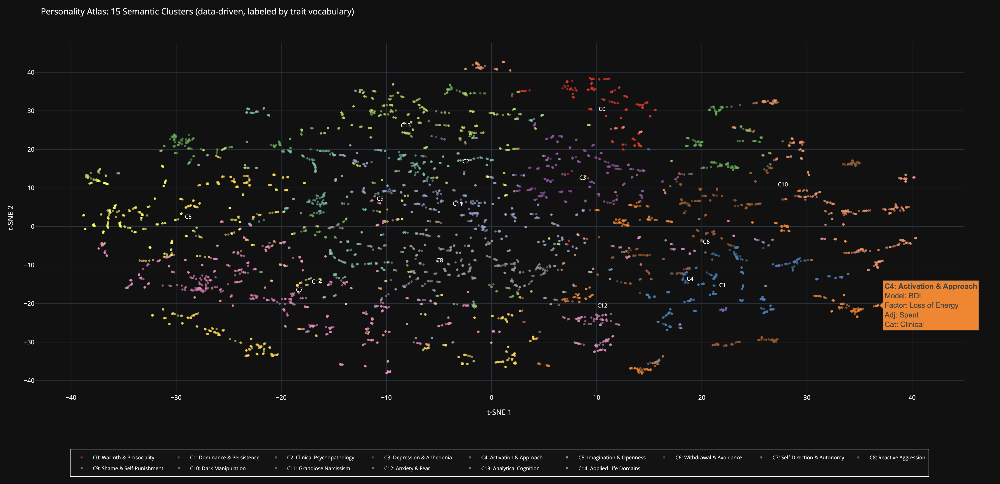
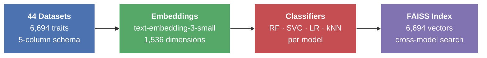
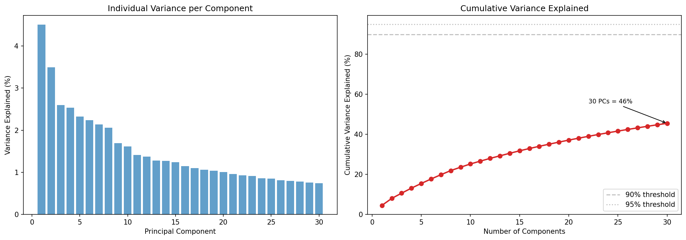
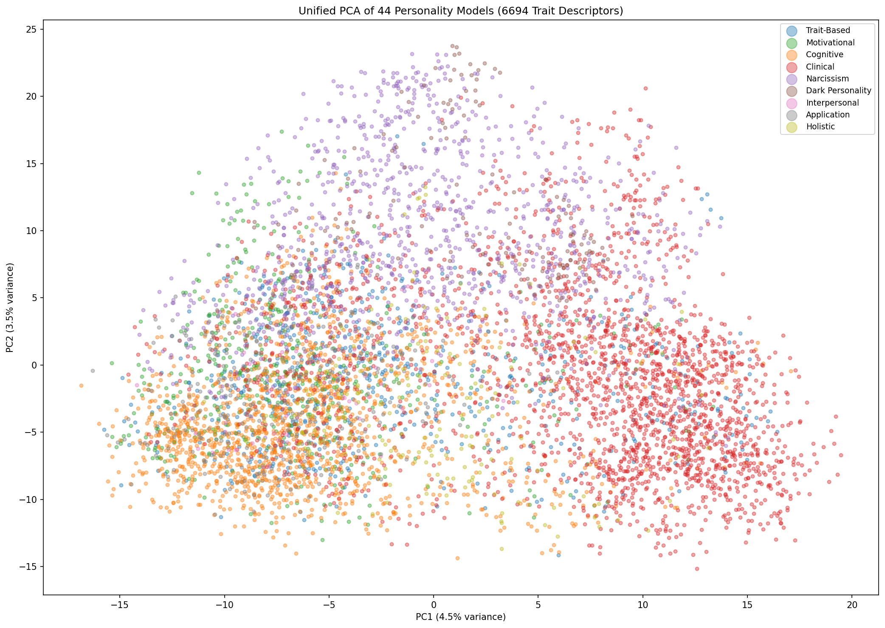

# A Survey and Computational Atlas of Personality Models

[](https://www.youtube.com/watch?v=E1UZ1aupkMc&list=PLA-ZMNokDMTQzCsr-s5n_EiF8OLYafBAW), complete walkthrough from history to validation results

1. [History and Introduction](https://www.youtube.com/watch?v=E1UZ1aupkMc&list=PLA-ZMNokDMTQzCsr-s5n_EiF8OLYafBAW&index=1)
2. [44 Models in One Space](https://www.youtube.com/watch?v=PYbM7jvIHso&list=PLA-ZMNokDMTQzCsr-s5n_EiF8OLYafBAW&index=2)
3. [Do Personality Classifiers Generalize?](https://www.youtube.com/watch?v=CrGPN2-75AI&list=PLA-ZMNokDMTQzCsr-s5n_EiF8OLYafBAW&index=3)
4. [Making It Better](https://www.youtube.com/watch?v=GBWG2U72BDs&list=PLA-ZMNokDMTQzCsr-s5n_EiF8OLYafBAW&index=4)
5. [Human Items and DSM-5 Validation](https://www.youtube.com/watch?v=Q3SYWDVbBG4&list=PLA-ZMNokDMTQzCsr-s5n_EiF8OLYafBAW&index=5)
6. [ACM TIST Reviewer Guide](https://www.youtube.com/watch?v=vv2oAc7hon8&list=PLA-ZMNokDMTQzCsr-s5n_EiF8OLYafBAW&index=6)
7. [Computational Atlas of Personality Models with Experiments Described](https://www.youtube.com/watch?v=YljbuJbdHmQ&list=PLA-ZMNokDMTQzCsr-s5n_EiF8OLYafBAW&index=7)

**44 personality models**: standardized datasets, dual-resolution embeddings (1536 + 3072-dim), trained classifiers (RF, SVC, LR, kNN), and verified model cards, ready to use in five minutes.

> Raetano, J., Gregor, J., & Tamang, S. (2026). *A Survey and Computational Atlas of Personality Models.* ACM Transactions on Intelligent Systems and Technology (TIST). Under review.

[](https://colab.research.google.com/github/Wildertrek/survey/blob/main/notebooks/atlas_quick_start.ipynb)  [](https://colab.research.google.com/github/Wildertrek/survey/blob/main/notebooks/atlas_classifier_comparison.ipynb)  [](https://colab.research.google.com/github/Wildertrek/survey/blob/main/notebooks/atlas_deep_dive.ipynb)  [](https://colab.research.google.com/github/Wildertrek/survey/blob/main/notebooks/atlas_embedding_projector.ipynb)  [](https://colab.research.google.com/github/Wildertrek/survey/blob/main/expert_evaluation/expert_evaluation_colab.ipynb)

---

## Abstract

Personality psychology has spent a century characterizing individual differences, yet computational approaches to personality are dominated by a single model: the Big Five (OCEAN). Numerous other validated frameworks exist, spanning clinical diagnosis, narcissism, motivation, cognition, conflict resolution, and applied assessment, but without a shared computational format they remain fragmented across disciplinary silos. This paper surveys 44 personality models from seven research traditions and encodes every construct as a *factor chain*, a structured descriptor set that disambiguates each construct through its defining adjectives, synonyms, and behavioral terms. The result is a unified computational atlas of 358 factors, each paired with a neural embedding and a trained classifier, searchable across all surveyed models simultaneously. Three layers of evaluation confirm the encoding: classifiers tested against human-authored items from 22 published psychometric instruments, an independent LLM judge panel, and replication across multiple generators, achieving 86.8% accuracy on human-authored items. Embedding-space analysis reveals that the seven disciplinary categories do not form coherent clusters in semantic space; data-driven clustering instead uncovers 15 natural groupings that cut across the predefined categories, approximate established diagnostic boundaries, and provide large-scale evidence that personality science has been studying overlapping constructs under different names for decades, though shared vocabulary alone is not sufficient evidence for construct equivalence. Human personality is too vast for any one framework to capture; each tradition maps territory the others cannot see. The full atlas, trained classifiers, and reproducibility notebooks are openly released.

### What the Abstract Is Saying

**The problem.** Computational approaches to personality are dominated by a single model: the Big Five (OCEAN). Numerous other validated frameworks exist across psychology, but without a shared format they stay siloed.

**What we did.** We encoded all 44 models into a single machine-readable format called a *factor chain*, a structured descriptor set (adjective, synonym, verb, noun) that disambiguates every trait. The result is 6,694 factor chains across 358 factors. Each chain gets a neural embedding and a trained classifier that can identify which personality construct a new sentence describes.

**Does it work?** Three experiments say yes. Classifiers tested against human-authored items from 22 published psychometric instruments, cross-checked by an independent LLM judge panel, and validated across multiple generators. Four classifier types (RF, SVC, LR, kNN) are compared: kNN achieves 83.5% mean accuracy on human items, with a best-per-model oracle ceiling of 86.8%. Every model scores above chance.

**What we discovered.** The seven disciplinary categories that organize the survey (Clinical, Motivational, etc.) do not form coherent clusters in the embedding space; they are organizational labels, not semantic boundaries. Data-driven clustering instead uncovers 15 natural groupings that cut across traditions, approximate established diagnostic boundaries, and provide large-scale evidence that personality science has been studying overlapping constructs under different names for decades, though shared vocabulary alone is not sufficient evidence for construct equivalence. OCEAN, despite its dominance in AI, ranks only third in per-model information contribution.

**Everything is open.** All data, classifiers, and code are in this repository.

For definitions of every technical term, see the [Glossary of Terms](docs/GLOSSARY.md).

---

### The Semantic Personality Index (SPI)

Data-driven clustering of all 6,694 trait embeddings reveals that the seven disciplinary categories do not reflect how personality constructs actually organize in semantic space. The **Semantic Personality Index (SPI)** identifies 15 natural clusters with silhouette 0.098, modest but significantly above the random-partition null (p < 0.001) and far above the disciplinary categories (silhouette 0.0002). This remains below the 0.25 threshold for substantial cluster structure (Kaufman & Rousseeuw, 1990), so the SPI should be interpreted as a soft semantic map rather than a definitive taxonomy. Clinical psychology fragments into four semantic regions. Narcissism fragments into three. Meanwhile, four clusters (Dominance, Activation, Withdrawal, Self-Direction) span all seven categories, while Warmth spans six of seven. A permutation null model confirms this is not a vocabulary artifact: under random category assignment, 14.4 of 15 clusters span all seven categories by chance; the actual count of 4 is far below the null (p < 0.001), indicating genuine category specificity. The atlas is not merely a catalog of 44 models, it is a map that reveals personality science has been studying overlapping constructs under different names for decades.



---

## Pipeline



Psychometric literature → standardized lexical datasets → semantic embeddings → trained classifiers → searchable cross-model index. Every stage ships in this repository.

---

## Quick Start

Each of the 44 models has a Jupyter notebook you can open and run immediately.

```
atlas/01_trait_based/ocean/          ← open OCEAN-Updated.ipynb
atlas/02_narcissism_based/dtm/       ← open DTM.ipynb
atlas/05_clinical_health/mmpi/       ← open MMPI.ipynb
...any of 44 folders
```

**In 10 lines:**

```python
import pandas as pd
import joblib

# 1. Load any model's dataset and trained classifier
df = pd.read_csv("datasets/ocean.csv")
model = joblib.load("models/ocean_knn_model.pkl")   # or _svc_, _lr_, _rf_
encoder = joblib.load("models/ocean_label_encoder.pkl")

# 2. Load pre-computed embeddings (1536-dim, text-embedding-3-small)
embeddings = pd.read_csv("Embeddings/ocean_embeddings.csv")
X = embeddings.iloc[:, 1:].values  # drop index column

# 3. Predict personality factors
predictions = model.predict(X)
labels = encoder.inverse_transform(predictions)
print(f"Predicted factors: {set(labels)}")
```

**Or run the standalone demo**, three pre-baked examples work without any API key:

```bash
git clone https://github.com/Wildertrek/survey.git
cd survey
python3 -m venv .venv
source .venv/bin/activate
pip install -r requirements.txt

python demo.py                                          # list examples
python demo.py "tends to worry about the future"        # -> GAD-7, OCEAN Neuroticism
python demo.py "manipulates others for personal gain"   # -> Narcissism across 5 models
python demo.py "enjoys leading group discussions"        # -> Extraversion across 4 models
```

The demo searches all 6,694 traits across 44 models and shows which categories, models, and factors match. Add `--model ocean` to also classify through a specific model's trained classifiers (RF, SVC, LR, kNN).

To search your own queries, set an OpenAI API key (costs < $0.001 per query):

```bash
export OPENAI_API_KEY=sk-...
python demo.py "avoids conflict at all costs" --model tki --top 10
```

Get an API key at: [platform.openai.com/api-keys](https://platform.openai.com/api-keys)

**Dependencies:** `pandas`, `scikit-learn`, `joblib`, `numpy`. For custom queries and notebooks: add `openai`, `python-dotenv`.

---

## What's in the Atlas

| Asset | Count | Format | Size |
|-------|-------|--------|------|
| [Lexical datasets](datasets/) | 44 | CSV (Factor, Adjective, Synonym, Verb, Noun) | 532 KB |
| [Embeddings (1536-dim)](Embeddings/) | 44 | CSV (OpenAI text-embedding-3-small) | 220 MB |
| [Embeddings (3072-dim)](https://huggingface.co/datasets/Wildertrek/personality-atlas-3072) | 44 | CSV (OpenAI text-embedding-3-large) | 440 MB\* |
| [Classifiers (1536-dim)](models/) | 176 | scikit-learn pickle (RF, SVC, LR, kNN x 44) | 59 MB |
| [RF classifiers (3072-dim)](https://huggingface.co/datasets/Wildertrek/personality-atlas-3072) | 44 | scikit-learn pickle | 107 MB\* |
| [Label encoders](models/) | 44 | scikit-learn pickle | 29 KB |
| [Model graphs](graphs/) | 44 | PNG + JSON (factor diagrams + machine-readable graph data) | 164 MB |
| [Psychometric test items](human_items/) | 22 | JSON (418 items from published psychometric instruments) | 92 KB |
| [Opus test items](test_items_opus/) | 45 | JSON (5,369 items generated by Claude Opus) | 1.9 MB |
| [Model cards](atlas/) | 44 | Markdown (verified from peer-reviewed appendix) | — |
| [Starter notebooks](atlas/) | 44 | Jupyter (.ipynb) | — |
| **Total trait rows** | **6,694** | across all 44 models | |

\*3072-dim embeddings and models are hosted separately due to size. See [Experiment 2 assets](#experiment-2-model-improvement-cycle) below.

---

## Repository Structure

```
survey/
├── README.md
├── HISTORY.md                      (how the atlas was built, origin story, timeline)
├── LICENSE                         (AGPL-3.0)
├── CITATION.cff                    (CFF citation metadata)
├── requirements.txt                (pip dependencies)
├── demo.py                         (cross-model trait search demo)
├── examples.json                   (pre-baked demo embeddings, no API key needed)
│
├── atlas/                          ★ Start here: 44 model cards + notebooks
│   ├── README.md                   (master index, all 44 models)
│   ├── references.bib              (328 citations across all cards)
│   │
│   ├── 01_trait_based/             (6 models)
│   │   ├── ocean/                  OCEAN (Big Five)
│   │   ├── mbti/                   Myers-Briggs Type Indicator
│   │   ├── hexaco/                 HEXACO Personality Model
│   │   ├── epm/                    Eysenck Personality Model
│   │   ├── 16pf/                   Sixteen Personality Factors
│   │   └── ftm/                    Four Temperaments
│   │
│   ├── 02_narcissism_based/        (10 models)
│   │   ├── npi/                    Narcissistic Personality Inventory
│   │   ├── pni/                    Pathological Narcissism Inventory
│   │   ├── ffni/                   Five-Factor Narcissism Inventory
│   │   ├── ffni_sf/                FFNI Short Form
│   │   ├── narq/                   Narcissistic Admiration & Rivalry
│   │   ├── hsns/                   Hypersensitive Narcissism Scale
│   │   ├── dtm/                    Dark Triad
│   │   ├── dt4/                    Dark Tetrad
│   │   ├── mcmin/                  MCMI-IV Narcissistic Scales
│   │   └── ipn/                    Inventory of Pathological Narcissism
│   │
│   ├── 03_motivational_value/      (6 models)
│   │   ├── stbv/                   Schwartz Theory of Basic Values
│   │   ├── mst/                    Motivational Systems Theory
│   │   ├── rft/                    Regulatory Focus Theory
│   │   ├── sdt/                    Self-Determination Theory
│   │   ├── aam/                    Approach/Avoidance Motivation
│   │   └── clifton/                Clifton Strengths
│   │
│   ├── 04_cognitive_learning/      (4 models)
│   │   ├── pct/                    Personal Construct Theory
│   │   ├── scm/                    Social-Cognitive Model
│   │   ├── cest/                   Cognitive-Experiential Self-Theory
│   │   └── fsls/                   Felder-Silverman Learning Styles
│   │
│   ├── 05_clinical_health/         (10 models)
│   │   ├── mmpi/                   Minnesota Multiphasic Personality Inventory
│   │   ├── tci/                    Temperament and Character Inventory
│   │   ├── tmp/                    Triarchic Model of Psychopathy
│   │   ├── bdi/                    Beck Depression Inventory
│   │   ├── gad7/                   Generalized Anxiety Disorder 7
│   │   ├── scid/                   Structured Clinical Interview for DSM
│   │   ├── mcmi/                   Millon Clinical Multiaxial Inventory
│   │   ├── rit/                    Rorschach Inkblot Test
│   │   ├── tat/                    Thematic Apperception Test
│   │   └── wais/                   Wechsler Adult Intelligence Scale
│   │
│   ├── 06_interpersonal_conflict/  (2 models)
│   │   ├── tki/                    Thomas-Kilmann Conflict Mode Instrument
│   │   └── disc/                   DiSC Workplace Profile
│   │
│   └── 07_application_holistic/    (6 models)
│       ├── riasec/                 Holland's Theory of Career Choice
│       ├── bt/                     Bartle Types
│       ├── tei/                    Theories of Emotional Intelligence
│       ├── em/                     Enneagram Model
│       ├── papc/                   Parametric Analysis of Person Characteristics
│       └── cmoa/                   Circumplex Model of Affect
│
│   Each model folder contains:
│   ├── MODEL_CARD.md               (verified model card)
│   ├── <MODEL>.ipynb               (starter notebook)
│   └── <model>_small.png           (factor diagram thumbnail)
│
├── datasets/                       44 CSV files (lexical schemas)
├── Embeddings/                     44 embedding CSVs (1536-dim, text-embedding-3-small)
├── models/                         176 classifiers (44 x RF/SVC/LR/kNN) + 44 label encoders (1536-dim)
├── graphs/                         44 high-res model diagrams + 44 JSON graph files
│
├── validate.py                     Standalone validation script
├── test_items/                     44 held-out test item files (5,052 GPT-4o items)
├── test_items_opus/                45 test item files (5,369 Claude Opus items)
├── human_items/                    22 published psychometric instrument items (418 items, "psychometric items")
│
├── notebooks/                      Cross-model analysis scripts + Colab notebooks
│   ├── atlas_quick_start.ipynb     Quick Start: load, predict, PCA, FAISS, 3 experiments
│   ├── atlas_classifier_comparison.ipynb  NEW: 4-way classifier comparison (RF/LR/SVC/kNN)
│   ├── atlas_deep_dive.ipynb       Deep Dive: per-model analysis
│   ├── atlas_embedding_projector.ipynb   PCA/t-SNE/UMAP + SPI clustering
│   └── 01_cross_model_pca_analysis.py  (supports --embedding-dim 1536|3072)
│
├── results/                        PCA + validation results
│   ├── README.md                   (methodology + full results)
│   ├── pca_summary_report.json
│   ├── pca_scree_plot.png
│   ├── pca_2d_all_models.png
│   ├── pca_model_centroids_2d.png
│   ├── pca_factor_loadings_heatmap.png
│   ├── pca_variance_explained.csv
│   ├── pca_top_factors_by_variance.csv
│   ├── pca_model_overlap_matrix.csv
│   ├── pca_3072/                   3072-dim PCA results (same structure)
│   └── validation/                 Per-model validation results
│       ├── individual_model_results.csv
│       ├── experiment2_comparison.csv
│       ├── category_results.csv
│       ├── baselines.json
│       ├── factor_complexity.csv
│       ├── atlas_summary.json
│       └── latency.json
```

---

## The 44 Models

### I. Trait-Based Models (6)

| # | Model | Full Name | Traits | Rows |
|---|-------|-----------|--------|------|
| 1 | [OCEAN](atlas/01_trait_based/ocean/MODEL_CARD.md) | Big Five Factor Model | O, C, E, A, N | 120 |
| 2 | [MBTI](atlas/01_trait_based/mbti/MODEL_CARD.md) | Myers-Briggs Type Indicator | EI, SN, TF, JP | 144 |
| 3 | [HEXACO](atlas/01_trait_based/hexaco/MODEL_CARD.md) | HEXACO Personality Model | H, E, X, A, C, O | 66 |
| 4 | [EPM](atlas/01_trait_based/epm/MODEL_CARD.md) | Eysenck Personality Model | P, E, N | 90 |
| 5 | [16PF](atlas/01_trait_based/16pf/MODEL_CARD.md) | Sixteen Personality Factors | 16 primary factors | 192 |
| 6 | [FT](atlas/01_trait_based/ftm/MODEL_CARD.md) | Four Temperaments | Sanguine, Choleric, Melancholic, Phlegmatic | 80 |

### II. Narcissism-Based Models (10)

| # | Model | Full Name | Rows |
|---|-------|-----------|------|
| 7 | [NPI](atlas/02_narcissism_based/npi/MODEL_CARD.md) | Narcissistic Personality Inventory | 168 |
| 8 | [PNI](atlas/02_narcissism_based/pni/MODEL_CARD.md) | Pathological Narcissism Inventory | 168 |
| 9 | [FFNI](atlas/02_narcissism_based/ffni/MODEL_CARD.md) | Five-Factor Narcissism Inventory | 360 |
| 10 | [FFNI-SF](atlas/02_narcissism_based/ffni_sf/MODEL_CARD.md) | FFNI Short Form | 60 |
| 11 | [NARQ](atlas/02_narcissism_based/narq/MODEL_CARD.md) | Narcissistic Admiration & Rivalry | 48 |
| 12 | [HSNS](atlas/02_narcissism_based/hsns/MODEL_CARD.md) | Hypersensitive Narcissism Scale | 48 |
| 13 | [DT3](atlas/02_narcissism_based/dtm/MODEL_CARD.md) | Dark Triad | 54 |
| 14 | [DT4](atlas/02_narcissism_based/dt4/MODEL_CARD.md) | Dark Tetrad | 96 |
| 15 | [MCMI-Narc](atlas/02_narcissism_based/mcmin/MODEL_CARD.md) | MCMI-IV Narcissistic Scales | 72 |
| 16 | [IPN](atlas/02_narcissism_based/ipn/MODEL_CARD.md) | Inventory of Pathological Narcissism | 80 |

### III. Motivational and Value Models (6)

| # | Model | Full Name | Rows |
|---|-------|-----------|------|
| 17 | [STBV](atlas/03_motivational_value/stbv/MODEL_CARD.md) | Schwartz Theory of Basic Values | 128 |
| 18 | [MST](atlas/03_motivational_value/mst/MODEL_CARD.md) | Motivational Systems Theory | 64 |
| 19 | [RFT](atlas/03_motivational_value/rft/MODEL_CARD.md) | Regulatory Focus Theory | 56 |
| 20 | [SDT](atlas/03_motivational_value/sdt/MODEL_CARD.md) | Self-Determination Theory | 84 |
| 21 | [AAM](atlas/03_motivational_value/aam/MODEL_CARD.md) | Approach/Avoidance Motivation | 40 |
| 22 | [CS](atlas/03_motivational_value/clifton/MODEL_CARD.md) | Clifton Strengths | 136 |

### IV. Cognitive and Learning Models (4)

| # | Model | Full Name | Rows |
|---|-------|-----------|------|
| 23 | [PCT](atlas/04_cognitive_learning/pct/MODEL_CARD.md) | Personal Construct Theory | 899 |
| 24 | [SCM](atlas/04_cognitive_learning/scm/MODEL_CARD.md) | Social-Cognitive Model | 180 |
| 25 | [CEST](atlas/04_cognitive_learning/cest/MODEL_CARD.md) | Cognitive-Experiential Self-Theory | 72 |
| 26 | [FSLS](atlas/04_cognitive_learning/fsls/MODEL_CARD.md) | Felder-Silverman Learning Styles | 360 |

### V. Clinical and Psychological Health Models (10)

| # | Model | Full Name | Rows |
|---|-------|-----------|------|
| 27 | [MMPI](atlas/05_clinical_health/mmpi/MODEL_CARD.md) | Minnesota Multiphasic Personality Inventory | 360 |
| 28 | [TCI](atlas/05_clinical_health/tci/MODEL_CARD.md) | Temperament and Character Inventory | 252 |
| 29 | [TMP](atlas/05_clinical_health/tmp/MODEL_CARD.md) | Triarchic Model of Psychopathy | 108 |
| 30 | [BDI](atlas/05_clinical_health/bdi/MODEL_CARD.md) | Beck Depression Inventory | 756 |
| 31 | [GAD-7](atlas/05_clinical_health/gad7/MODEL_CARD.md) | Generalized Anxiety Disorder 7 | 252 |
| 32 | [SCID](atlas/05_clinical_health/scid/MODEL_CARD.md) | Structured Clinical Interview for DSM | 401 |
| 33 | [MCMI](atlas/05_clinical_health/mcmi/MODEL_CARD.md) | Millon Clinical Multiaxial Inventory | 84 |
| 34 | [RIT](atlas/05_clinical_health/rit/MODEL_CARD.md) | Rorschach Inkblot Test | 45 |
| 35 | [TAT](atlas/05_clinical_health/tat/MODEL_CARD.md) | Thematic Apperception Test | 39 |
| 36 | [WAIS](atlas/05_clinical_health/wais/MODEL_CARD.md) | Wechsler Adult Intelligence Scale | 60 |

### VI. Interpersonal and Conflict Resolution Models (2)

| # | Model | Full Name | Rows |
|---|-------|-----------|------|
| 37 | [TKI](atlas/06_interpersonal_conflict/tki/MODEL_CARD.md) | Thomas-Kilmann Conflict Mode Instrument | 20 |
| 38 | [DiSC](atlas/06_interpersonal_conflict/disc/MODEL_CARD.md) | DiSC Workplace Profile | 31 |

### VII. Application-Specific and Holistic Models (6)

| # | Model | Full Name | Rows |
|---|-------|-----------|------|
| 39 | [RIASEC](atlas/07_application_holistic/riasec/MODEL_CARD.md) | Holland's Theory of Career Choice | 120 |
| 40 | [BT](atlas/07_application_holistic/bt/MODEL_CARD.md) | Bartle Types | 64 |
| 41 | [TEI](atlas/07_application_holistic/tei/MODEL_CARD.md) | Theories of Emotional Intelligence | 48 |
| 42 | [EM](atlas/07_application_holistic/em/MODEL_CARD.md) | Enneagram Model | 81 |
| 43 | [PAPC](atlas/07_application_holistic/papc/MODEL_CARD.md) | Parametric Analysis of Person Characteristics | 72 |
| 44 | [CMOA](atlas/07_application_holistic/cmoa/MODEL_CARD.md) | Circumplex Model of Affect | 36 |

---

## Cross-Model PCA Analysis

Principal Component Analysis across all 44 models (6,694 trait rows, 1536-dim embeddings):

| Metric | Value |
|--------|-------|
| PC1 variance explained | 4.5% |
| Top-5 components | 15.5% cumulative |
| Top-10 components | 25.2% cumulative |
| Most similar pair | IPN / PNI (cosine = 0.959)* |
| Least similar pair | TKI / WAIS (cosine = 0.268) |
| Highest-variance category | Narcissism (350.2) |

\*IPN (Inventory of Pathological Narcissism) and PNI (Pathological Narcissism Inventory) are the same instrument (Pincus et al., 2009) with its name abbreviated in two different orderings. Both are deliberately included in the atlas as a built-in jangle detection validation: the embedding pipeline correctly identifies them as near-identical (cosine 0.959) without any manual annotation, demonstrating that the atlas can surface cases where different labels mask the same construct. See [Jangle Fallacy](docs/GLOSSARY.md#the-discovery) in the glossary.





See [`results/README.md`](results/README.md) for full PCA outputs: factor loadings heatmap, model overlap matrix, similarity rankings, and summary report.

**Reproduce:**
```bash
python notebooks/01_cross_model_pca_analysis.py
```

---

## Empirical Validation

Three experiments and 14 research questions, including the Semantic Personality Index (SPI) discovery, plus independent PCA and knowledge graph validations, all across 44 models.

### Research questions at a glance

| RQ | Question | Answer |
|----|----------|--------|
| | **Experiment 1: Baseline** | |
| 1 | Can the classifiers distinguish factors above chance? | 58.6% mean accuracy on 5,038 novel items. All 44 models beat random (+35.7% lift); 41/44 beat frequency baseline. |
| 2 | How does factor count affect accuracy? | r = -0.67 (p < .001). Models with 2-5 factors average 67.6%; 20+ factors average 30.2%. |
| 3 | Do independent LLM judges agree on item validity? | Kappa = 0.99 across a triple-judge panel (GPT-5.2, Gemini 3 Pro, Claude Opus 4.6). 95.7% agreement with expected factors. |
| 4 | Where do RF classifiers fail relative to judges? | 66.7% RF-judge agreement. Judges correct 95.7% of the time. The gap is a classifier problem, not construct ambiguity. |
| 5 | Do related constructs from different models converge? | Yes. 1,536-dim index retrieves hits from 7.0 independent models per query (16% of the atlas). Convergence improves further in Experiment 2. |
| 6 | Are there category-level performance differences? | Motivational 74.5% > Narcissism 68.3% > Trait-Based 64.0% > Cognitive 51.8% > App/Holistic 50.9% > Clinical 50.6% > Interpersonal 23.7%. |
| | **Experiment 2: Improvement** | |
| 7 | Does upgrading to 3,072-dim embeddings help? | +5.1pp mean across all 44 models. 28 improved, 13 decreased slightly. |
| 8 | Does data augmentation help sparse models? | +25.9pp on 14 targeted models (all below 50%). All 14 improved. |
| 9 | Does hierarchical classification help high-factor models? | +4.8pp on 8 targeted models (15+ factors). Modest gain; 1/8 won in ablation. |
| | **Experiment 3: External validation** | |
| 10 | Do results hold across different LLM generators? | GPT-4o 58.7% vs Claude Opus 55.5% (delta 3.3pp, p = .041, d = 0.17). Consistent. |
| 11 | Can classifiers handle human-authored psychometric items? | 83.5% kNN on 418 items from 20 models (oracle ceiling 86.8%). RF baseline 69.8%. |
| 12 | Do human items retrieve related content across models? | 100% model and category hit rate in top-20 retrieval. Mean 8.2 models per query. |
| | **Semantic Personality Index (SPI)** | |
| 13 | Do the 7 theoretical categories correspond to semantic boundaries? | No. Silhouette 0.0002. Data-driven k=15: silhouette 0.098, significantly above null (p < 0.001). ARI = 0.17. |
| 14 | What structure does the embedding space reveal? | 15 SPI clusters. Clinical fragments into 4, Narcissism into 3. Interpersonal Circumplex confirmed (Warmth + Dominance span all 7 categories). |
| | **Supplementary** | |
| PCA | Is the embedding space redundant? | No. 50 components capture only 56.9% variance. No scree elbow. |
| KG | Does graph structure agree with embedding similarity? | Yes. Mantel r = 0.66 (p < .001). Graph density predicts classification difficulty. |
| DSM-5 | Does the embedding space preserve clinical construct structure? | 98.2% of 222 DSM-5 disorders route to the Clinical atlas category. SCID is the top retrieval for 20/21 DSM-5 categories. |

### Experiment 1: Baseline (RQ1-6)

5,052 novel test items, generated by GPT-4o, classified through each model's four classifiers (RF, SVC, LR, kNN). None of these items were seen during training. RF is reported as the primary baseline; SVC and kNN consistently outperform it on novel items.

| Metric | Value |
|--------|-------|
| Test items | 5,052 generated (5,038 valid), 358 factors (316 unique) |
| Mean RF accuracy | 58.6% (median 61.1%) |
| Mean lift over random | +35.7% (all 44 models above chance) |
| Models beating frequency baseline | 41/44 (93%) |
| Inter-judge agreement (kappa) | 0.99 |
| Factor-count vs. accuracy | r = -0.67, p < 0.001 |
| Hardware | Commodity CPU, no GPU required |

**By category:** Motivational (74.5%) > Narcissism (68.3%) > Trait-Based (64.0%) > Cognitive (51.8%) > App/Holistic (50.9%) > Clinical (50.6%) > Interpersonal (23.7%)

The 37-point gap between RF accuracy (58.6%) and judge accuracy (95.7%) is the improvement target for Experiment 2.

### Experiment 2: Improvement cycle (RQ7-9)

One intervention per bottleneck, all evaluated on the same 5,038 test items:

| Intervention | Scope | Mean Acc | Delta |
|-------------|-------|----------|-------|
| Exp1 baseline (1536-dim) | 44 models | 58.7% | — |
| RQ7: 3072-dim embeddings | 44 models | 63.8% | +5.1pp |
| RQ8: Data augmentation | 14 targeted | 61.1% | +25.9pp* |
| RQ9: Hierarchical classifiers | 8 targeted | 39.9% | +4.8pp* |
| **Combined best-per-model** | **44 models** | **71.5%** | **+12.9pp** |

*Delta computed against baseline for the same targeted subset.

**Top 5 improvers:** WAIS +42.1pp, EM +40.6pp, DISC +37.4pp, TKI +36.5pp, TEI +32.7pp

**After improvement (RF):** 22/44 models above 70% (was 13), 0 models below 30% (was 3). With multi-classifier selection: 33/44 above 70%.

The bottlenecks were data sparsity and embedding capacity, not ambiguity in the personality constructs. No specialized hardware or new architectures were needed.

**3072-dim assets:** The upgraded embeddings (440 MB) and retrained classifiers (107 MB) are on [Hugging Face Hub](https://huggingface.co/datasets/Wildertrek/personality-atlas-3072). The 1536-dim assets in this repository remain the default.

Per-model results are in each model's `MODEL_CARD.md` and in [`results/validation/`](results/validation/). See [`results/README.md`](results/README.md) for the full breakdown.

### Experiment 3: External validation (RQ10-12)

The first two experiments used LLM-generated items. Experiment 3 tests whether the classifiers generalize to items written by human psychometricians.

| Metric | Value |
|--------|-------|
| Published instruments | 22 (BFI-44, HEXACO-60, GAD-7, Short Dark Triad, NARQ, etc.) |
| Human-authored items | 418 across 20 models |
| RF accuracy (baseline) | 69.8% |
| kNN accuracy | 83.5% |
| SVC accuracy | 81.9% |
| LR accuracy | 82.9% |
| Best-per-model oracle | 86.8% (best classifier chosen per model) |
| Reliability tiers (best clf) | 33 reliable (>70%) / 9 usable (50-70%) / 2 research-only (<50%) |
| Reverse-scored error (RF vs kNN) | RF 43.0% error, kNN 11.1% error |
| Multi-generator consistency (RQ10) | GPT-4o 58.7% vs Opus 55.5%, d = 0.17 |
| Convergent validity (RQ12) | 100% model/category hit rate, 8.2 models per query |
| Classifier comparison (Friedman) | chi2 = 22.4, p < 0.001 (significant across 4 classifiers) |

Human items score higher because published psychometric items are designed to load cleanly on single factors, so less ambiguity means better classification. The multi-classifier comparison reveals that RF is the weakest of the four classifiers, particularly on reverse-scored items (43.0% error vs 11.1% for kNN). Linear and instance-based methods generalize better to unseen human-authored content.

Human-authored items are in [`human_items/`](human_items/) (22 JSON files). Second-generator items are in [`test_items_opus/`](test_items_opus/) (5,369 Claude Opus items).

### Cross-model convergent validity (FAISS)

[FAISS](https://github.com/facebookresearch/faiss) (Facebook AI Similarity Search; [Douze et al., 2024](https://arxiv.org/abs/2401.08281); [Johnson et al., 2021](https://doi.org/10.1109/TBDATA.2019.2921572)) is used for fast nearest-neighbor search over dense trait embeddings. Three FAISS index variants queried with 10 standardized constructs (anxiety, extraversion, narcissism, depression, etc.):

| Index | Dim | Vectors | Models/query | Categories/query |
|-------|-----|---------|-------------|-----------------|
| A: Original | 1,536 | 6,694 | 7.0 | 3.4 |
| B: 3072-dim | 3,072 | 6,694 | 8.6 | 3.9 |
| C: 3072 + augmented | 3,072 | 8,419 | 9.4 | 4.5 |

The 3,072-dim space retrieves 23% more independent models per query. Adding augmented data pushes diversity to 9.4 models across 4.5 categories, because previously underrepresented models (DISC, TKI, EM) now have enough vectors to appear in results.

### Reproduce the Validation

All test items and classifiers are included in this repository. To reproduce the reported accuracy figures:

```bash
# Install dependencies
pip install -r requirements.txt

# Set your OpenAI API key (needed to embed test items; ~$0.05 for all 44 models)
export OPENAI_API_KEY=sk-...

# Validate a single model
python validate.py --model ocean

# Validate all 44 models (1536-dim, ~5 min)
python validate.py --all

# Validate with 3072-dim embeddings (requires models_3072/ directory)
python validate.py --all --dim 3072

# Re-run without re-embedding (uses cached embeddings)
python validate.py --all --no-embed
```

Results are saved to `validation_results_1536.csv` (or `_3072.csv`). The `test_items/` directory contains 44 JSON files with 5,052 held-out items generated by GPT-4o. The `test_items_opus/` directory contains 45 JSON files with 5,369 items generated by Claude Opus (used in Experiment 3, RQ10). The `human_items/` directory contains 418 items from 22 published psychometric instruments (used in Experiment 3, RQ11–12).

### Reproduce the PCA

```bash
# 1536-dim PCA (default, uses Embeddings/ directory)
python notebooks/01_cross_model_pca_analysis.py

# 3072-dim PCA (uses Embeddings_3072/ directory)
python notebooks/01_cross_model_pca_analysis.py --embedding-dim 3072 --output-dir results/pca_3072
```

### Train All Classifiers

The repository ships 176 pre-trained classifiers (44 models x 4 classifier types). To retrain from scratch or reproduce:

```bash
# Train RF, SVC, LR, kNN for all 44 models and evaluate on test + human items
python scripts/train_and_evaluate_all_classifiers.py
```

This script:
1. Loads training embeddings from `Embeddings/{model}_embeddings.csv`
2. Trains four classifiers per model with the following hyperparameters:
   - **RF**: `RandomForestClassifier(n_estimators=100, random_state=42, n_jobs=-1)`
   - **LR**: `LogisticRegression(max_iter=1000, random_state=42)`
   - **SVC**: `LinearSVC(max_iter=2000, random_state=42, dual="auto")`
   - **kNN**: `KNeighborsClassifier(n_neighbors=5)`
3. Saves classifiers to `models/{model}_{clf}_model.pkl` (e.g., `ocean_svc_model.pkl`)
4. Evaluates all classifiers on cached test items (`.validation_cache/`) and human items (`human_items/`)
5. Computes reliability tiers, reverse-scored error rates, and Friedman test statistics
6. Writes results to `results/reviewer_experiments/multi_classifier_evaluation.json`

**File naming convention:**
```
models/
├── ocean_rf_model.pkl          # Random Forest
├── ocean_svc_model.pkl         # Support Vector (LinearSVC)
├── ocean_lr_model.pkl          # Logistic Regression
├── ocean_knn_model.pkl         # k-Nearest Neighbors (k=5)
├── ocean_label_encoder.pkl     # Shared label encoder (used by all 4)
└── ...                         # Same pattern for all 44 models
```

All classifiers share the same label encoder per model. The label encoder maps factor names to integer indices and is created during training from the training data labels.

**Dependencies:** `scikit-learn`, `numpy`, `joblib`. No GPU or API key required. Training all 176 classifiers takes approximately 2 minutes on commodity hardware.

---

## Computational Benchmarks

Four classifier types (RF, SVC, LR, kNN) are provided for 1536-dim embeddings (176 classifiers total). RF classifiers are also available at 3072-dim.

| Measurement | 1536-dim (4 classifiers) | 3072-dim (RF only) |
|-------------|--------------------------|---------------------|
| Embedding model | text-embedding-3-small | text-embedding-3-large |
| Total classifiers | 176 (44 x RF/SVC/LR/kNN) | 44 RF |
| Total model size | 59 MB | 107 MB |
| Best mean accuracy (test items) | 74.7% (SVC) | 63.8% (RF) |
| Best mean accuracy (human items) | 83.5% (kNN, 20 models) | N/A |
| Best-per-model oracle (human) | 86.8% | N/A |
| Models above 70% (best clf) | 33 | 19 |
| Total label encoders | 29 KB | 29 KB |
| Batch inference (50 chars x 1 model) | 5.3 ms | ~8 ms |
| Embedding cost (all 44 models) | $0.27 | $0.54 |
| ONNX export | Supported | Supported |
| Platform | Commodity CPU (no GPU required) | Same |

SVC and kNN are recommended over RF for deployment. RF remains included for backward compatibility and because it wins on 4 models. The entire atlas runs on commodity hardware. Individual models are small enough for browser deployment via [ONNX.js](https://onnxruntime.ai/docs/tutorials/web/) or mobile via Core ML / TFLite.

---

## Downstream Validation

Preliminary downstream testing applies the atlas to personality inference across 28 novels and 535 literary characters (181 matched against scholarly ground truth), demonstrating the atlas as working infrastructure:

| Result | Value | Significance |
|--------|-------|-------------|
| Personality inference accuracy | MAE = 0.298 [CI: 0.274, 0.324] | 181 characters vs. scholarly GT, 28 books, r = 0.635 |
| Author fingerprinting | 85.7% (12/14 correct) | Cohen's d = 1.96. Personality vectors only, no text, no metadata. |
| Knowledge distillation | $0.001 per character | 94% accuracy preserved vs. $1.53 full pipeline. 75K Gutenberg titles feasible. |

These results use the atlas classifiers and embeddings from this repository applied to literary character profiling, a task the atlas was not specifically designed for.

---

## Expert Evaluation: Open Invitation

We invite clinical psychologists, personality researchers, and psychometricians to independently evaluate the atlas using our complete evaluation toolkit. No API keys, no coding, no cost. A domain expert can complete all three tasks in **45-60 minutes**.

| Task | What you do | Items | Time |
|------|-------------|-------|------|
| Item Classification | Assign 50 personality items to their correct factor | 50 items across 20 models, all 7 categories | ~25 min |
| Construct Review | Rate whether factor chain entries capture the intended construct | 67 factor entries | ~15 min |
| Taxonomy Review | Assess whether the 7 category groupings are appropriate | 7 categories | ~10 min |

**To participate:**

```bash
git clone https://github.com/Wildertrek/survey.git
cd survey/expert_evaluation
pip install streamlit && streamlit run evaluator.py
```

A browser window opens automatically. When finished, click Submit to download your results and send them via a pre-addressed email. Results will be incorporated with full acknowledgment in published revisions.

See [`expert_evaluation/README.md`](expert_evaluation/README.md) for full instructions and system requirements.

---

## Lexical Schema

Every dataset follows a standardized five-column lexical schema called a **factor chain**, a five-field descriptor that connects a theoretical construct to the words that measure it. Every model, regardless of its theoretical origins, ultimately describes factors, and every factor is defined by trait vocabulary. The factor-chain schema normalizes that relationship so that any model can be embedded, classified, and compared alongside any other.

| Column | Description | Example (OCEAN) |
|--------|-------------|-----------------|
| `Factor` | Personality dimension | Extraversion |
| `Adjective` | Trait descriptor | Active |
| `Synonym` | Near-equivalent | Energetic |
| `Verb` | Behavioral form | Activate |
| `Noun` | Nominal quality | Activeness |

This schema enables consistent embedding generation, cross-model comparison, and integration into LLM-based personality inference pipelines.

### Schema Variations

38 of 44 models use the standard five-column schema above. Six models extend the schema with additional hierarchy or domain columns:

| Model | Columns | Notes |
|-------|---------|-------|
| WAIS | `Factor, Adjective, Description, Synonym, Verb, Noun, Embedding` | Extra `Description` column |
| DISC | `Domain, Subcategory, Factor, Adjective, Synonym, Verb, Noun` | Two hierarchy columns prepended |
| EM | `Type, Name, Factor, Adjective, Synonym, Verb, Noun, Adjacencies` | Enneagram type/name + adjacency list |
| TAT | `Category, Factor, Adjective, Synonym, Verb, Noun` | One hierarchy column prepended |
| TEI | `Domain, Factor, Adjective, Synonym, Verb, Noun` | One hierarchy column prepended |
| TKI | `Category, Factor, Adjective, Synonym, Verb, Noun` | One hierarchy column prepended |

All models share the core `Factor, Adjective, Synonym, Verb, Noun` columns used for embedding generation. The five-column schema is the minimum; extensions provide additional categorical or relational structure.

---

## Model Cards

Each model has a verified [MODEL_CARD.md](atlas/) containing:

- **Description**: theoretical basis and origin
- **Dimensions**: factors, facets, and brain-function mappings
- **Applications**: use cases in psychology, AI, and human-AI interaction
- **Timeline**: historical milestones
- **Psychometrics**: reliability, validity, instruments
- **Data Structure**: schema fields and example entries
- **Resources**: links to dataset, embeddings, classifier, and graph in this repo
- **Validation Results**: classifier accuracy (RF, SVC, LR, kNN), baselines, LLM judge evaluation, category context

All cards were verified by the authors and updated with empirical validation results from the companion experiment (5,052 test items, triple-judge LLM panel).

---

## Starter Notebooks

Each model folder in [`atlas/`](atlas/) includes a Jupyter notebook that demonstrates:

1. Loading the model's lexical dataset
2. Generating or loading embeddings
3. Training a classifier (RF shown in notebooks; SVC, LR, kNN also available as pre-trained `.pkl` files)
4. Evaluating classification accuracy
5. Visualizing embedding clusters (PCA)

These notebooks were developed in the Personality-Trait-Models research repository and represent the exact workflow used to produce the atlas artifacts. For multi-classifier training, see [Train All Classifiers](#train-all-classifiers).

### Colab Notebooks

Cross-model analysis notebooks in [`notebooks/`](notebooks/), runnable directly in Google Colab (no API keys needed):

| Notebook | Description |
|----------|-------------|
| [Quick Start](https://colab.research.google.com/github/Wildertrek/survey/blob/main/notebooks/atlas_quick_start.ipynb) | Load any model, PCA, FAISS search, 3 validation experiments, DSM-5 alignment |
| [Classifier Comparison](https://colab.research.google.com/github/Wildertrek/survey/blob/main/notebooks/atlas_classifier_comparison.ipynb) | Four-way comparison (RF/LR/SVC/kNN), Friedman test, reliability tiers, reverse-scored analysis |
| [Deep Dive](https://colab.research.google.com/github/Wildertrek/survey/blob/main/notebooks/atlas_deep_dive.ipynb) | Per-model deep analysis |
| [Embedding Projector](https://colab.research.google.com/github/Wildertrek/survey/blob/main/notebooks/atlas_embedding_projector.ipynb) | PCA/t-SNE/UMAP projections, SPI clustering (RQ13-RQ14) |

---

---

## License

Code is licensed under the AGPL-3.0 License, see [LICENSE](LICENSE). Datasets, embeddings, model cards, and non-code assets are licensed under CC BY-NC-SA 4.0, see [DATA_LICENSE](DATA_LICENSE).

---

## Citation

```bibtex
@article{Raetano2026Atlas,
  title   = {A Survey and Computational Atlas of Personality Models},
  author  = {Raetano, Joseph and Gregor, Jens and Tamang, Suzanne},
  journal = {ACM Transactions on Intelligent Systems and Technology},
  year    = {2026},
  note    = {Under review (TIST-2025-12-1243)}
}
```

See also [`CITATION.cff`](CITATION.cff).

---

> *"To see the world, things dangerous to come to, to see behind walls, draw closer, to find each other, and to feel."*
> — *The Secret Life of Walter Mitty* (2013)

See behind the walls of human behavior. Draw closer to what makes people who they are. Find each other.
