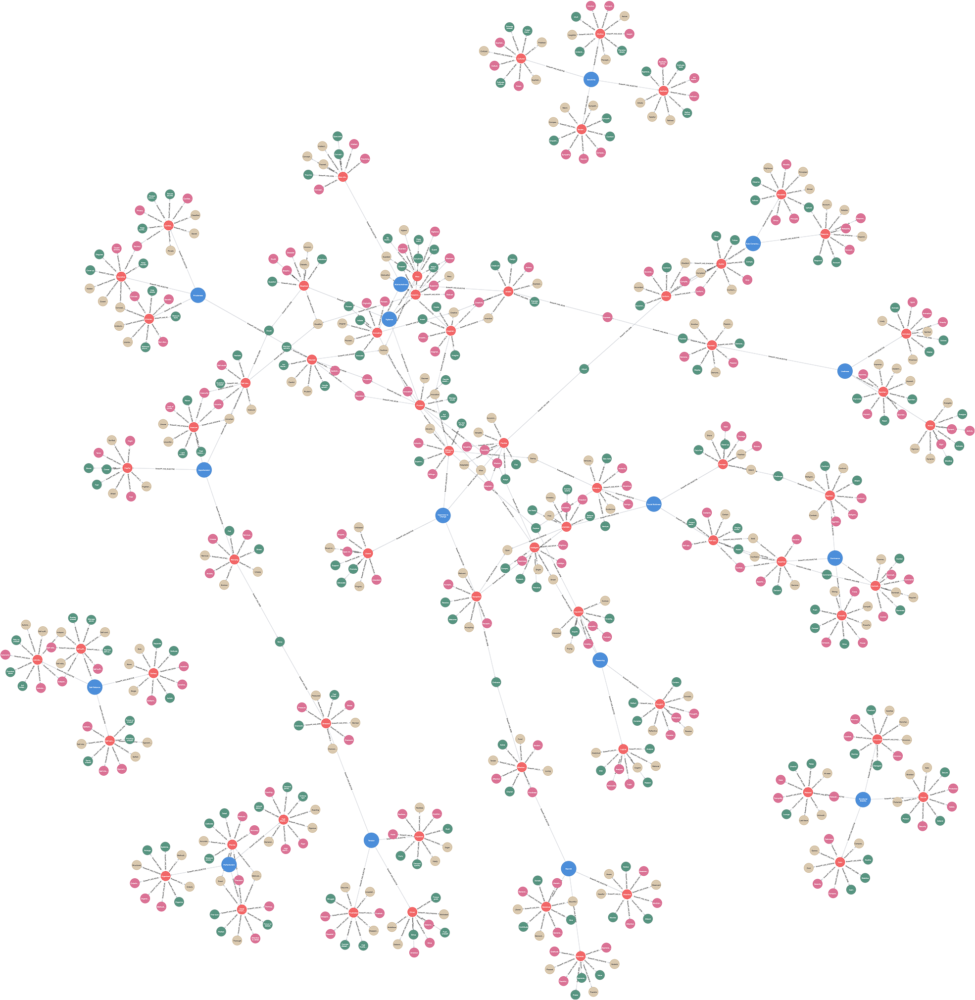

# (5) Sixteen Personality Factors

**Abbreviation:** 16PF
**Category:** Trait-Based Models
**Model Number:** 5 of 44

---

### Description.
Developed by Raymond B. Cattell, the Sixteen Personality Factor Questionnaire (**16PF**) provides a multidimensional measure of normal-range personality.
Cattell used factor analysis of large lexical datasets and behavioral observations to identify sixteen primary *source traits*, which can be grouped into higher-order global dimensions [Cattell1949, Cattell1956, Cattell1963].
The 16PF remains one of the most empirically grounded models in differential psychology, bridging lexical, behavioral, and psychometric traditions.

### Dimensions, Examples, and Functional Mapping.
Each of the sixteen factors represents a continuum of personality attributes with potential analogs in AI cognition and system behavior:

  - **Warmth (A):** Outgoing, participative, attentive.
    *Example:* Welcoming new colleagues with enthusiasm.
    Maps to *Social Cognition and Interaction*, AI inferring affective states and generating empathic dialogue (L2–L3).
  - **Reasoning (B):** Abstract, quick learner.
    *Example:* Rapidly understanding complex logical relationships.
    Maps to *Abstract Reasoning and Problem Solving*, symbolic or relational inference (L2–L3).
  - **Emotional Stability (C):** Calm, adaptive, resilient.
    *Example:* Maintaining composure under stress.
    Maps to *Affect Regulation and Resilience*, AI stabilizing outputs or confidence under uncertainty (L2–L3).
  - **Dominance (E):** Assertive, decisive, forceful.
    *Example:* Volunteering to lead a project.
    Maps to *Goal-Directed Planning and Assertiveness*, AI prioritizing among competing subgoals (L2–L3).
  - **Liveliness (F):** Enthusiastic, expressive, spontaneous.
    *Example:* Injecting humor into group interactions.
    Maps to *Behavioral Activation and Exploration*, AI managing novelty vs. exploitation (L1–L2).
  - **Rule-Consciousness (G):** Conforming, disciplined, ethical.
    *Example:* Adhering to governance and compliance rules.
    Maps to *Norm Adherence and Policy Enforcement*, AI executing rule-based constraints (L2–L3).
  - **Social Boldness (H):** Daring, uninhibited, adventurous.
    *Example:* Initiating conversation with unfamiliar peers.
    Maps to *Risk Tolerance and Social Engagement*, AI sustaining exploration despite feedback uncertainty (L2–L3).
  - **Sensitivity (I):** Intuitive, tender-minded, empathic.
    *Example:* Being emotionally moved by others’ stories.
    Maps to *Affective Sensitivity and Empathy*, AI interpreting subtle emotional cues (L2–L3).
  - **Vigilance (L):** Skeptical, critical, questioning.
    *Example:* Double-checking details before acceptance.
    Maps to *Anomaly Detection and Verification*, AI identifying inconsistencies or adversarial inputs (L2–L3).
  - **Abstractedness (M):** Imaginative, idealistic, unconventional.
    *Example:* Daydreaming about innovative solutions.
    Maps to *Conceptual Creativity and Ideation*, AI producing novel conceptual combinations (L3).
  - **Privateness (N):** Reserved, discreet, self-contained.
    *Example:* Preferring privacy before disclosure.
    Maps to *Self-Disclosure Management and Simulation*, AI deciding what internal state to externalize (L2–L3).
  - **Apprehension (O):** Insecure, self-critical, guilt-prone.
    *Example:* Overanalyzing potential mistakes.
    Maps to *Uncertainty Monitoring and Self-Correction*, AI adjusting output confidence dynamically (L2–L3).
  - **Openness to Change (Q1):** Analytical, experimental, non-traditional.
    *Example:* Adopting new technologies rapidly.
    Maps to *Adaptive Learning and Flexibility*, AI updating world models in response to new inputs (L2–L3).
  - **Self-Reliance (Q2):** Independent, self-sufficient.
    *Example:* Preferring autonomous problem solving.
    Maps to *Autonomous Goal Pursuit*, AI sustaining motivation via intrinsic reward systems (L2–L3).
  - **Perfectionism (Q3):** Organized, precise, disciplined.
    *Example:* Iteratively refining work until flawless.
    Maps to *Quality Control and Iterative Improvement*, AI refining internal models via error feedback (L2–L3).
  - **Tension (Q4):** Driven, impatient, restless.
    *Example:* Feeling uneasy when idle.
    Maps to *Arousal and Drive Regulation*, AI modulating activation levels or prediction-error energy (L1–L3).

### Timeline.

  - **1949:** Cattell identifies primary source traits via large-scale factor analysis [Cattell1949].
  - **1956–1957:** First 16PF Questionnaire released by the Institute for Personality and Ability Testing (IPAT) [Cattell1956].
  - **1963:** Third-edition *Handbook for the 16PF* published [Cattell1963].
  - **1993:** Fifth Edition introduces updated norms and psychometrics [Cattell1993].
  - **Present:** Continuous cross-cultural validation and digital adaptation in applied contexts.

### Applications.

  - **Personnel Selection and Leadership Development:** Core predictors of job performance, leadership, and teamwork [Salgado1997FFMJobPerformance, Judge2002PersonalityJobSatisfaction].
  - **Career Counseling and Guidance:** Aligns occupational paths with reasoning (B) and warmth (A) profiles [Carson1998, Conn1994].
  - **Educational Psychology:** Tailors instruction to learning styles using Abstractedness (M) and Rule-Consciousness (G) [CattellKrug1986, CattellEber1995].
  - **Clinical Assessment:** Extends to normal-range personality diagnostics; factors C and O correlate with adjustment [BahnerClark2020_16PF].
  - **AI-Driven Talent Analytics:** Modern HR systems leverage 16PF-analogous embeddings to match candidates with organizational culture [Winsor2025, Testlify2024].

### Psychometrics.

  - **Format:** Forced-choice self-report; results standardized to *sten* (1–10) scores.
  - **Reliability:** Internal consistency  = 0.70–0.85 across primary factors; strong test-retest stability.
  - **Validity:** Robust construct and criterion validity across occupational and cross-cultural samples.
  - **Method:** Derived via multi-method data integration (questionnaires, life records, observer ratings).

### Data Structure.
Each dataset row (e.g., `sixteenpf.csv`) encodes lexical representations of primary traits:

  - `Factor` – Primary factor (e.g., `Warmth_A`, `Reasoning_B`)
  - `Adjective` – Descriptive term (e.g., `Affectionate`)
  - `Synonym` – Near equivalent (e.g., `Kindly`)
  - `Verb` – Behavioral form (e.g., `Empathize`)
  - `Noun` – Abstract representation (e.g., `Empathy`)

### Resources.

  - **Mapped Brain Functions Table:** Table tab:16pf-mapping.
  - **L1–L3 AI Maturity Definitions:** Appendix sec:ai-maturity-levels.
  - **Interactive Literature Map:** [Connected Papers: Cattell & Krug (1986)](https://www.connectedpapers.com/main/1d34d0a7db285927d8e612e926655a9b236f57f1/The-Number-of-Factors-in-the-16PF%3A-A-Review-of-the-Evidence-with-Special-Emphasis-on-Methodological-Problems/graph).
  - **Dataset:** [`16PF_Dataset.csv`](https://github.com/Wildertrek/survey/blob/main/datasets/sixteenpf.csv).
  - **Embeddings File:** [`16PF_embeddings.csv`](https://github.com/Wildertrek/survey/blob/main/Embeddings/sixteenpf_embeddings.csv).

---

## Atlas Resources

| Resource | Location |
|----------|----------|
| Dataset | [`datasets/sixteenpf.csv`](../../../datasets/sixteenpf.csv) |
| Embeddings | [`Embeddings/sixteenpf_embeddings.csv`](../../../Embeddings/sixteenpf_embeddings.csv) |
| RF Model | [`models/sixteenpf_rf_model.pkl`](../../../models/sixteenpf_rf_model.pkl) |
| Label Encoder | [`models/sixteenpf_label_encoder.pkl`](../../../models/sixteenpf_label_encoder.pkl) |
| Graph (large) | [`graphs/16PF_large.png`](../../../graphs/16PF_large.png) |

## References

The following references are cited in this model card:

- `BahnerClark2020_16PF`
- `Carson1998`
- `Cattell1949`
- `Cattell1956`
- `Cattell1963`
- `Cattell1993`
- `CattellEber1995`
- `CattellKrug1986`
- `Conn1994`
- `Judge2002PersonalityJobSatisfaction`
- `Salgado1997FFMJobPerformance`
- `Testlify2024`
- `Winsor2025`

See `references.bib` in the atlas root for full bibliographic entries.
