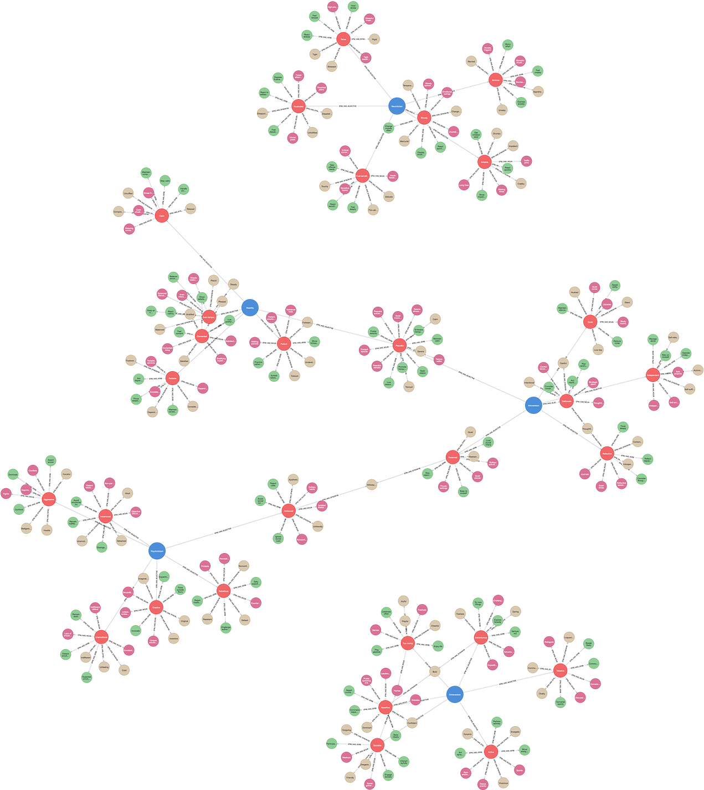

# (4) Eysenck Personality Model (PEN)

**Abbreviation:** EPM
**Category:** Trait-Based Models
**Model Number:** 4 of 44

---

### Description.
Hans Eysenck’s PEN model is a biologically grounded framework proposing three higher-order dimensions of personality: **Psychoticism (P)**, **Extraversion (E)**, and **Neuroticism (N)**.
Eysenck argued that individual differences arise primarily from genetic and physiological variations in the nervous system, linking cortical arousal and limbic system activation to personality expression.
Low Extraversion corresponds to Introversion, and low Neuroticism to Emotional Stability [Eysenck1968Psychoticism, Eysenck1967].

### Dimensions, Examples, and Brain–Function Mapping.
> AI maturity mappings (L1–L3) follow the foundation-agent cognitive hierarchy of Liu et al. (2025).

  - **P – Psychoticism (vs. Impulse Control):** Involves aggressiveness, impulsivity, egocentricity, and nonconformity.

      - Example: Engaging in risky behavior without regard for social norms or long-term consequences.
      - Maps to *Impulse Control and Behavioral Regulation* (L3 AI Maturity), AI agents learning to inhibit immediate responses or optimize long-term behavioral goals.

  - **E – Extraversion (vs. Introversion):** Reflects sociability, liveliness, assertiveness, and sensation-seeking.

      - Example: Actively initiating group discussions or social collaborations.
      - Maps to *Reward Sensitivity and Social Engagement* (L2), AI behaviors modulated by social feedback and environmental novelty.

  - **N – Neuroticism (vs. Emotional Stability):** Represents emotional reactivity, anxiety, irritability, and vulnerability to stress.

      - Example: Overreacting to minor setbacks or experiencing high pre-event anxiety.
      - Maps to *Emotional Processing and Stress Reactivity* (L3), AI systems adapting confidence levels or internal states in response to simulated stressors or uncertainty.

### Applications.

  - **Clinical Psychology:** Explains predispositions to disorders, e.g., anxiety (high N) or antisocial behavior (high P).
  - **Occupational Psychology:** Used to assess performance, resilience, and leadership potential.
  - **Forensic Psychology:** Applies PEN traits to understanding criminality and impulse control.
  - **Educational Psychology:** Studies the influence of trait patterns on learning engagement and academic persistence.
  - **AI Behavior Modeling:** Inspires development of agents exhibiting differentiated risk profiles and stress-adaptive mechanisms.

### Timeline.

  - **1947–1952:** Early work focuses on Extraversion–Introversion and Neuroticism [Eysenck1952Book].
  - **1967:** Publication of *The Biological Basis of Personality*, introducing the PEN model [Eysenck1967].
  - **1975:** Release of the *Eysenck Personality Questionnaire (EPQ)* incorporating the Lie (L) scale [Eysenck1975EPQR].
  - **Post-1975:** Refinements include the EPQ-R and short-form international adaptations.

### Psychometrics.

  - **Format:** Administered via self-report (EPQ, EPQ-R, or EPI) using dichotomous or Likert-type items.
  - **Reliability:** Internal consistency (\( = 0.70–0.85\)); Psychoticism often lower [Eysenck1975EPQR].
  - **Validity:** Strong empirical links to biological and behavioral correlates (e.g., arousal thresholds, conditioning speed).

### Data Structure.
The dataset (`epm.csv`) encodes lexical content for each PEN dimension:

  - `Factor` – Domain (e.g., `Extraversion`, `Introversion`, `Neuroticism`, `Stability`, `Psychoticism`)
  - `Adjective` – Descriptive term (e.g., `Sociable`, `Anxious`, `Impulsive`)
  - `Synonym` – Related descriptor (e.g., `Outgoing`)
  - `Verb` – Action form (e.g., `Socialize`)
  - `Noun` – Nominal representation (e.g., `Sociability`)

### Resources.

  - **Interactive Literature Map:** [Connected Papers graph for Eysenck (1967)](https://www.connectedpapers.com/main/4ce96827cece5195973bd1153084a07a70b5d30c/The-Biological-Basis-of-Personality/graph).
  - **Dataset:** [`EPM_Dataset.csv`](https://github.com/Wildertrek/survey/blob/main/datasets/epm.csv).
  - **Embeddings File:** [`epm_embeddings.csv`](https://github.com/Wildertrek/survey/blob/main/Embeddings/epm_embeddings.csv).

---

## Atlas Resources

| Resource | Location |
|----------|----------|
| Dataset | [`datasets/epm.csv`](../../../datasets/epm.csv) |
| Embeddings | [`Embeddings/epm_embeddings.csv`](../../../Embeddings/epm_embeddings.csv) |
| RF Model | [`models/epm_rf_model.pkl`](../../../models/epm_rf_model.pkl) |
| Label Encoder | [`models/epm_label_encoder.pkl`](../../../models/epm_label_encoder.pkl) |
| Graph (large) | [`graphs/epm_large.png`](../../../graphs/epm_large.png) |

---

## Validation Results

> From: Raetano, Gregor, & Tamang (2026). "A Survey and Computational Atlas of Personality Models." Under review, ACM TIST.

**Performance Tier:** Moderate (50-70%)

### Classification Performance

| Metric | Value |
|--------|-------|
| Factors | 5 |
| Test Items | 71 |
| RF Accuracy | 64.8% |
| F1 Score (macro) | 0.6189 |
| Precision | 0.7066 |
| Recall | 0.6495 |

### Baseline Comparisons

| Baseline | Accuracy | Lift |
|----------|----------|------|
| Random | 20.0% | +44.8% |
| Frequency | 20.0% | +44.8% |

### LLM Judge Evaluation

Triple-judge panel: GPT-5.2, Gemini 3 Pro, Claude Opus 4.6.

| Metric | Value |
|--------|-------|
| RF-Judge Agreement | 80.0% |
| Expected-Factor Agreement | 100.0% |
| Item Validity Rate | 80.0% |
| Mean Confidence | 5.00 / 5.0 |
| Inter-Judge Agreement | 100.0% |

### Category Context

| Metric | Value |
|--------|-------|
| Category | Trait-Based |
| Category Mean Accuracy | 64.0% |
| Category Best | ocean (76.1%) |
| Models in Category | 6 |

### Experiment 2: Model Improvement

| Intervention | Accuracy | Delta |
|-------------|----------|-------|
| Exp1 baseline (1536-dim) | 64.8% | — |
| RQ9: 3072-dim embeddings | 63.4% | -1.4% |
| **Best result** | **64.8%** | **+0.0%** |

Best intervention: Baseline (1536-dim embeddings perform best for this model).

## References

The following references are cited in this model card:

- [Eysenck, H. J. (1952). *The Scientific Study of Personality*](https://archive.org/details/scientificstudyo0000eyse_c9q0)
- `Eysenck1967`
- [Eysenck, S. B. G. & Eysenck, H. J. (1968). *The Measurement of Psychoticism: A Study of Factor Stability and Reliability*](https://hanseysenck.com/wp-content/uploads/2019/12/1968_eysenck_eysenck_-_the_measurement_of_psychoticism_study_of_factor_stability.pdf)
- `Eysenck1975EPQR`

See `references.bib` in the atlas root for full bibliographic entries.
