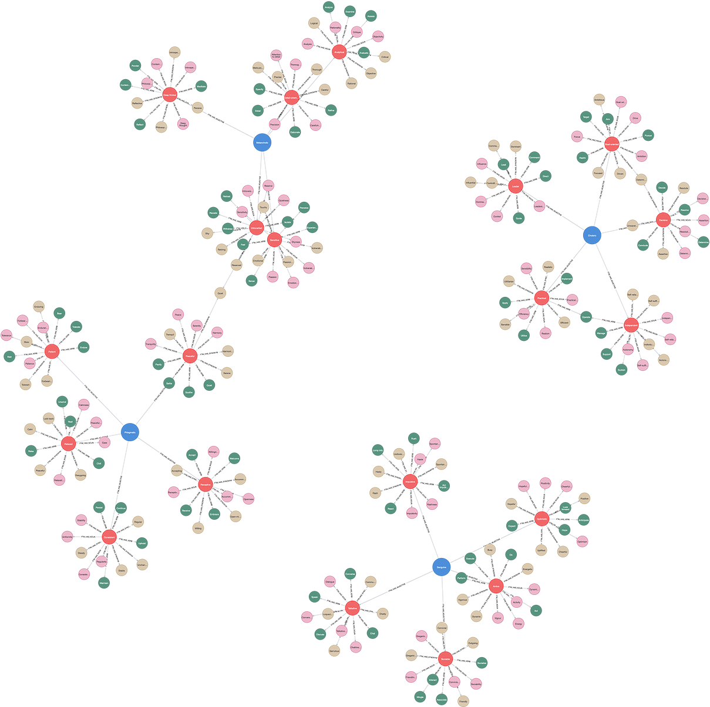

# (6) Four Temperaments

**Abbreviation:** FT
**Category:** Trait-Based Models
**Model Number:** 6 of 44

---

### Description.
The **Four Temperaments** model is an ancient proto-psychological framework proposing four fundamental personality types, **Sanguine**, **Choleric**, **Melancholic**, and **Phlegmatic**.
Originating in Graeco-Arabic medicine, it attributed temperament to bodily “humors”: blood, yellow bile, black bile, and phlegm.
Although superseded by modern psychometrics, the typology remains influential in historical scholarship and popular character theory [HippocratesCorpus, GalenOnTemperaments].

### Dimensions, Examples, and Brain–Function Mapping.
> AI maturity mappings (L1–L3) follow the foundation-agent cognitive hierarchy of Liu et al. (2025).

  - **Sanguine (Optimistic / Sociable):** Outgoing, impulsive, pleasure-seeking, charismatic.
    *Example:* Initiating friendly conversations with strangers at a social event.
    Maps to *Reward Drive and Social Engagement* (L2), AI seeking social feedback or immediate sensory reward.
  - **Choleric (Ambitious / Leader-like):** Decisive, goal-oriented, dominant, assertive.
    *Example:* Taking charge of a stalled meeting to produce an actionable plan.
    Maps to *Executive Control and Goal Pursuit* (L2), AI forming and executing hierarchical task plans.
  - **Melancholic (Analytical / Reflective):** Thoughtful, precise, perfectionistic, reserved.
    *Example:* Crafting a detailed project schedule and anticipating contingencies.
    Maps to *Self-Reflection and Analytical Processing* (L3), AI engaging in deliberate evaluation before action.
  - **Phlegmatic (Calm / Peaceful):** Relaxed, consistent, agreeable, stabilizing.
    *Example:* Mediating workplace conflict with patience and composure.
    Maps to *Emotional Regulation and Stability Maintenance* (L3), AI sustaining steady affective or behavioral states under stress.

### Applications.

  - **Historical Medicine and Philosophy:**
    Guided humoral diagnostics and lifestyle prescriptions across Greek, Islamic, and medieval traditions [Heineman2005].
  - **Creative Writing and Character Design:**
    Serves as a framework for building archetypal characters in literature, theater, and game design [CreativeArchetypes2020, campbell2008hero].
  - **Team-Building and Self-Help:**
    Used informally to illustrate communication styles and conflict approaches in modern workshops [TeamDynamics2018].
  - **Popular Psychology and Digital Typology:**
    Persists in online personality quizzes and self-assessment tools [DigitalTypology2021].

### Timeline.

  - **c. 400 BC:** Hippocratic corpus describes the four humors and their behavioral effects [HippocratesCorpus].
  - **c. 130–210 AD:** Galen formalizes the link between humors and temperaments [GalenOnTemperaments].
  - **Medieval Era (5th–15th Century):** Avicenna and others integrate humoral theory into medical philosophy [MedievalHumorTheory].
  - **19th Century Typology:** Early psychologists reinterpret temperaments along emotional and activity dimensions [Crocq2013Milestones].
  - **20th Century and Beyond:** Though scientifically obsolete, the model influences educational and typological systems (e.g., Waldorf education, Keirsey Temperament Sorter).

### Psychometrics.

  - **Format:** Categorical assignment to one of four types; not a standardized instrument.
  - **Method:** Observation and philosophical reasoning historically; modern use via informal checklists.
  - **Reliability and Validity:** Lacks empirical factor structure or predictive validity; primarily of historical and conceptual value.
  - **Primary Use:** Scholarship, character creation, informal personality self-typing.

### Data Structure.
Dataset (`ftm.csv`) encodes lexical information for each temperament:

  - `Factor` – Temperament type (`Sanguine`, `Choleric`, `Melancholic`, `Phlegmatic`)
  - `Adjective` – Descriptive term (e.g., `Talkative`, `Sociable`)
  - `Synonym` – Near equivalent (e.g., `Communicative`)
  - `Verb` – Behavioral expression (e.g., `Chat`)
  - `Noun` – Nominal form (e.g., `Talkativeness`)

### Resources.

  - **Interactive Literature Map:** [Connected Papers graph for Hippocratic Corpus](https://www.connectedpapers.com/main/4887b286108ce66f545b6e7274aac03fbe2c384d/Hippocratic-Corpus/graph).
  - **Dataset:** [`FT_Dataset.csv`](https://github.com/Wildertrek/survey/blob/main/datasets/ftm.csv).
  - **Embeddings File:** [`ft_embeddings.csv`](https://github.com/Wildertrek/survey/blob/main/Embeddings/ftm_embeddings.csv).

---

## Atlas Resources

| Resource | Location |
|----------|----------|
| Dataset | [`datasets/ftm.csv`](../../../datasets/ftm.csv) |
| Embeddings | [`Embeddings/ftm_embeddings.csv`](../../../Embeddings/ftm_embeddings.csv) |
| RF Model | [`models/ftm_rf_model.pkl`](../../../models/ftm_rf_model.pkl) |
| Label Encoder | [`models/ftm_label_encoder.pkl`](../../../models/ftm_label_encoder.pkl) |
| Graph (large) | [`graphs/ftm_large.png`](../../../graphs/ftm_large.png) |

---

## Validation Results

> From: Raetano, Gregor, & Tamang (2026). "A Survey and Computational Atlas of Personality Models." Under review, ACM TIST.

**Performance Tier:** High (>70%)

### Classification Performance

| Metric | Value |
|--------|-------|
| Factors | 4 |
| Test Items | 57 |
| RF Accuracy | 71.9% |
| F1 Score (macro) | 0.7171 |
| Precision | 0.7298 |
| Recall | 0.7167 |

### Baseline Comparisons

| Baseline | Accuracy | Lift |
|----------|----------|------|
| Random | 25.0% | +46.9% |
| Frequency | 25.0% | +46.9% |

### LLM Judge Evaluation

Triple-judge panel: GPT-5.2, Gemini 3 Pro, Claude Opus 4.6.

| Metric | Value |
|--------|-------|
| RF-Judge Agreement | 90.0% |
| Expected-Factor Agreement | 100.0% |
| Item Validity Rate | 90.0% |
| Mean Confidence | 4.87 / 5.0 |
| Inter-Judge Agreement | 100.0% |

### Category Context

| Metric | Value |
|--------|-------|
| Category | Trait-Based |
| Category Mean Accuracy | 64.0% |
| Category Best | ocean (76.1%) |
| Models in Category | 6 |

### Experiment 2: Model Improvement

| Intervention | Accuracy | Delta |
|-------------|----------|-------|
| Exp1 baseline (1536-dim) | 71.9% | — |
| RQ9: 3072-dim embeddings | 82.5% | +10.5% |
| **Best result** | **82.5%** | **+10.5%** |

Best intervention: 3072-dim embedding upgrade (text-embedding-3-large).

## References

The following references are cited in this model card:

- [Schmidt, H. R. (2020). *The 45 Master Characters: Mythic Models for Creating Original Characters*](https://www.google.com/books/edition/45_Master_Characters_Revised_Edition/mCBjDwAAQBAJ?hl=en&gbpv=1&dq=The+45+Master+Characters:+Mythic+Models+for+Creating+Original+Characters&printsec=frontcover)
- [Crocq, M. et al. (2013). *Milestones in the history of personality disorders*](https://doi.org/10.31887/DCNS.2013.15.2/macrocq)
- `DigitalTypology2021`
- `GalenOnTemperaments`
- `Heineman2005`
- `HippocratesCorpus`
- `MedievalHumorTheory`
- [Salas, E. et al. (2018). *The Wiley Blackwell Handbook of the Psychology of Team Working and Collaborative Processes*](https://www.wiley.com/en-us/The+Wiley+Blackwell+Handbook+of+the+Psychology+of+Team+Working+and+Collaborative+Processes-p-9781118909980)
- `campbell2008hero`

See `references.bib` in the atlas root for full bibliographic entries.
