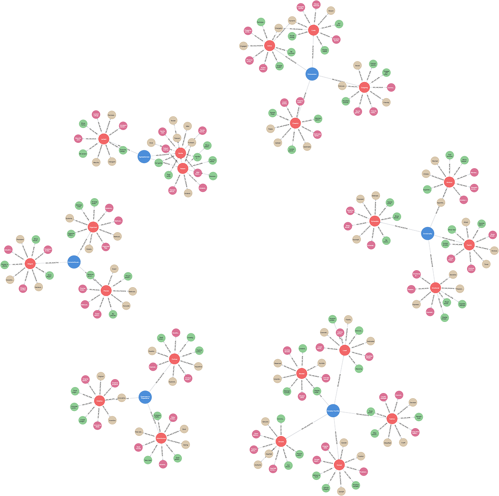

# (3) HEXACO Personality Model

**Abbreviation:** HEXACO
**Category:** Trait-Based Models
**Model Number:** 3 of 44

---

### Description.
Developed by Kibeom Lee and Michael C. Ashton, the HEXACO model extends the traditional Big Five framework by introducing a sixth major dimension, **Honesty–Humility**.
It posits that personality is best described across six broad domains validated across multiple cultures and languages [AshtonLee2004, LeeAshton2012].

### Dimensions, Examples, and Brain–Function Mapping.

  - **H – Honesty–Humility:** Sincerity, fairness, greed avoidance, and modesty.

      - Example: Refusing to exploit an unfair advantage even if undetected.
      - Maps to *Moral Reasoning and Fairness Computation* (L2 AI Maturity), AI applying fairness or ethical constraints in decision processes.

  - **E – Emotionality:** Anxiety, fearfulness, dependence, and sentimentality.

      - Example: Feeling anxious about potential harm or easily moved by a sad story.
      - Maps to *Emotional Processing and Threat Assessment* (L3), AI modeling nuanced emotion and risk detection.

  - **X – Extraversion:** Social boldness, liveliness, and confidence.

      - Example: Engaging energetically in social gatherings.
      - Maps to *Reward Sensitivity and Social Engagement* (L2), AI behaviors guided by feedback or reward mechanisms.

  - **A – Agreeableness (vs. Anger):** Forgiveness, gentleness, flexibility, and patience.

      - Example: Mediating conflicts calmly and empathetically.
      - Maps to *Social Cognition and Conflict Resolution* (L3), AI modeling intentions and resolving social tension collaboratively.

  - **C – Conscientiousness:** Organization, diligence, perfectionism, and prudence.

      - Example: Meticulously managing a multi-step project timeline.
      - Maps to *Working Memory, Planning, and Goal Pursuit* (L2), AI maintaining task-state and sequence control.

  - **O – Openness to Experience:** Aesthetic appreciation, inquisitiveness, and creativity.

      - Example: Exploring novel ideas or unconventional problem-solving approaches.
      - Maps to *Cognitive Flexibility and Creative Exploration* (L3), AI generating innovative solutions in dynamic contexts.

### Applications.

  - **Personnel Selection and Organizational Behavior:** Predicts performance, integrity, and leadership via Honesty–Humility and Conscientiousness [LeeBerry2019, Pletzer2019].
  - **Moral Reasoning and Ethics:** Connects Honesty–Humility to prosocial and moral decision-making [Bell2021MoralMosaic, Moran2020].
  - **Cross-Cultural Validation:** Confirms six-factor stability across diverse societies [DeVries2015, Castro2014].
  - **AI Personality Modeling and HCI:** Guides the development of trustworthy and believable virtual agents [HannaRichards2015, JiTang2024].
  - **Conflict Resolution and Interpersonal Dynamics:** Informs mediation and collaboration strategies based on Agreeableness and Emotionality [Balliet2013, PletzerThielmann2018].

### Timeline.

  - **Early 2000s:** Cross-linguistic psycholexical studies indicate a six-factor model.
  - **2004:** Ashton and Lee formally introduce the HEXACO model and HEXACO Personality Inventory (HEXACO–PI) [AshtonLee2004].
  - **2007:** Empirical validation highlights the predictive power of Honesty–Humility [AshtonLee2007].
  - **2009–2012:** Revised HEXACO–PI–R published and standardized [LeeAshton2012].

### Psychometrics.

  - **Format:** 60–200 items rated on 5-point Likert scales.
  - **Reliability:** Cronbach’s α = 0.80–0.90; high test–retest reliability [LeeAshton2012].
  - **Factor Validity:** Supported across numerous cultures and languages.
  - **Cross-Cultural Stability:** Replicated in over 30 nations, confirming robustness.

### Data Structure.
The dataset (`hex.csv`) encodes lexical information for each HEXACO factor:

  - `Factor` – Domain (e.g., `Honesty-Humility`, `Emotionality`)
  - `Adjective` – Descriptive trait (e.g., `Sincere`, `Anxious`)
  - `Synonym` – Near-equivalent term (e.g., `Fair`)
  - `Verb` – Behavioral form (e.g., `Empathize`)
  - `Noun` – Nominal form (e.g., `Sincerity`, `Empathizer`)

### Resources.

  - **Mapped Brain Functions Table:** Table tab:hexaco-mapping.
  - **L1–L3 AI Maturity Definitions:** Appendix sec:ai-maturity-levels.
  - **Official Website:** [hexaco.org](http://hexaco.org).
  - **Interactive Literature Map:** [Connected Papers graph for Ashton & Lee (2004)](https://www.connectedpapers.com/main/b44b39beaf8a9bdeddd6f7e558c45dde7056f20a/Psychometric-Properties-of-the-HEXACO-Personality-Inventory/graph).
  - **Dataset:** [`HEXACO_Dataset.csv`](https://github.com/Wildertrek/survey/blob/main/datasets/hex.csv).
  - **Embeddings File:** [`hex_embeddings.csv`](https://github.com/Wildertrek/survey/blob/main/Embeddings/hex_embeddings.csv).

---

## Atlas Resources

| Resource | Location |
|----------|----------|
| Dataset | [`datasets/hex.csv`](../../../datasets/hex.csv) |
| Embeddings | [`Embeddings/hex_embeddings.csv`](../../../Embeddings/hex_embeddings.csv) |
| RF Model | [`models/hex_rf_model.pkl`](../../../models/hex_rf_model.pkl) |
| Label Encoder | [`models/hex_label_encoder.pkl`](../../../models/hex_label_encoder.pkl) |
| Graph (large) | [`graphs/hex_large.png`](../../../graphs/hex_large.png) |

## References

The following references are cited in this model card:

- `AshtonLee2004`
- `AshtonLee2007`
- `Balliet2013`
- `Bell2021MoralMosaic`
- `Castro2014`
- `DeVries2015`
- `HannaRichards2015`
- `JiTang2024`
- `LeeAshton2012`
- `LeeBerry2019`
- `Moran2020`
- `Pletzer2019`
- `PletzerThielmann2018`

See `references.bib` in the atlas root for full bibliographic entries.
