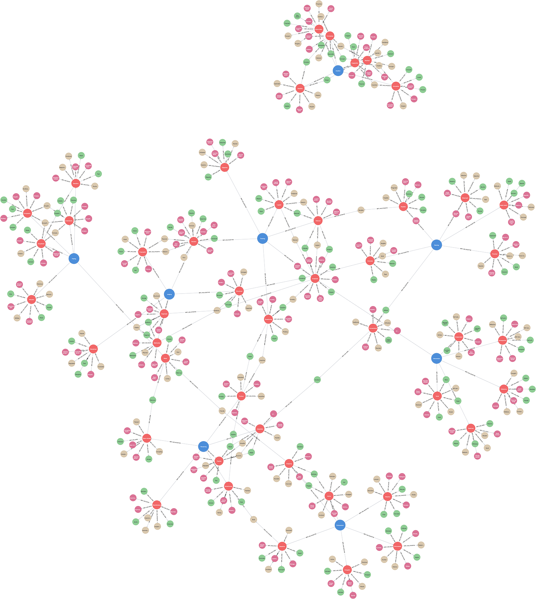

# (2) Myers-Briggs Type Indicator

**Abbreviation:** MBTI
**Category:** Trait-Based Models
**Model Number:** 2 of 44

---

### Description.
Grounded in Carl Jung’s theory of psychological types, the Myers–Briggs Type Indicator (MBTI) is an introspective self-report instrument designed to identify psychological preferences in how individuals perceive the world and make decisions. It assigns individuals to one of sixteen personality types based on four dichotomous scales [Jung1923, Myers1962].

### Dimensions, Examples, and Brain–Function Mapping.
> AI maturity mappings (L1–L3) follow the foundation-agent cognitive hierarchy of Liu et al. (2025).

  - **E/I (Extraversion / Introversion):** Orientation of energy.

      - Example (E): Enjoys collaborative brainstorming to energize.
      - Example (I): Prefers solitary reflection for focus and recharge.
      - (E) → *Reward Sensitivity* (L2 AI Maturity): AI adapting behaviors from positive social feedback.
      - (I) → *Internal Simulation* (L3 AI Maturity): AI performing introspective or self-corrective processing.

  - **S/N (Sensing / Intuition):** Mode of information perception.

      - Example (S): Focuses on concrete details and past experience.
      - Example (N): Detects patterns and future possibilities.
      - (S) → *Concrete Sensory Processing* (L1): AI extracting tangible features from raw data.
      - (N) → *Abstract Pattern Integration* (L2): AI inferring conceptual relations in datasets.

  - **T/F (Thinking / Feeling):** Basis of decision-making.

      - Example (T): Prioritizes logic and objective reasoning.
      - Example (F): Weighs empathy, values, and social impact.
      - (T) → *Rule-Based Reasoning* (L2): AI applying symbolic logic for decisions.
      - (F) → *Value-Based Decision-Making* (L3): AI integrating ethical and social principles.

  - **J/P (Judging / Perceiving):** Orientation to the outer world.

      - Example (J): Prefers structure, closure, and planning.
      - Example (P): Prefers flexibility and adaptability.
      - (J) → *Structured Planning & Goal Adherence* (L2): AI executing fixed task sequences.
      - (P) → *Cognitive Flexibility & Adaptive Response* (L3): AI dynamically reprioritizing under uncertainty.

### Applications.

  - **Team and Leadership Development:** Improves communication and team alignment [SteinSwan2019].
  - **Career Counseling:** Aligns occupational paths with personality preferences [Pittenger2005].
  - **Stress and Conflict Management:** Aids in understanding and mitigating interpersonal friction [Capraro2002].
  - **Personalized Learning:** Supports adaptive education approaches [MyersMcCaulley1985].
  - **Dialogue Style Adaptation:** Predicts MBTI traits (e.g., Extraversion) from human–machine dialogue with 60–70% accuracy, improving agent engagement [Guo2024MBTIPrediction, Fernau2022Alignment].

### Timeline.

  - **1921–1923** – Jung publishes *Psychological Types* [Jung1923].
  - **1926** – Katharine Cook Briggs publishes *Meet Yourself Using the Personality Paint Box* [Briggs1926].
  - **c.1943** – Briggs and Isabel Myers draft the original Type Indicator [MyersBriggs1943].
  - **1956** – Renamed the *Myers–Briggs Type Indicator* [MyersBriggs1956].
  - **1962** – ETS publishes the first official MBTI Manual [Myers1962].
  - **1975–1998** – Subsequent editions expand and refine the instrument [CPP1975, MyersMcCaulley1985, MyersEtAl1998].

### Psychometrics.

  - **Format:** Forced-choice questionnaire (e.g., 93 items in Form M).
  - **Reliability:** Internal consistency  = 0.70–0.90; test–retest r  0.75 [Capraro2002].
  - **Validity:** Ongoing debate on predictive and structural validity; critics cite dichotomous limitations [Pittenger2005].

### Data Structure.
The MBTI dataset (`mbti.csv`) encodes the four dichotomies and their lexical forms:

  - `Factor` – Dichotomy (e.g., `E/I`, `S/N`, `T/F`, `J/P`)
  - `Adjective` – Primary pole label (e.g., `Extraversion`)
  - `Synonym` – Related adjective (e.g., `Outgoing`)
  - `Verb` – Behavioral form (e.g., `Engage`)
  - `Noun` – Nominalized form (e.g., `Engagement`)

### Resources.

  - **Interactive Literature Map:** [Connected Papers graph for Myers & McCaulley (1985) Manual](https://www.connectedpapers.com/main/a8184c7921117d947a0e0ac43bfeee5403b8c6d5/Manual%3A-A-Guide-to-the-Development-and-Use-of-the-Myers%20Briggs-Type-Indicator/graph).
  - **Dataset:** [`MBTI_Dataset.csv`](https://github.com/Wildertrek/survey/blob/main/datasets/mbti.csv).
  - **Embeddings File:** [`mbti_embeddings.csv`](https://github.com/Wildertrek/survey/blob/main/Embeddings/mbti_embeddings.csv).

---

## Atlas Resources

| Resource | Location |
|----------|----------|
| Dataset | [`datasets/mbti.csv`](../../../datasets/mbti.csv) |
| Embeddings | [`Embeddings/mbti_embeddings.csv`](../../../Embeddings/mbti_embeddings.csv) |
| RF Model | [`models/mbti_rf_model.pkl`](../../../models/mbti_rf_model.pkl) |
| Label Encoder | [`models/mbti_label_encoder.pkl`](../../../models/mbti_label_encoder.pkl) |
| Graph (large) | [`graphs/mbti_large.png`](../../../graphs/mbti_large.png) |

---

## Validation Results

> From: Raetano, Gregor, & Tamang (2026). "A Survey and Computational Atlas of Personality Models." Under review, ACM TIST.

**Performance Tier:** Moderate (50-70%)

### Classification Performance

| Metric | Value |
|--------|-------|
| Factors | 8 |
| Test Items | 113 |
| RF Accuracy | 58.4% |
| F1 Score (macro) | 0.5773 |
| Precision | 0.6334 |
| Recall | 0.5851 |

### Baseline Comparisons

| Baseline | Accuracy | Lift |
|----------|----------|------|
| Random | 12.5% | +45.9% |
| Frequency | 12.5% | +45.9% |

### LLM Judge Evaluation

Triple-judge panel: GPT-5.2, Gemini 3 Pro, Claude Opus 4.6.

| Metric | Value |
|--------|-------|
| RF-Judge Agreement | 51.8% |
| Expected-Factor Agreement | 100.0% |
| Item Validity Rate | 51.8% |
| Mean Confidence | 4.97 / 5.0 |
| Inter-Judge Agreement | 100.0% |

### Category Context

| Metric | Value |
|--------|-------|
| Category | Trait-Based |
| Category Mean Accuracy | 64.0% |
| Category Best | ocean (76.1%) |
| Models in Category | 6 |

## References

The following references are cited in this model card:

- [Briggs, K. C. (1926). *Meet Yourself: How to Use the Personality Paint Box*](https://findingaids.lib.msu.edu//repositories/2/archival_objects/155010)
- `CPP1975`
- [Capraro, R. M. & Capraro, M. M. (2002). *Myers-Briggs Type Indicator score reliability across studies: A meta-analytic reliability generalization study*](https://doi.org/10.1177/0013164402062004004)
- `Fernau2022Alignment`
- [Guo, A. et al. (2025). *Personality prediction from task-oriented and open-domain human–machine dialogues*](https://doi.org/10.1038/s41598-024-53989-y)
- `Jung1923`
- `Myers1962`
- `MyersBriggs1943`
- [Briggs, K. C. & Myers, I. B. (1956). *Myers–Briggs Type Indicator formally named*](https://en.wikipedia.org/wiki/Myers%E2%80%93Briggs_Type_Indicator)
- `MyersEtAl1998`
- `MyersMcCaulley1985`
- [Pittenger, D. J. (2005). *Cautionary comments regarding the Myers-Briggs Type Indicator*](https://doi.org/10.1037/1065-9293.57.3.210)
- [Stein, R. & Swan, A. B. (2019). *Evaluating the validity of Myers-Briggs Type Indicator theory: A teaching tool and window into intuitive psychology*](https://doi.org/10.1111/spc3.12434)

See `references.bib` in the atlas root for full bibliographic entries.
