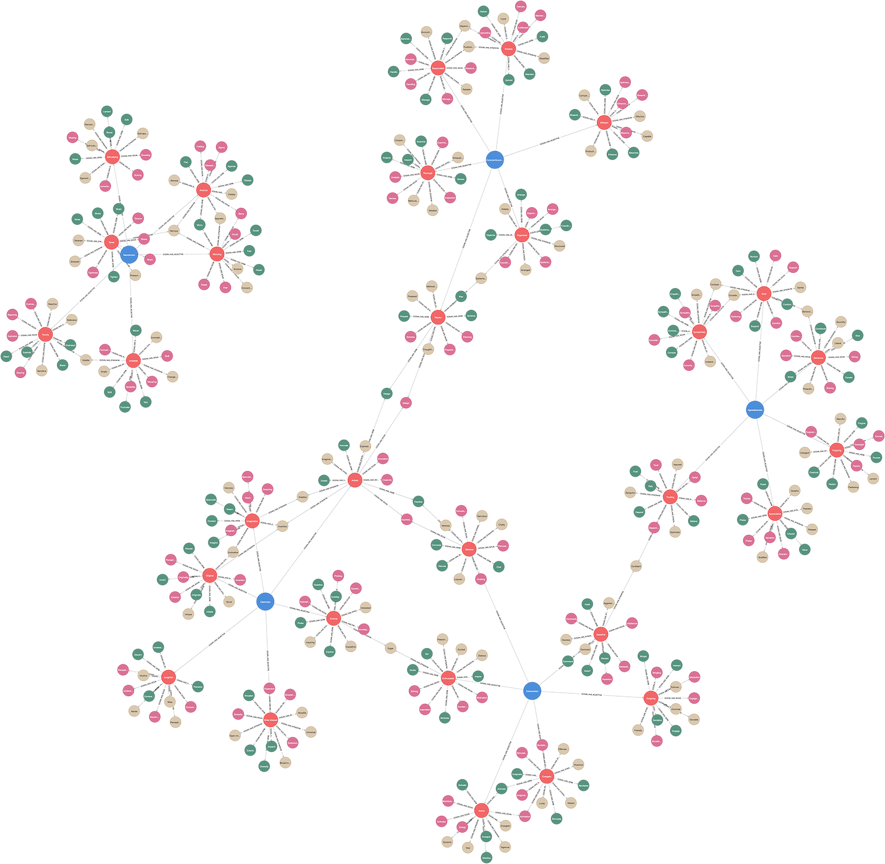

# (1) OCEAN (Big Five Factor Model)

**Abbreviation:** OCEAN
**Category:** Trait-Based Models
**Model Number:** 1 of 44

---

### Description.
Also known as the Five-Factor Model (FFM), OCEAN distills personality into five core dimensions, which have been widely researched and validated across diverse populations and cultures [Tupes1961, Norman1963, Goldberg1981].

### Dimensions, Examples, and Brain–Function Mapping.

  - **Openness (to Experience):** Creativity, curiosity, and appreciation for novelty.
  Example: Seeking out an abstract art exhibit for intellectual stimulation.
  Maps to *cognitive flexibility* (L3 AI Maturity), an AI agent dynamically generating novel strategies.
  - **Conscientiousness:** Organization, dependability, and self-discipline.
  Example: Maintaining a detailed project schedule.
  Maps to *planning and working memory* (L2 AI Maturity), task-list maintenance over extended sessions.
  - **Extraversion:** Sociability, assertiveness, and stimulation-seeking.
  Example: Volunteering to host a large social event.
  Maps to *reward sensitivity* (L2 AI Maturity), reinforcement learning tuned by social feedback.
  - **Agreeableness:** Cooperation, kindness, and empathy.
  Example: Offering emotional support to a distressed colleague.
  Maps to *social cognition and empathy* (L3 AI Maturity), AI modeling user emotional state.
  - **Neuroticism (inverse: Emotional Stability):** Anxiety, moodiness, irritability.
  Example: Experiencing stress from minor setbacks.
  Maps to *emotional regulation* (L3 AI Maturity), AI adjusting confidence or state under uncertainty.

### Applications.

  - **Personality-Aware Recommender Systems:** Enhances personalization by integrating user trait profiles [Dhelim2021].
  - **Behavioral Prediction from Digital Footprints:** Infers traits from social media and text data for adaptive content delivery [Kosinski2013].
  - **Multimodal Personality Recognition:** Predicts traits from images, voice, and text using deep learning [Frontiers2022].
  - **Enhanced Human–AI Interaction:** Embeds trait modeling into conversational agents for alignment and trust [Agrawal2021].
  - **Explainable AI Profiling:** Uses Big Five features for transparent psychological inference in finance, healthcare, and hiring [Matz2020].

### Timeline.

  - **1961** – Tupes and Christal identify five recurrent personality factors [Tupes1961].
  - **1963** – Norman extends and terms them the “Big Five” [Norman1963].
  - **1981** – Goldberg demonstrates cross-cultural robustness [Goldberg1981].
  - **1987** – McCrae and Costa develop the NEO-PI inventory [McCrae1987].
  - **1990** – Goldberg consolidates the Big Five as a descriptive framework [Goldberg1990].

### Psychometrics.

  - **Instruments:** IPIP-NEO-120, BFI-2, BFI-2-S, BFI-2-XS.
  - **Item Format:** 5-point Likert scale (1 = Strongly Disagree, 5 = Strongly Agree).
  - **Internal Consistency:** Cronbach’s α = 0.70–0.85 [Mastrascusa2023].
  - **Test–Retest Reliability:** α = 0.70–0.90 [Mastrascusa2023].
  - **Factor Structure:** CFA supports five-factor model across languages [Mastrascusa2023].
  - **Cross-Cultural Validity:** Stable across cultures, including non-Western populations [Gurven2013].
  - **Public-Domain Resource:** International Personality Item Pool (IPIP) [IPIP2024].

### Data Structure.
Each row in the dataset (e.g., `ocean.csv`) represents a lexical entry:

  - `Factor` – Big Five domain (e.g., `Extraversion`)
  - `Adjective` – Trait descriptor (e.g., `Active`)
  - `Synonym` – Near-equivalent adjective (e.g., `Energetic`)
  - `Verb` – Behavioral form (e.g., `Activate`)
  - `Noun` – Nominal quality or agent (e.g., `Activeness`)

### Resources.

  - **Interactive Literature Map:** [Connected Papers Graph for Tupes & Christal (1961)](https://www.connectedpapers.com/main/fad4bfadd499315007492dcde11f10e1d7ef4f22/Recurrent-personality-factors-based-on-trait-ratings./graph).
  - **Dataset:** [`OCEAN_Dataset.csv`](https://github.com/Wildertrek/survey/blob/main/datasets/ocean.csv).
  - **Embeddings File:** [`ffm_embeddings.csv`](https://github.com/Wildertrek/survey/blob/main/Embeddings/ffm_embeddings.csv).

---

## Atlas Resources

| Resource | Location |
|----------|----------|
| Dataset | [`datasets/ocean.csv`](../../../datasets/ocean.csv) |
| Embeddings | [`Embeddings/ocean_embeddings.csv`](../../../Embeddings/ocean_embeddings.csv) |
| RF Model | [`models/ocean_rf_model.pkl`](../../../models/ocean_rf_model.pkl) |
| Label Encoder | [`models/ocean_label_encoder.pkl`](../../../models/ocean_label_encoder.pkl) |
| Graph (large) | [`graphs/ocean_large.png`](../../../graphs/ocean_large.png) |

---

## Validation Results

> From: Raetano, Gregor, & Tamang (2026). "A Survey and Computational Atlas of Personality Models." Under review, ACM TIST.

**Performance Tier:** High (>70%)

### Classification Performance

| Metric | Value |
|--------|-------|
| Factors | 5 |
| Test Items | 71 |
| RF Accuracy | 76.1% |
| F1 Score (macro) | 0.7484 |
| Precision | 0.7973 |
| Recall | 0.7657 |

### Baseline Comparisons

| Baseline | Accuracy | Lift |
|----------|----------|------|
| Random | 20.0% | +56.1% |
| Frequency | 20.0% | +56.1% |

### LLM Judge Evaluation

Triple-judge panel: GPT-5.2, Gemini 3 Pro, Claude Opus 4.6.

| Metric | Value |
|--------|-------|
| RF-Judge Agreement | 50.0% |
| Expected-Factor Agreement | 100.0% |
| Item Validity Rate | 60.0% |
| Mean Confidence | 4.90 / 5.0 |
| Inter-Judge Agreement | 100.0% |

### Category Context

| Metric | Value |
|--------|-------|
| Category | Trait-Based |
| Category Mean Accuracy | 64.0% |
| Category Best | ocean (76.1%) |
| Models in Category | 6 |

## References

The following references are cited in this model card:

- `Agrawal2021`
- `Dhelim2021`
- `Frontiers2022`
- `Goldberg1981`
- `Goldberg1990`
- `Gurven2013`
- `IPIP2024`
- `Kosinski2013`
- `Mastrascusa2023`
- `Matz2020`
- `McCrae1987`
- `Norman1963`
- `Tupes1961`

See `references.bib` in the atlas root for full bibliographic entries.
