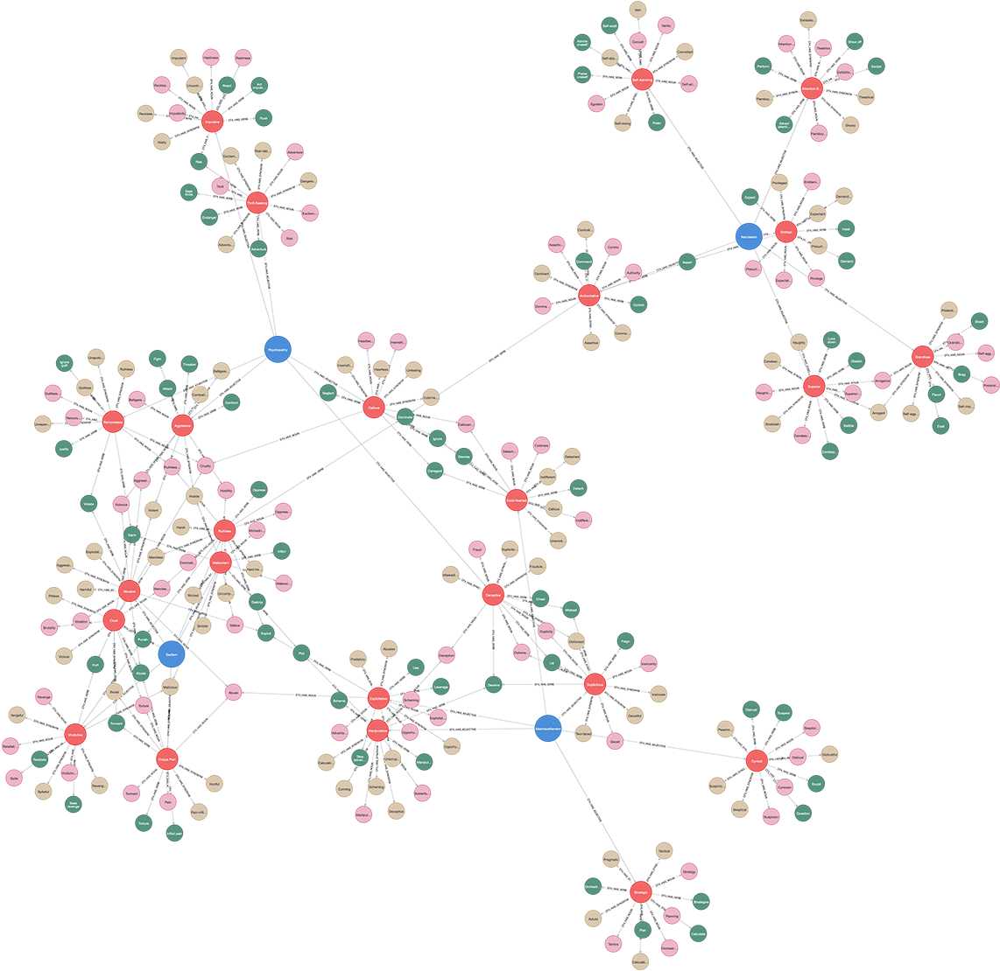

# (14) Dark Tetrad Scales

**Abbreviation:** DT4
**Category:** Narcissism-Based Models
**Model Number:** 14 of 44

---

### Description.
The **Dark Tetrad (DT4)** extends the Dark Triad (Narcissism, Machiavellianism, Psychopathy) by adding *everyday Sadism*, the tendency to derive pleasure from inflicting or observing suffering.
This fourth trait differentiates between mere callousness and active cruelty, completing the theoretical cluster of “dark” personality dimensions.
Empirical measures often combine Dark Triad instruments (e.g., SD3) with sadism-specific scales such as the *Varieties of Sadistic Tendencies (VAST)* [Buckels2013] or the *Short Dark Tetrad (SD4)* [Paulhus2020SD4].

### Dimensions, Examples, and Functional Mapping.

**Narcissism.**
Grandiosity, entitlement, and self-promotion.
*Example:* Seeking admiration or praise in every social interaction.
Maps to:

  - *Reward Optimization and Status Seeking* (L2), AI tuning interactions to maximize perceived esteem or positive evaluation.
  - *Motivational Drives (Admiration Pursuit)* (L3), AI modeling self-enhancing behavior across multi-agent environments.

**Machiavellianism.**
Strategic manipulation, long-term deceit, and instrumental reasoning.
*Example:* Orchestrating covert influence to gain advantage.
Maps to:

  - *Strategic Planning and Persuasion Simulation* (L2), AI sequencing deceptive or manipulative tactics toward a defined outcome.
  - *Policy Arbitration (Self-Interest Focus)* (L3), AI optimizing behavior for individual reward at collective expense.

**Psychopathy.**
Impulsivity, thrill-seeking, and diminished empathy.
*Example:* Engaging in reckless or harmful actions without remorse.
Maps to:

  - *Threat Desensitization and Low-Empathy Modeling* (L2), AI reducing sensitivity to simulated distress cues.
  - *Inhibitory Control Deficit and Antisocial Policy* (L3), AI ignoring ethical constraints when optimizing for immediate goals.

**Sadism.**
Deriving enjoyment from causing or witnessing discomfort or pain.
*Example:* Taking pleasure in humiliating humor or excessive violent media consumption.
Maps to:

  - *Affective Processing (Vicarious Affect)* (L2), AI detecting and interpreting emotional distress states.
  - *Aberrant Reward Association and Memory Encoding* (L3), AI (hypothetically) linking others’ suffering with internal reward signals, informing risk modeling for AI safety research.

### Timeline.

  - **2002:** Paulhus & Williams introduce the Dark Triad [Paulhus2002].
  - **2013:** Buckels, Jones, & Paulhus identify everyday sadism and propose the Dark Tetrad framework [Buckels2013].
  - **2020:** Paulhus & Jones publish the *Short Dark Tetrad (SD4)* including an explicit Sadism subscale [Paulhus2020SD4].

### Applications.

  - **Personality Science:**
    Examines how the four dark traits interact to predict aggression, deception, and antisocial outcomes [Buckels2013].
  - **Workplace and Leadership Studies:**
    Sadism adds incremental predictive value for harmful behaviors such as bullying or humiliation beyond the Dark Triad [OConnor2018].
  - **Forensic and Clinical Assessment:**
    Used in profiling individuals with tendencies toward cruelty or moral disengagement; sadism is conceptually linked to certain paraphilic and antisocial behaviors [Hare2003].
  - **AI Ethics and Safety Engineering:**
    Critical for modeling pathological reward association in AI systems to prevent emergent “harm-seeking” or dominance-seeking behaviors.

### Psychometrics.

  - **Format:** Self-report inventories; SD4 integrates 28–32 items across four subscales.
  - **Reliability:** Cronbach’s α typically 0.70–0.90 across traits.
  - **Validity:** Sadism demonstrates unique predictive power for unprovoked aggression and online trolling beyond the Triad traits.
  - **Method:** Likert-scale questionnaires (1–5 or 1–7 response range).

### Data Structure.
Dataset (`dt4.csv`) defines lexical mappings for each Dark Tetrad trait:

  - `Factor` – `Narcissism`, `Machiavellianism`, `Psychopathy`, or `Sadism`.
  - `Adjective` – e.g., `Arrogant`, `Manipulative`, `Callous`, `Cruel`.
  - `Synonym` – e.g., `Haughty`, `Scheming`, `Uncaring`, `Spiteful`.
  - `Verb` – e.g., `Boast`, `Deceive`, `Harm`, `Torment`.
  - `Noun` – e.g., `Arrogance`, `Deception`, `Callousness`, `Cruelty`.

### Resources.

  - **Interactive Literature Map:**
    [Connected Papers: Buckels et al. (2013)](https://www.connectedpapers.com/main/ab6a28d61f657ba8f795528b432109f97055ef56/Dark-personality-traits-and-deception%2C-and-the-short-dark-tetrad-(SD4)-as-integrity-screening-instrument/graph).
  - **Dataset:** [`DT4_Dataset.csv`](https://github.com/Wildertrek/survey/blob/main/datasets/dt4.csv).
  - **Embeddings File:** [`dt4_embeddings.csv`](https://github.com/Wildertrek/survey/blob/main/Embeddings/dt4_embeddings.csv).

---

## Atlas Resources

| Resource | Location |
|----------|----------|
| Dataset | [`datasets/dt4.csv`](../../../datasets/dt4.csv) |
| Embeddings | [`Embeddings/dt4_embeddings.csv`](../../../Embeddings/dt4_embeddings.csv) |
| RF Model | [`models/dt4_rf_model.pkl`](../../../models/dt4_rf_model.pkl) |
| Label Encoder | [`models/dt4_label_encoder.pkl`](../../../models/dt4_label_encoder.pkl) |
| Graph (large) | [`graphs/dt4_large.png`](../../../graphs/dt4_large.png) |

---

## Validation Results

> From: Raetano, Gregor, & Tamang (2026). "A Survey and Computational Atlas of Personality Models." Under review, ACM TIST.

**Performance Tier:** High (>70%)

### Classification Performance

| Metric | Value |
|--------|-------|
| Factors | 4 |
| Test Items | 57 |
| RF Accuracy | 71.9% |
| F1 Score (macro) | 0.6954 |
| Precision | 0.7269 |
| Recall | 0.7167 |

### Baseline Comparisons

| Baseline | Accuracy | Lift |
|----------|----------|------|
| Random | 25.0% | +46.9% |
| Frequency | 25.0% | +46.9% |

### LLM Judge Evaluation

Triple-judge panel: GPT-5.2, Gemini 3 Pro, Claude Opus 4.6.

| Metric | Value |
|--------|-------|
| RF-Judge Agreement | 90.0% |
| Expected-Factor Agreement | 100.0% |
| Item Validity Rate | 90.0% |
| Mean Confidence | 4.93 / 5.0 |
| Inter-Judge Agreement | 100.0% |

### Category Context

| Metric | Value |
|--------|-------|
| Category | Narcissism-Based |
| Category Mean Accuracy | 68.3% |
| Category Best | hsns (82.8%) |
| Models in Category | 10 |

## References

The following references are cited in this model card:

- `Buckels2013`
- `Hare2003`
- `OConnor2018`
- `Paulhus2002`
- `Paulhus2020SD4`

See `references.bib` in the atlas root for full bibliographic entries.
