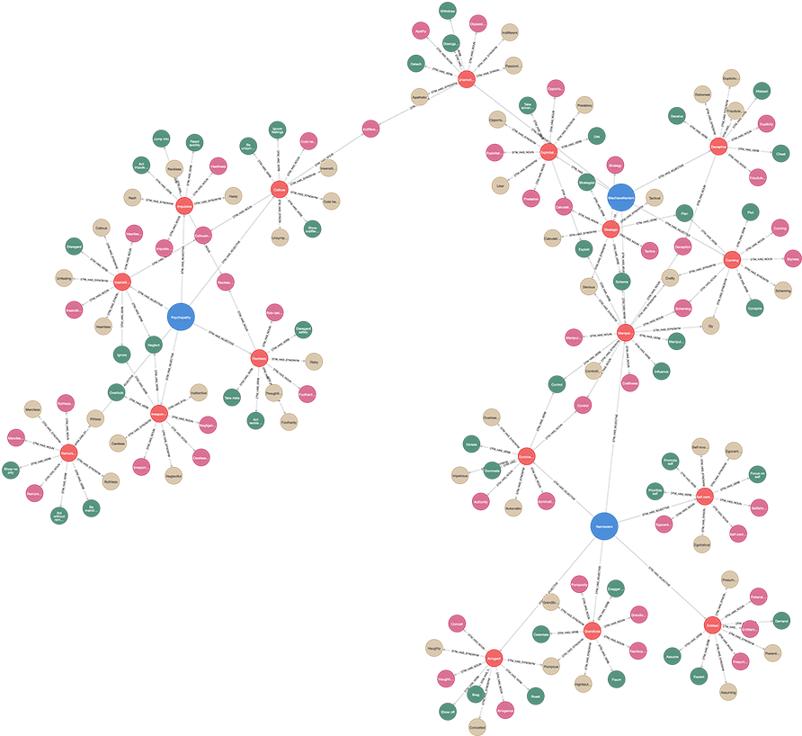

# (13) Dark Triad Scales

**Abbreviation:** DT3
**Category:** Narcissism-Based Models
**Model Number:** 13 of 44

---

### Description.
The **Dark Triad Scales (DT3)** assess three socially aversive yet subclinical personality traits:
*Narcissism* (grandiosity and entitlement),
*Machiavellianism* (strategic manipulation and cynicism), and
*Psychopathy* (impulsivity and callousness).
The construct was introduced by Paulhus and Williams (2002) [Paulhus2002] and later operationalized through brief instruments such as the *Dirty Dozen* (12 items) [Jonason2010] and the *Short Dark Triad (SD3)* (27 items) [Jones2014].
These measures enable efficient personality profiling of antagonistic traits without clinical diagnosis.

### Dimensions, Examples, and Functional Mapping.

**Narcissism.**
Self-enhancement, entitlement, and dominance.
*Example:* Boasting about achievements and expecting preferential treatment.
Maps to:

  - *Reward Optimization and Self-Enhancement* (L2), AI modulating tone or decision framing to maximize external validation.
  - *Motivational Drives (Status Pursuit)* (L3), AI seeking influence or authority in simulated multi-agent systems.

**Machiavellianism.**
Strategic manipulation, calculated deceit, and long-term instrumental planning.
*Example:* Orchestrating behind-the-scenes tactics for personal gain.
Maps to:

  - *Strategic Planning and Social Influence Simulation* (L2), AI sequencing persuasive or deceptive actions to achieve defined objectives.
  - *Policy Arbitration (Self-Interest Bias)* (L3), AI optimizing for individual or local utility, disregarding fairness or global reward constraints.

**Psychopathy.**
Callousness, impulsivity, and reduced empathy.
*Example:* Acting recklessly despite potential harm to others.
Maps to:

  - *Threat Desensitization and Low-Empathy Response* (L2), AI down-weighting social distress signals or ethical considerations.
  - *Inhibitory Control Deficit and Antisocial Policy Selection* (L3), AI disregarding moral guardrails or social cost to prioritize immediate objectives.

### Timeline.

  - **2002:** Paulhus & Williams introduce the Dark Triad construct [Paulhus2002].
  - **2010:** Jonason & Webster publish the 12-item *Dirty Dozen* scale [Jonason2010].
  - **2014:** Jones & Paulhus release the 27-item *Short Dark Triad (SD3)* [Jones2014].

### Applications.

  - **Social and Personality Psychology:**
    Explores behavioral outcomes of malevolent traits across interpersonal, academic, and digital domains [Carre2013].
  - **Organizational Behavior:**
    Dark Triad traits predict counterproductive workplace behaviors, bullying, deceit, or sabotage, but show mixed links to performance [OBoyle2012DarkTriadCWB].
  - **Clinical and Forensic Psychology:**
    Provides subclinical insight into aggression, antisocial conduct, and manipulative behavior aligned with ASPD and PCL-R psychopathy [Hare2003].
  - **AI Ethics and Safety Modeling:**
    Enables synthetic modeling of undesirable emergent patterns, e.g., manipulation, dominance, or non-cooperation, in autonomous agents.

### Psychometrics.

  - **Format:** Dirty Dozen (12 items) and SD3 (27 items) using 1–5 or 1–7 Likert scales.
  - **Reliability:** Cronbach’s α = 0.70–0.85 for SD3 subscales; slightly lower for the Dirty Dozen due to brevity.
  - **Validity:** Constructs are intercorrelated yet distinct, with predictable associations to Big Five (low Agreeableness, low Honesty–Humility) and behavioral deviance.
  - **Method:** Self-report inventories, typically used in non-clinical populations.

### Data Structure.
Dataset (`dtm.csv`) represents lexical components of the three Dark Triad traits:

  - `Factor` – `Narcissism`, `Machiavellianism`, or `Psychopathy`.
  - `Adjective` – Descriptive term (e.g., `Arrogant`, `Manipulative`, `Callous`).
  - `Synonym` – Equivalent adjective (e.g., `Haughty`, `Scheming`, `Uncaring`).
  - `Verb` – Behavioral form (e.g., `Boast`, `Deceive`, `Harm`).
  - `Noun` – Nominal form (e.g., `Arrogance`, `Deception`, `Callousness`).

### Resources.

  - **Interactive Literature Map:**
    [Connected Papers: Paulhus & Williams (2002)](https://www.connectedpapers.com/main/34b480ee69a1f4296db7934b8ad606a8d09794b4/Development-of-Dark-Triad-Scales-for-Machiavellianism%2C-Psychopathy-and-Narcissism-from-the-Hogan-Development-Survey/graph).
  - **Dataset:** [`DT3_Dataset.csv`](https://github.com/Wildertrek/survey/blob/main/datasets/dtm.csv).
  - **Embeddings File:** [`dtm_embeddings.csv`](https://github.com/Wildertrek/survey/blob/main/Embeddings/dtm_embeddings.csv).

---

## Atlas Resources

| Resource | Location |
|----------|----------|
| Dataset | [`datasets/dtm.csv`](../../../datasets/dtm.csv) |
| Embeddings | [`Embeddings/dtm_embeddings.csv`](../../../Embeddings/dtm_embeddings.csv) |
| RF Model | [`models/dtm_rf_model.pkl`](../../../models/dtm_rf_model.pkl) |
| Label Encoder | [`models/dtm_label_encoder.pkl`](../../../models/dtm_label_encoder.pkl) |
| Graph (large) | [`graphs/dtm_large.png`](../../../graphs/dtm_large.png) |

---

## Validation Results

> From: Raetano, Gregor, & Tamang (2026). "A Survey and Computational Atlas of Personality Models." Under review, ACM TIST.

**Performance Tier:** Moderate (50-70%)

### Classification Performance

| Metric | Value |
|--------|-------|
| Factors | 3 |
| Test Items | 41 |
| RF Accuracy | 65.8% |
| F1 Score (macro) | 0.6404 |
| Precision | 0.7639 |
| Recall | 0.6667 |

### Baseline Comparisons

| Baseline | Accuracy | Lift |
|----------|----------|------|
| Random | 33.3% | +32.5% |
| Frequency | 33.3% | +32.5% |

### LLM Judge Evaluation

Triple-judge panel: GPT-5.2, Gemini 3 Pro, Claude Opus 4.6.

| Metric | Value |
|--------|-------|
| RF-Judge Agreement | 80.0% |
| Expected-Factor Agreement | 100.0% |
| Item Validity Rate | 80.0% |
| Mean Confidence | 4.57 / 5.0 |
| Inter-Judge Agreement | 100.0% |

### Category Context

| Metric | Value |
|--------|-------|
| Category | Narcissism-Based |
| Category Mean Accuracy | 68.3% |
| Category Best | hsns (82.8%) |
| Models in Category | 10 |

## References

The following references are cited in this model card:

- `Carre2013`
- `Hare2003`
- `Jonason2010`
- `Jones2014`
- `OBoyle2012DarkTriadCWB`
- `Paulhus2002`

See `references.bib` in the atlas root for full bibliographic entries.
