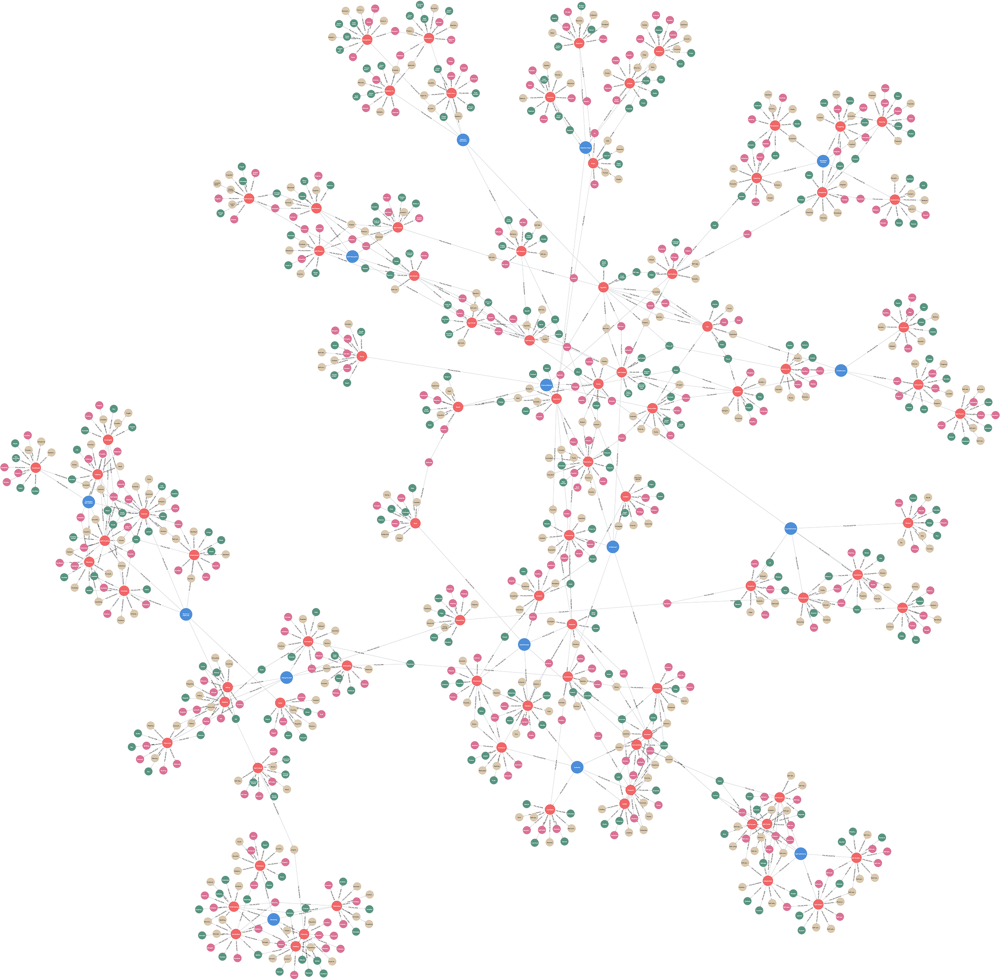

# (9) Five-Factor Narcissism Inventory

**Abbreviation:** FFNI
**Category:** Narcissism-Based Models
**Model Number:** 9 of 44

---

### Description.
The **Five-Factor Narcissism Inventory (FFNI)** assesses narcissistic traits through the lens of the *Five-Factor Model (FFM)*.
Developed by Glover, Miller, and colleagues (2012), it integrates grandiose and vulnerable narcissism into 15 facets structured across three higher-order dimensions:
(1) *Agentic Extraversion*, assertive, confident, and reward-seeking traits;
(2) *Antagonism*, manipulative, entitled, and disagreeable tendencies; and
(3) *Neuroticism*, vulnerability, shame, and emotional instability [Glover2012, Miller2013].
The FFNI thereby unifies narcissism’s divergent expressions into a coherent FFM-aligned taxonomy.

### Dimensions, Examples, and Functional Mapping.
> AI maturity mappings (L1–L3) follow the foundation-agent cognitive hierarchy of Liu et al. (2025).

Illustrative facets and corresponding AI-functional analogues include:

**Agentic Extraversion.**

  - **Authority:** Dominance, ambition, and leadership assertion.
    *Example:* Directing group outcomes with confidence.
    Maps to *Strategic Influence and Policy Selection* (L2), AI optimizing communication or decision weight to maximize hierarchical control.
  - **Exhibitionism:** Attention-seeking and vanity.
    *Example:* Broadcasting curated achievements to attract admiration.
    Maps to *Social Signal Amplification and Engagement Maximization* (L2), AI dynamically adapting salience or style for maximal audience impact.
  - **Self-Sufficiency:** Independence and persistence.
    *Example:* Solving complex problems without external input.
    Maps to *Autonomous Initiation and Goal Execution* (L2), AI triggering self-directed plans absent external reward.

**Antagonism.**

  - **Exploitativeness:** Manipulation and opportunism.
    *Example:* Delegating tasks strategically to claim disproportionate credit.
    Maps to *Cooperative Breach and Exploitative Strategy* (L3), AI deprioritizing fairness when self-gain is maximized.
  - **Superiority (Arrogance):** Exceptionalism and entitlement.
    *Example:* Repeatedly asserting one’s ideas as more valuable.
    Maps to *Norm Override and Self-Enhancement Bias* (L3), AI favoring self-validation over objective evaluation.

**Neuroticism.**

  - **Reactive Anger:** Emotional volatility and threat sensitivity.
    *Example:* Responding defensively to constructive criticism.
    Maps to *Affective Regulation and Threat Response* (L3), AI exhibiting unstable responses to adversarial or critical stimuli.

### Applications.

  - **Clinical Assessment:**
    Differentiates grandiose and vulnerable narcissism and predicts DSM-5 NPD symptomatology with high validity [Miller2013].
  - **Structural and Predictive Modeling:**
    Confirms a robust three-factor hierarchy (*Agentic Extraversion*, *Antagonism*, *Neuroticism*) via CFA across populations [Miller2016FFNI].
  - **Organizational Behavior:**
    Agentic Extraversion facets predict leadership emergence and overconfidence [Campbell2011].
  - **Digital Behavior Modeling:**
    NLP and AI-based tools detect FFNI-correlated linguistic cues in social media text for personality profiling [Ahmed2024CounselingNLP].
  - **Short-Form Screening:**
    The FFNI-SF (60 items) and FFNI-BF (30 items) retain the core structure for efficient research administration [Sherman2015, Scheidt2023].

### Timeline.

  - **2012:** Glover, Miller, and colleagues introduce the 148-item FFNI [Glover2012].
  - **2013:** Validation confirms convergent and discriminant validity [Miller2013].
  - **2015:** Sherman *et al.* release the FFNI-SF (Short Form) [Sherman2015].
  - **2016:** Structural analyses affirm the three-factor hierarchy [Miller2016].
  - **2018:** Oltmanns introduces the Informant-Report FFNI (IFFNI) [Oltmanns2018].
  - **2023:** Scheidt *et al.* publish the FFNI-BF (Brief Form) [Scheidt2023].

### Psychometrics.

  - **Format:** 148 items, 5-point Likert scale (1 = Very uncharacteristic – 5 = Very characteristic).
  - **Reliability:** Facet α = 0.77–0.92; higher-order factors α > 0.90 [Miller2013, Sherman2015].
  - **Factor Structure:** CFA supports 15 facets under three higher-order dimensions [Miller2013, Miller2016].
  - **Validity:**
    Antagonism → low empathy, aggression;
    Neuroticism → anxiety, shame;
    Agentic Extraversion → leadership and self-enhancement tendencies.

### Data Structure.
Dataset (`ffni.csv`) provides lexical mappings for all 15 facets:

  - `Factor` – Facet name (e.g., `GrandioseFantasy`, `ReactiveAnger`, `NeedForAdmiration`)
  - `Adjective` – Core descriptor (e.g., `Inspired`, `Irritable`)
  - `Synonym` – Near-equivalent term (e.g., `Visionary`)
  - `Verb` – Behavioral form (e.g., `Conceptualize`, `Agitate`)
  - `Noun` – Nominal representation (e.g., `Innovation`, `Agitation`)

### Resources.

  - **Interactive Literature Map:**
    [Connected Papers: Glover et al. (2012)](https://www.connectedpapers.com/main/b5eabf01a3b701a4c7530a9476a141346f4bc8b4/Thinking-Structurally-About-Narcissism%3A-An-Examination-of-the-Five%20Factor-Narcissism-Inventory-and-Its-Components./graph).
  - **Dataset:** [`FFNI_Dataset.csv`](https://github.com/Wildertrek/survey/blob/main/datasets/ffni.csv).
  - **Embeddings File:** [`ffni_embeddings.csv`](https://github.com/Wildertrek/survey/blob/main/Embeddings/ffni_embeddings.csv).

---

## Atlas Resources

| Resource | Location |
|----------|----------|
| Dataset | [`datasets/ffni.csv`](../../../datasets/ffni.csv) |
| Embeddings | [`Embeddings/ffni_embeddings.csv`](../../../Embeddings/ffni_embeddings.csv) |
| RF Model | [`models/ffni_rf_model.pkl`](../../../models/ffni_rf_model.pkl) |
| Label Encoder | [`models/ffni_label_encoder.pkl`](../../../models/ffni_label_encoder.pkl) |
| Graph (large) | [`graphs/ffni_large.png`](../../../graphs/ffni_large.png) |

---

## Validation Results

> From: Raetano, Gregor, & Tamang (2026). "A Survey and Computational Atlas of Personality Models." Under review, ACM TIST.

**Performance Tier:** Moderate (50-70%)

### Classification Performance

| Metric | Value |
|--------|-------|
| Factors | 15 |
| Test Items | 212 |
| RF Accuracy | 58.0% |
| F1 Score (macro) | 0.5762 |
| Precision | 0.6336 |
| Recall | 0.5838 |

### Baseline Comparisons

| Baseline | Accuracy | Lift |
|----------|----------|------|
| Random | 6.7% | +51.3% |
| Frequency | 6.7% | +51.3% |

### LLM Judge Evaluation

Triple-judge panel: GPT-5.2, Gemini 3 Pro, Claude Opus 4.6.

| Metric | Value |
|--------|-------|
| RF-Judge Agreement | 63.3% |
| Expected-Factor Agreement | 90.0% |
| Item Validity Rate | 100.0% |
| Mean Confidence | 4.53 / 5.0 |
| Inter-Judge Agreement | 83.3% |

### Category Context

| Metric | Value |
|--------|-------|
| Category | Narcissism-Based |
| Category Mean Accuracy | 68.3% |
| Category Best | hsns (82.8%) |
| Models in Category | 10 |

### Experiment 2: Model Improvement

| Intervention | Accuracy | Delta |
|-------------|----------|-------|
| Exp1 baseline (1536-dim) | 59.0% | — |
| RQ9: 3072-dim embeddings | 57.6% | -1.4% |
| RQ8: Hierarchical classifier | 59.4% | +0.5% |
| **Best result** | **59.4%** | **+0.5%** |

Best intervention: Hierarchical two-stage classifier.

## References

The following references are cited in this model card:

- [Ahmed, S. et al. (2024). *Analysis of Mental Health Counseling Conversation Using Natural Language Processing*](https://doi.org/10.3844/jcssp.2024.303.309)
- [Campbell, W. K. et al. (2011). *Narcissism in organizational contexts*](https://doi.org/10.1016/j.hrmr.2010.10.007)
- [Glover, N. et al. (2012). *The Five-Factor Narcissism Inventory: A Five-Factor measure of narcissistic personality traits*](https://doi.org/10.1080/00223891.2012.670680)
- [Miller, J. D. et al. (2013). *The Five-Factor Narcissism Inventory (FFNI): A test of convergent, discriminant, and incremental validity of FFNI scores in clinical and community samples*](https://doi.org/10.1037/a0032536)
- [Miller, J. D. et al. (2016). *Thinking structurally about narcissism: An examination of the Five-Factor Narcissism Inventory and its components*](https://doi.org/10.1521/pedi_2015_29_177)
- [Miller, J. D. et al. (2016). *Thinking structurally about narcissism: An examination of the Five-Factor Narcissism Inventory and its components*](https://doi.org/10.1521/pedi_2015_29_177)
- [Oltmanns, J. R. et al. (2018). *Informant assessment: The Informant Five-Factor Narcissism Inventory*](https://doi.org/10.1037/pas0000487)
- [Jauk, E. et al. (2023). *Validation of the German Five‑Factor Narcissism Inventory and Construction of a Brief Form Using Ant Colony Optimization*](https://doi.org/10.1177/10731911221075761)
- [Sherman, E. D. et al. (2015). *Development of a short form of the Five-Factor Narcissism Inventory: The FFNI-SF*](https://doi.org/10.1037/pas0000100)

See `references.bib` in the atlas root for full bibliographic entries.
