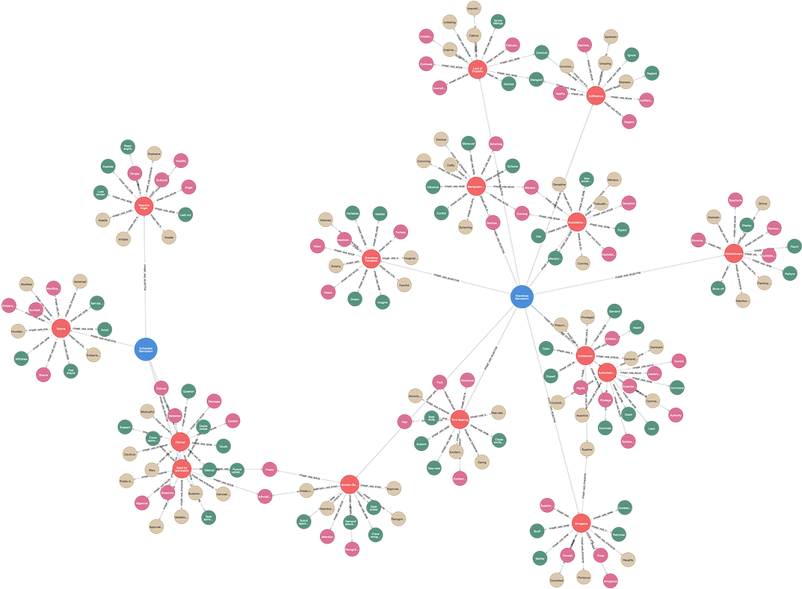

# (10) Five-Factor Narcissism Inventory (Short)

**Abbreviation:** FFNI-SF
**Category:** Narcissism-Based Models
**Model Number:** 10 of 44

---

### Description.
The **Five-Factor Narcissism Inventory–Short Form (FFNI-SF)** is a 60-item self-report instrument distilled from the full 148-item FFNI [Sherman2015].
Developed by Sherman, Miller, and colleagues, the FFNI-SF retains coverage of all 15 narcissism facets while dramatically reducing administration time.
It continues to organize traits under three higher-order dimensions, * Extraversion*, *Antagonism*, and *Neuroticism*, enabling balanced assessment of both grandiose and vulnerable expressions of narcissism.
Despite its brevity, it maintains comparable reliability and factorial integrity to the full inventory.

### Dimensions, Examples, and Functional Mapping.
> AI maturity mappings (L1–L3) follow the foundation-agent cognitive hierarchy of Liu et al. (2025).

The FFNI-SF captures both major narcissism expressions:

**Grandiose Narcissism.**
Acclaim-seeking, arrogance, entitlement, and self-confidence across facets such as *Authority*, *Exhibitionism*, and *Grandiose Fantasies*.
*Example:* Frequently soliciting praise or expecting special treatment following minor achievements.
Maps to:

  - *Reward Mechanisms (Social Approval) and Self-Enhancement* (L2), AI systems adjusting output or tone in response to positive feedback signals.
  - *Motivational Drives (Status Seeking)* (L3), AI agents pursuing recognition or dominance as an intrinsic optimization objective.

**Vulnerable Narcissism.**
Defensive self-enhancement, hypersensitivity to criticism, and oscillating self-esteem spanning facets such as *Contingent Self-Esteem*, *Shame*, and *Reactive Anger*.
*Example:* Becoming defensive or anxious when receiving ambiguous feedback or perceived slight.
Maps to:

  - *Anxiety Processing and Threat Sensitivity* (L2), AI over-weighting negative signals in uncertain evaluation contexts.
  - *Metacognitive Calibration (Self-Worth Fluctuation)* (L3), AI dynamically revising confidence estimates in response to evaluative input.

### Timeline.

  - **2012:** Glover *et al.* publish the original 148-item FFNI [Glover2012].
  - **2015:** Sherman, Miller, and colleagues release the validated 60-item FFNI-SF [Sherman2015].

### Applications.

  - **Clinical and Research Screening:**
    Enables rapid assessment of grandiose and vulnerable narcissism in time-constrained contexts [Oltmanns2018FLUX].
  - **Organizational Studies:**
    Used in large-scale analyses of leadership style, team cohesion, and counterproductive behaviors [Grijalva2015BossNarc].
  - **Forensic Evaluation:**
    Identifies provoked aggression and threat sensitivity, even beyond psychopathy predictors [vanTeffelen2021Provoked].
  - **AI-Driven Personality Analytics:**
    Applicable for adaptive hiring models, recommender systems, and user modeling frameworks [TalentAI2024].

### Psychometrics.

  - **Format:** 60 items rated on a 1–5 Likert scale (*Very Uncharacteristic*–*Very Characteristic*).
  - **Reliability:** Facet α values  .80–.92; higher-order factors maintain strong consistency [Sherman2015].
  - **Validity:** Retains the FFNI’s 15-facet structure and convergent validity with both grandiose and vulnerable measures.
  - **Method:** Standardized self-report inventory.

### Data Structure.
Dataset (`ffni_sf.csv`) organizes lexical data around two macro-dimensions:

  - `Factor` – `GrandioseNarcissism` or `VulnerableNarcissism`.
  - `Adjective` – Descriptor (e.g., `Arrogant`, `Hypersensitive`).
  - `Synonym` – Equivalent term (e.g., `Haughty`, `ThinSkinned`).
  - `Verb` – Behavioral form (e.g., `Dominate`, `Worry`).
  - `Noun` – Nominal representation (e.g., `Dominance`, `Anxiety`).

### Resources.

  - **Interactive Literature Map:**
    [Connected Papers: Sherman et al. (2015)](https://www.connectedpapers.com/main/6309a7fa7116cd289ef855be3c2abc8c4000a301/Five%20Factor-Narcissism-Inventory%20%20Short-Form/graph).
  - **Dataset:** [`FFNI-SF_Dataset.csv`](https://github.com/Wildertrek/survey/blob/main/datasets/ffni_sf.csv).
  - **Embeddings File:** [`ffni_sf_embeddings.csv`](https://github.com/Wildertrek/survey/blob/main/Embeddings/ffni_sf_embeddings.csv).

---

## Atlas Resources

| Resource | Location |
|----------|----------|
| Dataset | [`datasets/ffni_sf.csv`](../../../datasets/ffni_sf.csv) |
| Embeddings | [`Embeddings/ffni_sf_embeddings.csv`](../../../Embeddings/ffni_sf_embeddings.csv) |
| RF Model | [`models/ffni_sf_rf_model.pkl`](../../../models/ffni_sf_rf_model.pkl) |
| Label Encoder | [`models/ffni_sf_label_encoder.pkl`](../../../models/ffni_sf_label_encoder.pkl) |
| Graph (large) | [`graphs/ffni_sf_large.png`](../../../graphs/ffni_sf_large.png) |

---

## Validation Results

> From: Raetano, Gregor, & Tamang (2026). "A Survey and Computational Atlas of Personality Models." Under review, ACM TIST.

**Performance Tier:** High (>70%)

### Classification Performance

| Metric | Value |
|--------|-------|
| Factors | 2 |
| Test Items | 29 |
| RF Accuracy | 82.8% |
| F1 Score (macro) | 0.8242 |
| Precision | 0.8434 |
| Recall | 0.8238 |

### Baseline Comparisons

| Baseline | Accuracy | Lift |
|----------|----------|------|
| Random | 50.0% | +32.8% |
| Frequency | 73.3% | +9.4% |

### LLM Judge Evaluation

Triple-judge panel: GPT-5.2, Gemini 3 Pro, Claude Opus 4.6.

| Metric | Value |
|--------|-------|
| RF-Judge Agreement | 100.0% |
| Expected-Factor Agreement | 100.0% |
| Item Validity Rate | 100.0% |
| Mean Confidence | 4.90 / 5.0 |
| Inter-Judge Agreement | 100.0% |

### Category Context

| Metric | Value |
|--------|-------|
| Category | Narcissism-Based |
| Category Mean Accuracy | 68.3% |
| Category Best | hsns (82.8%) |
| Models in Category | 10 |

## References

The following references are cited in this model card:

- [Glover, N. et al. (2012). *The Five-Factor Narcissism Inventory: A Five-Factor measure of narcissistic personality traits*](https://doi.org/10.1080/00223891.2012.670680)
- [Grijalva, E. et al. (2015). *Narcissism and leadership: A meta-analytic review of linear and nonlinear relationships*](https://doi.org/10.1111/peps.12072)
- [Oltmanns, J. R. & Widiger, T. A. (2018). *Assessment of fluctuation between grandiose and vulnerable narcissism: Development and initial validation of the FLUX scales*](https://doi.org/10.1037/pas0000616)
- [Sherman, E. D. et al. (2015). *Development of a short form of the Five-Factor Narcissism Inventory: The FFNI-SF*](https://doi.org/10.1037/pas0000100)
- [Platform, T. A. (2024). *Integrating Personality Trait Data into Automated Hiring-Fit Algorithms*](https://testlify.com/features/ai-powered-assessments/)
- [van Teffelen, M. W. et al. (2021). *Provoked Aggression, Psychopathy and Narcissism: Comparing the Impact of Social Exclusion and Insult*](https://doi.org/10.1037/vio0000340)

See `references.bib` in the atlas root for full bibliographic entries.
