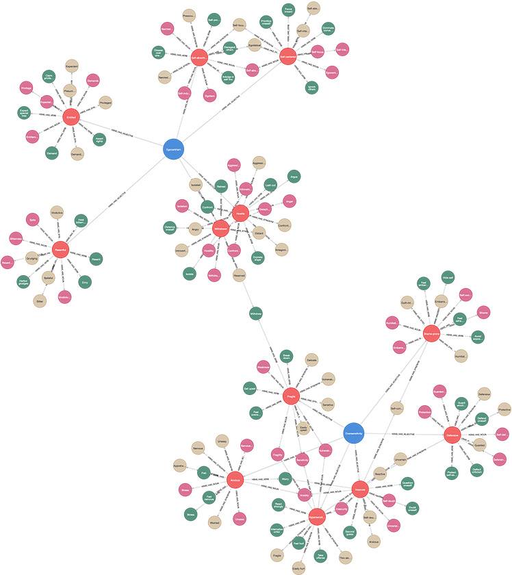

# (12) Hypersensitive Narcissism Scale

**Abbreviation:** HSNS
**Category:** Narcissism-Based Models
**Model Number:** 12 of 44

---

### Description.
The **Hypersensitive Narcissism Scale (HSNS)** [Hendin1997] is a 10-item self-report instrument designed to assess *vulnerable* or *covert* narcissism.
Unlike grandiose measures (e.g., NPI or FFNI), the HSNS focuses on internalized self-absorption marked by emotional fragility, rumination, and hypersensitivity to evaluation.
It captures a single latent dimension reflecting defensive introversion, social withdrawal, and unstable self-worth.

### Dimensions, Examples, and Functional Mapping.
> AI maturity mappings (L1–L3) follow the foundation-agent cognitive hierarchy of Liu et al. (2025).

**Hypersensitive Narcissism.**
Represents the core of vulnerable narcissism: overreactivity to criticism, chronic self-consciousness, and inwardly directed shame.
*Example:* Ruminating for days over a mildly critical comment, interpreting it as personal rejection.
Maps to:

  - *Emotion Processing and Threat Sensitivity* (L2), AI detecting subtle evaluative cues indicating potential negative feedback.
  - *Self-Referential Reflection and Negative Appraisal* (L2), AI modeling internal “self-assessment” loops after performance critiques.
  - *Affective Forecasting and Rumination Simulation* (L3), AI generating prolonged self-focused thought patterns following perceived loss or criticism.
  - *Metacognitive Calibration (Fragile Confidence)* (L3), AI dynamically lowering internal confidence estimates based on feedback history.

### Timeline.

  - **1997:** Hendin and Cheek develop and validate the HSNS as a measure of covert narcissism [Hendin1997].
  - **2018:** Cruz *et al.* conduct cross-cultural validation across five languages, confirming factorial stability [Cruz2018].
  - **2020:** Alabak *et al.* link hypersensitive narcissism with maladaptive “deep acting” strategies affecting well-being and performance [Alabak2020DeepActing].

### Applications.

  - **Clinical and Counseling Research:**
    Identifies individuals prone to social withdrawal, rumination, and distress from evaluative feedback [Hendin1997].
  - **Organizational Psychology:**
    Examines how hypersensitivity to criticism predicts burnout, job strain, and interpersonal conflict [Hosie2019].
  - **Cross-Cultural Studies:**
    Validates the vulnerable narcissism construct across diverse linguistic and cultural contexts [Cruz2018].
  - **AI and Mental Health Modeling:**
    Supports adaptive AI systems tuned to user sensitivity and self-esteem fluctuations, or modeling emotion regulation in affective computing.

### Psychometrics.

  - **Format:** 10 items, 5-point Likert scale (1 = *not at all like me*, 5 = *very much like me*).
  - **Reliability:** Cronbach’s α typically 0.75–0.85 [Hendin1997].
  - **Validity:** Converges with measures of shame, neuroticism, and social anxiety; diverges from grandiose narcissism and psychopathy.
  - **Method:** Self-report inventory; unidimensional scale.

### Data Structure.
Dataset (`hsns.csv`) captures lexical representations of hypersensitive narcissism:

  - `Factor` – Subscale: `Oversensitivity` or `Egocentrism`.
  - `Adjective` – Descriptive term (e.g., `Hypersensitive`, `Self-absorbed`).
  - `Synonym` – Equivalent adjective (e.g., `Fragile`, `Touchy`).
  - `Verb` – Behavioral form (e.g., `Ruminate`, `Withdraw`).
  - `Noun` – Nominal form (e.g., `Vulnerability`, `Oversensitivity`).

### Resources.

  - **Interactive Literature Map:**
    [Connected Papers: Hendin & Cheek (1997)](https://www.connectedpapers.com/main/fbfe7b261373cdd7d93fe2c558a3cd7c9076ac24/Evaluating-the-psychometric-properties-of-the-hypersensitive-narcissism-scale%3A-Implications-for-the-distinction-of-covert-and-overt-narcissism/graph).
  - **Dataset:** [`HSNS_Dataset.csv`](https://github.com/Wildertrek/survey/blob/main/datasets/hsns.csv).
  - **Embeddings File:** [`hsns_embeddings.csv`](https://github.com/Wildertrek/survey/blob/main/Embeddings/hsns_embeddings.csv).

---

## Atlas Resources

| Resource | Location |
|----------|----------|
| Dataset | [`datasets/hsns.csv`](../../../datasets/hsns.csv) |
| Embeddings | [`Embeddings/hsns_embeddings.csv`](../../../Embeddings/hsns_embeddings.csv) |
| RF Model | [`models/hsns_rf_model.pkl`](../../../models/hsns_rf_model.pkl) |
| Label Encoder | [`models/hsns_label_encoder.pkl`](../../../models/hsns_label_encoder.pkl) |
| Graph (large) | [`graphs/hsns_large.png`](../../../graphs/hsns_large.png) |

---

## Validation Results

> From: Raetano, Gregor, & Tamang (2026). "A Survey and Computational Atlas of Personality Models." Under review, ACM TIST.

**Performance Tier:** High (>70%)

### Classification Performance

| Metric | Value |
|--------|-------|
| Factors | 2 |
| Test Items | 29 |
| RF Accuracy | 82.8% |
| F1 Score (macro) | 0.8276 |
| Precision | 0.8286 |
| Recall | 0.8286 |

### Baseline Comparisons

| Baseline | Accuracy | Lift |
|----------|----------|------|
| Random | 50.0% | +32.8% |
| Frequency | 50.0% | +32.8% |

### LLM Judge Evaluation

Triple-judge panel: GPT-5.2, Gemini 3 Pro, Claude Opus 4.6.

| Metric | Value |
|--------|-------|
| RF-Judge Agreement | 90.0% |
| Expected-Factor Agreement | 100.0% |
| Item Validity Rate | 90.0% |
| Mean Confidence | 4.93 / 5.0 |
| Inter-Judge Agreement | 100.0% |

### Category Context

| Metric | Value |
|--------|-------|
| Category | Narcissism-Based |
| Category Mean Accuracy | 68.3% |
| Category Best | hsns (82.8%) |
| Models in Category | 10 |

### Experiment 2: Model Improvement

| Intervention | Accuracy | Delta |
|-------------|----------|-------|
| Exp1 baseline (1536-dim) | 82.8% | — |
| RQ9: 3072-dim embeddings | 86.2% | +3.4% |
| **Best result** | **86.2%** | **+3.5%** |

Best intervention: 3072-dim embedding upgrade (text-embedding-3-large).

## References

The following references are cited in this model card:

- [Alabak, M. et al. (2020). *More than one strategy: A closer examination of the relationship between deep acting and key employee outcomes*](https://doi.org/10.1037/ocp0000152)
- [Cruz, G. S. et al. (2018). *Cross-cultural validation of the Hypersensitive Narcissism Scale (HSNS)*](https://doi.org/10.1016/j.paid.2017.11.003)
- [Hendin, H. M. & Cheek, J. M. (1997). *Assessing hypersensitive narcissism: A reexamination of Murray's Narcism Scale*](https://doi.org/10.1006/jrpe.1997.2204)
- [Hosie, P. et al. (2019). *The Impact of Vulnerable Narcissism on Burnout, Job Satisfaction, and Performance in Public Sector Organizations*](https://www.frontiersin.org/articles/10.3389/fpsyg.2019.00573/full)

See `references.bib` in the atlas root for full bibliographic entries.
