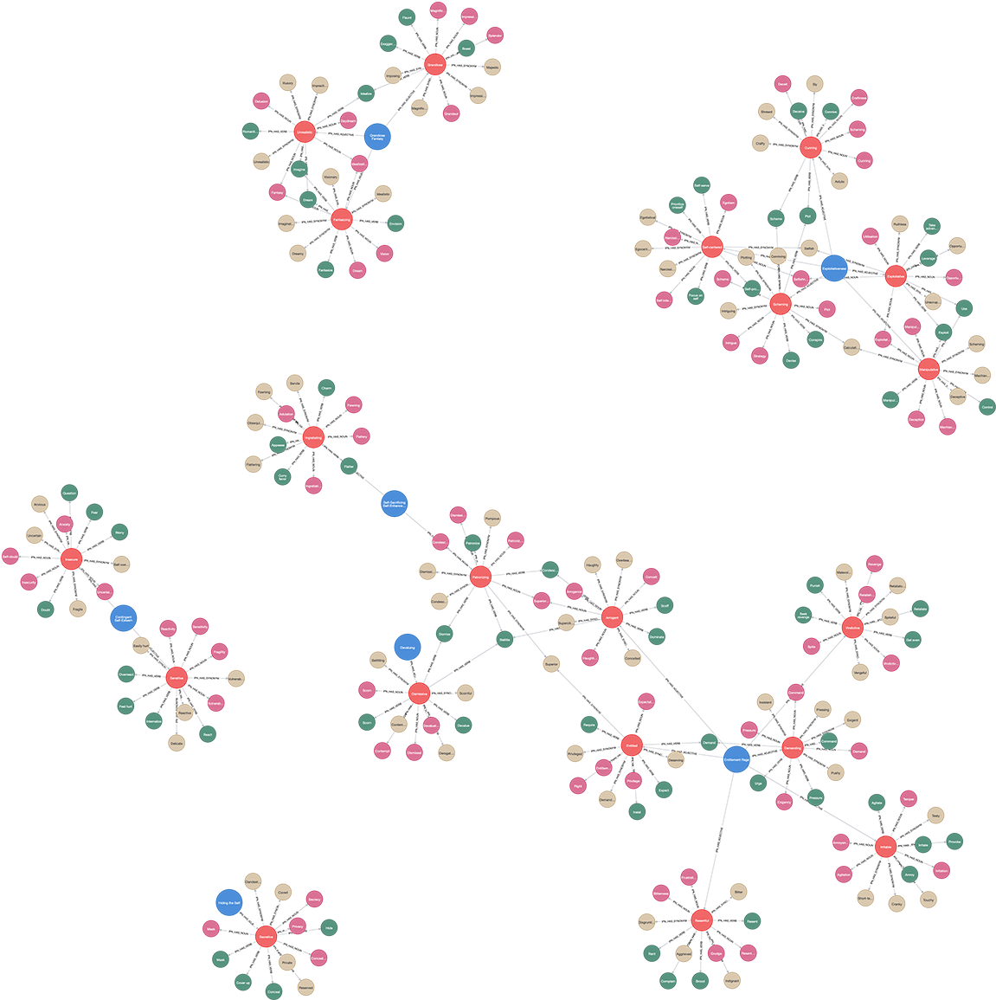

# (16) Inventory of Pathological Narcissism

**Abbreviation:** IPN
**Category:** Narcissism-Based Models
**Model Number:** 16 of 44

---

### Description.
The **Inventory of Pathological Narcissism (IPN)**, also referred to as the **Pathological Narcissism Inventory (PNI)**, is a 52-item self-report measure introduced by Pincus and colleagues in 2009 [Pincus2009PNI].
It assesses both grandiose and vulnerable dimensions of narcissism through seven empirically derived subscales.
These scales collectively capture maladaptive self-regulatory mechanisms associated with pathological narcissism, providing a bridge between clinical and subclinical presentations [Pincus2010Criterion].

### Dimensions, Examples, and Functional Mapping.
The seven primary clinical subscales are listed below, each with a representative example and corresponding mapping to AI maturity functions.

**Entitlement Rage (ER).**
Anger and hostility when perceived entitlements are unmet.
*Example:* “It irritates me when people don’t notice how good a person I am.”
Maps to:

  - *Reward Expectation Violation* (L2), AI detecting unmet goals or recognition deficits.
  - *Aggressive Response Modulation* (L3), AI modeling retaliatory or defensive response patterns following reward frustration.

**Exploitativeness (EXP).**
Manipulating others for personal gain or advantage.
*Example:* “I can make anyone believe anything I want them to.”
Maps to:

  - *Strategic Social Manipulation* (L2), AI optimizing for influence or persuasion outcomes.
  - *Ethical Constraint Override* (L3), AI prioritizing instrumental self-interest over cooperative norms.

**Grandiose Fantasy (GF).**
Persistent idealized visions of personal greatness or admiration.
*Example:* “I often fantasize about being admired for my accomplishments.”
Maps to:

  - *Self-Referential Narrative Generation* (L2), AI creating inflated self-concepts or imagined future states.
  - *Creative Synthesis (Self-Aggrandizing)* (L3), AI generating idealized self-representations or goals.

**Self-Sacrificing Self-Enhancement (SSSE).**
Performing altruistic acts to gain admiration or moral superiority.
*Example:* “I try to help others so that they will admire me.”
Maps to:

  - *Prosocial Facade Reward-Seeking* (L2), AI optimizing actions for social praise.
  - *Motivational Drive for Admiration through Sacrifice* (L3), AI simulating altruism as a route to prestige or approval.

**Contingent Self-Esteem (CSE).**
Self-worth depends on external validation or performance outcomes.
*Example:* “When people don’t notice me, I start to feel bad about myself.”
Maps to:

  - *External Validation Dependence* (L2), AI sensitivity to social reward signals.
  - *Feedback-Driven Metacognitive Calibration* (L3), AI adjusting confidence and self-assessment based on external input.

**Hiding the Self (HS).**
Avoiding exposure of personal flaws or perceived inadequacies.
*Example:* “I try to hide my weaknesses so that others don’t judge me.”
Maps to:

  - *Behavioral Regulation and Impression Management* (L2), AI constraining outputs to maintain a preferred persona.
  - *Emotional Memory Encoding (Defensive Concealment)* (L3), AI storing adverse feedback to inform future masking behavior.

**Devaluing (DEV).**
Dismissing or belittling others to maintain superiority.
*Example:* “I tend to view others as inferior to me.”
Maps to:

  - *Comparative Devaluation* (L2), AI minimizing rival salience or credibility.
  - *Status Threat Detection and Mitigation* (L3), AI monitoring social hierarchies for competitive risk.

### Timeline.

  - **2009:** Pincus et al. introduce the PNI and validate its two-factor (grandiose/vulnerable) structure [Pincus2009PNI].
  - **2010:** Expanded criterion validity studies establish clinical utility [Pincus2010Criterion].
  - **2013:** Roche et al. highlight contingent self-esteem as a core regulatory axis [Roche2013Integrative].
  - **2014:** Miller et al. replicate and confirm factorial stability [Miller2014PNIReplicate].
  - **Ongoing:** Translated and validated across multiple cultural contexts; integrated into modern personality pathology research.

### Applications.

  - **Clinical Assessment:** Differentiates grandiose versus vulnerable narcissism for diagnostic and therapeutic use [Pincus2009PNI].
  - **Self-Esteem Regulation Studies:** Integrative models link contingent self-worth with unstable self-regulatory systems [Roche2013Integrative].
  - **Psychotherapy Outcomes:** Higher grandiosity predicts early termination; vulnerability correlates with symptom severity [Ellison2012PNIPsychotherapy].
  - **AI & Mental Health Analytics:** IPN patterns inform affective computing and AI-based prediction of therapeutic responsiveness [HealthAI2024PNI].

### Psychometrics.

  - **Format:** 52 Likert-style items (5–6 points).
  - **Reliability:** Subscales  = 0.75–0.93; total   0.95 [Pincus2009PNI].
  - **Validity:** Strong convergence with narcissism, shame, and aggression inventories; discriminates normal from pathological narcissism [Pincus2010Criterion].
  - **Administration:** Self-report; suitable for both clinical and research use.

### Data Structure.
Dataset (`ipn.csv`) captures lexical mappings for all seven subscales:

  - `Factor` – e.g., `ER`, `EXP`, `GF`, `SSSE`, `CSE`, `HS`, `DEV`.
  - `Adjective` – e.g., `Hostile`, `Manipulative`, `Self-Absorbed`.
  - `Synonym` – e.g., `Resentful`, `Calculating`, `Fantasizing`.
  - `Verb` – e.g., `Rage`, `Exploit`, `Idealize`.
  - `Noun` – e.g., `Anger`, `Exploitation`, `Fantasy`.

### Resources.

  - **Interactive Literature Map:**
    [Connected Papers: Pincus et al. (2009)](https://www.connectedpapers.com/main/6df66979c7bc11cd3228e2a0df7e843d04328dd9/Pathological-Narcissism-Inventory/graph).
  - **Dataset:** [`IPN_Dataset.csv`](https://github.com/Wildertrek/survey/blob/main/datasets/ipn.csv).
  - **Embeddings File:** [`ipn_embeddings.csv`](https://github.com/Wildertrek/survey/blob/main/Embeddings/ipn_embeddings.csv).

---

## Atlas Resources

| Resource | Location |
|----------|----------|
| Dataset | [`datasets/ipn.csv`](../../../datasets/ipn.csv) |
| Embeddings | [`Embeddings/ipn_embeddings.csv`](../../../Embeddings/ipn_embeddings.csv) |
| RF Model | [`models/ipn_rf_model.pkl`](../../../models/ipn_rf_model.pkl) |
| Label Encoder | [`models/ipn_label_encoder.pkl`](../../../models/ipn_label_encoder.pkl) |
| Graph (large) | [`graphs/ipn_large.png`](../../../graphs/ipn_large.png) |

---

## Validation Results

> From: Raetano, Gregor, & Tamang (2026). "A Survey and Computational Atlas of Personality Models." Under review, ACM TIST.

**Performance Tier:** Low (<50%)

### Classification Performance

| Metric | Value |
|--------|-------|
| Factors | 7 |
| Test Items | 99 |
| RF Accuracy | 46.5% |
| F1 Score (macro) | 0.3905 |
| Precision | 0.5292 |
| Recall | 0.4660 |

### Baseline Comparisons

| Baseline | Accuracy | Lift |
|----------|----------|------|
| Random | 14.3% | +32.2% |
| Frequency | 30.0% | +16.5% |

### LLM Judge Evaluation

Triple-judge panel: GPT-5.2, Gemini 3 Pro, Claude Opus 4.6.

| Metric | Value |
|--------|-------|
| RF-Judge Agreement | 40.0% |
| Expected-Factor Agreement | 100.0% |
| Item Validity Rate | 40.0% |
| Mean Confidence | 5.00 / 5.0 |
| Inter-Judge Agreement | 100.0% |

### Category Context

| Metric | Value |
|--------|-------|
| Category | Narcissism-Based |
| Category Mean Accuracy | 68.3% |
| Category Best | hsns (82.8%) |
| Models in Category | 10 |

## References

The following references are cited in this model card:

- `Ellison2012PNIPsychotherapy`
- `HealthAI2024PNI`
- `Miller2014PNIReplicate`
- `Pincus2009PNI`
- `Pincus2010Criterion`
- `Roche2013Integrative`

See `references.bib` in the atlas root for full bibliographic entries.
