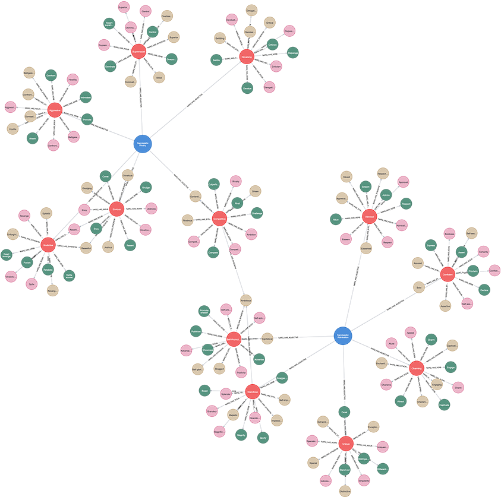

# (11) Narcissistic Admiration and Rivalry Questionnaire

**Abbreviation:** NARQ
**Category:** Narcissism-Based Models
**Model Number:** 11 of 44

---

### Description.
The **Narcissistic Admiration and Rivalry Questionnaire (NARQ)** [Back2013] conceptualizes narcissism as two complementary strategies for maintaining a grandiose self-image.
*Narcissistic Admiration* reflects assertive self-enhancement and charm-oriented social expansion, whereas *Narcissistic Rivalry* captures antagonistic self-protection through devaluation and aggression.
Together, these dimensions distinguish socially adaptive versus maladaptive pathways of narcissistic expression, refining the construct beyond single-factor models.

### Dimensions, Examples, and Functional Mapping.

**Narcissistic Admiration (ADM).**
Assertive self-enhancement via charm, self-promotion, and pursuit of uniqueness.
*Example:* Confidently showcasing one’s achievements to elicit admiration or reinforce competence.
Maps to:

  - *Self-Promotion and Impression Management* (L2), AI emphasizing prior successes or positive performance metrics to enhance user trust.
  - *Contextual Social Optimization* (L3), AI dynamically modulating tone or visibility to maximize influence or rapport in social contexts.

**Narcissistic Rivalry (RIV).**
Antagonistic self-defense through devaluation of others and defensive aggression.
*Example:* Undermining or dismissing others following perceived criticism or status threat.
Maps to:

  - *Threat Attenuation and Defensive Preservation* (L2), AI suppressing or reframing negative feedback to preserve a positive self-representation.
  - *Competitive Monitoring and Counter-Response* (L3), AI detecting challenges to its status or credibility and activating assertive or devaluing responses.

### Timeline.

  - **2013:** Back *et al.* introduce the two-dimensional NARQ and validate it across seven studies [Back2013].
  - **2018–present:** Cross-cultural replications and extensions (e.g., [ZeiglerHill2018]) confirm its psychometric robustness and predictive accuracy for interpersonal outcomes.

### Applications.

  - **Theoretical Validation:**
    Establishes the *Narcissistic Admiration and Rivalry Concept (NARC)* where Admiration correlates with Extraversion and self-esteem, and Rivalry with low Agreeableness and Machiavellianism [Back2013AdmirationRivalry].
  - **Organizational Contexts:**
    Admiration predicts empowerment and initiative; Rivalry predicts conflict and abusive supervision [Back2013].
  - **Clinical and Research Screening:**
    Supports identification of antagonistic versus self-enhancing narcissistic profiles relevant to subclinical and personality disorder research [Cain2013].
  - **AI and Social Robotics:**
    Enables modeling of “admiring” versus “rivalrous” AI personalities for use in team simulations, adaptive collaboration, and conflict resolution.

### Psychometrics.

  - **Format:** 18 items (9 Admiration, 9 Rivalry), Likert scale 1–6 (*not agree at all* – *agree completely*).
  - **Reliability:** Cronbach’s α = 0.75–0.88 for both dimensions [Back2013].
  - **Validity:** Confirmed two-factor structure with distinct correlational patterns: Admiration links to Extraversion and positive affect; Rivalry links to disagreeableness, hostility, and low empathy.
  - **Variants:** The NARQ-S (6 items) provides a validated brief screening version for large-scale studies.

### Data Structure.
Dataset (`narq.csv`) captures lexical and psychometric features across the two NARQ dimensions:

  - `Dimension` – `Admiration` or `Rivalry`.
  - `Trait_Adjective` – Descriptive term (e.g., `Charming`, `Competitive`).
  - `Example_Item_Stem` – Representative statement (e.g., “I am great.”, “I react angrily to criticism.”).
  - `Synonym` – Similar descriptor (e.g., `Confident`, `Aggressive`).
  - `Verb` – Behavioral form (e.g., `Impress`, `Devalue`).
  - `Noun` – Nominal form (e.g., `Charisma`, `Aggression`).

### Resources.

  - **Mapped Brain Functions Table:** Table tab:narq-mapping.
  - **L1–L3 AI Maturity Definitions:** Section sec:ai-maturity-levels.
  - **Interactive Literature Map:**
    [Connected Papers: Back et al. (2013)](https://www.connectedpapers.com/main/5688a7e095143a97dec090cd7f69446b4d471f82/Narcissistic-Admiration-and-Rivalry-Questionnaire/graph).
  - **Dataset:** [`NARQ_Dataset.csv`](https://github.com/Wildertrek/survey/blob/main/datasets/narq.csv).
  - **Embeddings File:** [`narq_embeddings.csv`](https://github.com/Wildertrek/survey/blob/main/Embeddings/narq_embeddings.csv).

---

## Atlas Resources

| Resource | Location |
|----------|----------|
| Dataset | [`datasets/narq.csv`](../../../datasets/narq.csv) |
| Embeddings | [`Embeddings/narq_embeddings.csv`](../../../Embeddings/narq_embeddings.csv) |
| RF Model | [`models/narq_rf_model.pkl`](../../../models/narq_rf_model.pkl) |
| Label Encoder | [`models/narq_label_encoder.pkl`](../../../models/narq_label_encoder.pkl) |
| Graph (large) | [`graphs/narq_large.png`](../../../graphs/narq_large.png) |

## References

The following references are cited in this model card:

- `Back2013`
- `Back2013AdmirationRivalry`
- `Cain2013`
- `ZeiglerHill2018`

See `references.bib` in the atlas root for full bibliographic entries.
