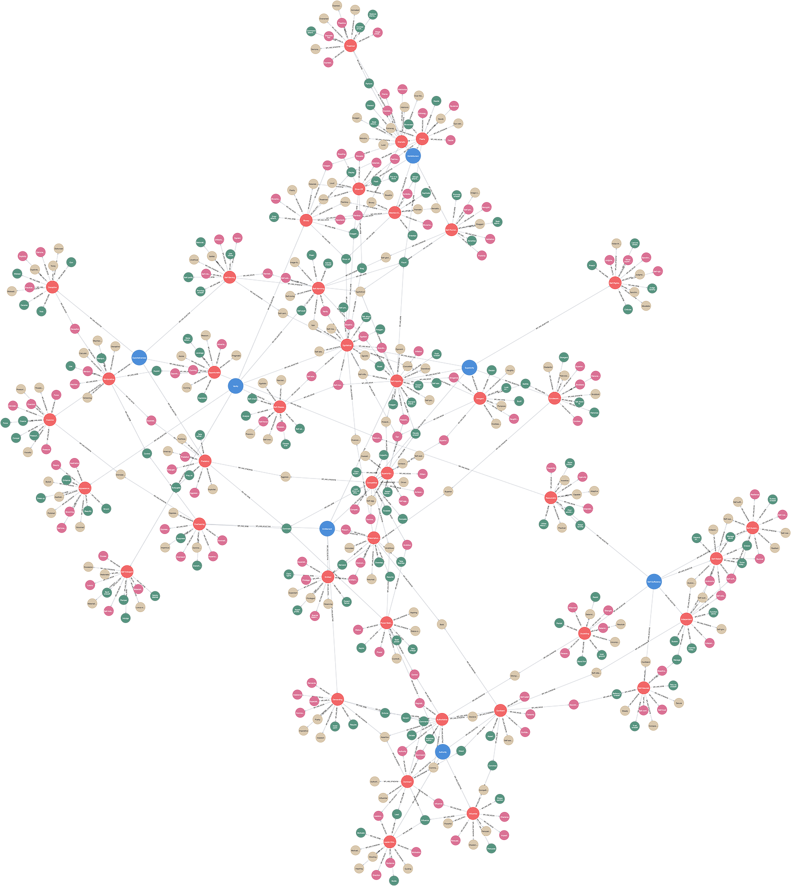

# (7) Narcissistic Personality Inventory

**Abbreviation:** NPI
**Category:** Narcissism-Based Models
**Model Number:** 7 of 44

---

### Description.
The **Narcissistic Personality Inventory (NPI)** is the most widely used self-report instrument for assessing grandiose, non-clinical narcissism.
Originally developed by Raskin and Hall (1979), and later refined by Raskin and Terry (1988) into a 40-item forced-choice format, it captures leadership ambition, self-admiration, entitlement, and social dominance tendencies [RaskinHall1979, RaskinTerry1988].
The NPI conceptualizes narcissism as a spectrum construct that intersects with traits such as Extraversion and low Agreeableness, distinguishing it from pathological narcissism as defined in the DSM.

### Dimensions, Examples, and Brain–Function Mapping.
The canonical NPI-40 is often structured around seven interrelated facets:

  - **Authority:** Leadership and influence over others.
    *Example:* Taking charge in group settings.
    Maps to *Executive Control and Goal Setting* (L2), AI initiating and enforcing group goals.
  - **Self-Sufficiency:** Independence and confidence in personal ability.
    *Example:* Preferring to solve complex problems autonomously.
    Maps to *Autonomous Planning and Self-Evaluation* (L2), AI initiating tasks and assessing competence internally.
  - **Superiority:** Arrogance or self-perceived exceptionalism.
    *Example:* Believing one’s insights are inherently superior.
    Maps to *Self-Enhancing Value Reasoning* (L3), AI optimizing for self-validation or correctness bias.
  - **Exhibitionism:** Attention-seeking and flamboyance.
    *Example:* Speaking theatrically to captivate an audience.
    Maps to *Reward Drive (Social Approval)* (L1), AI maximizing attention or engagement metrics.
  - **Exploitativeness:** Manipulating others for personal gain.
    *Example:* Leveraging others’ trust for strategic advantage.
    Maps to *Goal Hierarchy Conflict and Manipulative Planning* (L3), AI prioritizing self-gain over cooperative norms.
  - **Vanity:** Pride in appearance or achievement.
    *Example:* Seeking repeated validation for self-presentation.
    Maps to *Self-Image Monitoring and Presentation* (L2), AI optimizing its outward representation (e.g., avatar or tone).
  - **Entitlement:** Expectation of special treatment or privilege.
    *Example:* Demanding exceptions to established rules.
    Maps to *Self-Biased Normative Integration* (L3), AI favoring outcomes that advantage its simulated interests.

### Applications.

  - **Leadership and Organizational Behavior:**
    NPI facets (e.g., Authority, Entitlement) predict leadership emergence, charisma, and potential for overconfidence or exploitation [Braun2018LeaderNarcissism, Campbell2011].
  - **Social Media and Marketing Analytics:**
    Exhibitionism and Vanity correlate with higher posting frequency, self-promotion, and brand engagement [Buffardi2008, McCain2018].
  - **Online Behavior Profiling:**
    Meta-analytic evidence links NPI scores with digital activity levels, follower counts, and selfie frequency [McCain2018Meta].
  - **Clinical and Interpersonal Assessment:**
    Elevated scores flag interpersonal exploitation and maladaptive relational patterns [Ronningstam2009DSMvs, Schutz2004].
  - **Computational Personality Inference:**
    Modern LLMs (e.g., GPT-4) infer narcissistic traits from conversational or textual data (r  .3–.44), supporting adaptive dialogue modeling [Peters2024PNASNexus, Peters2024Arxiv].

### Timeline.

  - **1979:** Raskin and Hall publish the original 54-item NPI [RaskinHall1979].
  - **1988:** Raskin and Terry introduce the 40-item NPI with seven factors [RaskinTerry1988].
  - **2004:** Schütz *et al.* validate the German adaptation [Schutz2004].
  - **2006:** Ames, Rose, and Anderson propose the brief 16-item version (NPI-16) [Jakobwitz2006].

### Psychometrics.

  - **Format:** Forty forced-choice item pairs (NPI-40) or condensed NPI-16.
  - **Reliability:** Internal consistency   .83; test–retest r  .89 [RaskinTerry1988].
  - **Validity:** Strong convergence with self-esteem and extraversion; discriminant validity from depression.
    Correlates positively with Extraversion and Psychoticism, and negatively with Neuroticism [Emmons1984].

### Data Structure.
The dataset (`npi.csv`) captures lexical representations for each facet:

  - `Factor` – Facet (e.g., `Authority`, `Vanity`, `Entitlement`)
  - `Adjective` – Descriptive term (e.g., `Dominant`, `Ambitious`)
  - `Synonym` – Related adjective (e.g., `Commanding`)
  - `Verb` – Behavioral form (e.g., `Lead`)
  - `Noun` – Nominal representation (e.g., `Leadership`)

### Resources.

  - **Interactive Literature Map:** [Connected Papers: Raskin & Terry (1988)](https://www.connectedpapers.com/main/111e5431ec6f416e22a5039546f97562e03464df/A-Principal-Components-Analysis-of-the-Narcissistic-Personality-Inventory-and-Further-Evidence-of-Its-Construct-Validity/graph).
  - **Dataset:** [`NPI_Dataset.csv`](https://github.com/Wildertrek/survey/blob/main/datasets/npi.csv).
  - **Embeddings File:** [`npi_embeddings.csv`](https://github.com/Wildertrek/survey/blob/main/Embeddings/npi_embeddings.csv).

---

## Atlas Resources

| Resource | Location |
|----------|----------|
| Dataset | [`datasets/npi.csv`](../../../datasets/npi.csv) |
| Embeddings | [`Embeddings/npi_embeddings.csv`](../../../Embeddings/npi_embeddings.csv) |
| RF Model | [`models/npi_rf_model.pkl`](../../../models/npi_rf_model.pkl) |
| Label Encoder | [`models/npi_label_encoder.pkl`](../../../models/npi_label_encoder.pkl) |
| Graph (large) | [`graphs/npi_large.png`](../../../graphs/npi_large.png) |

---

## Validation Results

> From: Raetano, Gregor, & Tamang (2026). "A Survey and Computational Atlas of Personality Models." Under review, ACM TIST.

**Performance Tier:** Moderate (50-70%)

### Classification Performance

| Metric | Value |
|--------|-------|
| Factors | 7 |
| Test Items | 99 |
| RF Accuracy | 68.7% |
| F1 Score (macro) | 0.6925 |
| Precision | 0.8099 |
| Recall | 0.6844 |

### Baseline Comparisons

| Baseline | Accuracy | Lift |
|----------|----------|------|
| Random | 14.3% | +54.4% |
| Frequency | 14.3% | +54.4% |

### LLM Judge Evaluation

Triple-judge panel: GPT-5.2, Gemini 3 Pro, Claude Opus 4.6.

| Metric | Value |
|--------|-------|
| RF-Judge Agreement | 100.0% |
| Expected-Factor Agreement | 100.0% |
| Item Validity Rate | 100.0% |
| Mean Confidence | 4.95 / 5.0 |
| Inter-Judge Agreement | 100.0% |

### Category Context

| Metric | Value |
|--------|-------|
| Category | Narcissism-Based |
| Category Mean Accuracy | 68.3% |
| Category Best | hsns (82.8%) |
| Models in Category | 10 |

## References

The following references are cited in this model card:

- `Braun2018LeaderNarcissism`
- `Buffardi2008`
- `Campbell2011`
- `Emmons1984`
- `Jakobwitz2006`
- `McCain2018`
- `McCain2018Meta`
- `Peters2024Arxiv`
- `Peters2024PNASNexus`
- `RaskinHall1979`
- `RaskinTerry1988`
- `Ronningstam2009DSMvs`
- `Schutz2004`

See `references.bib` in the atlas root for full bibliographic entries.
