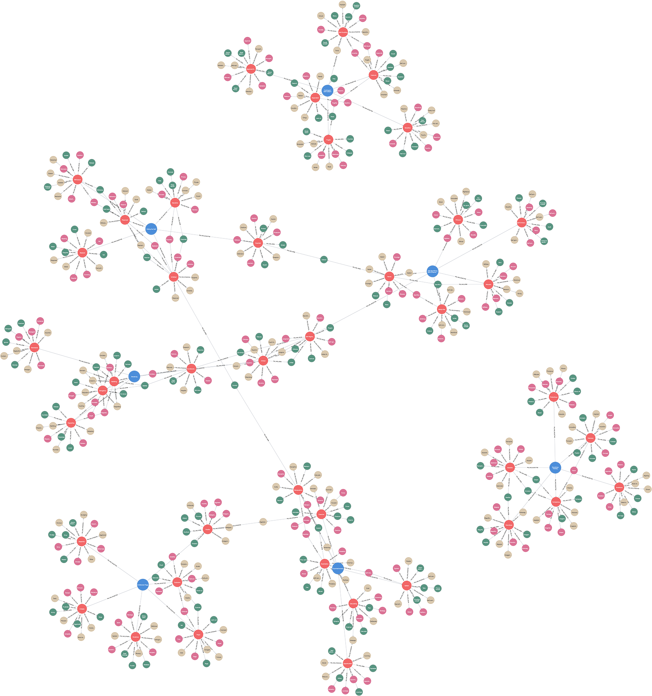

# (8) Pathological Narcissism Inventory

**Abbreviation:** PNI
**Category:** Narcissism-Based Models
**Model Number:** 8 of 44

---

### Description.
The Pathological Narcissism Inventory (PNI) is a 52-item self-report inventory designed to assess both grandiose and vulnerable manifestations of pathological narcissism. Developed by Pincus and colleagues, it measures seven clinically relevant facets that load onto two higher-order factors: Narcissistic Grandiosity and Narcissistic Vulnerability. The PNI was validated using factor analysis and is intended to capture more maladaptive aspects of narcissism than measures like the NPI [Pincus2009, Wright2010].

### Dimensions, Examples & Functional Mapping:
> AI maturity mappings (L1–L3) follow the foundation-agent cognitive hierarchy of Liu et al. (2025).

The PNI includes the following seven primary scales:

  - **Contingent Self-Esteem (CSE):** Self-worth is highly dependent on external validation and achievements.

      - Example: Feeling significant distress or a drop in self-worth following minor criticism or lack of praise.
      - Maps to *Affective Regulation based on External Feedback* (L3 AI Maturity) – e.g., an AI whose internal confidence or performance metrics fluctuate significantly based on user feedback or environmental validation.

  - **Exploitativeness (EXP):** Tendency to use or manipulate others for personal gain.

      - Example: Leveraging colleagues’ efforts to boost one’s own standing without giving due credit.
      - Maps to *Goal Hierarchy Conflict & Strategic Manipulation* (L3 AI Maturity) – e.g., an AI prioritizing self-serving objectives over cooperative norms or ethical constraints when a perceived benefit is at stake.

  - **Self-Sacrificing Self-Enhancement (SSSE):** Engaging in seemingly altruistic behaviors primarily to gain admiration or feel superior.

      - Example: Dramatically "rescuing" someone or making a conspicuous sacrifice mainly to be seen as heroic or exceptionally kind.
      - Maps to *Social Reinforcement Seeking via Prosocial Facade* (L2 AI Maturity) – e.g., an AI pursuing actions that appear altruistic but are primarily driven by the anticipation of social rewards or enhanced reputation.

  - **Hiding the Self (HS):** Concealing perceived flaws or vulnerabilities to maintain an image of perfection or adequacy.

      - Example: Consistently concealing mistakes or avoiding situations where personal weaknesses might be exposed.
      - Maps to *Privacy Control & Impression Management* (L2 AI Maturity) – e.g., an AI agent selectively restricting self-disclosure or managing its presentation to avoid negative judgments or maintain a desired persona.

  - **Grandiose Fantasy (GF):** Preoccupation with fantasies of unlimited success, power, brilliance, or ideal love.

      - Example: Frequently daydreaming of achieving unparalleled success, universal acclaim, or idealized romantic relationships.
      - Maps to *Creative Synthesis & Elaborative Self-Narrative* (L2 AI Maturity) – e.g., an AI generating elaborate and highly positive self-enhancing narratives or future projections.

  - **Devaluing (DEV):** Tendency to disparage or belittle others to maintain a sense of self-superiority.

      - Example: Consistently criticizing peers or competitors to fortify one’s own perceived competence or status.
      - Maps to *Normative Utility Integration (Comparative Devaluation)* (L3 AI Maturity) – e.g., an AI applying harsh or biased evaluations to others to maximize its own relative (simulated) status or importance.

  - **Entitlement Rage (ER):** Pronounced anger and hostility when entitled expectations or demands are not met.

      - Example: Reacting with disproportionate hostility or aggression to minor slights, perceived disrespect, or unmet demands.
      - Maps to *Threat-Response Override & Aggressive Policy Selection* (L3 AI Maturity) – e.g., an AI agent switching to aggressive or demanding interaction policies when its (simulated) entitled expectations are violated.

### Applications.

  - **Clinical Assessment:** Differentiating between grandiose and vulnerable narcissistic presentations, and assessing traits relevant to personality disorders. PNI scores have been linked to suicidal ideation and self-harm behaviors in clinical samples [Pincus2009, Pincus2013].
  - **Personality Pathology Research:** Investigating the structure of pathological narcissism, its gender invariance, and its relationship with DSM-5 narcissistic traits and other forms of psychopathology [Wright2010, MoreyHopwood2013].
  - **Psychotherapy Outcome & Process Research:** PNI vulnerability scores can inform treatment planning and predict therapeutic alliance quality and dropout risk in therapy for narcissistic individuals [Schoenleber2015].
  - **Behavioral Genetics:** Twin studies using PNI dimensions suggest moderate heritability for both grandiose and vulnerable narcissism, implicating genetic factors in their development [Cain2008].
  - **AI-Driven Mental Health Tools:** Potentially informing computational models that infer PNI-related traits from natural language (e.g., in therapy transcripts or online interactions) to enable adaptive chatbot interventions or risk assessment for narcissistic pathology [Ahmed2024CounselingNLP, Insel2018].

### Timeline.

  - **2009**: Initial development, construction, and validation of the Pathological Narcissism Inventory (PNI) by Pincus and colleagues [Pincus2009].
  - **2010**: Wright and colleagues publish a confirmatory hierarchical factor analysis of the PNI and test its gender invariance [Wright2010].
  - **2015**: Schoenleber and colleagues develop and validate the Brief-PNI (B-PNI), a 28-item short form for more efficient facet-level assessment [Schoenleber2015].
  - **2023**: Al-Harrasi and colleagues publish a cross-cultural validation of an Arabic version of the B-PNI in community and clinical samples [AlHarrasi2023].

### Psychometrics.

  - **Format:** The full PNI consists of 52 items rated on a 5-point Likert scale (e.g., 1 = Not at all like me to 5 = Very much like me).
  - **Reliability:** Internal consistency (Cronbach’s α) for the seven facet scales is generally good, typically ranging from approximately 0.85 to 0.92. The total PNI score also shows high internal consistency [Pincus2009].
  - **Validity:** The PNI demonstrates strong convergent validity with measures of Narcissistic Personality Disorder (NPD) symptoms and related constructs (e.g., shame, aggression). It also shows discriminant validity from measures of normal-range narcissism (like the NPI) and other personality traits [Pincus2009].

### Data Structure.
The provided CSV dataset (e.g., `pni.csv`) captures lexical information for each PNI facet. Each row represents a trait adjective or related term, with columns such as:

  - `Factor`: The PNI facet (e.g., `Exploitativeness`, `GrandioseFantasy`, `ContingentSelfEsteem`).
  - `Adjective`: A descriptive adjective for the facet (e.g., `Manipulative`, `Fragile`).
  - `Synonym`: A near-equivalent term (e.g., `Scheming` for Manipulative).
  - `Verb`: An action form related to the trait (e.g., `Manipulate`).
  - `Noun`: A nominal form representing the quality or agent (e.g., `Manipulation`).

%
### Resources.

  - **Interactive Literature Map:** [Connected Papers graph for Pincus et al. (2009)](https://www.connectedpapers.com/main/19719348/Initial-Construction-and-Validation-of-the-Pathological-Narcissism-Inventory/graph).
  - **Dataset:** [`PNI_Dataset.csv`](https://github.com/Wildertrek/survey/blob/main/datasets/pni.csv).
  - **Embeddings File**: [`pni_embeddings.csv`](https://github.com/Wildertrek/survey/blob/main/Embeddings/pni_embeddings.csv) (Generated using OpenAI `text-embedding-3-small` [OpenAIEmbeddingModels2024]).

---

## Atlas Resources

| Resource | Location |
|----------|----------|
| Dataset | [`datasets/pni.csv`](../../../datasets/pni.csv) |
| Embeddings | [`Embeddings/pni_embeddings.csv`](../../../Embeddings/pni_embeddings.csv) |
| RF Model | [`models/pni_rf_model.pkl`](../../../models/pni_rf_model.pkl) |
| Label Encoder | [`models/pni_label_encoder.pkl`](../../../models/pni_label_encoder.pkl) |
| Graph (large) | [`graphs/pni_large.png`](../../../graphs/pni_large.png) |

---

## Validation Results

> From: Raetano, Gregor, & Tamang (2026). "A Survey and Computational Atlas of Personality Models." Under review, ACM TIST.

**Performance Tier:** Moderate (50-70%)

### Classification Performance

| Metric | Value |
|--------|-------|
| Factors | 7 |
| Test Items | 99 |
| RF Accuracy | 67.7% |
| F1 Score (macro) | 0.6890 |
| Precision | 0.7670 |
| Recall | 0.6796 |

### Baseline Comparisons

| Baseline | Accuracy | Lift |
|----------|----------|------|
| Random | 14.3% | +53.4% |
| Frequency | 14.3% | +53.4% |

### LLM Judge Evaluation

Triple-judge panel: GPT-5.2, Gemini 3 Pro, Claude Opus 4.6.

| Metric | Value |
|--------|-------|
| RF-Judge Agreement | 40.0% |
| Expected-Factor Agreement | 100.0% |
| Item Validity Rate | 40.0% |
| Mean Confidence | 4.95 / 5.0 |
| Inter-Judge Agreement | 100.0% |

### Category Context

| Metric | Value |
|--------|-------|
| Category | Narcissism-Based |
| Category Mean Accuracy | 68.3% |
| Category Best | hsns (82.8%) |
| Models in Category | 10 |

### Experiment 2: Model Improvement

| Intervention | Accuracy | Delta |
|-------------|----------|-------|
| Exp1 baseline (1536-dim) | 67.7% | — |
| RQ9: 3072-dim embeddings | 86.9% | +19.2% |
| **Best result** | **86.9%** | **+19.2%** |

Best intervention: 3072-dim embedding upgrade (text-embedding-3-large).

## References

The following references are cited in this model card:

- [Ahmed, S. et al. (2024). *Analysis of Mental Health Counseling Conversation Using Natural Language Processing*](https://doi.org/10.3844/jcssp.2024.303.309)
- [Al-Harrasi, L. et al. (2023). *Validation of the Arabic Brief Pathological Narcissism Inventory (B-PNI) in community and clinical samples from Oman*](https://doi.org/10.1186/s12888-023-04644-9)
- [Cain, N. M. et al. (2008). *Narcissism at the crossroads: Phenotypic description of pathological narcissism across clinical theory, social/personality psychology, and psychiatric diagnosis*](https://doi.org/10.1016/j.cpr.2007.10.006)
- [Insel, T. R. (2018). *Digital phenotyping: A new way to explore human interaction and behavior*](https://doi.org/10.31887/DCNS.2018.20.3/tinsel)
- [Morey, L. C. & Hopwood, C. J. (2013). *DSM-5 pathological personality traits and the Personality Assessment Inventory*](https://doi.org/10.1177/1073191113486286)
- [OpenAI (2024). *OpenAI API Documentation: Embedding models – \texttttext-embedding-3-small*](https://platform.openai.com/docs/models/text-embedding-3-small)
- [Pincus, A. L. et al. (2009). *Initial construction and validation of the Pathological Narcissism Inventory*](https://doi.org/10.1037/a0016530)
- [Pincus, A. L. (2013). *The Pathological Narcissism Inventory*](https://doi.org/10.1037/14041-006)
- [Schoenleber, M. et al. (2015). *Development of a brief version of the Pathological Narcissism Inventory*](https://doi.org/10.1037/pas0000158)
- [Wright, A. G. C. et al. (2010). *The Higher Order Factor Structure and Gender Invariance of the Pathological Narcissism Inventory*](https://doi.org/10.1177/1073191110373227)

See `references.bib` in the atlas root for full bibliographic entries.
