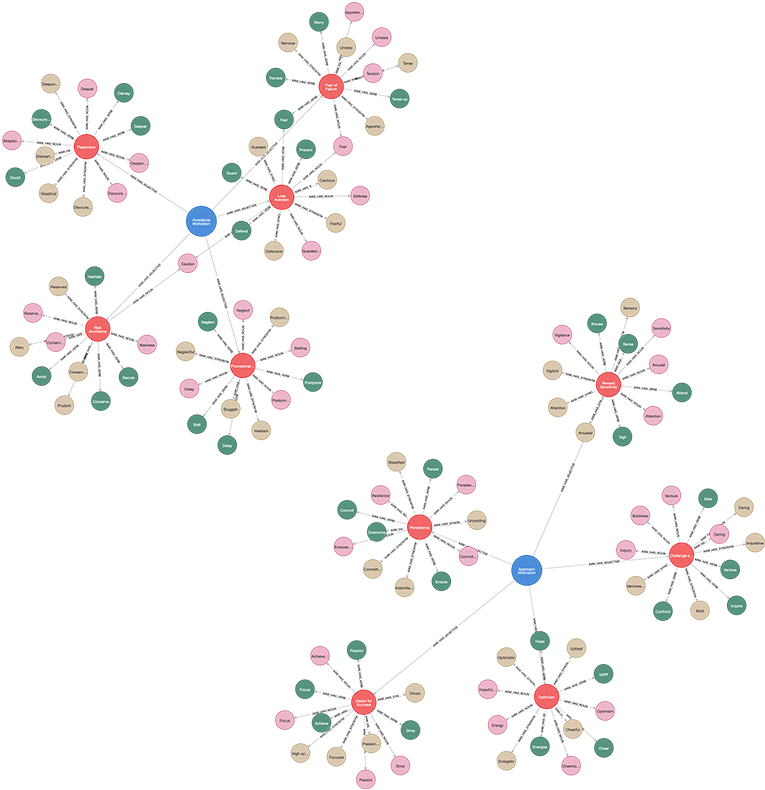

# (21) Approach/Avoidance Motivation

**Abbreviation:** AAM
**Category:** Motivational and Value Models
**Model Number:** 21 of 44

---

### Description.
**Approach/Avoidance Motivation (AAM)** theory defines two complementary motivational systems that guide behavior toward rewards or away from threats.
The *approach system* directs individuals toward desirable outcomes, pleasure, and positive stimuli, while the *avoidance system* regulates behavior to prevent negative outcomes, pain, and punishment.
These dual mechanisms influence emotion, cognition, attention, and decision-making.
Jeffrey Gray’s Behavioral Activation System (BAS) and Behavioral Inhibition System (BIS) models, later refined by Elliot and Thrash, provide the foundation for AAM’s integration into personality and motivational psychology [Carver1994, Elliot1999Approach].

### Dimensions, Examples, and Functional Mapping.
> AI maturity mappings (L1–L3) follow the foundation-agent cognitive hierarchy of Liu et al. (2025).

**Approach Motivation.**
Reward sensitivity and goal pursuit.
*Example:* Volunteering for a challenging project to gain recognition or skill mastery.
Maps to:

  - *Reward Sensitivity and Goal Pursuit* (L2), AI prioritizing high-utility actions and exploring novel states.
  - *Exploratory Drive Simulation* (L3), AI generating reward-oriented behavioral strategies.

**Avoidance Motivation.**
Threat sensitivity and behavioral inhibition.
*Example:* Avoiding a leadership opportunity to prevent criticism or failure.
Maps to:

  - *Threat Detection and Risk Aversion* (L2), AI adjusting behavior to minimize adverse outcomes.
  - *Behavioral Inhibition and Uncertainty Regulation* (L3), AI dynamically constraining risky exploration under uncertainty.

### Applications.

  - **Affective Computing:** Modeling motivational orientation to predict user reactions and adapt system feedback [Elliot2002ApproachAvoidance].
  - **Human–AI Collaboration:** Adjusting communication tone and framing (encouraging vs.\ cautious) to match user motivational state.
  - **Adaptive Learning Systems:** Modulating challenge and reward frequency based on approach or avoidance persistence signals [Schunk1991].
  - **Digital Mental Health:** Profiling avoidant vs.\ approach coping behaviors to personalize interventions [Carver1994].
  - **Game Design and UX:** Structuring reward and penalty mechanics to engage both motivational orientations.

### Timeline.

  - **1950s–1970s:** Early behavioral models of approach and withdrawal systems in learning theory and psychobiology (e.g., Gray’s BAS/BIS).
  - **1990s:** Elliot, Thrash, Carver, and White formalize AAM within modern motivational psychology [Elliot1999Approach, Carver1994].
  - **2000s:** Integration with personality and affective models linking AAM to extraversion, neuroticism, anxiety, and reward processing.
  - **2010s–Present:** Expansion into affective computing, HCI, and reinforcement learning frameworks for adaptive AI.

### Psychometrics.

  - **Format:** Self-report instruments using 5–7 point Likert scales (e.g., “I act to avoid failure,” “I get excited by opportunity”).
  - **Common Scales:**

      - BIS/BAS Scales (Carver & White, 1994) [Carver1994].
      - Approach–Avoidance Temperament Questionnaire (AATQ; Elliot & Thrash, 2001, 2010).
      - Domain-specific Motivational Orientation Scales.

  - **Reliability:**  > 0.75 for approach and avoidance dimensions (and subscales such as BAS-Drive or BIS).
  - **Validity:** Demonstrated through correlations with personality, affective style, and physiological markers of reward and threat response.

### Data Structure.
Dataset (`aam.csv`) encodes lexical elements representing the two motivational systems:

  - `Factor` – `ApproachMotivation` or `AvoidanceMotivation`.
  - `Adjective` – e.g., `Bold`, `Enthusiastic` (approach); `Cautious`, `Anxious` (avoidance).
  - `Synonym` – e.g., `Fearless`, `Apprehensive`.
  - `Verb` – e.g., `Advance`, `Seek` (approach); `Retreat`, `Avoid` (avoidance).
  - `Noun` – e.g., `Striver`, `Explorer` (approach); `Evader`, `Worrier` (avoidance).

### Resources.

  - **Interactive Literature Map:**
    [Connected Papers: Elliot & Thrash (1999)](https://www.connectedpapers.com/main/253462113c12211ea3833f2802ba5d47df74150f/Approach%20avoidance-motivation-in-personality%3A-approach-and-avoidance-temperaments-and-goals./graph).
  - **Dataset:** [`AAM_Dataset.csv`](https://github.com/Wildertrek/survey/blob/main/datasets/aam.csv).
  - **Embeddings File:** [`aam_embeddings.csv`](https://github.com/Wildertrek/survey/blob/main/Embeddings/aam_embeddings.csv).

---

## Atlas Resources

| Resource | Location |
|----------|----------|
| Dataset | [`datasets/aam.csv`](../../../datasets/aam.csv) |
| Embeddings | [`Embeddings/aam_embeddings.csv`](../../../Embeddings/aam_embeddings.csv) |
| RF Model | [`models/aam_rf_model.pkl`](../../../models/aam_rf_model.pkl) |
| Label Encoder | [`models/aam_label_encoder.pkl`](../../../models/aam_label_encoder.pkl) |
| Graph (large) | [`graphs/aam_large.png`](../../../graphs/aam_large.png) |

---

## Validation Results

> From: Raetano, Gregor, & Tamang (2026). "A Survey and Computational Atlas of Personality Models." Under review, ACM TIST.

**Performance Tier:** High (>70%)

### Classification Performance

| Metric | Value |
|--------|-------|
| Factors | 2 |
| Test Items | 30 |
| RF Accuracy | 86.7% |
| F1 Score (macro) | 0.8667 |
| Precision | 0.8667 |
| Recall | 0.8667 |

### Baseline Comparisons

| Baseline | Accuracy | Lift |
|----------|----------|------|
| Random | 50.0% | +36.7% |
| Frequency | 50.0% | +36.7% |

### LLM Judge Evaluation

Triple-judge panel: GPT-5.2, Gemini 3 Pro, Claude Opus 4.6.

| Metric | Value |
|--------|-------|
| RF-Judge Agreement | 100.0% |
| Expected-Factor Agreement | 100.0% |
| Item Validity Rate | 100.0% |
| Mean Confidence | 5.00 / 5.0 |
| Inter-Judge Agreement | 100.0% |

### Category Context

| Metric | Value |
|--------|-------|
| Category | Motivational |
| Category Mean Accuracy | 74.5% |
| Category Best | aam (86.7%) |
| Models in Category | 6 |

## References

The following references are cited in this model card:

- [Carver, C. S. & White, T. L. (1994). *Behavioral inhibition, behavioral activation, and affective responses to impending reward and punishment: The BIS/BAS scales*](https://doi.org/10.1037/0022-3514.67.2.319)
- [Elliot, A. J. & Thrash, T. M. (2002). *Approach-avoidance motivation in personality: Approach and avoidance temperaments and goals*](https://doi.org/10.1037/0022-3514.82.5.804)
- [Elliot, A. J. & Thrash, T. M. (2002). *Approach-avoidance motivation in personality: Approach and avoidance temperaments and goals*](https://doi.org/10.1037/0022-3514.82.5.804)
- [Schunk, D. H. (1991). *Self-efficacy and academic motivation*](https://doi.org/10.1080/00461520.1991.9653133)

See `references.bib` in the atlas root for full bibliographic entries.
