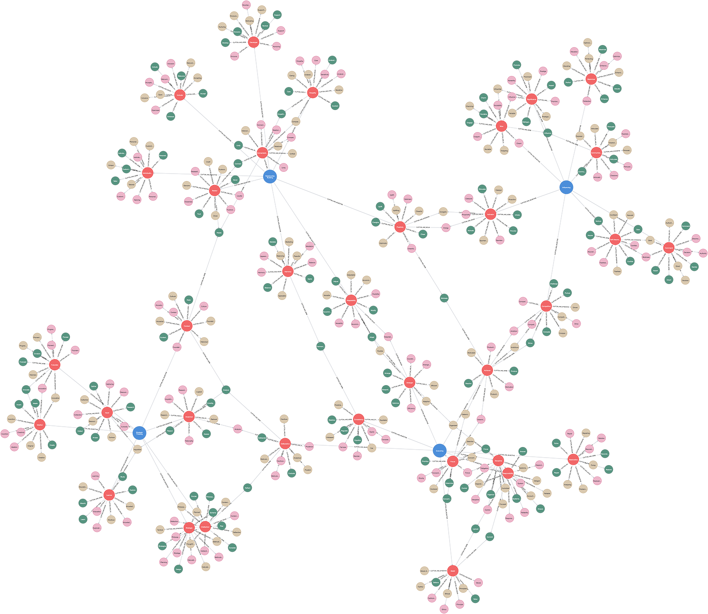

# (22) Clifton Strengths

**Abbreviation:** CS
**Category:** Motivational and Value Models
**Model Number:** 22 of 44

---

### Description.
**Clifton Strengths**, developed by Donald O. Clifton and Gallup, identifies 34 “talent themes”, distinct patterns of thought, feeling, and behavior that can be productively applied.
These are grouped into four domains: *Executing*, *Influencing*, *Relationship Building*, and *Strategic Thinking*.
The model’s central premise is that focusing on developing one’s strengths, rather than correcting weaknesses, produces higher engagement, performance, and fulfillment, reflecting the core of positive psychology [Clifton2001, Rath2007].

### Dimensions, Examples, and Functional Mapping.
> AI maturity mappings (L1–L3) follow the foundation-agent cognitive hierarchy of Liu et al. (2025).

Themes are organized across four domains, each linking to distinct cognitive and motivational functions.
See the `cs.csv` dataset for a complete list.

  - **Executing:** Making things happen through drive and discipline.
    *Example (Achiever):* Striving daily for accomplishment.
    Maps to *Goal Pursuit & Task Completion Drive* (L2 AI Maturity).
  - **Influencing:** Taking charge, speaking up, and mobilizing others.
    *Example (Command):* Taking decisive control in uncertain situations.
    Maps to *Social Influence & Persuasion Simulation* (L3).
  - **Relationship Building:** Forming cohesive teams and fostering empathy.
    *Example (Empathy):* Understanding others’ feelings and perspectives.
    Maps to *Affective Empathy & Social Connection Modeling* (L3).
  - **Strategic Thinking:** Absorbing information to make sound decisions.
    *Example (Strategic):* Rapidly generating alternative plans.
    Maps to *Complex Problem Solving & Pattern Recognition* (L2).

### Applications.

  - **Career Development:** Aligning individuals with roles that match their dominant strengths for higher satisfaction and output.
  - **Team Composition:** Designing balanced teams using complementary strengths [Buckingham1999].
  - **Leadership Training:** Building leadership programs rooted in recognizing and cultivating strengths [Linley2009strengths].
  - **Learning and Coaching:** Structuring mentorship and education to amplify innate talents [Linley2006, Linley2010using].
  - **Well-being and Performance:** Using strengths-based engagement to boost motivation, productivity, and fulfillment [Govindji2007, Proctor2011strengths, Harzer2014].
  - **AI Personalization:** Modeling user “strength profiles” in recommender systems for human–AI co-development.

### Timeline.

  - **1950s–1990s:** Clifton’s foundational strengths research.
  - **1998:** Initial StrengthsFinder development [Clifton1998].
  - **1999:** *First, Break All the Rules* promotes managing via strengths [Buckingham1999].
  - **2001:** *Now, Discover Your Strengths* launches StrengthsFinder 1.0 [Clifton2001].
  - **2007:** StrengthsFinder 2.0 (Tom Rath) expands and refines [Rath2007].
  - **2010s–2020s:** Global adoption and ongoing validation [Asplund2014TR, Bakker2017].

### Psychometrics.

  - **Format:** 177 paired statements with 20-second responses favoring intuition [Asplund2014TR].
  - **Output:** Identifies “Top 5” dominant themes or full 34 rankings.
  - **Reliability:** High test–retest reliability; internal consistency data proprietary [Gallup2024Sci].
  - **Validity:** Demonstrated correlations with engagement, productivity, and well-being [Asplund2014TR].
  - **Instrument:** Administered exclusively online via Gallup.

### Data Structure.
Dataset (`cs.csv`) encodes lexical information for all 34 themes:

  - `Factor` – Domain (e.g., `Executing`, `Influencing`, `Relationship Building`, `Strategic Thinking`).
  - `Adjective` – Theme name (e.g., `Achiever`, `Woo`).
  - `Synonym` – Related descriptor (e.g., `Productive`).
  - `Verb` – Associated behavior (e.g., `Accomplish`).
  - `Noun` – Abstract or agent form (e.g., `Achievement`, `Achiever`).

### Resources.

  - **Official Website:** [Gallup CliftonStrengths](https://www.gallup.com/cliftonstrengths/en/home.aspx) [Gallup2024CS].
  - **Technical Reports:** [The Science of CliftonStrengths](https://www.gallup.com/cliftonstrengths/en/253790/science-of-cliftonstrengths.aspx) [Gallup2024Sci, Asplund2014TR].
  - **Interactive Literature Map:** [Connected Papers: Clifton & Buckingham (2001)](https://www.connectedpapers.com/main/2fb7dacc7d6f3288412573e2a1f1c267b8274f5b/Strength-in-diversity-and-diversity-of-strengths-of-state-FFA-officers%3A-An-analysis-of-Clifton-StrengthsFinder-assessment-data-for-state-FFA-officers%2C-2006%202010%3B-2012%202015/graph).
  - **Dataset:** [`cs_Dataset.csv`](https://github.com/Wildertrek/survey/blob/main/datasets/cs.csv).
  - **Embeddings File:** [`clifton_embeddings.csv`](https://github.com/Wildertrek/survey/blob/main/Embeddings/cs_embeddings.csv).

---

## Atlas Resources

| Resource | Location |
|----------|----------|
| Dataset | [`datasets/cs.csv`](../../../datasets/cs.csv) |
| Embeddings | [`Embeddings/cs_embeddings.csv`](../../../Embeddings/cs_embeddings.csv) |
| RF Model | [`models/cs_rf_model.pkl`](../../../models/cs_rf_model.pkl) |
| Label Encoder | [`models/cs_label_encoder.pkl`](../../../models/cs_label_encoder.pkl) |
| Graph (large) | [`graphs/clifton_large.png`](../../../graphs/clifton_large.png) |

---

## Validation Results

> From: Raetano, Gregor, & Tamang (2026). "A Survey and Computational Atlas of Personality Models." Under review, ACM TIST.

**Performance Tier:** Low (<50%)

### Classification Performance

| Metric | Value |
|--------|-------|
| Factors | 4 |
| Test Items | 57 |
| RF Accuracy | 49.1% |
| F1 Score (macro) | 0.4538 |
| Precision | 0.7063 |
| Recall | 0.4821 |

### Baseline Comparisons

| Baseline | Accuracy | Lift |
|----------|----------|------|
| Random | 25.0% | +24.1% |
| Frequency | 26.5% | +22.7% |

### LLM Judge Evaluation

Triple-judge panel: GPT-5.2, Gemini 3 Pro, Claude Opus 4.6.

| Metric | Value |
|--------|-------|
| RF-Judge Agreement | 100.0% |
| Expected-Factor Agreement | 100.0% |
| Item Validity Rate | 100.0% |
| Mean Confidence | 4.73 / 5.0 |
| Inter-Judge Agreement | 100.0% |

### Category Context

| Metric | Value |
|--------|-------|
| Category | Motivational |
| Category Mean Accuracy | 74.5% |
| Category Best | aam (86.7%) |
| Models in Category | 6 |

## References

The following references are cited in this model card:

- [Asplund, J. et al. (2014). *The Clifton StrengthsFinder 2.0 Technical Report: Development and Validation*](https://www.furman.edu/shucker-leadership-development/wp-content/uploads/sites/112/2020/05/Clifton-StrengthsFinder-2.0-Technical-Report.pdf)
- [Bakker, A. B. & van Woerkom, M. (2018). *Strengths use in organizations: A positive approach of occupational health*](https://doi.org/10.1037/cap0000120)
- `Buckingham1999`
- `Clifton1998`
- `Clifton2001`
- [Gallup, Inc. (2024). *CliftonStrengths*](https://www.gallup.com/cliftonstrengths/en/home.aspx)
- [Gallup, Inc. (2024). *The Science of CliftonStrengths*](https://www.gallup.com/cliftonstrengths/en/253790/science-of-cliftonstrengths.aspx)
- `Govindji2007`
- [Harzer, C. & Ruch, W. (2014). *The role of character strengths for task performance, job dedication, interpersonal facilitation, and organizational support*](https://doi.org/10.1080/08959285.2014.913592)
- `Linley2006`
- `Linley2009strengths`
- `Linley2010using`
- [Proctor, C. et al. (2011). *Strengths use as a predictor of well-being and health-related quality of life*](https://doi.org/10.1007/s10902-009-9181-2)
- `Rath2007`

See `references.bib` in the atlas root for full bibliographic entries.
