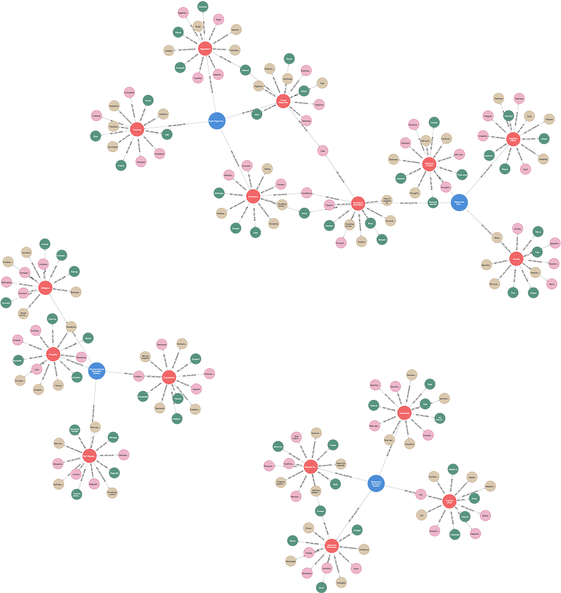

# (18) Motivational Systems Theory

**Abbreviation:** MST
**Category:** Motivational and Value Models
**Model Number:** 18 of 44

---

### Description.
**Motivational Systems Theory (MST)**, developed by Martin Ford, integrates multiple frameworks of human motivation into a systemic model of how goals, beliefs, and emotions interact to drive behavior.
MST asserts that behavior results from the dynamic interplay among *personal goals*, *personal agency beliefs* (capability and context), and *emotional reactions*.
It synthesizes ideas from Self-Determination Theory (SDT), Achievement Goal Theory (AGT), Expectancy-Value Theory (EVT), and Mindset Theory, offering a unified account of goal initiation, persistence, and affective feedback in complex environments [Deci1985SDT, Ames1992AGT, Ryan2000SDT, Wigfield2000EVT, Dweck2006Mindset].

### Dimensions, Examples, and Functional Mapping.
> AI maturity mappings (L1–L3) follow the foundation-agent cognitive hierarchy of Liu et al. (2025).

MST focuses on motivational processes rather than static traits:

**Goal Setting (Direction).**
Defining and prioritizing desired outcomes.
*Example:* Creating a SMART plan for a research project.
Maps to:

  - *Hierarchical Goal Decomposition* (L2), AI partitioning long-term objectives into actionable sub-plans.
  - *Autonomous Planning* (L3), AI dynamically generating new goal hierarchies.

**Goal Striving (Energization and Regulation).**
Initiating, sustaining, and regulating effort toward goals.
*Example:* Maintaining consistent training despite setbacks.
Maps to:

  - *Effort Allocation and Policy Execution* (L2), AI optimizing resource use to sustain policies.
  - *Adaptive Persistence* (L3), AI modifying strategies based on progress signals.

**Emotional Reactions (Appraisal and Coping).**
Affective responses that reinforce or alter motivation.
*Example:* Reassessing priorities after failure or success.
Maps to:

  - *Affective Appraisal* (L2), AI interpreting simulated feedback to modulate policy confidence.
  - *Emotional Regulation Simulation* (L3), AI adjusting long-term plans based on contextual affect.

### Timeline (Influential Theories).

  - **1985:** Deci & Ryan introduce Self-Determination Theory (intrinsic vs. extrinsic motivation; autonomy, competence, relatedness) [Deci1985SDT].
  - **1992:** Ames and Dweck formalize Achievement Goal Theory (mastery vs. performance orientations) [Ames1992AGT].
  - **2000:** Eccles & Wigfield develop Expectancy-Value Theory (success expectancies and task value) [Wigfield2000EVT]; SDT expands to well-being and social development [Ryan2000SDT].
  - **2006:** Dweck’s Mindset Theory links implicit ability beliefs to motivation and resilience [Dweck2006Mindset].
  - **1992 → Present:** Ford’s MST synthesizes these frameworks into a systemic motivational model.

### Applications.

  - **Education:** Goal-based learning design, feedback systems, and adaptive motivation scaffolding [Ames1992AGT].
  - **Organizational Development:** Structured milestones, feedback, and agency-enhancing leadership models.
  - **Clinical Psychology:** Intervention on maladaptive goal pursuit, burnout, or motivational deficits.
  - **AI and Human-AI Collaboration:** Embedding adaptive goal modules and affective feedback loops within intelligent tutoring or cooperative systems.

### Psychometrics.

  - **Format:** Typically multi-scale assessment of goals, agency beliefs, and emotional responses (10–30 items per dimension; 5- or 7-point Likert).
  - **Reliability:**  = 0.70–0.85 across validated sub-constructs.
  - **Method:** Self-report, behavioral observation, or artifact analysis.
  - **Validity:** Supported by convergence among SDT, EVT, and AGT measures and empirical studies linking MST constructs to achievement and well-being.

### Data Structure.
Dataset (`mst.csv`) encodes lexical terms for MST’s core processes:

  - `Factor` – Motivational system (e.g., `Behavioral Activation System`, `Behavioral Inhibition System`, `Fight-Flight-Freeze System`, `Socioemotional Regulation System`).
  - `Adjective` – Descriptive term (e.g., `Approach Motivation`, `Avoidance Motivation`).
  - `Synonym` – Near-equivalent (e.g., `Driven`, `Cautious`).
  - `Verb` – Action form (e.g., `Pursue`, `Inhibit`).
  - `Noun` – Nominal form (e.g., `Drive`, `Caution`).

### Resources.

  - **Interactive Literature Map:**
    [Connected Papers: Deci & Ryan (1985)](https://www.connectedpapers.com/main/1a9ca721e735a1a9cec50400cbc2a18699ece6ae/Motivational-Systems-Theory-and-the-Academic-Performance-of-College-Students./graph).
  - **Dataset:** [`MST_Dataset.csv`](https://github.com/Wildertrek/survey/blob/main/datasets/mst.csv).
  - **Embeddings File:** [`mst_embeddings.csv`](https://github.com/Wildertrek/survey/blob/main/Embeddings/mst_embeddings.csv).

---

## Atlas Resources

| Resource | Location |
|----------|----------|
| Dataset | [`datasets/mst.csv`](../../../datasets/mst.csv) |
| Embeddings | [`Embeddings/mst_embeddings.csv`](../../../Embeddings/mst_embeddings.csv) |
| RF Model | [`models/mst_rf_model.pkl`](../../../models/mst_rf_model.pkl) |
| Label Encoder | [`models/mst_label_encoder.pkl`](../../../models/mst_label_encoder.pkl) |
| Graph (large) | [`graphs/mst_large.png`](../../../graphs/mst_large.png) |

---

## Validation Results

> From: Raetano, Gregor, & Tamang (2026). "A Survey and Computational Atlas of Personality Models." Under review, ACM TIST.

**Performance Tier:** Moderate (50-70%)

### Classification Performance

| Metric | Value |
|--------|-------|
| Factors | 4 |
| Test Items | 57 |
| RF Accuracy | 68.4% |
| F1 Score (macro) | 0.6703 |
| Precision | 0.7407 |
| Recall | 0.6810 |

### Baseline Comparisons

| Baseline | Accuracy | Lift |
|----------|----------|------|
| Random | 25.0% | +43.4% |
| Frequency | 25.0% | +43.4% |

### LLM Judge Evaluation

Triple-judge panel: GPT-5.2, Gemini 3 Pro, Claude Opus 4.6.

| Metric | Value |
|--------|-------|
| RF-Judge Agreement | 100.0% |
| Expected-Factor Agreement | 100.0% |
| Item Validity Rate | 100.0% |
| Mean Confidence | 5.00 / 5.0 |
| Inter-Judge Agreement | 100.0% |

### Category Context

| Metric | Value |
|--------|-------|
| Category | Motivational |
| Category Mean Accuracy | 74.5% |
| Category Best | aam (86.7%) |
| Models in Category | 6 |

## References

The following references are cited in this model card:

- [Ames, C. (1992). *Classrooms: Goals, structures, and student motivation*](https://doi.org/10.1037/0022-0663.84.3.261)
- `Deci1985SDT`
- `Dweck2006Mindset`
- [Ryan, R. M. & Deci, E. L. (2000). *Self-determination theory and the facilitation of intrinsic motivation, social development, and well-being*](https://doi.org/10.1037/0003-066X.55.1.68)
- [Wigfield, A. & Eccles, J. S. (2000). *Expectancy–Value theory of achievement motivation*](https://doi.org/10.1006/ceps.1999.1015)

See `references.bib` in the atlas root for full bibliographic entries.
