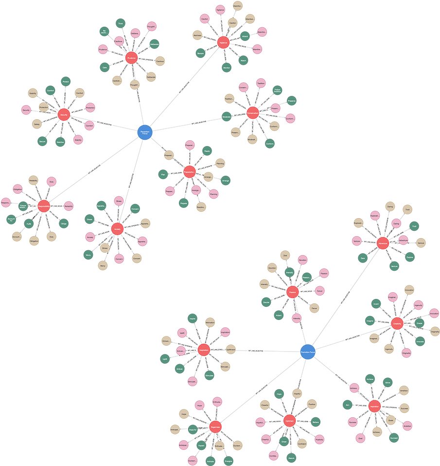

# (19) Regulatory Focus Theory

**Abbreviation:** RFT
**Category:** Motivational and Value Models
**Model Number:** 19 of 44

---

### Description.
**Regulatory Focus Theory (RFT)**, proposed by E. Tory Higgins, differentiates two self-regulatory systems that govern how individuals pursue goals:
*Promotion Focus*, oriented toward aspirations, accomplishments, and growth (gains and ideals); and
*Prevention Focus*, oriented toward safety, responsibility, and security (loss avoidance and oughts).
These orientations influence cognitive strategies, affective responses, and decision-making patterns, forming a dual-motivational model of goal regulation [Higgins1997Beyond, Higgins1998RFT].

### Dimensions, Examples, and Functional Mapping.
> AI maturity mappings (L1–L3) follow the foundation-agent cognitive hierarchy of Liu et al. (2025).

**Promotion Focus.**
Eagerness, opportunity-seeking, and sensitivity to gains or non-gains.
*Example:* Pursuing a challenging project to gain recognition or skill mastery.
Maps to:

  - *Exploratory Behavior & Gain Maximization* (L2), AI increasing action value based on expected gains.
  - *Opportunistic Policy Adaptation* (L3), AI identifying high-utility trajectories for advancement.

**Prevention Focus.**
Vigilance, risk-aversion, and sensitivity to losses or non-losses.
*Example:* Double-checking safety procedures to prevent system failure.
Maps to:

  - *Risk Mitigation and Constraint Adherence* (L2), AI minimizing negative outcomes under uncertainty.
  - *Safety-Constrained Optimization* (L3), AI prioritizing reliable, low-variance decisions.

### Timeline.

  - **1997:** Higgins formalizes RFT, distinguishing promotion vs.\ prevention orientations as motivational systems [Higgins1997Beyond].
  - **1998:** Expanded description of ideals (promotion) and oughts (prevention), linked to emotional consequences [Higgins1998RFT].
  - **2001:** RFT applied to well-being and life-satisfaction studies [Grant2001WellBeing].
  - **2002:** The concept of *regulatory fit* introduced, performance and motivation increase when goal strategies align with orientation [Higgins2002Fit].

### Applications.

  - **Organizational Behavior:** Aligning incentives and leadership styles to employees’ dominant regulatory focus [Brockner2001EmotionsWork].
  - **Health Psychology:** Framing health communications as promotion (gains) or prevention (loss avoidance) to increase adherence [Lee2000SelfConstrual].
  - **Marketing and Consumer Behavior:** Designing messages emphasizing adventure and aspiration (promotion) or safety and reliability (prevention) [Avnet2006Consumer].
  - **AI Personalization:** Calibrating agent tone, risk thresholds, or reward signals to match user regulatory focus, enhancing engagement and task completion.

### Psychometrics.

  - **Format:** Measured via self-report questionnaires assessing independent promotion and prevention dimensions (e.g., RFQ, GRFM).
  - **Reliability:**  = 0.75–0.85 across subscales.
  - **Method:** Self-report, experimental priming, or situational manipulation.
  - **Validity:** Supported by strong differentiation in affective, cognitive, and behavioral outcomes across hundreds of studies.

### Data Structure.
Dataset (`rft.csv`) encodes lexical elements linked to the two motivational orientations:

  - `Factor` – `PromotionFocus` or `PreventionFocus`.
  - `Adjective` – e.g., `Eager`, `Vigilant`, `Aspirational`, `Cautious`.
  - `Synonym` – e.g., `Enthusiastic`, `Watchful`.
  - `Verb` – e.g., `Achieve`, `Protect`, `Advance`, `Secure`.
  - `Noun` – e.g., `Aspiration`, `Vigilance`, `Accomplishment`, `Safety`.

### Resources.

  - **Interactive Literature Map:**
    [Connected Papers: RFT](https://www.connectedpapers.com/main/25f3335c3fce67eafb20cbe1d6b7318d0e5a335b/Regulatory-Focus-Theory%3A-Implications-for-the-Study-of-Emotions-at-Work/graph).
  - **Dataset:** [`RFT_Dataset.csv`](https://github.com/Wildertrek/survey/blob/main/datasets/rft.csv).
  - **Embeddings File:** [`rft_embeddings.csv`](https://github.com/Wildertrek/survey/blob/main/Embeddings/rft_embeddings.csv).

---

## Atlas Resources

| Resource | Location |
|----------|----------|
| Dataset | [`datasets/rft.csv`](../../../datasets/rft.csv) |
| Embeddings | [`Embeddings/rft_embeddings.csv`](../../../Embeddings/rft_embeddings.csv) |
| RF Model | [`models/rft_rf_model.pkl`](../../../models/rft_rf_model.pkl) |
| Label Encoder | [`models/rft_label_encoder.pkl`](../../../models/rft_label_encoder.pkl) |
| Graph (large) | [`graphs/rft_large.png`](../../../graphs/rft_large.png) |

---

## Validation Results

> From: Raetano, Gregor, & Tamang (2026). "A Survey and Computational Atlas of Personality Models." Under review, ACM TIST.

**Performance Tier:** High (>70%)

### Classification Performance

| Metric | Value |
|--------|-------|
| Factors | 2 |
| Test Items | 29 |
| RF Accuracy | 86.2% |
| F1 Score (macro) | 0.8606 |
| Precision | 0.8701 |
| Recall | 0.8595 |

### Baseline Comparisons

| Baseline | Accuracy | Lift |
|----------|----------|------|
| Random | 50.0% | +36.2% |
| Frequency | 50.0% | +36.2% |

### LLM Judge Evaluation

Triple-judge panel: GPT-5.2, Gemini 3 Pro, Claude Opus 4.6.

| Metric | Value |
|--------|-------|
| RF-Judge Agreement | 100.0% |
| Expected-Factor Agreement | 100.0% |
| Item Validity Rate | 100.0% |
| Mean Confidence | 4.95 / 5.0 |
| Inter-Judge Agreement | 100.0% |

### Category Context

| Metric | Value |
|--------|-------|
| Category | Motivational |
| Category Mean Accuracy | 74.5% |
| Category Best | aam (86.7%) |
| Models in Category | 6 |

## References

The following references are cited in this model card:

- [Avnet, T. & Higgins, E. T. (2006). *How regulatory fit affects value in consumer choices and opinions*](https://doi.org/10.1509/jmkr.43.1.1)
- [Brockner, J. & Higgins, E. T. (2001). *Regulatory focus theory: Implications for the study of emotions at work*](https://doi.org/10.1006/obhd.2001.2972)
- [Grant, A. M. (2001). *Toward a psychology of coaching: The impact of coaching on metacognition, mental health and goal attainment*](https://psycnet.apa.org/record/2001-18578-001)
- [Higgins, E. T. (1997). *Beyond pleasure and pain*](https://doi.org/10.1037/0003-066X.52.12.1280)
- [Higgins, E. T. (1998). *Promotion and prevention: Regulatory focus as a motivational principle*](https://doi.org/10.1016/S0065-2601(08)60381-0)
- [Higgins, E. T. et al. (2003). *Transfer of value from fit*](https://doi.org/10.1037/0022-3514.84.6.1140)
- [Lee, A. Y. et al. (2000). *The pleasures and pains of distinct self-construals: The role of interdependence in regulatory focus*](https://doi.org/10.1037/0022-3514.78.6.1122)

See `references.bib` in the atlas root for full bibliographic entries.
