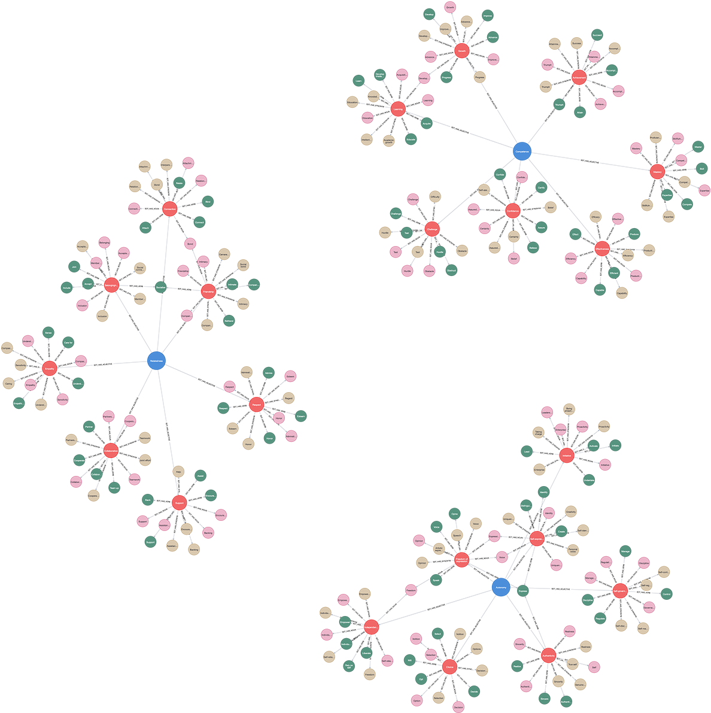

# (20) Self-Determination Theory

**Abbreviation:** SDT
**Category:** Motivational and Value Models
**Model Number:** 20 of 44

---

### Description.
**Self-Determination Theory (SDT)**, developed by Edward L. Deci and Richard M. Ryan, is a macro-theory of motivation and personality that emphasizes the fulfillment of three innate psychological needs:
*Autonomy* (self-endorsement and volition),
*Competence* (effectiveness and mastery), and
*Relatedness* (connection and belonging).
Satisfaction of these needs promotes intrinsic motivation, psychological growth, and well-being, while their frustration contributes to alienation or diminished motivation.
SDT also describes a continuum of motivational regulation ranging from amotivation to extrinsic to intrinsic forms [Deci1971, Deci1985SDT, Ryan2000SDT].

### Dimensions, Examples, and Functional Mapping.
**Autonomy.**
Freedom and volition in action.
*Example:* A learner designing their own project driven by curiosity rather than external pressure.
Maps to:

  - *Self-Governance and Goal Endorsement* (L2), AI selecting strategies aligned with internal objectives.
  - *Intrinsic–Extrinsic Arbitration* (L3), AI balancing self-generated and externally imposed goals.

**Competence.**
Effectiveness and mastery in interacting with the environment.
*Example:* A developer iteratively improving model performance through feedback loops.
Maps to:

  - *Skill Acquisition and Feedback Integration* (L2), AI refining performance through iterative evaluation.
  - *Adaptive Challenge Seeking* (L3), AI adjusting learning difficulty dynamically to sustain progress.

**Relatedness.**
Connectedness and mutual care within social contexts.
*Example:* A team collaborating cooperatively, maintaining trust and cohesion.
Maps to:

  - *Social Coordination and Affiliation Modeling* (L2), AI inferring peers’ intentions for smooth cooperation.
  - *Rapport Simulation and Empathic Communication* (L3), AI anticipating human emotional responses to maintain positive interaction.

### Applications.

  - **Education:** Designing autonomy-supportive classrooms to enhance engagement and intrinsic learning.
  - **Organizations:** Creating work climates that nurture need satisfaction and intrinsic motivation [Gagne2005].
  - **Healthcare:** Supporting patient autonomy in behavior-change interventions.
  - **Sports and Exercise:** Promoting adherence and performance through need-supportive coaching.
  - **Parenting:** Fostering children’s motivation and self-regulation through autonomy support.
  - **AI and HCI:** Building systems perceived as autonomy-supportive, competence-enhancing, and socially responsive.

### Timeline.

  - **1959:** Competence introduced as an intrinsic motivator (“motivation reconsidered”) [White1959].
  - **1971:** Early experiments reveal that external rewards can diminish intrinsic motivation [Deci1971].
  - **1985:** Formal publication of the Self-Determination Theory (SDT) framework, defining autonomy, competence, and relatedness as core psychological needs [Deci1985SDT].
  - **2000:** Expansion of SDT to encompass well-being, social development, and cross-cultural applications [Ryan2000SDT].
  - **2005–Present:** Broad application of SDT to work motivation, education, and organizational behavior [Gagne2005].

### Psychometrics.

  - **Format:** Basic Psychological Needs Scale (BPNS; 21–24 items, 7-point Likert) measuring autonomy, competence, and relatedness.
  - **Reliability:** Typically  > 0.80 across subscales.
  - **Method:** Self-report and experimental manipulations (need-supportive vs.\ need-thwarting environments).
  - **Validity:** Strong cross-cultural support for the three-factor structure and predictive relations to well-being and performance.

### Data Structure.
Dataset (`sdt.csv`) encodes lexical elements for SDT’s three needs:

  - `Factor` – `Autonomy`, `Competence`, or `Relatedness`.
  - `Adjective` – e.g., `Volitional`, `Effective`, `Connected`.
  - `Synonym` – e.g., `Self-Directed`, `Capable`, `Belonging`.
  - `Verb` – e.g., `Choose`, `Master`, `Relate`.
  - `Noun` – e.g., `Choice`, `Mastery`, `Connection`.

### Resources.

  - **Mapped Brain Functions Table:** Table tab:sdt-mapping.
  - **AI Maturity Definitions:** Section sec:ai-maturity-levels.
  - **Official Website:** [selfdeterminationtheory.org](https://selfdeterminationtheory.org/).
  - **Interactive Literature Map:**
    [Connected Papers: Deci & Ryan (1985)](https://www.connectedpapers.com/main/0a5fd9f90632ba0e7be5cbae52813429b05bb7d5/Self%20Determination-Theory%3A-Basic-Psychological-Needs-in-Motivation%2C-Development%2C-and-Wellness/graph).
  - **Dataset:** [`SDT_Dataset.csv`](https://github.com/Wildertrek/survey/blob/main/datasets/sdt.csv).
  - **Embeddings File:** [`sdt_embeddings.csv`](https://github.com/Wildertrek/survey/blob/main/Embeddings/sdt_embeddings.csv).

---

## Atlas Resources

| Resource | Location |
|----------|----------|
| Dataset | [`datasets/sdt.csv`](../../../datasets/sdt.csv) |
| Embeddings | [`Embeddings/sdt_embeddings.csv`](../../../Embeddings/sdt_embeddings.csv) |
| RF Model | [`models/sdt_rf_model.pkl`](../../../models/sdt_rf_model.pkl) |
| Label Encoder | [`models/sdt_label_encoder.pkl`](../../../models/sdt_label_encoder.pkl) |
| Graph (large) | [`graphs/sdt_large.png`](../../../graphs/sdt_large.png) |

## References

The following references are cited in this model card:

- `Deci1971`
- `Deci1985SDT`
- `Gagne2005`
- `Ryan2000SDT`
- `White1959`

See `references.bib` in the atlas root for full bibliographic entries.
