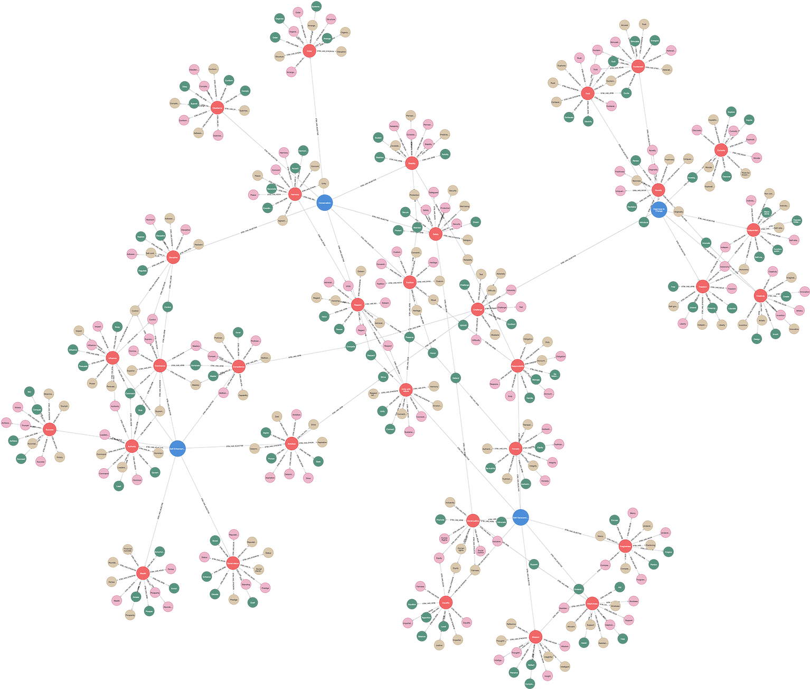

# (17) Schwartz Theory of Basic Values

**Abbreviation:** STBV
**Category:** Motivational and Value Models
**Model Number:** 17 of 44

---

### Description.
**Schwartz’s Theory of Basic Values (STBV)** [Schwartz1992, Schwartz2012Overview] defines ten motivationally distinct values recognized across cultures: *Self-Direction, Stimulation, Hedonism, Achievement, Power, Security, Conformity, Tradition, Benevolence,* and *Universalism*.
These values are arranged in a circumplex structure where adjacent values share motivational compatibility and opposing values represent conflict.
They are typically measured through the *Schwartz Value Survey (SVS)* or the *Portrait Values Questionnaire (PVQ)*.

### Dimensions, Examples, and Functional Mapping.
> AI maturity mappings (L1–L3) follow the foundation-agent cognitive hierarchy of Liu et al. (2025).

The ten foundational values correspond to both human motivation and potential AI analogues for preference, reward, and policy alignment.

**Self-Direction.**
Independent thought and choice.
*Example:* Selecting a career based on intrinsic interest.
Maps to:

  - *Autonomous Goal Formation* (L2), AI generating independent objectives.
  - *Abstract Integration* (L3), AI synthesizing novel, self-consistent plans.

**Stimulation.**
Novelty, excitement, and challenge.
*Example:* Pursuing adventure or experimentation.
Maps to:

  - *Exploration Drive* (L1), AI seeking novel states.
  - *Reward-Driven Curiosity* (L2), AI optimizing for informational gain.

**Hedonism.**
Pleasure and sensuous gratification.
*Example:* Indulging in luxury experiences.
Maps to:

  - *Reward Maximization* (L1), AI preferring immediate positive feedback.
  - *Preference Modeling* (L2), AI simulating affective reward bias.

**Achievement.**
Personal success through competence.
*Example:* Striving for recognition or mastery.
Maps to:

  - *Performance Optimization* (L2), AI improving metric outcomes.
  - *Benchmark-Based Learning* (L3), AI refining skills against standards.

**Power.**
Social status and control over people or resources.
*Example:* Seeking leadership and influence.
Maps to:

  - *Influence Maximization* (L2), AI coordinating outcomes for dominance.
  - *Policy Arbitration and Control Simulation* (L3), AI resolving competition among agents.

**Security.**
Safety, harmony, and stability.
*Example:* Preferring predictability and low risk.
Maps to:

  - *Stability Maintenance* (L2), AI sustaining equilibrium in dynamic systems.
  - *Risk Aversion Heuristics* (L3), AI prioritizing consistent, low-variance outcomes.

**Conformity.**
Restraint of impulses that violate norms.
*Example:* Obeying rules even when unobserved.
Maps to:

  - *Norm Compliance Enforcement* (L2), AI aligning behavior to predefined constraints.
  - *Policy Regularization* (L3), AI embedding institutional norms into decision layers.

**Tradition.**
Respect and adherence to cultural or religious customs.
*Example:* Observing long-standing rituals or values.
Maps to:

  - *Cultural Script Recognition* (L2), AI identifying established behavioral templates.
  - *Cultural Simulation and Continuity Modeling* (L3), AI reproducing stable sociocultural patterns.

**Benevolence.**
Enhancing the welfare of close others.
*Example:* Supporting friends or community members.
Maps to:

  - *Prosocial Inference* (L2), AI predicting others’ needs within its social group.
  - *Empathic Coordination* (L3), AI adapting decisions to maintain in-group welfare.

**Universalism.**
Understanding and protection of all people and nature.
*Example:* Advocating for global justice or sustainability.
Maps to:

  - *Ethical Generalization* (L3), AI applying universal moral or ecological principles.
  - *Contextual Integration* (L3), AI considering global and long-term consequences.

### Timeline.

  - **1992:** Schwartz introduces the value circumplex and ten universal categories [Schwartz1992].
  - **1994:** The Schwartz Value Survey (SVS) gains global adoption [Schwartz1994SVS].
  - **2001:** The Portrait Values Questionnaire (PVQ) is developed for broader applicability [Schwartz2001Proposal].
  - **2012:** Updated cross-cultural synthesis consolidates findings from 80+ countries [Schwartz2012Overview].

### Applications.

  - **Cross-Cultural Analysis:** Comparing societal value priorities and cultural dimensions [Davidov2008].
  - **Consumer and Organizational Behavior:** Linking values to decision-making, brand perception, and leadership [Sagiv2000WellBeing, Sagiv2004Career].
  - **Public Policy:** Informing policy design consistent with cultural value hierarchies [Bilsky2011Structure].
  - **AI Value Alignment:** Modeling human value spectra for personalization, safety, and ethical governance of AI systems.

### Psychometrics.

  - **Format:** SVS (57 items, 9-point scale) or PVQ (21–40 portraits).
  - **Reliability:** Subscales  = 0.60–0.85; confirmed circumplex structure via MDS/CFA [Schwartz2004CFA].
  - **Validity:** Cross-cultural replication across 80+ nations supports near-universality [Schwartz2012Overview].

### Data Structure.
Dataset (`stbv.csv`) encodes lexical elements for the ten basic values and their four higher-order groupings:

  - *Self-Transcendence:* Universalism, Benevolence.
  - *Self-Enhancement:* Power, Achievement, Hedonism.
  - *Openness to Change:* Self-Direction, Stimulation, Hedonism.
  - *Conservation:* Security, Conformity, Tradition.

Each row includes:

  - `Factor` – Value category (e.g., `SelfDirection`).
  - `Adjective` – Descriptive term (e.g., `Independent`).
  - `Synonym` – Related adjective (e.g., `Autonomous`).
  - `Verb` – Action form (e.g., `Choose`).
  - `Noun` – Nominal form (e.g., `Independence`).

### Resources.

  - **Interactive Literature Map:**
    [Connected Papers: Schwartz (1992)](https://www.connectedpapers.com/main/3a455a00d01fcd45d7797f296eb5b5db331ff7b1/Assessing-the-Alignment-of-Large-Language-Models-With-Human-Values-for-Mental-Health-Integration%3A-Cross%20Sectional-Study-Using-Schwartz%E2%80%99s-Theory-of-Basic-Values/graph).
  - **Dataset:** [`STBV_Dataset.csv`](https://github.com/Wildertrek/survey/blob/main/datasets/stbv.csv).
  - **Embeddings File:** [`stbv_embeddings.csv`](https://github.com/Wildertrek/survey/blob/main/Embeddings/stbv_embeddings.csv).
  - **Additional Source:** European Social Survey (ESS) integrates the PVQ for cross-national data.

---

## Atlas Resources

| Resource | Location |
|----------|----------|
| Dataset | [`datasets/stbv.csv`](../../../datasets/stbv.csv) |
| Embeddings | [`Embeddings/stbv_embeddings.csv`](../../../Embeddings/stbv_embeddings.csv) |
| RF Model | [`models/stbv_rf_model.pkl`](../../../models/stbv_rf_model.pkl) |
| Label Encoder | [`models/stbv_label_encoder.pkl`](../../../models/stbv_label_encoder.pkl) |
| Graph (large) | [`graphs/stbv_large.png`](../../../graphs/stbv_large.png) |

---

## Validation Results

> From: Raetano, Gregor, & Tamang (2026). "A Survey and Computational Atlas of Personality Models." Under review, ACM TIST.

**Performance Tier:** High (>70%)

### Classification Performance

| Metric | Value |
|--------|-------|
| Factors | 4 |
| Test Items | 57 |
| RF Accuracy | 77.2% |
| F1 Score (macro) | 0.7719 |
| Precision | 0.7996 |
| Recall | 0.7738 |

### Baseline Comparisons

| Baseline | Accuracy | Lift |
|----------|----------|------|
| Random | 25.0% | +52.2% |
| Frequency | 25.0% | +52.2% |

### LLM Judge Evaluation

Triple-judge panel: GPT-5.2, Gemini 3 Pro, Claude Opus 4.6.

| Metric | Value |
|--------|-------|
| RF-Judge Agreement | 80.0% |
| Expected-Factor Agreement | 100.0% |
| Item Validity Rate | 80.0% |
| Mean Confidence | 5.00 / 5.0 |
| Inter-Judge Agreement | 100.0% |

### Category Context

| Metric | Value |
|--------|-------|
| Category | Motivational |
| Category Mean Accuracy | 74.5% |
| Category Best | aam (86.7%) |
| Models in Category | 6 |

### Experiment 2: Model Improvement

| Intervention | Accuracy | Delta |
|-------------|----------|-------|
| Exp1 baseline (1536-dim) | 77.2% | — |
| RQ9: 3072-dim embeddings | 75.4% | -1.8% |
| **Best result** | **77.2%** | **+0.0%** |

Best intervention: Baseline (1536-dim embeddings perform best for this model).

## References

The following references are cited in this model card:

- [Bilsky, W. et al. (2011). *The structural organization of human values—Evidence from three rounds of the European Social Survey (ESS)*](https://doi.org/10.1177/0022022110362757)
- [Davidov, E. et al. (2008). *Bringing values back in: The adequacy of the European Social Survey to measure values in 20 countries*](https://doi.org/10.1093/poq/nfn035)
- [Sagiv, L. & Schwartz, S. H. (2000). *Value priorities and subjective well‑being: Direct relations and congruity effects*](https://doi.org/10.1002/(SICI)1099-0992(200003/04)30:2<177::AID-EJSP982>3.0.CO;2-Z)
- [Sagiv, L. (2004). *Values, intelligence and client behavior in career counseling: A field study*](https://doi.org/10.1007/BF03173222)
- [Schwartz, S. H. (1992). *Universals in the content and structure of values: Theoretical advances and empirical tests in 20 countries*](https://doi.org/10.1016/S0065-2601(08)60281-6)
- [Schwartz, S. H. (1994). *Are there universal aspects in the structure and contents of human values?*](https://doi.org/10.1111/j.1540-4560.1994.tb01196.x)
- [Schwartz, S. H. & Bardi, A. (2001). *Value hierarchies across cultures: Taking a similarities perspective*](https://doi.org/10.1177/0022022101032003002)
- [Schwartz, S. H. & Boehnke, K. (2004). *Evaluating the structure of human values with confirmatory factor analysis*](https://doi.org/10.1016/S0092-6566(03)00069-2)
- [Schwartz, S. H. (2012). *An overview of the Schwartz Theory of Basic Values*](https://doi.org/10.9707/2307-0919.1116)

See `references.bib` in the atlas root for full bibliographic entries.
