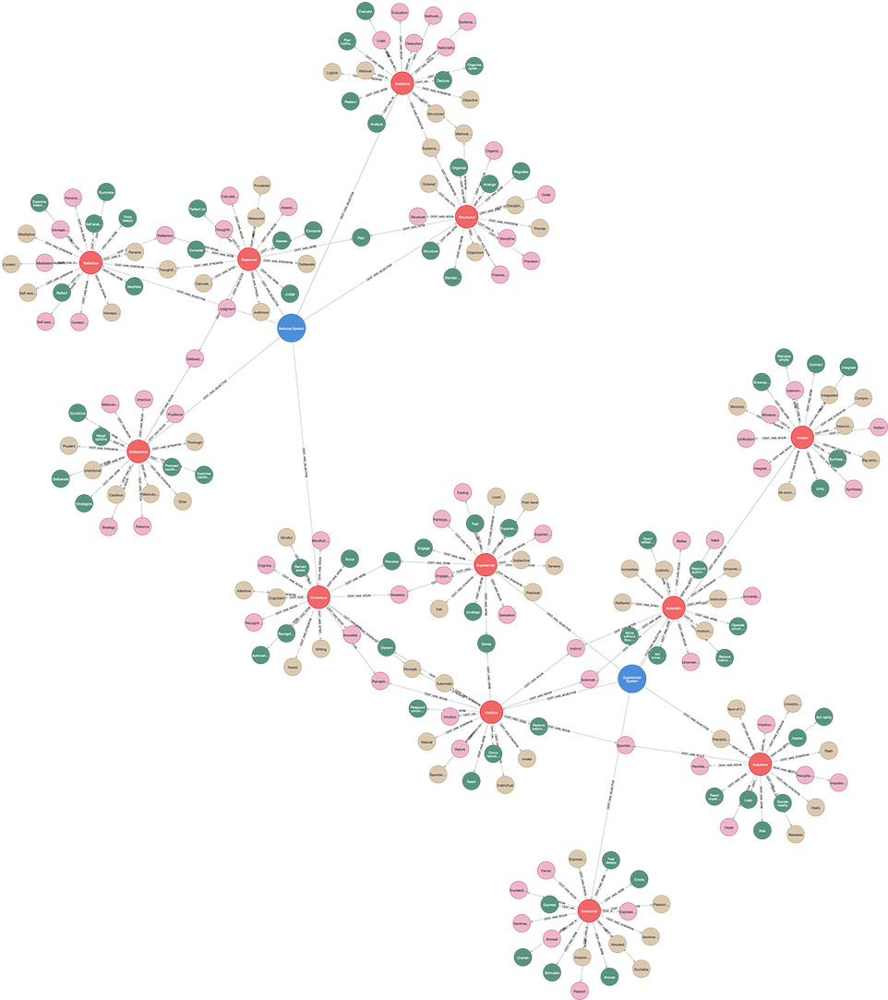

# (25) Cognitive-Experiential Self-Theory

**Abbreviation:** CEST
**Category:** Cognitive and Learning Models
**Model Number:** 25 of 44

---

### Description.
**Cognitive-Experiential Self-Theory (CEST)**, also known as the **Cognitive-Experiential Model (CEM)**, was developed by Seymour Epstein as a dual-process model of personality.
It proposes that human functioning is governed by two interacting information-processing systems:
*(1) the rational system*, analytical, deliberate, and verbal; and
*(2) the experiential system*, intuitive, automatic, affective, and preconscious.
The rational system operates slowly and logically, whereas the experiential system relies on associative learning and emotional memory.
Together, they shape perception, judgment, and behavior through a continual interplay of logic and emotion [Epstein1990CEST, Epstein1994Integration].

### Dimensions, Examples, and Functional Mapping.
CEST identifies two core modes of processing, each with characteristic operations, psychological correlates, and AI analogues.

I. Rational System.
Conscious, analytical, and rule-based reasoning that requires effortful cognitive control.

  - **Example:** Methodically weighing pros and cons before a major decision.
  - **Functional Analogues:**

      - *Analytical/Logical Processing:* Maps to **Symbolic Reasoning & Rule-Based Systems** (L2).
      - *Deliberative/Controlled Search:* Maps to **Sequential Planning & Search Algorithms** (L2).
      - *Abstract/Structured Representation:* Maps to **Knowledge Graphs & Conceptual Modeling** (L3).

II. Experiential System.
Intuitive, affect-driven, and associative processing that operates rapidly and preconsciously.

  - **Example:** Trusting an intuitive “gut feeling” about a person or decision.
  - **Functional Analogues:**

      - *Intuitive/Automatic Processing:* Maps to **Heuristic Pattern Recognition** (L2–L3).
      - *Affective Influence:* Maps to **Affective Computing & Emotion Modulation** (L3).
      - *Experiential Learning:* Maps to **Reinforcement Learning & Contextual Adaptation** (L2–L3).

Individual differences in the relative use of these systems are measured via the *Rational–Experiential Inventory (REI)* [Epstein1996REI].

### Timeline.

  - **1970s–1980s:** Foundational dual-process work integrating cognitive and psychodynamic mechanisms.
  - **1990:** Formal publication of CEST [Epstein1990CEST].
  - **1994:** Expanded integration of rational and experiential systems [Epstein1994Integration].
  - **1996:** Development of the *Rational–Experiential Inventory (REI)* [Epstein1996REI].
  - **2003:** Epstein’s *Constructive Thinking: The Key to Emotional Intelligence* links CEST to emotional intelligence [Epstein2003CTI].
  - **2000s–Present:** Applied across decision-making, coping, creativity, and clinical psychology.

### Applications.

  - **Clinical Psychology:** Understanding maladaptive coping and irrational beliefs through experiential dominance [Pacini1998].
  - **Decision Science:** Explaining intuition–reason conflict and affective heuristics in risk behavior [DenesRaj1994, Shiloh2002, Sloman1996].
  - **Personality Research:** Studying cognitive style preferences (rational vs. experiential) and their links to life outcomes [Kirkpatrick1992].
  - **Consumer Psychology:** Designing dual-route persuasive messages combining logic and emotion.
  - **Education:** Examining thinking-style effects on academic learning and reflection.
  - **AI & HCI:** Developing agents capable of balancing analytic and heuristic reasoning to emulate human-like judgment.

### Psychometrics.

  - **Primary Instrument:** Rational–Experiential Inventory (REI), typically 40 items with subscales for *Need for Cognition* (rational) and *Faith in Intuition* (experiential).
  - **Scale Format:** 5-point Likert (1 = Definitely False to 5 = Definitely True).
  - **Reliability:** Internal consistency typically  > 0.80.
  - **Validity:** Stable two-factor structure; subscales largely independent predictors of decision styles [Epstein1996REI].

### Data Structure.
Dataset (`cest.csv`) encodes lexical and categorical distinctions between systems:

  - `System` – `RationalSystem` or `ExperientialSystem`.
  - `Factor` – Trait characteristic (e.g., `Analytical`, `Intuitive`).
  - `Adjective` – Descriptor.
  - `Synonym` – Near-equivalent adjective.
  - `Verb` – Behavioral expression.
  - `Noun` – Conceptual noun form.

### Resources.

  - **Mapped Brain Functions Table:** Table tab:cest-mapping.
  - **AI Maturity Definitions:** Section sec:ai-maturity-levels.
  - **Interactive Literature Map:** [Connected Papers graph for Epstein (1990)](https://www.connectedpapers.com/main/8a70020d288caee851744168760b19fdf944c98f/Cognitive%20experiential-self%20theory./graph).
  - **Dataset:** [`CEM_CEST_Dataset.csv`](https://github.com/Wildertrek/survey/blob/main/datasets/cest.csv).
  - **Embeddings:** [`cest_embeddings.csv`](https://github.com/Wildertrek/survey/blob/main/Embeddings/cest_embeddings.csv).

---

## Atlas Resources

| Resource | Location |
|----------|----------|
| Dataset | [`datasets/cest.csv`](../../../datasets/cest.csv) |
| Embeddings | [`Embeddings/cest_embeddings.csv`](../../../Embeddings/cest_embeddings.csv) |
| RF Model | [`models/cest_rf_model.pkl`](../../../models/cest_rf_model.pkl) |
| Label Encoder | [`models/cest_label_encoder.pkl`](../../../models/cest_label_encoder.pkl) |
| Graph (large) | [`graphs/cest_large.png`](../../../graphs/cest_large.png) |

## References

The following references are cited in this model card:

- `DenesRaj1994`
- `Epstein1990CEST`
- `Epstein1994Integration`
- `Epstein1996REI`
- `Epstein2003CTI`
- `Kirkpatrick1992`
- `Pacini1998`
- `Shiloh2002`
- `Sloman1996`

See `references.bib` in the atlas root for full bibliographic entries.
