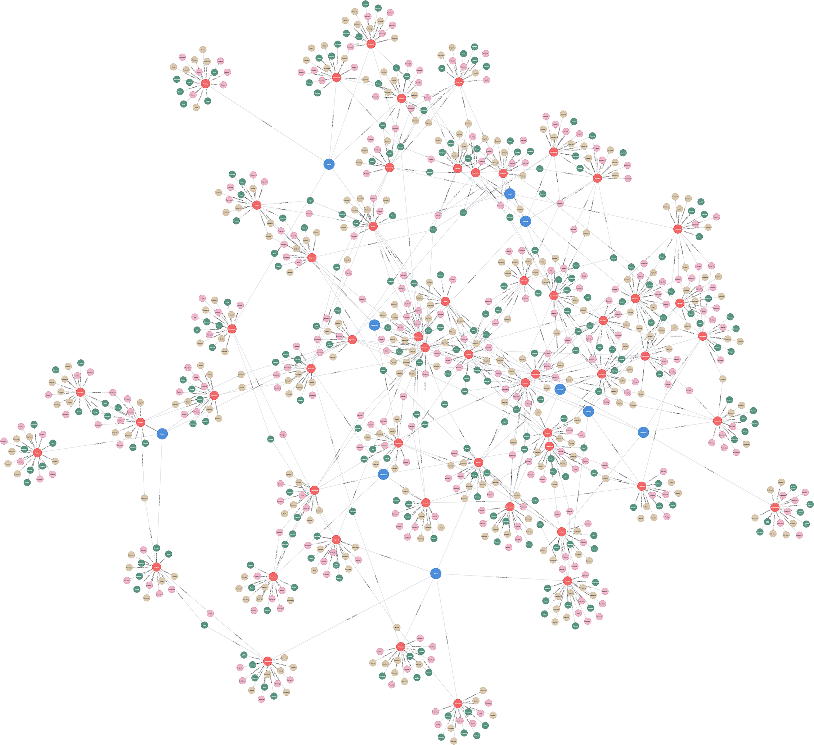

# (26) Felder-Silverman Learning Styles

**Abbreviation:** FSLS
**Category:** Cognitive and Learning Models
**Model Number:** 26 of 44

---

### Description.
The **Felder–Silverman Learning Style Model (FSLS)** [FelderSilverman1988] was introduced by Richard Felder and Linda Silverman in 1988 to describe learning preferences in engineering education.
It identifies four dichotomous dimensions that characterize how learners perceive, process, and organize information:
*Active/Reflective*, *Sensing/Intuitive*, *Visual/Verbal*, and *Sequential/Global*.
The associated *Index of Learning Styles (ILS)* [FelderSolomanILS] quantifies preferences across these dimensions, offering a practical framework for instructional design and adaptive learning systems.

### Dimensions, Examples, and Functional Mapping.
> AI maturity mappings (L1–L3) follow the foundation-agent cognitive hierarchy of Liu et al. (2025).

FSLS defines four continua that describe distinct modes of learning and cognitive engagement.

I. Active / Reflective (Processing Information).

  - **Active Learners:** Prefer hands-on engagement, discussion, and experimentation.
  Example: Immediately testing a new programming concept by coding and iterating.
  Maps to *Interactive Learning & Embodied Cognition* (L2–L3) ,  e.g., reinforcement-based AI agents that learn by doing or teaching.
  - **Reflective Learners:** Prefer internal processing, review, and mental simulation.
  Example: Pondering material and visualizing outcomes before action.
  Maps to *Internal Simulation & Model-Based Reasoning* (L2–L3) ,  e.g., AI performing internal policy refinement before execution.

II. Sensing / Intuitive (Perceiving Information).

  - **Sensing Learners:** Concrete, detail-oriented, prefer factual examples.
  Example: Learning from experimental data or explicit procedures.
  Maps to *Data-Driven Learning & Feature-Based Processing* (L1–L2).
  - **Intuitive Learners:** Abstract, conceptual, and imaginative.
  Example: Exploring underlying theories and synthesizing connections.
  Maps to *Conceptual Reasoning & Transfer Learning* (L2–L3).

III. Visual / Verbal (Input Modality).

  - **Visual Learners:** Learn best via diagrams, flowcharts, and spatial representations.
  Example: Understanding systems through architecture diagrams.
  Maps to *Multimodal Learning & Vision-Centric Processing* (L1–L2).
  - **Verbal Learners:** Learn via reading, writing, or discussion.
  Example: Grasping new ideas through lecture notes or conversation.
  Maps to *Natural Language Processing & Textual Reasoning* (L1–L2).

IV. Sequential / Global (Understanding Organization).

  - **Sequential Learners:** Prefer structured, step-by-step progression.
  Example: Following a logical sequence in a coding tutorial.
  Maps to *Structured Problem Solving & Curriculum Learning* (L2).
  - **Global Learners:** Prefer holistic understanding before detail.
  Example: Grasping the “big picture” before diving into specifics.
  Maps to *Contextual Synthesis & Holistic Pattern Recognition* (L2–L3).

### Timeline.

  - **1988:** Felder and Silverman introduce the model [FelderSilverman1988].
  - **1990s:** Development of the *Index of Learning Styles (ILS)* [FelderSolomanILS].
  - **2000s–Present:** Continued application across STEM, e-learning, and AI tutoring systems; debates on empirical validity remain active [Litzinger2007ILS].

### Applications.

  - **Instructional Design:** Adapting classroom or online content for diverse cognitive profiles.
  - **Student Development:** Increasing self-awareness of learning strategies.
  - **Curriculum Design:** Balancing content delivery modes across FSLS dimensions.
  - **E-Learning:** Personalizing digital learning experiences based on user profiles.
  - **AI Tutoring:** Enabling adaptive agents to infer and accommodate user learning styles.

### Psychometrics.

  - **Instrument:** *Index of Learning Styles (ILS)* ,  44 forced-choice items across four dichotomies.
  - **Reliability:** Mixed internal consistency across dimensions (α values ranging from moderate to high).
  - **Validity:** Conceptually robust for awareness and instructional diversity, though empirical support for learning-style matching remains contested [Litzinger2007ILS].
  - **Method:** Self-report questionnaire; analysis by continuum balance.

### Data Structure.
Dataset (`fsls.csv`) captures adjectives, verbs, and nominal forms associated with each learning style dimension:

  - `Factor` – Learning-style pole (e.g., `Active`, `Reflective`, `Sensing`, `Intuitive`).
  - `Adjective` – Descriptor (e.g., `Engaged`, `Thoughtful`).
  - `Synonym` – Near-equivalent adjective.
  - `Verb` – Associated behavioral verb (e.g., `Engage`, `Think`).
  - `Noun` – Nominal form (e.g., `Engagement`, `Thought`).
  - `Noun` – Nominal representation (e.g., `Engagement`, `Reflection`).

### Resources.

  - **Primary Source:** Felder & Silverman (1988) [FelderSilverman1988].
  - **Instrument:** Felder & Soloman’s *Index of Learning Styles* [FelderSolomanILS].
  - **Connected Papers:** [Literature graph for Felder & Silverman (1988)](https://www.connectedpapers.com/main/38444d4a5f57082081a33dd4f8f725665ad6edb2/Identifying-the-Learning-Style-of-Students-Using-Machine-Learning-Techniques%3A-An-Approach-of-Felder-Silverman-Learning-Style-Model-(FSLSM)/graph).
  - **Dataset:** [`FSLS_Dataset.csv`](https://github.com/Wildertrek/survey/blob/main/datasets/fsls.csv).
  - **Embeddings:** [`fsls_embeddings.csv`](https://github.com/Wildertrek/survey/blob/main/Embeddings/fsls_embeddings.csv).

---

## Atlas Resources

| Resource | Location |
|----------|----------|
| Dataset | [`datasets/fsls.csv`](../../../datasets/fsls.csv) |
| Embeddings | [`Embeddings/fsls_embeddings.csv`](../../../Embeddings/fsls_embeddings.csv) |
| RF Model | [`models/fsls_rf_model.pkl`](../../../models/fsls_rf_model.pkl) |
| Label Encoder | [`models/fsls_label_encoder.pkl`](../../../models/fsls_label_encoder.pkl) |
| Graph (large) | [`graphs/fsls_large.png`](../../../graphs/fsls_large.png) |

---

## Validation Results

> From: Raetano, Gregor, & Tamang (2026). "A Survey and Computational Atlas of Personality Models." Under review, ACM TIST.

**Performance Tier:** Low (<50%)

### Classification Performance

| Metric | Value |
|--------|-------|
| Factors | 10 |
| Test Items | 141 |
| RF Accuracy | 47.5% |
| F1 Score (macro) | 0.4532 |
| Precision | 0.5222 |
| Recall | 0.4757 |

### Baseline Comparisons

| Baseline | Accuracy | Lift |
|----------|----------|------|
| Random | 10.0% | +37.5% |
| Frequency | 10.0% | +37.5% |

### LLM Judge Evaluation

Triple-judge panel: GPT-5.2, Gemini 3 Pro, Claude Opus 4.6.

| Metric | Value |
|--------|-------|
| RF-Judge Agreement | 43.3% |
| Expected-Factor Agreement | 100.0% |
| Item Validity Rate | 46.7% |
| Mean Confidence | 4.83 / 5.0 |
| Inter-Judge Agreement | 100.0% |

### Category Context

| Metric | Value |
|--------|-------|
| Category | Cognitive |
| Category Mean Accuracy | 51.8% |
| Category Best | cest (72.4%) |
| Models in Category | 4 |

## References

The following references are cited in this model card:

- `FelderSilverman1988`
- [Felder, R. M. & Soloman, B. A. (1991). *Index of Learning Styles (ILS)*](https://www.webtools.ncsu.edu/learningstyles/)
- [Litzinger, T. A. et al. (2007). *A psychometric study of the Index of Learning Styles*](https://doi.org/10.1002/j.2168-9830.2007.tb00941.x)

See `references.bib` in the atlas root for full bibliographic entries.
