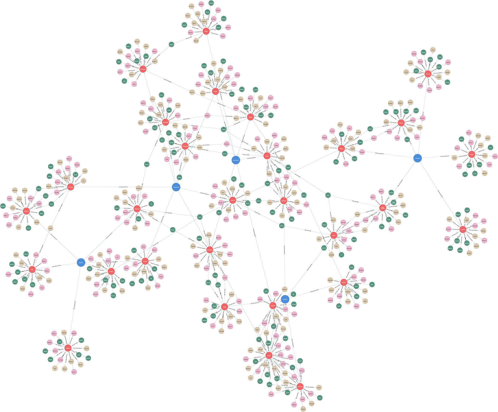

# (24) Social-Cognitive Model

**Abbreviation:** SCM
**Category:** Cognitive and Learning Models
**Model Number:** 24 of 44

---

### Description.
**The Social-Cognitive Model (SCM)**, grounded in the work of Albert Bandura, Julian Rotter, and Walter Mischel, emphasizes the reciprocal interplay between cognitive, behavioral, and environmental factors in shaping human functioning.
At its core lies *reciprocal determinism*, wherein cognition, behavior, and situational context continually influence one another.
Key mechanisms include *observational learning* (modeling), *self-efficacy* (belief in one’s capability to achieve desired outcomes), and *self-regulation* (monitoring and adjusting one’s behavior).
Rather than reducing learning to stimulus–response conditioning, SCM positions humans as proactive agents who interpret, anticipate, and adapt within social contexts [Bandura1977SLT, Bandura1986SocialFoundations].

### Dimensions, Examples, and Functional Mapping.
SCM spans three broad domains, behavioral, cognitive, and affective–interpersonal, each of which maps onto functional analogues in adaptive AI systems.

I. Behavioral Dynamics (Modes of Engagement).

  - **Active Behavior:** Energetic engagement and proactive exploration.
    Example: Seeking new collaborations.
    Maps to *Goal-Directed Exploration & Action Selection* (L2 AI Maturity).
  - **Passive Behavior:** Reactive, low-initiative responding.
    Maps to *Low Autonomy & Reactive Task Execution* (L1–L2).
  - **Aggressive Behavior:** Assertive, dominant, competitive engagement.
    Maps to *Competitive Multi-Agent Strategies & Dominance Modeling* (L3).
  - **Submissive Behavior:** Cooperative, compliant, harmony-oriented.
    Maps to *Collaborative Compliance & Conflict Avoidance Simulation* (L2).
  - **Flexible Behavior:** Adaptable and resilient to contextual changes.
    Maps to *Adaptive Planning & Strategy Revision* (L3).
  - **Rigid Behavior:** Inflexible adherence to established patterns.
    Maps to *Policy Fixation & Heuristic Stagnation Modeling* (L2).

II. Cognitive Processes (Information-Processing Styles).

  - **Analytical Cognition:** Logical, systematic reasoning.
    Maps to *Structured Inference & Rule-Based Reasoning* (L2).
  - **Intuitive Cognition:** Rapid, heuristic, or “gut-feeling” judgment.
    Maps to *Pattern Recognition & Heuristic Approximation* (L3).
  - **Abstract Cognition:** Conceptual or symbolic thinking.
    Maps to *Concept Formation & Schema Generalization* (L3).
  - **Concrete Cognition:** Focus on tangible, literal details.
    Maps to *Factual Recall & Procedural Execution* (L1–L2).
  - **Creative Cognition:** Generative, original idea synthesis.
    Maps to *Creative Generation & Novel Solution Formation* (L3).
  - **Cognitive Rigidity:** Resistance to belief updating or change.
    Maps to *Belief Perseverance & Bias Propagation Simulation* (L3).

III. Interpersonal and Affective Dimensions.

  - **Affective Polarity:** Spectrum from positive to negative affective tone.
    Maps to *Affective State Recognition & Emotional Simulation* (L2–L3).
  - **Interpersonal Style:** Extroverted vs. introverted, cooperative vs. competitive.
    Maps to *Multi-Agent Coordination & Social Role Modeling* (L2–L3).

### Timeline.

  - **1961:** Bandura’s Bobo Doll experiment establishes observational learning [BanduraRossRoss1961].
  - **1973–1977:** Formalization of self-efficacy and social learning [Bandura1973Aggression, Bandura1977SLT].
  - **1986:** Bandura’s *Social Foundations of Thought and Action* articulates full Social Cognitive Theory [Bandura1986SocialFoundations].
  - **1990s–Present:** SCM principles applied to health behavior, education, organizational learning, and media psychology.

### Applications.

  - **Clinical Psychology:** Modeling adaptive behavior change and self-regulation in therapy.
  - **Education:** Fostering self-efficacy, metacognition, and peer modeling in classrooms.
  - **Health Promotion:** Designing campaigns that use social modeling and collective efficacy to influence behavior.
  - **Organizational Development:** Training programs using vicarious learning and self-efficacy enhancement.
  - **Media Studies:** Understanding how exposure to modeled behaviors influences attitudes and social norms.
  - **AI & Robotics:** Informing social learning systems, imitation learning, and user self-efficacy modeling in human–AI interaction.

### Psychometrics.
Although SCM is a theoretical meta-framework rather than a single instrument, its constructs are widely measured:

  - **Self-Efficacy:** General or domain-specific self-efficacy scales (e.g., Schwarzer & Jerusalem, 1995).
  - **Observational Learning:** Experimental and behavioral observation paradigms.
  - **Locus of Control:** Rotter’s I–E Scale for internal vs. external reinforcement control.
  - **Self-Regulation:** Scales measuring goal setting, monitoring, and strategy use.
  - **Methodology:** Combines self-report, experimental, and naturalistic observation designs.

### Data Structure.
The dataset (`scm.csv`) captures lexical and categorical data across behavioral, cognitive, and affective domains:

  - `Factor` – Domain or dimension (e.g., `Behavior`, `Cognition`, `Affective`).
  - `Adjective` – Descriptive term (e.g., `Active`, `Analytical`, `Positive`).
  - `Synonym` – Near-equivalent adjective.
  - `Verb` – Action representation.
  - `Noun` – Nominal representation.

### Resources.

  - **Interactive Literature Map:** [Connected Papers graph for Bandura (1977)](https://www.connectedpapers.com/main/753960aef3f2747f757d73bc5c9330a21b484f2e/Human-agency-in-social-cognitive-theory./graph).
  - **Dataset:** [`SCM_Dataset.csv`](https://github.com/Wildertrek/survey/blob/main/datasets/scm.csv).
  - **Embeddings:** [`scm_embeddings.csv`](https://github.com/Wildertrek/survey/blob/main/Embeddings/scm_embeddings.csv).

---

## Atlas Resources

| Resource | Location |
|----------|----------|
| Dataset | [`datasets/scm.csv`](../../../datasets/scm.csv) |
| Embeddings | [`Embeddings/scm_embeddings.csv`](../../../Embeddings/scm_embeddings.csv) |
| RF Model | [`models/scm_rf_model.pkl`](../../../models/scm_rf_model.pkl) |
| Label Encoder | [`models/scm_label_encoder.pkl`](../../../models/scm_label_encoder.pkl) |
| Graph (large) | [`graphs/scm_large.png`](../../../graphs/scm_large.png) |

---

## Validation Results

> From: Raetano, Gregor, & Tamang (2026). "A Survey and Computational Atlas of Personality Models." Under review, ACM TIST.

**Performance Tier:** Moderate (50-70%)

### Classification Performance

| Metric | Value |
|--------|-------|
| Factors | 5 |
| Test Items | 74 |
| RF Accuracy | 52.7% |
| F1 Score (macro) | 0.5192 |
| Precision | 0.5284 |
| Recall | 0.5276 |

### Baseline Comparisons

| Baseline | Accuracy | Lift |
|----------|----------|------|
| Random | 20.0% | +32.7% |
| Frequency | 20.0% | +32.7% |

### LLM Judge Evaluation

Triple-judge panel: GPT-5.2, Gemini 3 Pro, Claude Opus 4.6.

| Metric | Value |
|--------|-------|
| RF-Judge Agreement | 70.0% |
| Expected-Factor Agreement | 100.0% |
| Item Validity Rate | 80.0% |
| Mean Confidence | 4.85 / 5.0 |
| Inter-Judge Agreement | 100.0% |

### Category Context

| Metric | Value |
|--------|-------|
| Category | Cognitive |
| Category Mean Accuracy | 51.8% |
| Category Best | cest (72.4%) |
| Models in Category | 4 |

## References

The following references are cited in this model card:

- `Bandura1973Aggression`
- `Bandura1977SLT`
- `Bandura1986SocialFoundations`
- `BanduraRossRoss1961`

See `references.bib` in the atlas root for full bibliographic entries.
