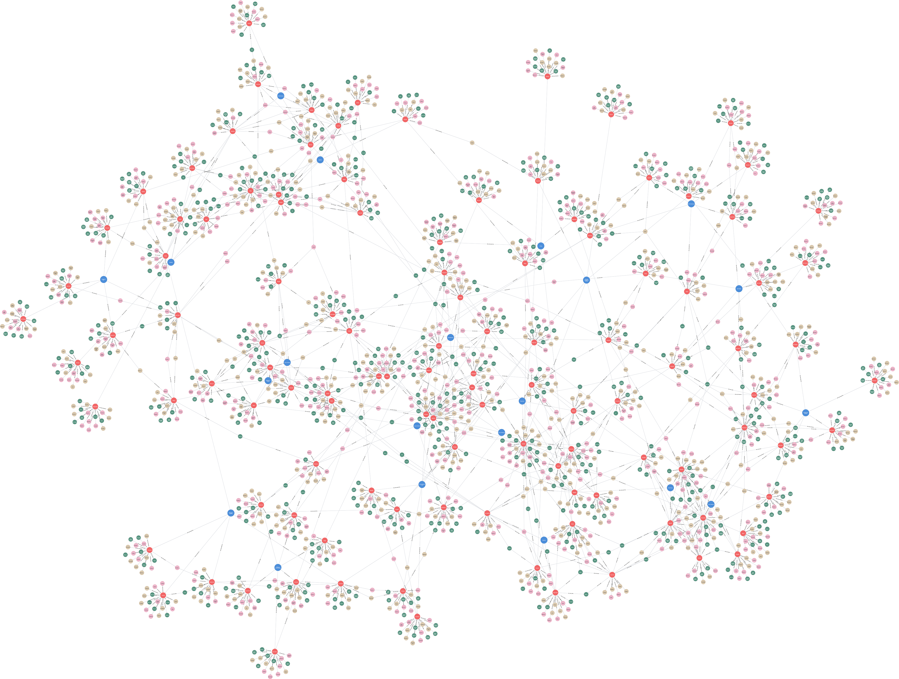

# (30) Beck Depression Inventory

**Abbreviation:** BDI
**Category:** Clinical and Psychological Health Models
**Model Number:** 30 of 44

---

### Description.
The **Beck Depression Inventory (BDI)** is a 21-item self-report instrument developed by Aaron T. Beck to measure the intensity of depressive symptoms [Beck1961AnInventory].
Each item describes a specific symptom, rated on a four-point scale (0–3), producing total scores from 0–63 that indicate severity categories (minimal, mild, moderate, or severe).
The *BDI-II* [BeckSteerBrown1996BDIIManual], published in 1996, updates the original to align with DSM–IV diagnostic criteria and is validated for ages 13 and above.
The BDI assesses affective, cognitive, somatic, and motivational aspects of depression and remains one of the most frequently used clinical measures worldwide.

### Dimensions, Examples, and AI Mapping.
Representative BDI-II items and their functional mappings include:

  - **Sadness (Affective):** Feeling persistently down or tearful.
  Example: “I feel sad most of the time.”
  Maps to *Negative Affect Regulation & Mood Simulation* (L3).
  - **Pessimism (Cognitive):** Hopeless outlook toward the future.
  Example: “I believe things will only get worse.”
  Maps to *Negative Predictive Bias / Future Expectancy Modeling* (L3).
  - **Loss of Pleasure (Anhedonia):** Diminished ability to experience enjoyment.
  Example: “I no longer enjoy activities I used to like.”
  Maps to *Reward Circuit Attenuation / Goal Deactivation* (L3).
  - **Self-Criticalness (Cognitive):** Excessive self-blame or guilt.
  Example: “I blame myself for everything bad that happens.”
  Maps to *Self-Referential Negative Attribution Modeling* (L3).
  - **Loss of Energy (Somatic):** Persistent fatigue and decreased drive.
  Example: “I feel too tired to do most things.”
  Maps to *Arousal Regulation & Motivation Deficit Simulation* (L3).
  - **Difficulty Concentrating (Cognitive):** Impaired attention or working memory.
  Example: “I find it hard to focus or think clearly.”
  Maps to *Cognitive Load Dysregulation / Sustained Attention Impairment* (L2–L3).

*Additional BDI-II items include:* past failure, guilt, punishment feelings, self-dislike, suicidal thoughts, crying, agitation, loss of interest, indecisiveness, worthlessness, sleep and appetite changes, irritability, fatigue, and loss of interest in sex.

### Applications.

  - **Clinical Assessment:** Screening and severity measurement for depressive symptoms [BeckSteerBrown1996BDIIManual].
  - **Treatment Monitoring:** Evaluating response to psychotherapy or pharmacological interventions [Schneibel2012Sensitivity].
  - **Psychological Research:** Studying depression correlates, risk factors, and outcomes across populations.
  - **AI for Mental Health:** Training models for early detection of depression via text, voice, or behavioral data.
  - **Personalized AI Companions:** Modulating conversational tone or empathy level based on detected mood indicators (within ethical constraints).
  - **Computational Psychiatry:** Simulating depressive cognition and affect for mechanistic modeling of mood disorders.

### Timeline.

  - **1961:** Original BDI introduced [Beck1961AnInventory].
  - **1978:** BDI-IA revision with updated items.
  - **1988:** Major psychometric review published [BeckSteerCarbin1988Psychometric].
  - **1996:** BDI-II aligns with DSM–IV criteria [BeckSteerBrown1996BDIIManual].
  - **Ongoing:** Cross-cultural validations and clinical refinements continue.

### Psychometrics.

  - **Format:** 21 items, each scored 0–3; total 0–63.
  - **Reliability:** Cronbach’s  = 0.80–0.93; stable test–retest reliability [BeckSteerCarbin1988Psychometric].
  - **Validity:** Strong correlations with clinician ratings and convergent depression scales (e.g., HRSD) [Brown1995Assessing].
  - **Method:** Standardized self-report; widely normed across populations.

### Data Structure.
The `bdi.csv` dataset encodes lexical descriptors for each BDI symptom item:

  - `Factor` – BDI symptom item (e.g., `Sadness`, `Pessimism`).
  - `Adjective` – Key descriptor (e.g., `Despondent`).
  - `Synonym` – Equivalent adjective (e.g., `Down`).
  - `Verb` – Action/state form (e.g., `Suffer`).
  - `Noun` – Nominal form (e.g., `Despondency`).

### Resources.

  - **Mapped Brain Functions Table:** Table tab:bdi-mapping.
  - **AI Maturity Levels:** Section sec:ai-maturity-levels.
  - **Connected Papers:** [Beck et al. (1961)](https://www.connectedpapers.com/main/33b2110fa59d8e52a848a5ebead9a088fb255f4e/Beck-Depression-Inventory%E2%80%93II/graph).
  - **Dataset:** [`BDI_Dataset.csv`](https://github.com/Wildertrek/survey/blob/main/datasets/bdi.csv).
  - **Embeddings:** [`bdi_embeddings.csv`](https://github.com/Wildertrek/survey/blob/main/Embeddings/bdi_embeddings.csv).

---

## Atlas Resources

| Resource | Location |
|----------|----------|
| Dataset | [`datasets/bdi.csv`](../../../datasets/bdi.csv) |
| Embeddings | [`Embeddings/bdi_embeddings.csv`](../../../Embeddings/bdi_embeddings.csv) |
| RF Model | [`models/bdi_rf_model.pkl`](../../../models/bdi_rf_model.pkl) |
| Label Encoder | [`models/bdi_label_encoder.pkl`](../../../models/bdi_label_encoder.pkl) |
| Graph (large) | [`graphs/bdi_large.png`](../../../graphs/bdi_large.png) |

## References

The following references are cited in this model card:

- `Beck1961AnInventory`
- `BeckSteerBrown1996BDIIManual`
- `BeckSteerCarbin1988Psychometric`
- `Brown1995Assessing`
- `Schneibel2012Sensitivity`

See `references.bib` in the atlas root for full bibliographic entries.
