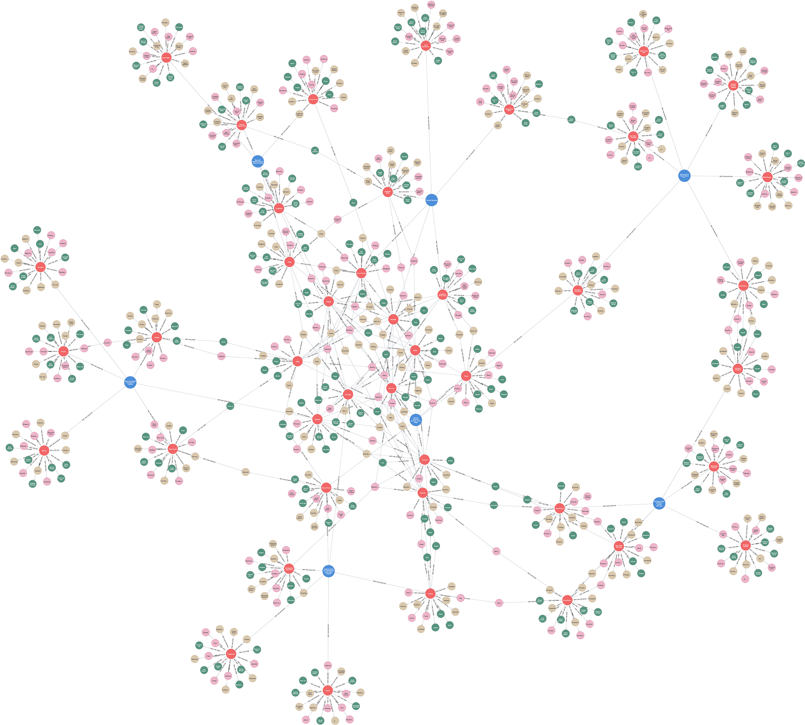

# (31) Generalized Anxiety Disorder 7

**Abbreviation:** GAD7
**Category:** Clinical and Psychological Health Models
**Model Number:** 31 of 44

---

### Description.
The **Generalized Anxiety Disorder 7 (GAD-7)** is a concise, 7-item self-report measure developed by Spitzer, Kroenke, Williams, and Löwe [Spitzer2006GAD7] to assess the severity of generalized anxiety disorder (GAD).
Respondents rate the frequency of seven core symptoms over the past two weeks using a four-point Likert scale (0 = “Not at all” to 3 = “Nearly every day”).
Total scores range from 0–21, with cutoffs of 5, 10, and 15 indicating mild, moderate, and severe anxiety.
The scale’s brevity, reliability, and construct validity make it a standard instrument across clinical, research, and digital health contexts.

### Dimensions, Examples, and AI Mapping.
> AI maturity mappings (L1–L3) follow the foundation-agent cognitive hierarchy of Liu et al. (2025).

Each GAD-7 item represents a core anxiety construct:

  - **Feeling nervous, anxious, or on edge:** Persistent physiological and cognitive tension.
  Example: Feeling perpetually keyed up or unable to relax.
  Maps to *Heightened Threat Monitoring & Arousal Dysregulation* (L3).
  - **Not being able to stop or control worrying:** Intrusive, uncontrollable ruminations.
  Example: Continuous overthinking despite awareness of excessiveness.
  Maps to *Deficient Cognitive Control over Worry Loops* (L3).
  - **Worrying too much about different things:** Generalized anxiety across domains.
  Example: Simultaneous worry about work, health, and relationships.
  Maps to *Overgeneralized Threat Appraisal* (L3).
  - **Trouble relaxing:** Difficulty returning to a calm baseline.
  Example: Inability to unwind even in safe conditions.
  Maps to *Impaired Relaxation Response & Somatic Tension Regulation* (L3).
  - **Restlessness / psychomotor agitation:** Motor and attentional hyperactivity.
  Example: Fidgeting, pacing, or difficulty sitting still.
  Maps to *Motor Agitation & Hypervigilant Scanning* (L3).
  - **Irritability:** Low frustration tolerance and emotional volatility.
  Example: Becoming easily angered by minor inconveniences.
  Maps to *Affective Dysregulation & Frustration Sensitivity* (L3).
  - **Feeling afraid as if something awful might happen:** Anticipatory fear without clear trigger.
  Example: Persistent dread of impending catastrophe.
  Maps to *Catastrophic Expectation Modeling* (L3).

### Applications.

  - **Clinical Screening:** Rapid assessment of GAD severity and comorbid anxiety symptoms [Spitzer2006GAD7].
  - **Treatment Monitoring:** Tracking therapeutic progress and pharmacologic response [Dear2011Psychometric].
  - **Epidemiology:** Estimating prevalence and correlates of anxiety in large cohorts [Kroenke2010PHQGADReview].
  - **Digital Health:** Integration in telehealth and self-assessment applications.
  - **AI Mental-Health Modeling:** Training classifiers to detect anxiety markers from text, speech, or behavioral data.
  - **Simulated Anxiety States:** Informing AI agents that emulate vigilance, rumination, or anticipatory threat bias.

### Timeline.

  - **2006:** Initial publication and validation [Spitzer2006GAD7].
  - **2000s–2010s:** Cross-cultural adaptations and psychometric replications [Plummer2016Screening].
  - **2010s–Present:** Continued use in clinical practice and digital mental-health systems [Dear2011Psychometric].

### Psychometrics.

  - **Format:** 7 items, 0–3 Likert scale; total 0–21.
  - **Reliability:** Cronbach’s α  0.92; test–retest r = 0.83 [Spitzer2006GAD7].
  - **Validity:** Strong criterion and construct validity; unidimensional factor structure [Plummer2016Screening].
  - **Cut-points:**  10 = clinically significant anxiety; higher scores indicate greater impairment.

### Data Structure.
The `gad7.csv` dataset contains lexical representations of the seven items:

  - `Factor` – GAD-7 symptom (e.g., `Restlessness`).
  - `Adjective` – Core descriptor (e.g., `Anxious`).
  - `Synonym` – Semantic equivalent (e.g., `Apprehensive`).
  - `Verb` – Behavioral verb (e.g., `Worry`).
  - `Noun` – Nominal abstraction (e.g., `Anxiety`).

### Resources.

  - **Connected Papers:** [GAD-7 Graph](https://www.connectedpapers.com/main/952af439c84eca1e867fba02e4f9c4e74fe4bdf9/Generalized-anxiety-disorder%3A-a-preliminary-test-of-a-conceptual-model./graph).
  - **Dataset:** [`GAD7_Dataset.csv`](https://github.com/Wildertrek/survey/blob/main/datasets/gad7.csv).
  - **Embeddings:** [`gad7_embeddings.csv`](https://github.com/Wildertrek/survey/blob/main/Embeddings/gad7_embeddings.csv).

---

## Atlas Resources

| Resource | Location |
|----------|----------|
| Dataset | [`datasets/gad7.csv`](../../../datasets/gad7.csv) |
| Embeddings | [`Embeddings/gad7_embeddings.csv`](../../../Embeddings/gad7_embeddings.csv) |
| RF Model | [`models/gad7_rf_model.pkl`](../../../models/gad7_rf_model.pkl) |
| Label Encoder | [`models/gad7_label_encoder.pkl`](../../../models/gad7_label_encoder.pkl) |
| Graph (large) | [`graphs/gad7_large.png`](../../../graphs/gad7_large.png) |

---

## Validation Results

> From: Raetano, Gregor, & Tamang (2026). "A Survey and Computational Atlas of Personality Models." Under review, ACM TIST.

**Performance Tier:** Moderate (50-70%)

### Classification Performance

| Metric | Value |
|--------|-------|
| Factors | 7 |
| Test Items | 93 |
| RF Accuracy | 67.7% |
| F1 Score (macro) | 0.6340 |
| Precision | 0.6868 |
| Recall | 0.6719 |

### Baseline Comparisons

| Baseline | Accuracy | Lift |
|----------|----------|------|
| Random | 14.3% | +53.4% |
| Frequency | 14.3% | +53.4% |

### LLM Judge Evaluation

Triple-judge panel: GPT-5.2, Gemini 3 Pro, Claude Opus 4.6.

| Metric | Value |
|--------|-------|
| RF-Judge Agreement | 100.0% |
| Expected-Factor Agreement | 100.0% |
| Item Validity Rate | 100.0% |
| Mean Confidence | 4.93 / 5.0 |
| Inter-Judge Agreement | 100.0% |

### Category Context

| Metric | Value |
|--------|-------|
| Category | Clinical |
| Category Mean Accuracy | 46.1% |
| Category Best | gad7 (67.7%) |
| Models in Category | 10 |

## References

The following references are cited in this model card:

- [Dear, B. F. et al. (2011). *Psychometric Comparison of the Generalized Anxiety Disorder Scale-7 and the Penn State Worry Questionnaire for Measuring Response during Treatment of Generalised Anxiety Disorder*](https://doi.org/10.1080/16506073.2011.582138)
- [Kroenke, K. et al. (2010). *The Patient Health Questionnaire Somatic, Anxiety, and Depressive Symptom Scales: a systematic review*](https://doi.org/10.1016/j.genhosppsych.2010.03.006)
- [Plummer, F. et al. (2016). *Screening for anxiety disorders with the GAD-7 and GAD-2: a systematic review and diagnostic metaanalysis*](https://doi.org/10.1016/j.genhosppsych.2015.11.005)
- [Spitzer, R. L. et al. (2006). *A brief measure for assessing generalized anxiety disorder: The GAD-7*](https://doi.org/10.1001/archinte.166.10.1092)

See `references.bib` in the atlas root for full bibliographic entries.
