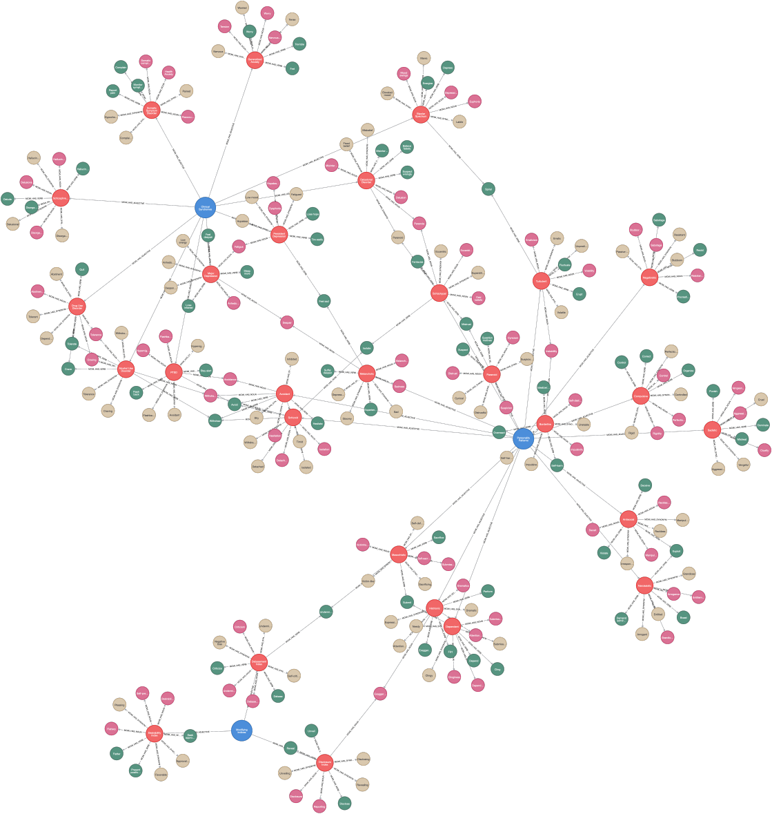

# (33) Millon Clinical Multiaxial Inventory

**Abbreviation:** MCMI
**Category:** Clinical and Psychological Health Models
**Model Number:** 33 of 44

---

### Description.
The **Millon Clinical Multiaxial Inventory (MCMI)** is a self-report psychological assessment developed by Theodore Millon to measure both enduring personality patterns and acute clinical syndromes in adults [Millon1977MCMI, Millon1982MCMI, Millon2015MCMIIV].
It employs a base-rate scoring system designed to reflect the prevalence of traits and syndromes in clinical populations, providing T-scores across **15 Personality Pattern**, **10 Clinical Syndrome**, and **3 Modifying Index** scales.
The MCMI is grounded in Millon’s evolutionary theory of personality, integrating DSM criteria into a theoretically coherent structure of personality and psychopathology.

### Format.

  - **Method:** Self-report inventory (195 items).
  - **Scale:** T-scores (base-rate adjusted).
  - **Interpretation:** Scores  75 indicate prominent traits;  85 suggest clinically significant elevations.

### Dimensions, Examples, and AI Mapping.
> AI maturity mappings (L1–L3) follow the foundation-agent cognitive hierarchy of Liu et al. (2025).

  - **Personality Patterns** (e.g., Borderline, Narcissistic, Avoidant)
  Maps to *Interpersonal Behavior, Emotional Regulation, and Self-Concept Modeling* (L3) ,  AI simulating unstable affect, relational volatility, or exaggerated self-schemas.
  - **Clinical Syndromes** (e.g., Major Depression, PTSD, Substance Abuse)
  Maps to *Affective Regulation, Threat Response, and Reinforcement Learning* (L2/L3) ,  AI representing maladaptive reward-seeking, dysphoric affect, or hypervigilance.
  - **Modifying Indices** (Disclosure, Desirability, Debasement)
  Maps to *Self-Presentation Bias & Response Validity Modeling* (L2) ,  AI estimating exaggeration, denial, or impression-management patterns in user data.

### Applications.

  - **Clinical Practice:** Diagnostic clarification and treatment planning for comorbid personality and clinical disorders.
  - **Research:** Examining trait-syndrome covariance and their neural or behavioral correlates.
  - **Forensics:** Personality and risk profiling in legal and correctional contexts.
  - **AI in Psychometrics:**

    - Constructing knowledge graphs linking personality dimensions and syndromes.
    - Generating simulated patient avatars with specific MCMI profiles for clinician-training environments.
    - Integrating normalized T-scores as standardized psychometric features in ML pipelines.

### Timeline.

  - **1977:** Original MCMI introduced [Millon1977MCMI].
  - **1982:** MCMI-I published; formalizes base-rate scoring [Millon1982MCMI].
  - **1997:** MCMI-III updated to DSM-IV.
  - **2015:** MCMI-IV released for DSM-5 alignment [Millon2015MCMIIV].
  - **Present:** Ongoing psychometric refinement and international validation.

### Psychometrics.

  - **Reliability:** Internal consistency  > 0.70 across most scales [Pincus2015Millon].
  - **Validity:** Strong content validity through DSM correspondence; good convergent validity with SCID and MMPI [Blais2003Psychometric].
  - **Base-Rate System:** Adjusts for disorder prevalence, improving interpretive precision for clinical elevations.

### Data Structure.
The `mcmi.csv` dataset provides lexical and categorical representations of the inventory’s scales:

  - `Factor` ,  Broad category (e.g., Personality Pattern, Clinical Syndrome).
  - `Adjective` ,  Specific scale (e.g., Borderline, Paranoid).
  - `Synonym, Verb, Noun` ,  Lexical descriptors corresponding to each dimension.

### Resources.

  - **Connected Papers:** [MCMI Graph](https://www.connectedpapers.com/main/844fde6e09258eca69fe54a2c36c3333a5002608/Millon-Clinical-Multiaxial-Inventory-manual/graph).
  - **Dataset:** [`MCMI_Dataset.csv`](https://github.com/Wildertrek/survey/blob/main/datasets/mcmi.csv).
  - **Embeddings:** [`mcmi_embeddings.csv`](https://github.com/Wildertrek/survey/blob/main/Embeddings/mcmi_embeddings.csv).

---

## Atlas Resources

| Resource | Location |
|----------|----------|
| Dataset | [`datasets/mcmi.csv`](../../../datasets/mcmi.csv) |
| Embeddings | [`Embeddings/mcmi_embeddings.csv`](../../../Embeddings/mcmi_embeddings.csv) |
| RF Model | [`models/mcmi_rf_model.pkl`](../../../models/mcmi_rf_model.pkl) |
| Label Encoder | [`models/mcmi_label_encoder.pkl`](../../../models/mcmi_label_encoder.pkl) |
| Graph (large) | [`graphs/mcmi_large.png`](../../../graphs/mcmi_large.png) |

---

## Validation Results

> From: Raetano, Gregor, & Tamang (2026). "A Survey and Computational Atlas of Personality Models." Under review, ACM TIST.

**Performance Tier:** Low (<50%)

### Classification Performance

| Metric | Value |
|--------|-------|
| Factors | 3 |
| Test Items | 42 |
| RF Accuracy | 42.9% |
| F1 Score (macro) | 0.3255 |
| Precision | 0.3358 |
| Recall | 0.4206 |

### Baseline Comparisons

| Baseline | Accuracy | Lift |
|----------|----------|------|
| Random | 33.3% | +9.5% |
| Frequency | 53.6% | -10.7% |

### LLM Judge Evaluation

Triple-judge panel: GPT-5.2, Gemini 3 Pro, Claude Opus 4.6.

| Metric | Value |
|--------|-------|
| RF-Judge Agreement | 36.7% |
| Expected-Factor Agreement | 100.0% |
| Item Validity Rate | 43.3% |
| Mean Confidence | 4.67 / 5.0 |
| Inter-Judge Agreement | 100.0% |

### Category Context

| Metric | Value |
|--------|-------|
| Category | Clinical |
| Category Mean Accuracy | 46.1% |
| Category Best | gad7 (67.7%) |
| Models in Category | 10 |

### Experiment 2: Model Improvement

| Intervention | Accuracy | Delta |
|-------------|----------|-------|
| Exp1 baseline (1536-dim) | 42.9% | — |
| RQ9: 3072-dim embeddings | 47.6% | +4.8% |
| RQ7: Data augmentation | 50.0% | +7.1% |
| **Best result** | **50.0%** | **+7.1%** |

Best intervention: Data augmentation (41 LLM-generated items).

## References

The following references are cited in this model card:

- [Blais, M. A. et al. (2003). *Exploring the Psychometric Properties and Construct Validity of the MCMI-III Anxiety and Avoidant Personality Scales*](https://doi.org/10.1207/S15327752JPA8103_06)
- `Millon1977MCMI`
- `Millon1982MCMI`
- `Millon2015MCMIIV`
- [Pincus, A. L. & Krueger, R. F. (2015). *Theodore Millon's Contributions to Conceptualizing Personality Disorders*](https://doi.org/10.1080/00223891.2015.1031376)

See `references.bib` in the atlas root for full bibliographic entries.
