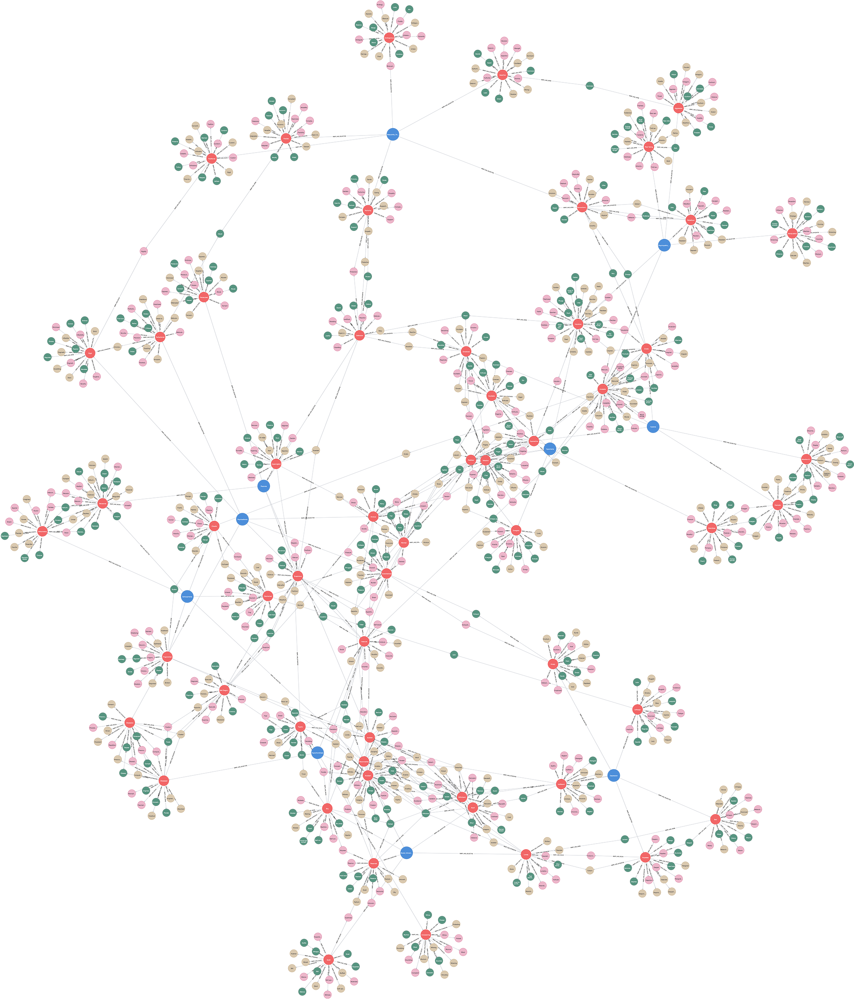

# (27) Minnesota Multiphasic Personality Inventory

**Abbreviation:** MMPI
**Category:** Clinical and Psychological Health Models
**Model Number:** 27 of 44

---

### Description.
The **Minnesota Multiphasic Personality Inventory (MMPI)** is one of the most widely used and empirically validated instruments for assessing adult personality and psychopathology.
Developed by Starke R. Hathaway and J. C. McKinley at the University of Minnesota (1939–1943) [HathawayMcKinley1943], the MMPI assesses diverse psychological conditions through a large set of true/false statements.
Major revisions include the *MMPI-2* (1989) [Butcher1989MMPI2] and the *MMPI-2 Restructured Form (MMPI-2-RF)* (2008) [BenPorathTellegen2008MMPI2RF].
The MMPI-A (1992) [Butcher1992MMPIA] extends the framework to adolescents.
The test measures emotional, behavioral, and interpersonal functioning across standardized clinical and validity scales.

### Dimensions, Examples, and Functional Mapping (Clinical Scales).
> AI maturity mappings (L1–L3) follow the foundation-agent cognitive hierarchy of Liu et al. (2025).

Each MMPI scale corresponds to a specific domain of psychological functioning. Below are the ten primary clinical scales and their potential computational analogues.

  - **Scale 1 (Hs – Hypochondriasis):** Excessive concern with bodily functions.
  Example: Frequent complaints without medical cause.
  Maps to *Somatic Concern Simulation & Internal Anomaly Detection* (L3).
  - **Scale 2 (D – Depression):** Low mood, loss of motivation, hopelessness.
  Example: Expressions of sadness or withdrawal.
  Maps to *Affective Damping & Reduced Goal Activation* (L3).
  - **Scale 3 (Hy – Hysteria):** Conversion of stress into physical symptoms.
  Example: Psychosomatic reactions with denial of distress.
  Maps to *Stress Response Reframing & Systemic Denial Modeling* (L3).
  - **Scale 4 (Pd – Psychopathic Deviate):** Social norm defiance, impulsivity.
  Example: Chronic rule-breaking, hostility to authority.
  Maps to *Norm Violation & Antisocial Policy Simulation* (L3).
  - **Scale 5 (Mf – Masculinity–Femininity):** Gendered interests and role identification.
  Example: Endorsement of gender-atypical activities.
  Maps to *Preference Modeling & Identity Representation* (L2).
  - **Scale 6 (Pa – Paranoia):** Suspiciousness and distrust of others.
  Example: Belief of being targeted or deceived.
  Maps to *Threat Misattribution & Distrust Modeling* (L3).
  - **Scale 7 (Pt – Psychasthenia):** Anxiety, obsessionality, compulsive checking.
  Example: Repetitive behaviors or self-doubt.
  Maps to *Uncertainty Amplification & Recursive Control Loops* (L3).
  - **Scale 8 (Sc – Schizophrenia):** Thought disorder, perceptual distortion.
  Example: Bizarre ideation, social withdrawal.
  Maps to *Disorganized Processing & Aberrant Signal Interpretation* (L3).
  - **Scale 9 (Ma – Hypomania):** High energy, impulsivity, euphoria.
  Example: Racing thoughts, overconfidence, restlessness.
  Maps to *Elevated Activation & Risk-Taking Policy* (L2–L3).
  - **Scale 0 (Si – Social Introversion):** Shyness, social withdrawal.
  Example: Preference for solitude, discomfort in crowds.
  Maps to *Social Avoidance & Low Engagement Simulation* (L2).

The MMPI also includes multiple *validity scales* (e.g., L, F, K, VRIN, TRIN) to detect exaggerated, defensive, or inconsistent responses.

### Timeline.

  - **1939–1943:** Original MMPI published [HathawayMcKinley1943].
  - **1989:** MMPI-2 revision with updated norms [Butcher1989MMPI2].
  - **1992:** MMPI-A introduced for adolescents [Butcher1992MMPIA].
  - **2008:** MMPI-2-RF developed with restructured scales [BenPorathTellegen2008MMPI2RF].
  - **Present:** Used globally across clinical, forensic, and research contexts.

### Applications.

  - **Clinical Assessment:** Diagnosing psychological disorders and guiding treatment [Graham2006MMPI2].
  - **Forensic Evaluation:** Used for competency, risk, and custody assessments [PopeButcherSeelen2006MMPIForensic].
  - **Occupational Screening:** Applied selectively in high-risk roles (law enforcement, aviation) [Butcher2009MMPIRoutledge].
  - **Medical Psychology:** Assessing psychosomatic or adjustment responses [Greene2007MMPI2Interpretation].
  - **Research:** Foundational in personality, psychopathology, and cross-cultural studies.

### Psychometrics.

  - **Item Format:** MMPI-2 – 567 items; MMPI-2-RF – 338 items.
  - **Scoring:** T-scores (Mean = 50, SD = 10); 65 considered clinically elevated.
  - **Reliability:** Strong for most scales (r = 0.70–0.90) [Graham2006MMPI2, BenPorathTellegen2008MMPI2RF].
  - **Validity:** Supported through thousands of studies across populations; validity indices critical for interpretation [Greene2007MMPI2Interpretation, Nichols2001MMPI2Interpretation].
  - **Method:** Standardized self-report; professional administration required.

### Data Structure.
The `mmpi.csv` dataset uses the standard five-column lexical schema:

  - `Factor` – Clinical scale (e.g., `Hypochondriasis`, `Depression`, `Paranoia`).
  - `Adjective` – Trait descriptor (e.g., `Obsessed`).
  - `Synonym` – Equivalent descriptor (e.g., `Preoccupied`).
  - `Verb` – Action form (e.g., `Obsess`).
  - `Noun` – Nominal representation (e.g., `Obsession`).

### Resources.

  - **Publisher:** University of Minnesota Press (MMPI family); Pearson Assessments.
  - **Connected Papers:** [Hathaway & McKinley (1943) Literature Graph](https://www.connectedpapers.com/main/eb206787a066eafde7ab3c32917a512a8c59b740/Minnesota-multiphasic-personality-inventory-%3A-manual/graph).
  - **Dataset:** [`MMPI_Dataset.csv`](https://github.com/Wildertrek/survey/blob/main/datasets/mmpi.csv).
  - **Embeddings:** [`mmpi_embeddings.csv`](https://github.com/Wildertrek/survey/blob/main/Embeddings/mmpi_embeddings.csv).

---

## Atlas Resources

| Resource | Location |
|----------|----------|
| Dataset | [`datasets/mmpi.csv`](../../../datasets/mmpi.csv) |
| Embeddings | [`Embeddings/mmpi_embeddings.csv`](../../../Embeddings/mmpi_embeddings.csv) |
| RF Model | [`models/mmpi_rf_model.pkl`](../../../models/mmpi_rf_model.pkl) |
| Label Encoder | [`models/mmpi_label_encoder.pkl`](../../../models/mmpi_label_encoder.pkl) |
| Graph (large) | [`graphs/mmpi_large.png`](../../../graphs/mmpi_large.png) |

---

## Validation Results

> From: Raetano, Gregor, & Tamang (2026). "A Survey and Computational Atlas of Personality Models." Under review, ACM TIST.

**Performance Tier:** Low (<50%)

### Classification Performance

| Metric | Value |
|--------|-------|
| Factors | 10 |
| Test Items | 142 |
| RF Accuracy | 47.9% |
| F1 Score (macro) | 0.4380 |
| Precision | 0.5031 |
| Recall | 0.4776 |

### Baseline Comparisons

| Baseline | Accuracy | Lift |
|----------|----------|------|
| Random | 10.0% | +37.9% |
| Frequency | 10.0% | +37.9% |

### LLM Judge Evaluation

Triple-judge panel: GPT-5.2, Gemini 3 Pro, Claude Opus 4.6.

| Metric | Value |
|--------|-------|
| RF-Judge Agreement | 82.5% |
| Expected-Factor Agreement | 100.0% |
| Item Validity Rate | 82.5% |
| Mean Confidence | 4.78 / 5.0 |
| Inter-Judge Agreement | 100.0% |

### Category Context

| Metric | Value |
|--------|-------|
| Category | Clinical |
| Category Mean Accuracy | 46.1% |
| Category Best | gad7 (67.7%) |
| Models in Category | 10 |

### Experiment 2: Model Improvement

| Intervention | Accuracy | Delta |
|-------------|----------|-------|
| Exp1 baseline (1536-dim) | 47.9% | — |
| RQ9: 3072-dim embeddings | 59.2% | +11.3% |
| RQ7: Data augmentation | 69.0% | +21.1% |
| **Best result** | **69.0%** | **+21.1%** |

Best intervention: Data augmentation (130 LLM-generated items).

## References

The following references are cited in this model card:

- [Ben-Porath, Y. S. & Tellegen, A. (2008). *MMPI-2-RF (Minnesota Multiphasic Personality Inventory-2 Restructured Form): Manual for administration, scoring, and interpretation*](https://www.upress.umn.edu/book-division/books/mmpi-2-rf)
- [Butcher, J. N. et al. (1989). *MMPI-2: Minnesota Multiphasic Personality Inventory-2: Manual for administration and scoring*](https://www.upress.umn.edu/book-division/books/mmpi-2)
- [Butcher, J. N. et al. (1992). *MMPI-A: Minnesota Multiphasic Personality Inventory-Adolescent: Manual for administration, scoring, and interpretation*](https://www.upress.umn.edu/book-division/books/mmpi-a)
- [Unknown (2009). *Oxford Handbook of Personality Assessment*](https://doi.org/10.1093/oxfordhb/9780195366877.001.0001)
- [Graham, J. R. (2006). *MMPI-2: Assessing personality and psychopathology*](https://books.google.com/books?id=22qYf31tSLEC&newbks=0&hl=en&source=newbks_fb)
- `Greene2007MMPI2Interpretation`
- [Hathaway, S. R. (1951). *An Atlas for the Clinical Use of the MMPI*](https://archive.org/details/atlasforclinical0000hath_p9n7)
- [Nichols, D. S. (2001). *Essentials of MMPI-2 Assessment*](https://archive.org/details/essentialsofmmpi0000nich)
- [Pope, K. S. et al. (2006). *The MMPI, MMPI-2, and MMPI-A in court: A practical guide for expert witnesses and attorneys*](https://doi.org/10.1037/11411-000)

See `references.bib` in the atlas root for full bibliographic entries.
