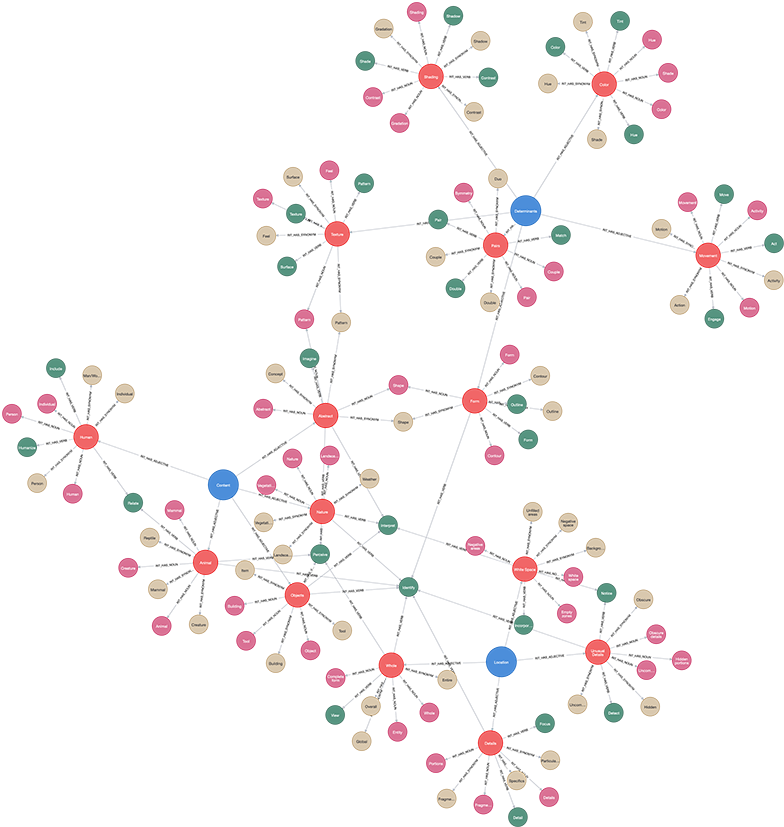

# (34) Rorschach Inkblot Test

**Abbreviation:** RIT
**Category:** Clinical and Psychological Health Models
**Model Number:** 34 of 44

---

### Description.
The **Rorschach Inkblot Test (RIT)** is a projective psychological instrument introduced by Hermann Rorschach in 1921 [Rorschach1921Psychodiagnostik].
It uses a series of ten ambiguous inkblots to elicit spontaneous interpretations, from which trained examiners infer underlying personality dynamics, emotional regulation, and thought organization.
Although its psychometric validity has been debated [Wood2000RorschachCritReview, Hunsley1999ClinicalUtility], modern scoring systems, such as Exner’s *Comprehensive System (CS)* [Exner2003CSVol1] and the *Rorschach Performance Assessment System (R-PAS)* [Meyer2011RPASManual], have standardized administration and interpretation, improving reliability and empirical grounding [Meyer2001HardScience, Viglione1999ReviewRecent].

### Dimensions, Examples, and AI Mapping.
The Rorschach is analyzed along three primary dimensions, *Location*, *Determinants*, and *Content*, each reflecting distinct perceptual or cognitive processes that can be analogized to AI perception and interpretation tasks.

  - **Location.** Where the respondent focuses within the blot.

    - **Whole (W):** Interprets the entire blot (e.g., “The whole thing looks like a bat”).
    Maps to *Global Visual Processing & Gestalt Integration* (L1–L2).
    - **Detail (D/Dd):** Focuses on common or small, unusual areas (e.g., “This side looks like a bear’s paw”).
    Maps to *Selective Attention & Feature Extraction* (L1–L2).
    - **White Space (S):** Uses negative space (e.g., “The white part forms a ghost”).
    Maps to *Figure–Ground Reversal & Cognitive Flexibility* (L2–L3).

  - **Determinants.** Visual qualities influencing perception.

    - **Form (F):** Based on shape alone ,  *Shape Recognition & Object Organization* (L1).
    - **Movement (M):** Perceived human or animal motion ,  *Action Recognition & Intention Inference* (L2–L3).
    - **Color (C):** Driven by chromatic cues ,  *Color Processing & Affective Association* (L1–L3).
    - **Shading (Sh):** Uses tone/texture ,  *Tactile Inference & Haptic Reasoning* (L2–L3).

  - **Content.** Thematic subject of the response.

    - **Human (H):** Reflects social cognition.
    - **Animal (A):** Engages biological form recognition.
    - **Abstract (Ab):** Expresses symbolic or metaphorical reasoning.
    These map to *Human/Animal Recognition & Abstract Conceptualization* (L1–L3).

### Applications.

  - **Clinical Assessment:** Evaluates personality organization, emotional control, and cognitive style [Exner2003CSVol1, Meyer2001HardScience].
  - **Forensic Psychology:** Occasionally used in competency and risk assessments [Viglione2008ForensicPsychometrics].
  - **Research:** Tool for studying perception, creativity, and response to ambiguity [Weiner2001AdvancingScience].
  - **AI Applications:**

    - *AI-Assisted Scoring:* Automating the coding of Rorschach protocols for consistency.
    - *Ambiguity Resolution Modeling:* Informing AI systems that infer meaning from uncertain or incomplete data.
    - *Generative Creativity:* Using response distributions to inspire more open-ended generative modeling behaviors.

### Timeline.

  - **1921:** Rorschach publishes *Psychodiagnostik* [Rorschach1921Psychodiagnostik].
  - **1930s–1950s:** Development of multiple scoring systems (Beck, Klopfer, Hertz, Piotrowski).
  - **1969–1990s:** Exner consolidates systems into the *Comprehensive System (CS)* [Exner1969SystemsManual, Exner2003CSVol1].
  - **2000s:** Empirical reappraisal and international norming [Wood2000RorschachCritReview, Shaffer2007IntlRefSamples].
  - **2011:** R-PAS introduced [Meyer2011RPASManual].
  - **Present:** R-PAS dominates modern use; focus on psychometrics, cross-cultural validation, and digital augmentation [Bornstein2012ScoreValidation].

### Psychometrics.

  - **Scoring Systems:** Exner’s CS and R-PAS provide standardized variables for location, determinants, and content.
  - **Reliability:** Good inter-rater reliability for trained scorers [Meyer2002InterraterCS].
  - **Validity:** Supported for variables linked to thought disorder, affect regulation, and interpersonal perception [Mihura2013PsychBull], though global validity remains debated [Wood2000RorschachCritReview, Hunsley1999ClinicalUtility].
  - **Norms:** R-PAS includes updated international reference samples [Meyer2015IntlRefValues].
  - **Administration:** Requires standardized prompts and response counts to ensure interpretive reliability [Viglione2015AlternativeAdmin].

### Data Structure.
The conceptual dataset (`rit.csv`) encodes the hierarchical structure of Rorschach variables:

  - `Factor` ,  Dimension (e.g., Location, Determinant, Content).
  - `Adjective` ,  Specific code or descriptor (e.g., Whole, Color, Human).
  - `Synonym` ,  Near-equivalent term.
  - `Verb` ,  Behavioral form.
  - `Noun` ,  Nominal abstraction.

### Resources.

  - **Connected Papers:** [RIT Graph](https://www.connectedpapers.com/main/cdc0968f7aedfb3613bd9841da687fb0f0c9ae8b/The-Parallel-Series-%E2%80%93-The-Behn%E2%80%93Rorschach-Inkblot-Test/graph).
  - **Dataset:** [`RIT_Dataset.csv`](https://github.com/Wildertrek/survey/blob/main/datasets/rit.csv).
  - **Embeddings:** [`rit_embeddings.csv`](https://github.com/Wildertrek/survey/blob/main/Embeddings/rit_embeddings.csv).

---

## Atlas Resources

| Resource | Location |
|----------|----------|
| Dataset | [`datasets/rit.csv`](../../../datasets/rit.csv) |
| Embeddings | [`Embeddings/rit_embeddings.csv`](../../../Embeddings/rit_embeddings.csv) |
| RF Model | [`models/rit_rf_model.pkl`](../../../models/rit_rf_model.pkl) |
| Label Encoder | [`models/rit_label_encoder.pkl`](../../../models/rit_label_encoder.pkl) |
| Graph (large) | [`graphs/rit_large.png`](../../../graphs/rit_large.png) |

---

## Validation Results

> From: Raetano, Gregor, & Tamang (2026). "A Survey and Computational Atlas of Personality Models." Under review, ACM TIST.

**Performance Tier:** Moderate (50-70%)

### Classification Performance

| Metric | Value |
|--------|-------|
| Factors | 3 |
| Test Items | 42 |
| RF Accuracy | 64.3% |
| F1 Score (macro) | 0.6346 |
| Precision | 0.7243 |
| Recall | 0.6556 |

### Baseline Comparisons

| Baseline | Accuracy | Lift |
|----------|----------|------|
| Random | 33.3% | +31.0% |
| Frequency | 40.0% | +24.3% |

### LLM Judge Evaluation

Triple-judge panel: GPT-5.2, Gemini 3 Pro, Claude Opus 4.6.

| Metric | Value |
|--------|-------|
| RF-Judge Agreement | 70.0% |
| Expected-Factor Agreement | 90.0% |
| Item Validity Rate | 70.0% |
| Mean Confidence | 4.90 / 5.0 |
| Inter-Judge Agreement | 100.0% |

### Category Context

| Metric | Value |
|--------|-------|
| Category | Clinical |
| Category Mean Accuracy | 46.1% |
| Category Best | gad7 (67.7%) |
| Models in Category | 10 |

## References

The following references are cited in this model card:

- `Bornstein2012ScoreValidation`
- `Exner1969SystemsManual`
- `Exner2003CSVol1`
- `Hunsley1999ClinicalUtility`
- `Meyer2001HardScience`
- `Meyer2002InterraterCS`
- `Meyer2011RPASManual`
- `Meyer2015IntlRefValues`
- `Mihura2013PsychBull`
- `Rorschach1921Psychodiagnostik`
- `Shaffer2007IntlRefSamples`
- `Viglione1999ReviewRecent`
- `Viglione2008ForensicPsychometrics`
- `Viglione2015AlternativeAdmin`
- `Weiner2001AdvancingScience`
- `Wood2000RorschachCritReview`

See `references.bib` in the atlas root for full bibliographic entries.
