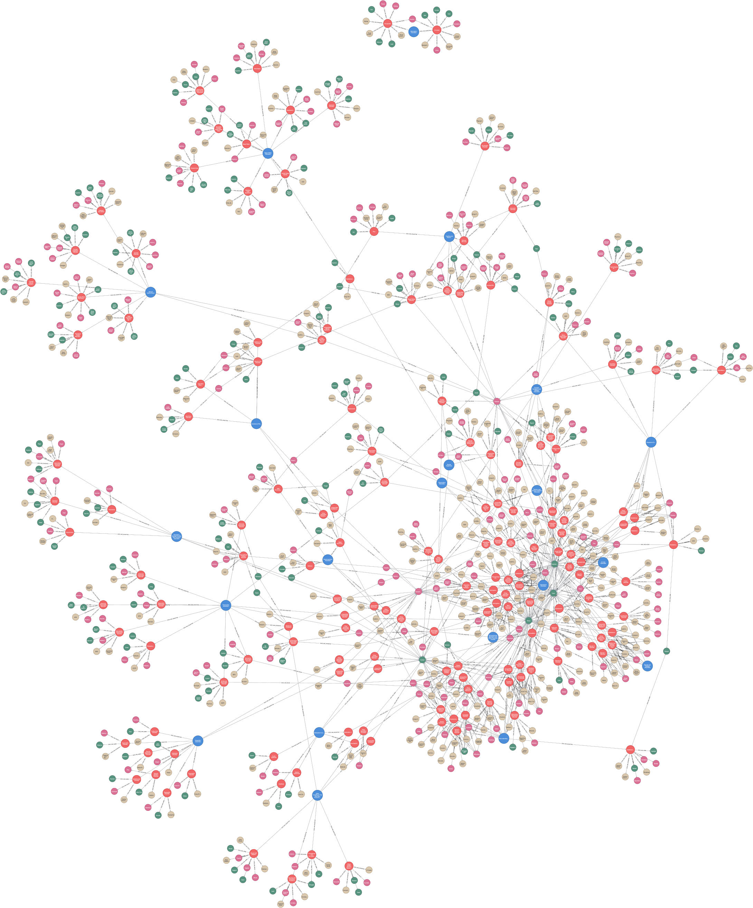

# (32) Structured Clinical Interview for DSM

**Abbreviation:** SCID
**Category:** Clinical and Psychological Health Models
**Model Number:** 32 of 44

---

### Description.
The **Structured Clinical Interview for DSM-5 (SCID-5)** is a semi-structured, clinician-administered diagnostic instrument developed by Michael B. First, Janet B.W. Williams, Rhonda Karg, and Robert L. Spitzer [First2016SCID5CVGuide].
It provides a systematic framework for evaluating DSM-5 criteria across the spectrum of mental disorders.
Each diagnostic class is represented as a *module*, containing standardized questions and probes to enhance inter-rater reliability and diagnostic precision.
Variants include the *Clinician Version (SCID-5-CV)*, *Research Version (SCID-5-RV)*, and *Personality Disorders Version (SCID-5-PD)*.
The SCID is widely considered the *gold standard* for structured psychiatric diagnosis in both clinical and research settings.

### Dimensions, Examples, and AI Mapping.
Each SCID module corresponds to a DSM diagnostic category, operationalized here as conceptual “dimensions” that can inform computational psychiatry and AI mental-modeling:

  - **Depressive Disorders:** Persistent low mood, anhedonia, and cognitive distortions.
  Example: Major Depressive Disorder.
  Maps to *Affect Regulation & Reward Circuit Dysfunction* (L3) ,  AI modeling of sustained low-valence affect, motivational deficits, and pessimistic appraisal bias.

  - **Anxiety Disorders:** Excessive fear, worry, and avoidance behaviors.
  Example: Generalized Anxiety Disorder (GAD).
  Maps to *Threat Detection, Fear Circuit Activation, & Rumination Modeling* (L3) ,  AI simulation of chronic vigilance and catastrophic expectancy loops.

  - **Schizophrenia Spectrum & Psychotic Disorders:** Distortions in thought, perception, and behavior.
  Example: Schizophrenia.
  Maps to *Perceptual Processing & Belief Formation Dynamics* (L3) ,  AI analogs of hallucination modeling and fixed-belief generation.

  - **Bipolar and Related Disorders:** Alternating states of mania/hypomania and depression.
  Example: Bipolar I Disorder.
  Maps to *Mood Regulation Oscillation & Reward Sensitivity Shifts* (L3) ,  AI state models alternating between high energy/exploration and low energy/conservation modes.

  - **Substance-Related & Addictive Disorders:** Maladaptive reward-seeking and compulsive use patterns.
  Example: Alcohol Use Disorder.
  Maps to *Reinforcement Learning & Impulse-Control Dysregulation* (L2/L3) ,  AI simulating craving feedback loops and tolerance phenomena.

  - **Personality Disorders:** Enduring maladaptive patterns of cognition, affect, and behavior.
  Example: Borderline Personality Disorder.
  Maps to *Emotional Regulation & Self-Concept Modeling* (L3) ,  AI simulation of unstable interpersonal schemas and affective lability.

### Applications.

  - **Clinical Diagnosis:** Core instrument for reliable and standardized DSM-5 diagnostic assessment [First2016SCID5CVGuide].
  - **Research Standardization:** Ensures diagnostic consistency across studies on etiology, comorbidity, and treatment efficacy [Spitzer1992SCIDHistory].
  - **Training:** Teaches clinicians structured diagnostic interviewing and criteria-based assessment.
  - **Forensic Use:** Provides standardized diagnostic evidence in legal and forensic evaluations.
  - **AI Psychiatry Integration:**

    - Framework for DSM-based knowledge graphs and clinical reasoning ontologies.
    - Enables structured data generation for supervised machine-learning models predicting symptom clusters and treatment outcomes.
    - Basis for synthetic “virtual patient” agents exhibiting disorder-consistent affective and cognitive patterns.

### Timeline.

  - **1980s:** SCID introduced for DSM-III by Spitzer & Williams [Spitzer1992SCIDHistory].
  - **1994–1997:** DSM-IV versions (SCID-I/SCID-II) refined Axis I and II diagnostics [First1997SCIDIV].
  - **2013–2016:** SCID-5 released for DSM-5 alignment [First2016SCID5CVGuide].
  - **Present:** Ongoing use across research, clinical, and digital assessment domains; continued psychometric validation [DeLimaOsorio2019ClinicalValidity, Shabani2020Psychometric].

### Psychometrics.

  - **Format:** Clinician-administered, modular semi-structured interview.
  - **Response Coding:** Binary criterion endorsement (met/not met) with optional severity ratings.
  - **Reliability:** Excellent inter-rater reliability ( > 0.70) for major diagnoses [Shabani2020Psychometric].
  - **Validity:** Strong content and concurrent validity; predictive validity varies by diagnostic domain [First2016SCID5CVGuide].

### Data Structure.
The conceptual dataset (`scid.csv`) captures a structured lexical representation of DSM diagnostic hierarchies:

  - `Factor` ,  DSM diagnostic category (e.g., `Anxiety Disorders`).
  - `Adjective` ,  Specific disorder or descriptor (e.g., `Panic Disorder`).
  - `Synonym` ,  Core or defining symptom (e.g., `Palpitations`, `Dread`).
  - `Verb` ,  Behavioral form (e.g., `Fear`, `Avoid`).
  - `Noun` ,  Nominal abstraction (e.g., `Anxiety`, `Hallucination`).

### Resources.

  - **Mapped Brain Functions Table:** Table tab:scid-mapping.
  - **AI Maturity Levels:** Section sec:ai-maturity-levels.
  - **Connected Papers:** [SCID Concept Graph](https://www.connectedpapers.com/main/58a1e09d29d82404929c17aaec0e26a422b4cdd3/Structured-Clinical-Interview-for-DSM%20IV-Axis-I-Disorders/graph).
  - **Dataset:** [`SCID_Dataset.csv`](https://github.com/Wildertrek/survey/blob/main/datasets/scid.csv).
  - **Embeddings:** [`scid_embeddings.csv`](https://github.com/Wildertrek/survey/blob/main/Embeddings/scid_embeddings.csv).

---

## Atlas Resources

| Resource | Location |
|----------|----------|
| Dataset | [`datasets/scid.csv`](../../../datasets/scid.csv) |
| Embeddings | [`Embeddings/scid_embeddings.csv`](../../../Embeddings/scid_embeddings.csv) |
| RF Model | [`models/scid_rf_model.pkl`](../../../models/scid_rf_model.pkl) |
| Label Encoder | [`models/scid_label_encoder.pkl`](../../../models/scid_label_encoder.pkl) |
| Graph (large) | [`graphs/scid_large.png`](../../../graphs/scid_large.png) |

## References

The following references are cited in this model card:

- `DeLimaOsorio2019ClinicalValidity`
- `First1997SCIDIV`
- `First2016SCID5CVGuide`
- `Shabani2020Psychometric`
- `Spitzer1992SCIDHistory`

See `references.bib` in the atlas root for full bibliographic entries.
