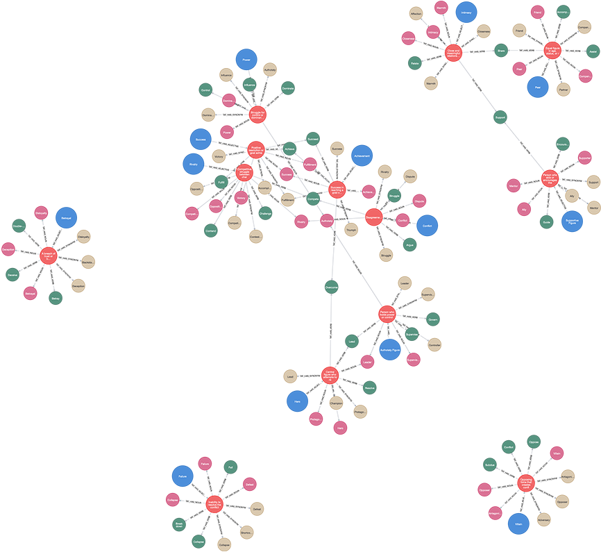

# (35) Thematic Apperception Test

**Abbreviation:** TAT
**Category:** Clinical and Psychological Health Models
**Model Number:** 35 of 44

---

### Description.
The **Thematic Apperception Test (TAT)**, developed by Henry A. Murray and Christiana D. Morgan in the 1930s [MorganMurray1935TATMethod, Murray1943TATManual], is a projective assessment designed to uncover underlying drives, emotions, and interpersonal dynamics through storytelling.
Participants are shown ambiguous images depicting social situations and asked to create narratives about what is happening, what led up to it, what the characters are thinking and feeling, and how the story ends [Tomkins1947TAT].
Interpretation frameworks include analyses of defense mechanisms [Cramer1991DevelopmentDefenseBook], object relations [Westen1991SocialCognitionObjRel], and social cognition [Westen1991ClinicalAssessmentTAT].

### Dimensions, Examples, and AI Mapping.
> AI maturity mappings (L1–L3) follow the foundation-agent cognitive hierarchy of Liu et al. (2025).

TAT analysis centers on the narrative's structure, characters, themes, conflicts, and outcomes, each corresponding to cognitive and motivational processes analogous to AI reasoning capabilities.

  - **Characters.**

    - **Hero / Protagonist:** The main actor driving the narrative (e.g., “A young woman deciding her future”).
    Maps to *Self-Representation & Agent Identification* (L2–L3 AI Maturity).
    - **Supporting Figures:** Authority or peer roles influencing the protagonist (e.g., “Her father offers advice, her friend challenges it”).
    Maps to *Social Role Understanding & Theory of Mind* (L2–L3).

  - **Themes.**

    - **Achievement:** Striving toward success or mastery (e.g., “He rebuilds his business after failure”).
    Maps to *Goal-Oriented Planning & Motivational Drive* (L2).
    - **Affiliation:** Desire for warmth and connection (e.g., “They support each other through hardship”).
    Maps to *Socio-Emotional Modeling* (L3).
    - **Power:** Control, dominance, or influence (e.g., “He asserts authority over the group”).
    Maps to *Hierarchy & Strategy Representation* (L2–L3).

  - **Conflicts.**

    - **Internal:** Approach–avoidance struggles (e.g., “She wants the new job but fears leaving home”).
    Maps to *Decision-Making Under Uncertainty* (L2).
    - **Interpersonal:** Rivalry or betrayal (e.g., “Two brothers compete for their father’s approval”).
    Maps to *Social Interaction & Conflict Simulation* (L2–L3).

  - **Outcomes.**

    - **Positive Resolution:** Achievement or reconciliation (e.g., “She succeeds and feels fulfilled”).
    Maps to *Causal Reasoning & Reward Prediction* (L2).
    - **Negative Resolution:** Failure or frustration (e.g., “He gives up after repeated setbacks”).
    Maps to *Resilience Modeling & Reinforcement Learning Adaptation* (L2–L3).

### Applications.

  - **Clinical Psychology:** Assesses personality structure, motivation, and defense mechanisms [Cramer1991DevelopmentDefenseBook, Westen1991SocialCognitionObjRel].
  - **Personality Research:** Studies development of identity and defensive change [Cramer1998FreshmanToSenior, Cramer2007LongitudinalDefense].
  - **AI Narrative Modeling:** Provides structured patterns for psychologically coherent story generation [Tomkins1947TAT].
  - **Character Simulation:** Enables AI agents or NPCs to exhibit consistent motivational depth.
  - **Computational Social Cognition:** Supports modeling of human mental-state inference and empathy [Westen1991AssessingComplexity].
  - **Automated Thematic Text Analysis:** NLP systems can extract story themes analogous to TAT interpretation dimensions.

### Timeline.

  - **1935:** Morgan & Murray introduce the TAT [MorganMurray1935TATMethod].
  - **1943:** Murray publishes the official *TAT Manual* [Murray1943TATManual].
  - **1947:** Tomkins formalizes systematic interpretation [Tomkins1947TAT].
  - **1970s–1990s:** Scoring systems expand (Cramer’s Defense Manual; Westen’s SCORS) [Cramer1991DevelopmentDefenseBook, Westen1991ClinicalAssessmentTAT].
  - **2000s–Present:** Ongoing psychometric refinements and narrative-based AI research [Cramer2007LongitudinalDefense].

### Psychometrics.

  - **Scoring Systems:** Cramer’s Defense Mechanism Manual and Westen’s SCORS.
  - **Reliability:** Good inter-rater reliability with training; test–retest stability varies by theme.
  - **Validity:** Supported for constructs such as object relations and motivation, though holistic validity remains debated.
  - **Subjectivity:** Balances interpretive richness with reliability through structured coding.
  - **Clinical Utility:** Valuable for hypothesis generation and therapeutic engagement [Barends1990AffectTone].

### Data Structure.
The conceptual `tat.csv` dataset mirrors the hierarchy:

  - `Category` ,  Major dimension (Characters, Themes, Conflicts, Outcomes).
  - `Factor` ,  Subcategory (e.g., Hero, Achievement).
  - `Adjective` ,  Descriptive phrase.
  - `Synonym, Verb, Noun` ,  Lexical extensions for embeddings and ontology linking.

### Resources.

  - **Connected Papers:** [TAT Graph](https://www.connectedpapers.com/main/2de3bf8444d45ad7723b9ec2a9c46b1bc9a00707/Thematic-Apperception-Test/graph).
  - **Dataset:** [`TAT_Dataset.csv`](https://github.com/Wildertrek/survey/blob/main/datasets/tat.csv).
  - **Embeddings:** [`tat_embeddings.csv`](https://github.com/Wildertrek/survey/blob/main/Embeddings/tat_embeddings.csv).

---

## Atlas Resources

| Resource | Location |
|----------|----------|
| Dataset | [`datasets/tat.csv`](../../../datasets/tat.csv) |
| Embeddings | [`Embeddings/tat_embeddings.csv`](../../../Embeddings/tat_embeddings.csv) |
| RF Model | [`models/tat_rf_model.pkl`](../../../models/tat_rf_model.pkl) |
| Label Encoder | [`models/tat_label_encoder.pkl`](../../../models/tat_label_encoder.pkl) |
| Graph (large) | [`graphs/tat_large.png`](../../../graphs/tat_large.png) |

---

## Validation Results

> From: Raetano, Gregor, & Tamang (2026). "A Survey and Computational Atlas of Personality Models." Under review, ACM TIST.

**Performance Tier:** Low (<50%)

### Classification Performance

| Metric | Value |
|--------|-------|
| Factors | 13 |
| Test Items | 169 |
| RF Accuracy | 33.7% |
| F1 Score (macro) | 0.2812 |
| Precision | 0.3202 |
| Recall | 0.3106 |

### Baseline Comparisons

| Baseline | Accuracy | Lift |
|----------|----------|------|
| Random | 7.7% | +26.0% |
| Frequency | 38.5% | -4.7% |

### LLM Judge Evaluation

Triple-judge panel: GPT-5.2, Gemini 3 Pro, Claude Opus 4.6.

| Metric | Value |
|--------|-------|
| RF-Judge Agreement | 50.0% |
| Expected-Factor Agreement | 100.0% |
| Item Validity Rate | 50.0% |
| Mean Confidence | 5.00 / 5.0 |
| Inter-Judge Agreement | 100.0% |

### Category Context

| Metric | Value |
|--------|-------|
| Category | Clinical |
| Category Mean Accuracy | 46.1% |
| Category Best | gad7 (67.7%) |
| Models in Category | 10 |

## References

The following references are cited in this model card:

- [Barends, A. et al. (1990). *Assessing Affect-Tone of Relationship Paradigms from TAT and Interview Data*](https://doi.org/10.1037/1040-3590.2.3.329)
- [Cramer, P. (1991). *The Development of Defense Mechanisms: Theory, Research, and Assessment*](https://doi.org/10.1007/978-1-4613-9025-1)
- [Cramer, P. (1998). *Freshman to Senior Year: A Follow-Up Study of Identity, Narcissism, and Defense Mechanisms*](https://doi.org/10.1006/jrpe.1997.2208)
- [Cramer, P. (2007). *Longitudinal Study of Defense Mechanisms: Late Childhood to Late Adolescence*](https://doi.org/10.1111/j.1467-6494.2006.00430.x)
- [Morgan, C. D. & Murray, H. A. (1935). *A Method for Investigating Fantasies: The Thematic Apperception Test*](https://doi.org/10.1001/archneurpsyc.1935.02250200049005)
- [Murray, H. A. (1943). *Thematic Apperception Test Manual*](https://psycnet.apa.org/doiLanding?doi=10.1037%2Ft02717-000)
- `Tomkins1947TAT`
- [Westen, D. et al. (1991). *Assessing Complexity of Representations of People and Understanding of Social Causality: A Comparison of Natural Science and Clinical Psychology Graduate Students*](https://doi.org/10.1521/jscp.1991.10.4.448)
- [Westen, D. (1991). *Clinical Assessment of Object Relations Using the TAT*](https://doi.org/10.1207/s15327752jpa5601_6)
- [Westen, D. (1991). *Social Cognition and Object Relations*](https://doi.org/10.1037/0033-2909.109.3.429)

See `references.bib` in the atlas root for full bibliographic entries.
