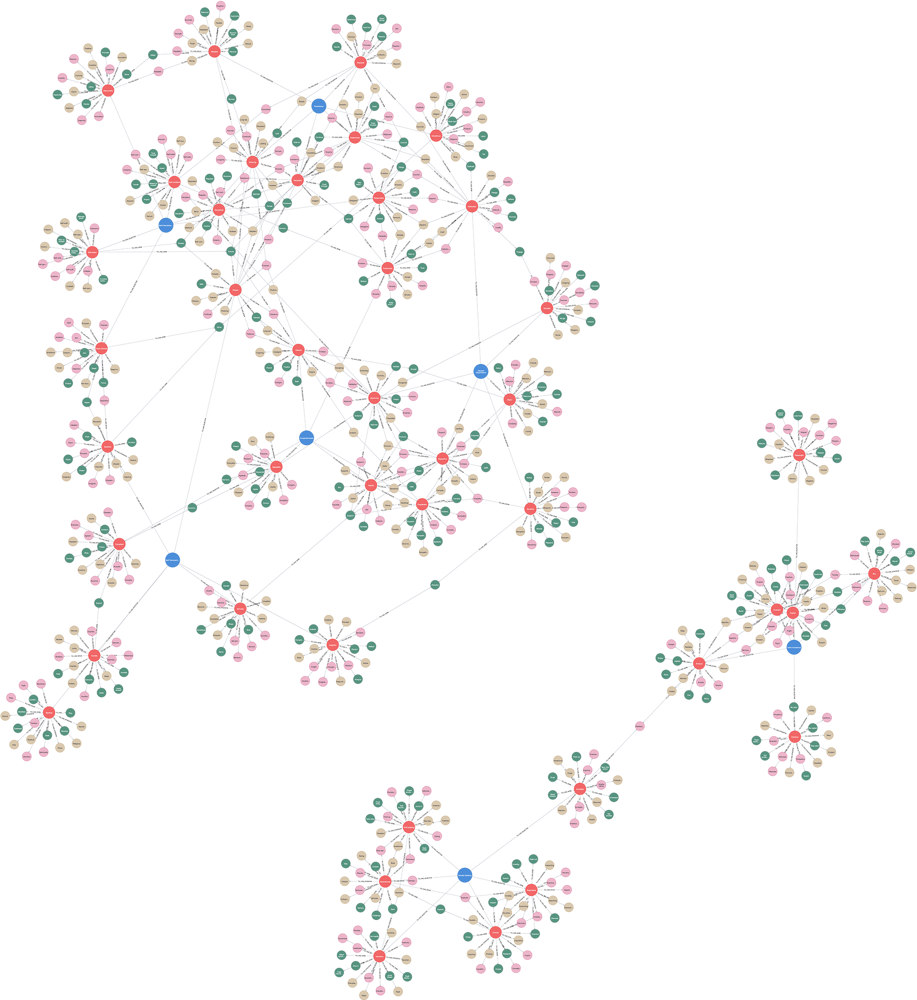

# (28) Temperament and Character Inventory

**Abbreviation:** TCI
**Category:** Clinical and Psychological Health Models
**Model Number:** 28 of 44

---

### Model Type.
Clinical; Psychobiological.

### Description.
The **Temperament and Character Inventory (TCI)** operationalizes C. Robert Cloninger’s Psychobiological Model of Temperament and Character, a biosocial theory integrating genetic, neurochemical, and experiential influences on personality.
Temperament dimensions are heritable, reflecting automatic emotional responses tied to specific neurotransmitter systems, while character dimensions evolve through learning, socialization, and self-concept integration.
The TCI expands Cloninger’s earlier *Tridimensional Personality Questionnaire (TPQ)* from three to seven dimensions: four temperament and three character factors [Cloninger1986, Cloninger1993, Cloninger1994TCIManual].

### Dimensions, Examples, and Functional Mapping.
> AI maturity mappings (L1–L3) follow the foundation-agent cognitive hierarchy of Liu et al. (2025).

  - **Temperament Dimensions:**

      - **Novelty Seeking (NS):** Exploratory excitability and impulsive reward pursuit; linked to dopamine.
        Example: Signing up spontaneously for a new activity.
        Maps to *Adaptive Exploration & Novelty Processing* (L2).
      - **Harm Avoidance (HA):** Cautiousness, anticipatory worry, and behavioral inhibition; linked to serotonin.
        Example: Avoiding risk due to fear of negative evaluation.
        Maps to *Risk Assessment & Threat Mitigation* (L3).
      - **Reward Dependence (RD):** Sensitivity to social reward and attachment; linked to norepinephrine.
        Example: Seeking affirmation or approval from peers.
        Maps to *Social Reinforcement Learning* (L2).
      - **Persistence (PS):** Perseverance despite frustration or fatigue.
        Example: Continuing work through setbacks or exhaustion.
        Maps to *Goal Maintenance & Effort Regulation* (L2).

  - **Character Dimensions:**

      - **Self-Directedness (SD):** Autonomy, purposefulness, and self-acceptance.
        Example: Setting and achieving personal goals independently.
        Maps to *Self-Regulation & Autonomous Goal Management* (L3).
      - **Cooperativeness (CO):** Empathy, social tolerance, and helpfulness.
        Example: Mentoring or assisting colleagues with understanding.
        Maps to *Social Calibration & Prosocial Behavior* (L3).
      - **Self-Transcendence (ST):** Spirituality, idealism, and identification with universal values.
        Example: Meditation, altruism, or finding meaning in art or nature.
        Maps to *Abstract Self-Modeling & Value Integration* (L3).

### Timeline.

  - **1986–1987:** Introduction of the Tridimensional Personality Questionnaire (TPQ) [Cloninger1986].
  - **1993:** Expansion to seven dimensions with the TCI [Cloninger1993].
  - **1994:** Publication of the TCI manual [Cloninger1994TCIManual].
  - **1999–Present:** Cross-cultural validations and the TCI-R revisions [Kijima2000TCIJapan, Gutierrez2001TCISpanish, Sung2002TCICorey, Brandstrom2008TCISweden].

### Applications.

  - **Clinical Assessment:** Profiling temperament and character patterns related to mood, anxiety, and personality disorders [Pomerleau1992, Bayon1996, Svrakic1993, Young1995TCIUnipolarBipolar].
  - **Behavioral Genetics and Neurobiology:** Correlating dopamine (NS), serotonin (HA), and norepinephrine (RD) pathways with genetic polymorphisms [Gillespie2003TCIGenetics].
  - **Personalized Psychotherapy:** Targeting self-directedness and cooperativeness to enhance treatment outcomes [DeFruyt2000, Celikel2009TCIDepressionTreatment].
  - **Well-being and Resilience:** Using ST and CO scales to assess spirituality, purpose, and flourishing [Cloninger2004, Cloninger2006Wellbeing, Jylha2006TCIGeneralPopulation].
  - **Digital Phenotyping & AI-Driven Mental Health:** Employing TCI-derived behavioral traits to adapt empathic chatbot or digital therapy responses [Mouchabac2022, Fraser2023].

### Psychometrics.

  - **Format:** TCI-R – 240 items (5-point Likert); short forms (TCI-R-S, 140 items).
  - **Reliability:** α coefficients typically 0.65–0.85; stable test-retest reliability [Hansenne2005TCIRBelgian].
  - **Validity:** Robust seven-factor structure, with strong convergent validity vs.\ Big Five and clinical outcomes [Cloninger2006Wellbeing].
  - **Method:** Self-report; informant and youth versions available.

### Data Structure.
Each row in `tci.csv` represents a lexical feature for one of seven TCI dimensions, with fields:
`Factor`, `Adjective`, `Synonym`, `Verb`, `Noun`.

### Resources.

  - **Connected Papers:** [Cloninger et al. (1993) Graph](https://www.connectedpapers.com/main/3bcf1c4ec20101890c252d30548cd77dbe260b87/Temperament-and-Character-Inventory/graph).
  - **Dataset:** [`TCI_Dataset.csv`](https://github.com/Wildertrek/survey/blob/main/datasets/tci.csv).
  - **Embeddings:** [`tci_embeddings.csv`](https://github.com/Wildertrek/survey/blob/main/Embeddings/tci_embeddings.csv).

---

## Atlas Resources

| Resource | Location |
|----------|----------|
| Dataset | [`datasets/tci.csv`](../../../datasets/tci.csv) |
| Embeddings | [`Embeddings/tci_embeddings.csv`](../../../Embeddings/tci_embeddings.csv) |
| RF Model | [`models/tci_rf_model.pkl`](../../../models/tci_rf_model.pkl) |
| Label Encoder | [`models/tci_label_encoder.pkl`](../../../models/tci_label_encoder.pkl) |
| Graph (large) | [`graphs/tci_large.png`](../../../graphs/tci_large.png) |

---

## Validation Results

> From: Raetano, Gregor, & Tamang (2026). "A Survey and Computational Atlas of Personality Models." Under review, ACM TIST.

**Performance Tier:** Moderate (50-70%)

### Classification Performance

| Metric | Value |
|--------|-------|
| Factors | 7 |
| Test Items | 98 |
| RF Accuracy | 55.1% |
| F1 Score (macro) | 0.5232 |
| Precision | 0.5804 |
| Recall | 0.5561 |

### Baseline Comparisons

| Baseline | Accuracy | Lift |
|----------|----------|------|
| Random | 14.3% | +40.8% |
| Frequency | 14.3% | +40.8% |

### LLM Judge Evaluation

Triple-judge panel: GPT-5.2, Gemini 3 Pro, Claude Opus 4.6.

| Metric | Value |
|--------|-------|
| RF-Judge Agreement | 40.0% |
| Expected-Factor Agreement | 100.0% |
| Item Validity Rate | 45.0% |
| Mean Confidence | 4.80 / 5.0 |
| Inter-Judge Agreement | 100.0% |

### Category Context

| Metric | Value |
|--------|-------|
| Category | Clinical |
| Category Mean Accuracy | 46.1% |
| Category Best | gad7 (67.7%) |
| Models in Category | 10 |

## References

The following references are cited in this model card:

- [Bayon, C. et al. (1996). *Dimensional assessment of personality in an out-patient sample: Relations of the systems of Millon and Cloninger*](https://doi.org/10.1016/0022-3956(96)00024-6)
- [Brändström, S. et al. (2008). *The Swedish version of the Temperament and Character Inventory (TCI): A cross-validation with other personality questionnaires and a national normative sample*](https://doi.org/10.1027/1015-5759.24.1.14)
- [Celikel, F. C. et al. (2009). *Cloninger's temperament and character dimensions of personality in patients with major depressive disorder*](https://doi.org/10.1016/j.comppsych.2008.11.012)
- `Cloninger1986`
- [Cloninger, C. R. et al. (1993). *A psychobiological model of temperament and character*](https://doi.org/10.1001/archpsyc.1993.01820240059008)
- `Cloninger1994TCIManual`
- `Cloninger2004`
- `Cloninger2006Wellbeing`
- [De Fruyt, F. et al. (2000). *Cloninger’s Psychobiological Model of Temperament and Character and the Five-Factor Model of Personality*](https://doi.org/10.1016/S0191-8869(99)00204-4)
- [Fraser, H. & Specht, M. (2023). *Adaptive chatbots for mental health: Integrating personality models*](https://doi.org/10.2196/46523)
- [Gillespie, N. A. et al. (2003). *The genetic and environmental relationship between Cloninger's dimensions of temperament and character*](https://doi.org/10.1016/S0191-8869(03)00042-4)
- [Gutiérrez, F. et al. (2001). *Psychometric properties of the Temperament and Character Inventory (TCI) questionnaire in a Spanish psychiatric population*](https://doi.org/10.1034/j.1600-0447.2001.00183.x)
- [Hansenne, M. et al. (2005). *Psychometric properties of the Temperament and Character Inventory–Revised (TCI–R) in a Belgian sample*](https://doi.org/10.1207/s15327752jpa8501_04)
- [Jylhä, P. & Isometsä, E. (2006). *Temperament, character and symptoms of anxiety and depression in the general population*](https://doi.org/10.1016/j.eurpsy.2005.09.003)
- [Kijima, N. et al. (2000). *Reliability and validity of the Japanese version of the Temperament and Character Inventory*](https://doi.org/10.2466/pr0.2000.86.3.1050)
- [Mouchabac, S. et al. (2022). *Improving clinical decision-making in psychiatry: implementation of digital phenotyping could mitigate the influence of patient's and practitioner's individual cognitive biases*](https://doi.org/10.1080/19585969.2022.2042165)
- [Pomerleau, C. S. et al. (1992). *Relationship of Tridimensional Personality Questionnaire scores and smoking variables in female and male smokers*](https://doi.org/10.1016/0899-3289(92)90014-O)
- [Sung, S. et al. (2002). *Reliability and validity of the Korean version of the Temperament and Character Inventory*](https://doi.org/10.1053/comp.2002.30794)
- [Svrakic, D. M. et al. (1993). *Differential diagnosis of personality disorders by the seven‑factor model of temperament and character*](https://doi.org/10.1001/archpsyc.1993.01820240075009)
- [Young, L. T. et al. (1995). *A comparison of Tridimensional Personality Questionnaire dimensions in bipolar disorder and unipolar depression*](https://doi.org/10.1016/0165-1781(95)02684-o)

See `references.bib` in the atlas root for full bibliographic entries.
