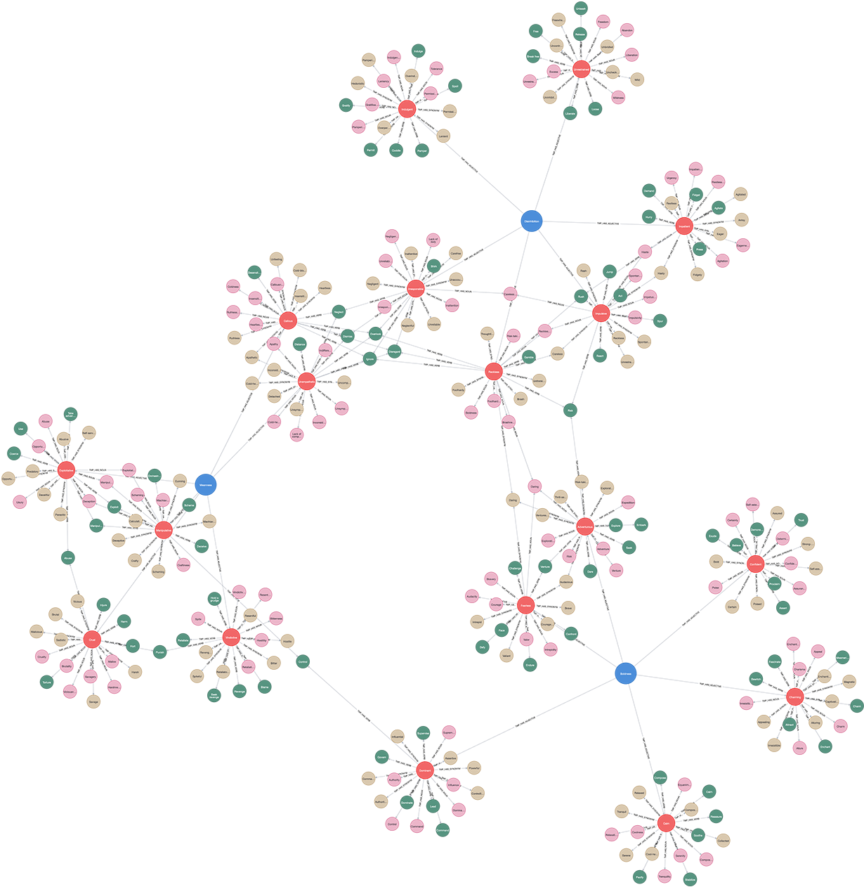

# (29) Triarchic Model of Psychopathy

**Abbreviation:** TMP
**Category:** Clinical and Psychological Health Models
**Model Number:** 29 of 44

---

### Description.
The **Triarchic Model of Psychopathy (TMP)** conceptualizes psychopathy through three phenotypic constructs, *Boldness*, *Meanness*, and *Disinhibition*, proposed by Christopher J. Patrick and colleagues [Patrick2009Triarchic].
The model unifies classical clinical observations with modern personality and neurobiological findings, emphasizing psychopathy’s heterogeneity rather than a single-factor syndrome [PatrickDrislane2015Triarchic].
Its operational measure, the **Triarchic Psychopathy Measure (TriPM)** [Patrick2010Operationalizing], captures individual differences across these three domains.

### Core Dimensions and AI Functional Mapping.
> AI maturity mappings (L1–L3) follow the foundation-agent cognitive hierarchy of Liu et al. (2025).

  - **Boldness:**
  Fearlessness, stress immunity, social assertiveness, and tolerance for novelty and risk [Lilienfeld2016IsBoldness].
  Example: A leader remaining calm and decisive during high-stakes decision-making.
  Maps to *Threat Insensitivity & Stress Resilience* (L3) ,  e.g., an AI maintaining composure and optimal performance under uncertainty or crisis.
  - **Disinhibition:**
  Impulsivity, irresponsibility, and poor behavioral restraint.
  Example: Choosing immediate small rewards over long-term strategic gain.
  Maps to *Deficient Inhibitory Control & Myopic Planning* (L2–L3) ,  e.g., an AI agent repeatedly selecting short-term actions that undermine its global objectives.
  - **Meanness:**
  Callousness, exploitativeness, and lack of empathy or social attachment.
  Example: Persistently deceiving other agents for personal gain.
  Maps to *Antisocial Policy Simulation & Empathy Deficit Modeling* (L3) ,  e.g., an AI agent ignoring cooperative norms or others’ welfare to maximize self-utility.

### Applications.

  - **Clinical Assessment:** Provides a multidimensional trait profile distinguishing diverse psychopathic expressions [Skeem2011Psychopathic].
  - **Forensic Psychology:** Enhances offender risk assessment and classification across behavioral profiles [Venables2014Differentiating].
  - **Etiological Research:** Links psychopathy dimensions to neurobiological and genetic markers [PatrickBernat2009Neurobiology].
  - **Treatment Implications:** Guides interventions targeting disinhibition (impulse control) or meanness (empathy training) [PatrickDrislaneStrickland2012Conceptualizing].
  - **Cyberpsychology & Security:** Personality traits such as low conscientiousness and high sensation-seeking correlate with risky cyber behaviors [Kennison2020].
  - **AI Behavior Detection:** Informs modeling and detection of manipulative or exploitative strategies in autonomous systems.

### Timeline.

  - **2009:** Patrick, Fowles, and Krueger introduce the TMP framework [Patrick2009Triarchic].
  - **2010:** Triarchic Psychopathy Measure (TriPM) introduced [Patrick2010Operationalizing].
  - **2010s:** Validation across community and offender populations [Drislane2014Clarifying, Stanley2013Elaborating, Sellbom2013Examination].
  - **2015:** Comprehensive theoretical review consolidates TMP as a major psychopathy model [PatrickDrislane2015Triarchic].
  - **Present:** Ongoing neurobiological, developmental, and cross-cultural research [Sellbom2016Development].

### Psychometrics.

  - **Instrument:** Triarchic Psychopathy Measure (TriPM) [Patrick2010Operationalizing].
  - **Format:** 58 self-report items rated on 4–5 point Likert scales.
  - **Reliability:** Internal consistency typically  = 0.70–0.85; acceptable test–retest reliability [Stanley2013Elaborating, Drislane2014Clarifying].
  - **Validity:** Strong factorial and criterion validity; correlates with PCL-R, PPI, Big Five, and HEXACO dimensions [Sellbom2013Examination, PatrickDrislane2015Triarchic].
  - **Method:** Self-report, with emerging informant and structured-interview variants.

### Data Structure.
The `tmp.csv` dataset encodes lexical descriptors for each dimension:

  - `Factor` – Boldness, Meanness, or Disinhibition.
  - `Adjective` – Subfacet label (e.g., `Fearless`, `Impulsive`).
  - `Synonym` – Semantic equivalents (e.g., `Brave`).
  - `Verb` – Behavioral form (e.g., `Challenge`).
  - `Noun` – Nominal abstraction (e.g., `Bravery`).

### Resources.

  - **Connected Papers:** [Patrick et al. (2009)](https://www.connectedpapers.com/main/1ccf4f31b2916366b05a6aa7dd97508a93faabf1/triarchic-conceptualization-of-psychopathy-developmental-origins-of-disinhibition-boldness-and-meanness/graph).
  - **Dataset:** [`TMP_Dataset.csv`](https://github.com/Wildertrek/survey/blob/main/datasets/tmp.csv).
  - **Embeddings:** [`tmp_embeddings.csv`](https://github.com/Wildertrek/survey/blob/main/Embeddings/tmp_embeddings.csv).

---

## Atlas Resources

| Resource | Location |
|----------|----------|
| Dataset | [`datasets/tmp.csv`](../../../datasets/tmp.csv) |
| Embeddings | [`Embeddings/tmp_embeddings.csv`](../../../Embeddings/tmp_embeddings.csv) |
| RF Model | [`models/tmp_rf_model.pkl`](../../../models/tmp_rf_model.pkl) |
| Label Encoder | [`models/tmp_label_encoder.pkl`](../../../models/tmp_label_encoder.pkl) |
| Graph (large) | [`graphs/tmp_large.png`](../../../graphs/tmp_large.png) |

---

## Validation Results

> From: Raetano, Gregor, & Tamang (2026). "A Survey and Computational Atlas of Personality Models." Under review, ACM TIST.

**Performance Tier:** Moderate (50-70%)

### Classification Performance

| Metric | Value |
|--------|-------|
| Factors | 3 |
| Test Items | 38 |
| RF Accuracy | 57.9% |
| F1 Score (macro) | 0.5658 |
| Precision | 0.7593 |
| Recall | 0.5897 |

### Baseline Comparisons

| Baseline | Accuracy | Lift |
|----------|----------|------|
| Random | 33.3% | +24.6% |
| Frequency | 33.3% | +24.6% |

### LLM Judge Evaluation

Triple-judge panel: GPT-5.2, Gemini 3 Pro, Claude Opus 4.6.

| Metric | Value |
|--------|-------|
| RF-Judge Agreement | 50.0% |
| Expected-Factor Agreement | 90.0% |
| Item Validity Rate | 70.0% |
| Mean Confidence | 4.55 / 5.0 |
| Inter-Judge Agreement | 80.0% |

### Category Context

| Metric | Value |
|--------|-------|
| Category | Clinical |
| Category Mean Accuracy | 46.1% |
| Category Best | gad7 (67.7%) |
| Models in Category | 10 |

## References

The following references are cited in this model card:

- [Drislane, L. E. et al. (2014). *Clarifying the content coverage of differing psychopathy inventories through reference to the Triarchic Psychopathy Measure*](https://www.semanticscholar.org/paper/235a311437f02a3bace022983ca35cb8dfac7ab7)
- [Kennison, S. M. & Chan-Tin, E. (2020). *Taking Risks With Cybersecurity: Using Knowledge and Personal Characteristics to Predict Self‑Reported Cybersecurity Behaviors*](https://doi.org/10.3389/fpsyg.2020.546546)
- [Lilienfeld, S. O. et al. (2016). *Is boldness relevant to psychopathic personality? Meta-analytic relations with non-Psychopathy Checklist-based measures of psychopathy*](https://www.semanticscholar.org/paper/aef56dd61cbf07416a76536c3e4fb7aac6de9740)
- [Patrick, C. J. et al. (2009). *Triarchic conceptualization of psychopathy: Developmental origins of disinhibition, boldness, and meanness*](https://www.semanticscholar.org/paper/1ccf4f31b2916366b05a6aa7dd97508a93faabf1)
- [Patrick, C. J. (2010). *Operationalizing the Triarchic Conceptualization of Psychopathy: Preliminary Description of Brief Scales for Assessment of Boldness, Meanness, and Disinhibition*](https://www.semanticscholar.org/paper/Operationalizing-the-Triarchic-Conceptualization-Patrick/6fbc6d92e87c82d79e6620a22fcea0bd8fde588a)
- [Patrick, C. J. & Bernat, E. M. (2009). *Neurobiology of Psychopathy: A Two-Process Theory*](https://doi.org/10.1002/9780470478509.NEUBB002057)
- [Patrick, C. J. & Drislane, L. E. (2015). *Triarchic Model of Psychopathy: Origins, Operationalizations, and Observed Linkages with Personality and General Psychopathology*](https://www.semanticscholar.org/paper/82299fa057328bc3402b1bfb2ae188136d36178b)
- [Patrick, C. J. et al. (2012). *Conceptualizing Psychopathy in Triarchic Terms: Implications for Treatment*](https://www.semanticscholar.org/paper/98cdc2b7d71904235b832480a42eab6a8b7a905e)
- [Sellbom, M. & Phillips, T. R. (2013). *An examination of the triarchic conceptualization of psychopathy in incarcerated and nonincarcerated samples*](https://www.semanticscholar.org/paper/880266ff96efa587321c1d4ffb688a8d65c31431)
- [Sellbom, M. et al. (2016). *Development and Validation of MMPI-2-RF Scales for Indexing Triarchic Psychopathy Constructs*](https://www.semanticscholar.org/paper/0b3e137d5c2fd682500b21ceeef3cb0235128483)
- [Skeem, J. L. et al. (2011). *Psychopathic Personality: Bridging the Gap Between Scientific Evidence and Public Policy*](https://www.semanticscholar.org/paper/43365b857d3243621d3d8becc3e2a4d47553142c)
- [Stanley, J. H. et al. (2013). *Elaborating on the Construct Validity of the Triarchic Psychopathy Measure in a Criminal Offender Sample*](https://www.semanticscholar.org/paper/779c13971d9ef8a746c6815ff4afa053b4f85ae1)
- [Venables, N. C. et al. (2014). *Differentiating psychopathy from antisocial personality disorder: a triarchic model perspective*](https://www.semanticscholar.org/paper/e1ce1cc576d3638a404dd531241afaa9c4eadfa8)

See `references.bib` in the atlas root for full bibliographic entries.
