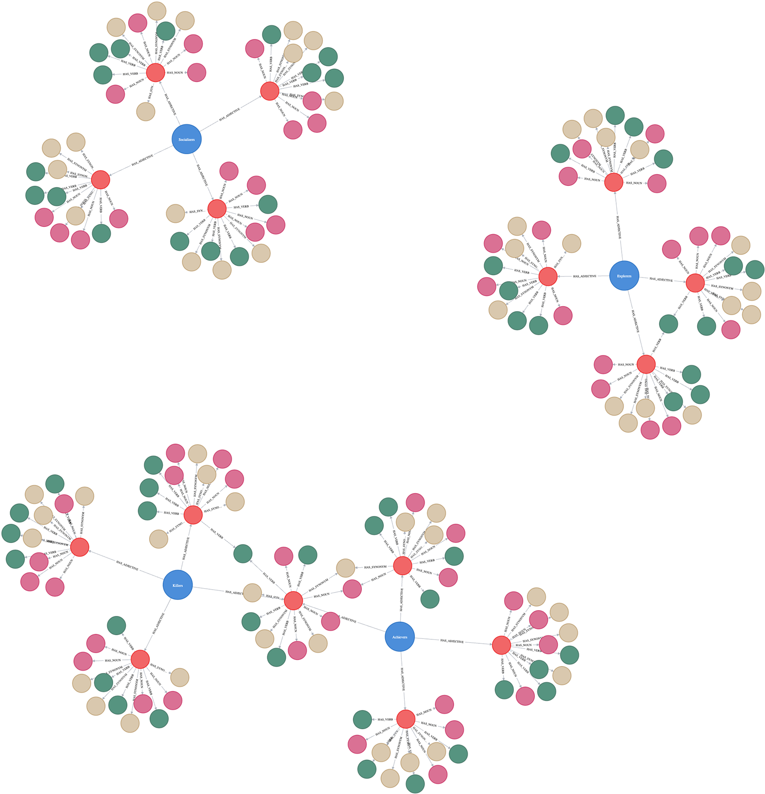

# (40) Bartle Types

**Abbreviation:** BT
**Category:** Application-Specific and Holistic Models
**Model Number:** 40 of 44

---

### Description.
Proposed by Richard Bartle in 1996, the **Bartle Types** model classifies multiplayer game participants into four motivational archetypes, **Achievers**, **Explorers**, **Socializers**, and **Killers**, based on behavioral preferences and interaction patterns within virtual environments [Bartle1996Hearts].
It remains one of the most influential frameworks for understanding engagement mechanics, player motivation, and social dynamics in massively multiplayer online (MMO) and gamified systems [Bartle2003DVW, Yee2006Motivations].

### Dimensions and Brain–Function Mapping.
> AI maturity mappings (L1–L3) follow the foundation-agent cognitive hierarchy of Liu et al. (2025).

Each player type reflects a dominant motivational drive that aligns with specific cognitive and affective processes.

  - **Achievers:** Goal-oriented accumulation and progression.
    *Maps to* Reward Mechanisms & Skill Acquisition (L2).

      - **Example (L2):** Deep Q-Networks maximizing score-based reward signals in Atari benchmarks.

  - **Explorers:** Analytical discovery and curiosity-driven exploration.
    *Maps to* Planning & Semantic World Modeling (L2).

      - **Example (L2):** AlphaZero’s Monte Carlo Tree Search uncovering novel Go strategies through autonomous exploration.

  - **Socializers:** Cooperative interaction and relationship building.
    *Maps to* Social Cognition & Theory-of-Mind Simulation (L3).

      - **Example (L3):** Generative agents exhibiting affective alignment and mutual intention modeling in multi-agent dialogues [Park2021Sustainability].

  - **Killers:** Competitive dominance and adversarial interaction.
    *Maps to* Competitive Strategy Modeling & Game-Theoretic Reasoning (L2).

      - **Example (L2):** Multi-agent reinforcement learning systems optimizing adversarial tactics in StarCraft or Dota-2 environments.

### Applications.

  - **Game Design:** Tailor mechanics, progression systems, and social features to balance motivational profiles.
  - **Community Management:** Encourage inclusive online ecosystems by balancing social and competitive incentives.
  - **Player Retention:** Personalize in-game challenges and feedback loops based on engagement archetype.
  - **Market Research:** Segment user populations by motivational preference and behavioral telemetry.
  - **AI Persona Modeling:** Enable adaptive NPC and agent personalities aligned with Bartle archetypes for human–AI co-play.

### Timeline.

  - **1996:** Bartle publishes “Hearts, Clubs, Diamonds, Spades,” introducing the four primary player types [Bartle1996Hearts].
  - **2003:** Expanded discussion in *Designing Virtual Worlds* connects player types to motivational design [Bartle2003DVW].
  - **2010s:** Empirical validation across MMOs and digital platforms, with refinements to subtypes and hybrids [Yee2006Motivations].
  - **2021:** Park et al.\ link Bartle types to learning motivation and sustainable engagement patterns [Park2021Sustainability].

### Psychometrics.

  - **Validity:** Supported by correlations between player self-reports and in-game behavioral data [Yee2006Motivations].
  - **Factor Structure:** Confirmatory factor analyses replicate the four-type model, sometimes revealing subfactors (e.g., cooperative vs.\ aggressive Killers) [Johnson2015].
  - **Reliability:** Bartle Type Indicator scales exhibit internal consistency >0.80 [Park2021Sustainability].
  - **Cross-Cultural Stability:** Factor loadings remain consistent across regional gaming communities.
  - **Use Cases:** Applied in gamification research, adaptive content recommendation, and AI agent persona training.

### Data Structure.
Dataset `bartle.csv` captures lexical, semantic, and embedding representations for each player type:

  - `Factor`: Player archetype (Achiever, Explorer, Socializer, Killer).
  - `Adjective`: Core motivational descriptor.
  - `Synonym, Verb, Noun`: Lexical attributes per trait.
  - `Embedding`: Numeric vector representation for similarity modeling.

Flattened schema: `Factor, Adjective, Synonym, Verb, Noun, Embedding`.

### Resources.

  - **Original Work:** Bartle (1996) “Hearts, Clubs, Diamonds, Spades” [Bartle1996Hearts].
  - **Expanded Theory:** Bartle (2003) *Designing Virtual Worlds* [Bartle2003DVW].
  - **Empirical Studies:** Yee (2006); Johnson et al.\ (2015); Park et al.\ (2021) [Yee2006Motivations, Johnson2015, Park2021Sustainability].
  - **Interactive Literature Map:** [Connected Papers graph for BT](https://www.connectedpapers.com/main/28206a4dc43950c0a3e8ef3e4e2668d66f7d6c01/Differences-in-Learning-Motivation-among-Bartle%E2%80%99s-Player-Types-and-Measures-for-the-Delivery-of-Sustainable-Gameful-Experiences/graph).
  - **Dataset:** [`bt_Dataset.csv`](https://github.com/Wildertrek/survey/blob/main/datasets/bt.csv).
  - **Embeddings:** [`bt_embeddings.csv`](https://github.com/Wildertrek/survey/blob/main/Embeddings/bt_embeddings.csv).

---

## Atlas Resources

| Resource | Location |
|----------|----------|
| Dataset | [`datasets/bt.csv`](../../../datasets/bt.csv) |
| Embeddings | [`Embeddings/bt_embeddings.csv`](../../../Embeddings/bt_embeddings.csv) |
| RF Model | [`models/bt_rf_model.pkl`](../../../models/bt_rf_model.pkl) |
| Label Encoder | [`models/bt_label_encoder.pkl`](../../../models/bt_label_encoder.pkl) |
| Graph (large) | [`graphs/bt_large.png`](../../../graphs/bt_large.png) |

---

## Validation Results

> From: Raetano, Gregor, & Tamang (2026). "A Survey and Computational Atlas of Personality Models." Under review, ACM TIST.

**Performance Tier:** High (>70%)

### Classification Performance

| Metric | Value |
|--------|-------|
| Factors | 4 |
| Test Items | 54 |
| RF Accuracy | 90.7% |
| F1 Score (macro) | 0.9053 |
| Precision | 0.9162 |
| Recall | 0.9052 |

### Baseline Comparisons

| Baseline | Accuracy | Lift |
|----------|----------|------|
| Random | 25.0% | +65.7% |
| Frequency | 25.0% | +65.7% |

### LLM Judge Evaluation

Triple-judge panel: GPT-5.2, Gemini 3 Pro, Claude Opus 4.6.

| Metric | Value |
|--------|-------|
| RF-Judge Agreement | 100.0% |
| Expected-Factor Agreement | 100.0% |
| Item Validity Rate | 100.0% |
| Mean Confidence | 4.97 / 5.0 |
| Inter-Judge Agreement | 100.0% |

### Category Context

| Metric | Value |
|--------|-------|
| Category | App/Holistic |
| Category Mean Accuracy | 50.9% |
| Category Best | bt (90.7%) |
| Models in Category | 6 |

## References

The following references are cited in this model card:

- `Bartle1996Hearts`
- `Bartle2003DVW`
- `Johnson2015`
- [Park, S. et al. (2021). *Differences in Learning Motivation among Bartle's Player Types*](https://doi.org/10.3390/su13126677)
- `Yee2006Motivations`

See `references.bib` in the atlas root for full bibliographic entries.
