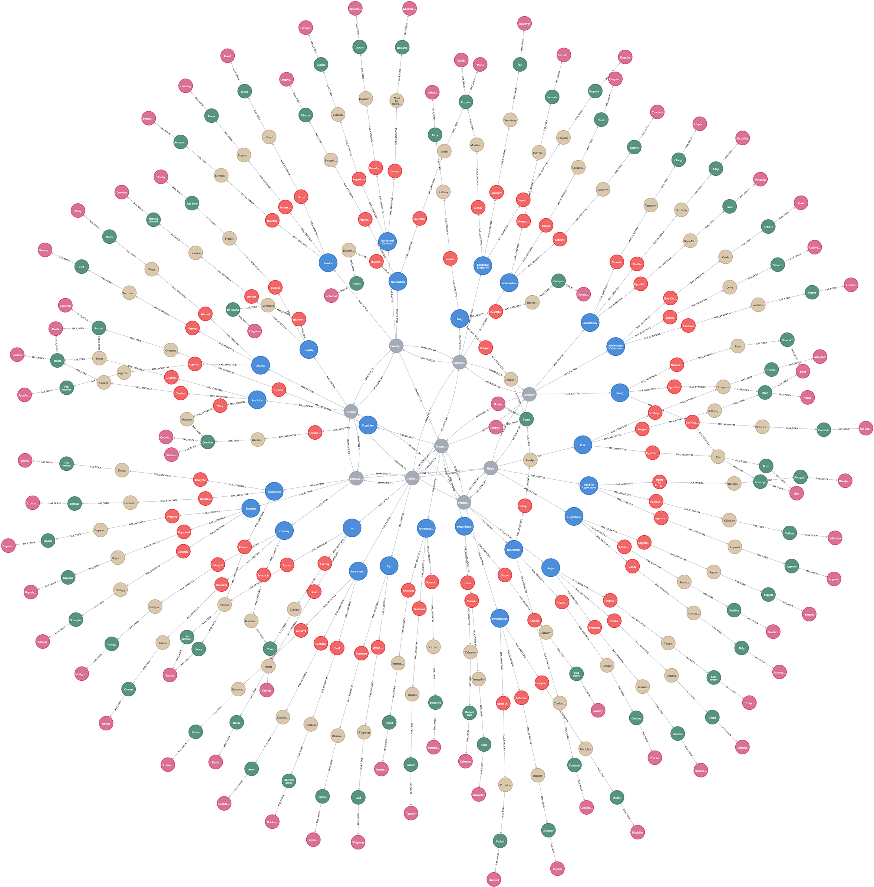

# (42) Enneagram Model

**Abbreviation:** EM
**Category:** Application-Specific and Holistic Models
**Model Number:** 42 of 44

---

### Description.
The **Enneagram Model (EM)** classifies personality into nine interrelated types, each defined by core motivations, fears, and coping strategies [nott1984, sayreadams2003].
It represents a dynamic system in which individuals move along pathways of growth and stress (integration and disintegration), emphasizing transformation rather than fixed typology.
Modern interpretations blend EM’s spiritual–psychological origins with contemporary trait, motivational, and affective science perspectives [hook2020].

### Dimensions and Core Motivations.

  - **Type 1 – Perfectionist:** Integrity, order, and moral purpose (Perfectionism, Resentment, Anger).
  - **Type 2 – Helper:** Love, service, and belonging (Helpfulness, Need for Appreciation, Pride).
  - **Type 3 – Achiever:** Success, performance, and recognition (Achievement, Adaptability, Vanity).
  - **Type 4 – Individualist:** Authenticity and depth (Emotional Sensitivity, Individualism, Envy).
  - **Type 5 – Investigator:** Knowledge, analysis, and detachment (Curiosity, Observation, Avarice).
  - **Type 6 – Loyalist:** Security and preparedness (Loyalty, Anxiety, Suspicion).
  - **Type 7 – Enthusiast:** Freedom, optimism, and experience (Enthusiasm, Planning, Gluttony).
  - **Type 8 – Challenger:** Control, justice, and protection (Assertiveness, Ego, Lust).
  - **Type 9 – Peacemaker:** Harmony, stability, and acceptance (Perseverance, Peacefulness, Inertia).

### Adjacencies and Dynamics.
Each type connects to three neighboring types, forming *integration* (growth) and *disintegration* (stress) pathways that describe adaptive transitions under different psychological conditions [kamfluit2021].
These dynamic relationships make the EM uniquely suitable for modeling nonlinear personality change and adaptive feedback processes.

### Illustrative Mappings to AI Behavior.

  - **Perfectionism (Type 1):**
    *Human:* “I refine my document until every detail meets the standard.”
    *AI Analogue:* A writing agent performing recursive revision until outputs meet compliance thresholds (planning & working memory; L2).

  - **Helpfulness (Type 2):**
    *Human:* “I reorganize shared drives to help my team.”
    *AI Analogue:* A proactive assistant recommending relevant files or automating workload redistribution (empathy & social cognition; L3).

  - **Adaptability (Type 3):**
    *Human:* “I pivot quickly when project priorities change.”
    *AI Analogue:* A conversational system adjusting dialogue strategy in real time (cognitive flexibility; L3).

  - **Observation (Type 5):**
    *Human:* “I notice patterns others overlook.”
    *AI Analogue:* A vision model performing anomaly detection in sensor data streams (feature extraction; L1).

  - **Assertiveness (Type 8):**
    *Human:* “I take charge during uncertainty.”
    *AI Analogue:* A decision agent recommending high-confidence actions under risk (strategic reasoning; L2).

### Applications.

  - **Therapeutic Integration:** Psychospiritual tool for counseling, self-development, and conflict mediation [sayreadams2003].
  - **Narrative Therapy:** Framework for ego-development through narrative identity reconstruction [kamfluit2021].
  - **Cognitive Modeling:** Use of EM’s DAS2 (Dynamic Adaptive Systems of Self) structure in AI agent personality architectures [schwarzzarrabi2017].
  - **Research Synthesis:** Comprehensive review of empirical evidence and theoretical extensions [hook2020].

### Timeline.

  - **Early 20th Century:** Gurdjieff introduces the Enneagram symbol for spiritual transformation [nott1984].
  - **2003:** Formal psychological framing of the EM [sayreadams2003].
  - **2017:** Cognitive DAS2 interpretation proposed [schwarzzarrabi2017].
  - **2020:** Systematic literature review consolidates psychometric evidence [hook2020].
  - **2021:** Integration of EM into narrative therapeutic practice [kamfluit2021].

### Psychometrics.
Emerging studies report moderate-to-high internal consistency across Enneagram dimensions (Cronbach’s α  0.70–0.85) with ongoing efforts toward confirmatory factor analysis and cross-cultural validation [hook2020].

### Data Structure.
Dataset `em.csv` encodes lexical, semantic, and relational data for each type:
`Type, Name, Factor, Adjective, Synonym, Verb, Noun, Adjacencies`.
Embeddings capture cross-type similarity and adjacency vectors to support graph-based trait modeling.

### Resources.

  - **Interactive Literature Map:** [Connected Papers graph for Enneagram](https://www.connectedpapers.com/main/5aeb7b8ffdc0f8bccff15f7c301d3197e91365e6/Ontology%20Based-Enneagram-Personality-Prediction-System/graph).
  - **Dataset:** [`em_Dataset.csv`](https://github.com/Wildertrek/survey/blob/main/datasets/em.csv).
  - **Embeddings:** [`em_embeddings.csv`](https://github.com/Wildertrek/survey/blob/main/Embeddings/em_embeddings.csv).

---

## Atlas Resources

| Resource | Location |
|----------|----------|
| Dataset | [`datasets/em.csv`](../../../datasets/em.csv) |
| Embeddings | [`Embeddings/em_embeddings.csv`](../../../Embeddings/em_embeddings.csv) |
| RF Model | [`models/em_rf_model.pkl`](../../../models/em_rf_model.pkl) |
| Label Encoder | [`models/em_label_encoder.pkl`](../../../models/em_label_encoder.pkl) |
| Graph (large) | [`graphs/em_large.png`](../../../graphs/em_large.png) |

---

## Validation Results

> From: Raetano, Gregor, & Tamang (2026). "A Survey and Computational Atlas of Personality Models." Under review, ACM TIST.

**Performance Tier:** Low (<50%)

### Classification Performance

| Metric | Value |
|--------|-------|
| Factors | 27 |
| Test Items | 379 |
| RF Accuracy | 15.8% |
| F1 Score (macro) | 0.1153 |
| Precision | 0.1832 |
| Recall | 0.1596 |

### Baseline Comparisons

| Baseline | Accuracy | Lift |
|----------|----------|------|
| Random | 3.7% | +12.1% |
| Frequency | 11.1% | +4.7% |

### LLM Judge Evaluation

Triple-judge panel: GPT-5.2, Gemini 3 Pro, Claude Opus 4.6.

| Metric | Value |
|--------|-------|
| RF-Judge Agreement | 75.9% |
| Expected-Factor Agreement | 96.7% |
| Item Validity Rate | 79.3% |
| Mean Confidence | 4.93 / 5.0 |
| Inter-Judge Agreement | 96.7% |

### Category Context

| Metric | Value |
|--------|-------|
| Category | App/Holistic |
| Category Mean Accuracy | 50.9% |
| Category Best | bt (90.7%) |
| Models in Category | 6 |

## References

The following references are cited in this model card:

- `hook2020`
- `kamfluit2021`
- `nott1984`
- `sayreadams2003`
- `schwarzzarrabi2017`

See `references.bib` in the atlas root for full bibliographic entries.
