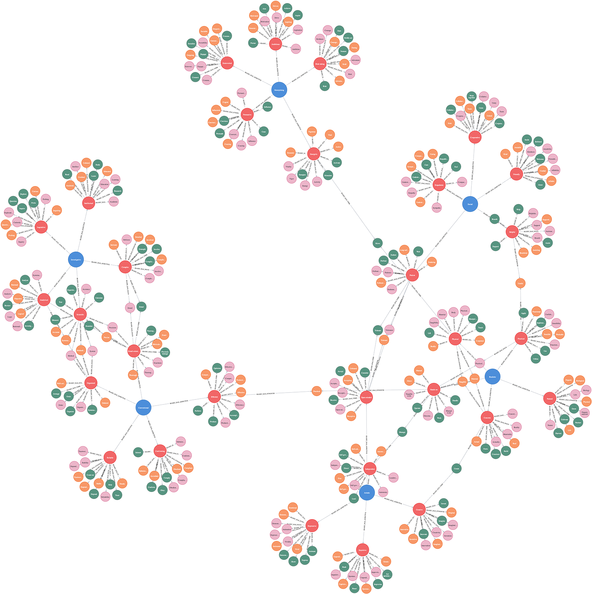

# (39) Holland's Theory of Career Choice

**Abbreviation:** RIASEC
**Category:** Application-Specific and Holistic Models
**Model Number:** 39 of 44

---

### Description.
John L. Holland’s **RIASEC model**, also known as the Holland Codes or *Holland Occupational Themes*, categorizes vocational interests into six recurring personality–environment patterns:
**Realistic, Investigative, Artistic, Social, Enterprising,** and **Conventional** [Holland1959, Holland1973].
It forms the theoretical foundation for widely used career instruments such as the *Self-Directed Search (SDS)* and underpins the U.S.\ Department of Labor’s *O*NET* classification system [GatiMeir1982, OsipowAshbyWall1966, Nauta2010].
RIASEC posits that occupational satisfaction and stability arise from congruence between an individual’s type and their work environment.

### Dimensions and Brain–Function Mapping.
Each RIASEC domain corresponds to distinct cognitive and motivational orientations.
Using the AI maturity taxonomy in Appendix sec:ai-maturity-levels, each is mapped to analogous computational functions:

  - **Realistic (R):** Practical, hands-on, mechanical.
    *Maps to* Sensorimotor Coordination & Reflexive Control (L1).

      - **Example (L1):** Robotic arms using CNN-based vision for precision pick-and-place operations.

  - **Investigative (I):** Analytical, empirical, problem-solving.
    *Maps to* Logical Reasoning & Working Memory (L2).

      - **Example (L2):** Neuro-symbolic solvers proving multi-step logical propositions.

  - **Artistic (A):** Creative, expressive, original.
    *Maps to* Generative Creativity & Contextual Understanding (L2/L3).

      - **Example (L2):** GANs producing novel artwork.
      - **Example (L3):** Generative agents composing emotionally coherent music or prose.

  - **Social (S):** Cooperative, empathic, service-oriented.
    *Maps to* Social Cognition & Empathy Modeling (L3).

      - **Example (L3):** Affective computing systems adapting dialogue tone to user sentiment.

  - **Enterprising (E):** Persuasive, strategic, leadership-focused.
    *Maps to* Decision-Making Under Uncertainty & Strategic Planning (L2).

      - **Example (L2):** Reinforcement-learning agents optimizing multi-objective business strategies.

  - **Conventional (C):** Structured, detail-oriented, rule-bound.
    *Maps to* Symbolic Encoding & Attention Control (L1).

      - **Example (L1):** Transformer-based OCR systems converting documents into structured datasets.

### Applications.

  - **Career Counseling:** Match individuals to occupations aligning with their intrinsic interests.
  - **Education Planning:** Inform academic major or program selection.
  - **Workforce Development:** Guide placement and reskilling strategies.
  - **Team Design:** Balance team composition by complementary RIASEC orientations.
  - **AI Agent Modeling:** Encode vocational archetypes to simulate diverse work-style personas in human–AI collaboration environments.

### Timeline.

  - **1959:** Holland introduces personality–environment fit theory [Holland1959].
  - **1973:** *Making Vocational Choices* formalizes the six-type RIASEC framework [Holland1973].
  - **1980s–1990s:** Cross-cultural validation studies confirm robustness [GatiMeir1982].
  - **2000s–Present:** Adopted in digital career platforms and the O*NET occupational database.

### Psychometrics.

  - **Reliability:** Internal consistency >0.80 across types [Nauta2010].
  - **Test–Retest:** Stability coefficients typically exceed 0.75 [Holland1973].
  - **Validity:** Factor analyses confirm six-type structure; strong concurrent validity with occupational outcomes [OsipowAshbyWall1966].
  - **Norming:** Large U.S.\ and international samples; integrated into O*NET benchmarks by job family.

### Data Structure.
Dataset `riasec.csv` encodes lexical and semantic mappings for each type:

  - `Factor`: RIASEC type.
  - `Adjective`: Descriptive trait.
  - `Synonym, Verb, Noun`: Lexical attributes.

Flattened schema: `Factor, Adjective, Synonym, Verb, Noun, Embedding`.

### Resources.

  - **Foundational Works:** [Holland1959, Holland1973].
  - **Applied Research:** Gati & Meir (1982); Osipow et al.\ (1966) [GatiMeir1982, OsipowAshbyWall1966].
  - **Modern Review:** Nauta (2010) on Holland’s empirical legacy [Nauta2010].
  - **Interactive Literature Map:** [Connected Papers graph for RIASEC](https://www.connectedpapers.com/main/474853fd7270b5383ed470a549f229d1a30b5b57/Analysis-of-A-Conceptual-Framework-of-John-Holland%E2%80%99s-Theory-of-Career-Satisfaction/graph).
  - **Dataset:** [`riasec_Dataset.csv`](https://github.com/Wildertrek/survey/blob/main/datasets/riasec.csv).
  - **Embeddings:** [`riasec_embeddings.csv`](https://github.com/Wildertrek/survey/blob/main/Embeddings/riasec_embeddings.csv).

---

## Atlas Resources

| Resource | Location |
|----------|----------|
| Dataset | [`datasets/riasec.csv`](../../../datasets/riasec.csv) |
| Embeddings | [`Embeddings/riasec_embeddings.csv`](../../../Embeddings/riasec_embeddings.csv) |
| RF Model | [`models/riasec_rf_model.pkl`](../../../models/riasec_rf_model.pkl) |
| Label Encoder | [`models/riasec_label_encoder.pkl`](../../../models/riasec_label_encoder.pkl) |
| Graph (large) | [`graphs/riasec_large.png`](../../../graphs/riasec_large.png) |

## References

The following references are cited in this model card:

- `GatiMeir1982`
- `Holland1959`
- `Holland1973`
- `Nauta2010`
- `OsipowAshbyWall1966`

See `references.bib` in the atlas root for full bibliographic entries.
