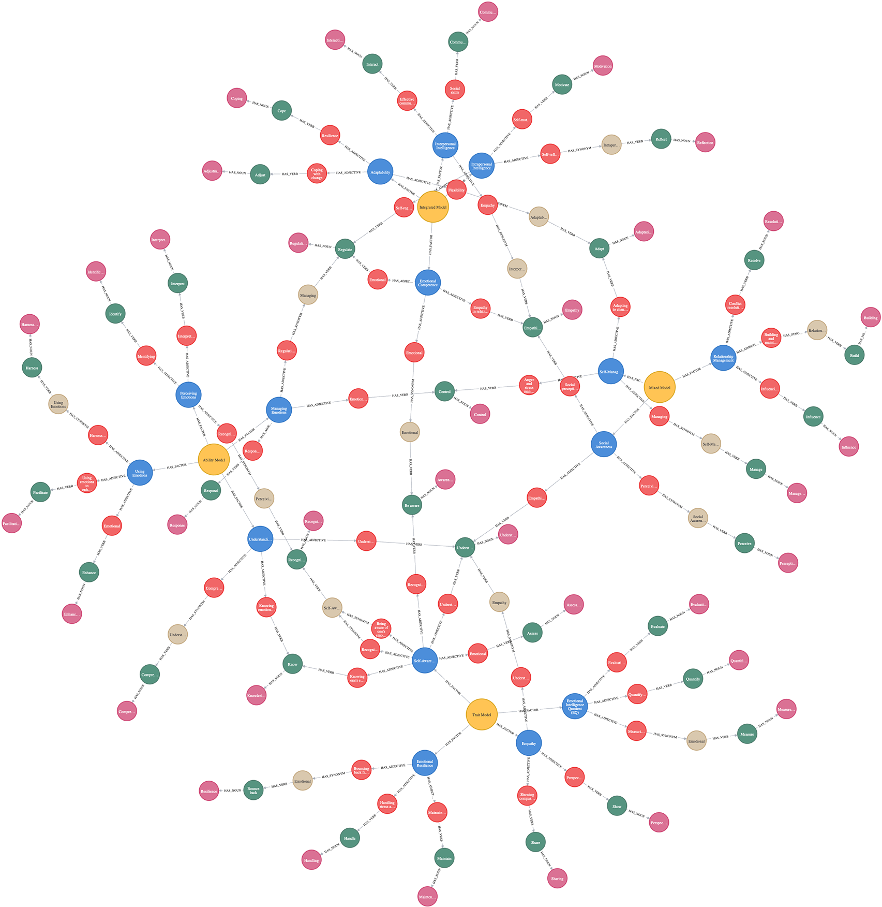

# (41) Theories of Emotional Intelligence

**Abbreviation:** TEI
**Category:** Application-Specific and Holistic Models
**Model Number:** 41 of 44

---

### Description.
Theories of Emotional Intelligence (TEI) describe the ability to perceive, use, understand, and regulate emotions in oneself and others [Salovey1990, Goleman1995].
These frameworks encompass **ability-based models** (e.g., Mayer–Salovey–Caruso Emotional Intelligence Test, MSCEIT), **trait-based models** (e.g., Trait Emotional Intelligence Questionnaire, TEIQue), and **mixed models** that integrate emotional and social competencies (e.g., Goleman’s Emotional Competence Inventory).
TEI constructs underpin a range of psychometric instruments used in leadership, education, and affective computing.

### Dimensions and Brain–Function Mapping.

  - **Perceiving Emotions:** Recognizing emotions via facial expressions or tone of voice.
    *Maps to* Facial Expression Processing (L1) ,  CNNs classifying basic emotions in images or audio.

  - **Using Emotions:** Harnessing affective states to enhance reasoning or creativity.
    *Maps to* Affective Context Integration (L2) ,  Transformers leveraging emotional tone for creative generation.

  - **Understanding Emotions:** Comprehending causes and transitions among emotions.
    *Maps to* Semantic Reasoning & Contextual Inference (L2) ,  LLMs decoding emotional intent from dialogue.

  - **Managing Emotions:** Regulating emotional states adaptively.
    *Maps to* Reinforcement Learning under Stress (L2) ,  agents adjusting reward policies to maintain equilibrium.

  - **Self-Awareness:** Monitoring one’s emotional and cognitive states.
    *Maps to* Metacognitive Reflection (L3) ,  agents generating self-evaluations of performance or bias.

  - **Emotional Resilience:** Recovering from setbacks or stressors.
    *Maps to* Stress Regulation (L3) ,  adaptive AI maintaining function under high-load conditions.

  - **Empathy:** Understanding and sharing others’ emotional perspectives.
    *Maps to* Cognitive & Affective Empathy (L3) ,  agents aligning responses with user sentiment.

  - **Social Awareness:** Reading group dynamics and social cues.
    *Maps to* Social Cognition & Persuasion Modeling (L2) ,  LLMs tailoring dialogue based on audience signals.

  - **Self-Management:** Modulating impulses and maintaining goal focus.
    *Maps to* Inhibitory Control (L3) ,  executive-function simulators suppressing premature actions.

  - **Relationship Management:** Building rapport, influencing, and resolving conflict.
    *Maps to* Theory-of-Mind Simulation (L3) ,  multi-agent coordination through intention modeling.

### Applications.

  - **Leadership Development:** EI training programs to enhance managerial decision-making [Mayer2008].
  - **Clinical Intervention:** Screening and remediation for emotional dysregulation [Petrides2007].
  - **Education and Coaching:** Integrating emotional skill-building into curricula.
  - **Human–AI Interaction:** Embedding EI-inspired modules in virtual assistants for empathy-driven response generation.

### Timeline.

  - **1990:** Salovey & Mayer introduce “Emotional Intelligence” [Salovey1990].
  - **1995:** Goleman popularizes EI as a workplace and social skill [Goleman1995].
  - **2000s:** Development of standardized ability and trait instruments (MSCEIT, TEIQue) [BarOn2000].
  - **2010s–Present:** EI applied in leadership, education, and affective computing [Mayer2008].

### Psychometrics.

  - **Item Formats:** Self-report Likert scales (e.g., 5-point) and performance-based scenario tests.
  - **Reliability:** Cronbach’s α typically 0.70–0.90 across subscales.
  - **Validity:** Strong convergent and discriminant validity across personality, cognitive, and affective measures.

### Data Structure.
Dataset `tei.csv` encodes lexical and embedding-based representations for each EI factor:

  - `Domain`: TEI model (Ability, Trait, or Mixed).
  - `Factor`: Specific EI dimension (e.g., Perceiving Emotions).
  - `Adjective, Synonym, Verb, Noun`: Lexical descriptors.
  - `Embedding`: Vector representation for semantic clustering.

Flattened schema: `Domain, Factor, Adjective, Synonym, Verb, Noun, Embedding`.

### Resources.

  - **Key References:** [Salovey1990, Goleman1995, BarOn2000, Mayer2008, Petrides2007].
  - **Interactive Literature Map:** [Connected Papers graph for TEI](https://www.connectedpapers.com/main/7570030323e1ec98bcf865265d46f4a693cd1c61/Implicit-Theories-of-Emotional-Intelligence-and-Students'-Emotional-and-Academic-Outcomes./graph).
  - **Dataset:** [`tei_Dataset.csv`](https://github.com/Wildertrek/survey/blob/main/datasets/tei.csv).
  - **Embeddings:** [`tei_embeddings.csv`](https://github.com/Wildertrek/survey/blob/main/Embeddings/tei_embeddings.csv).

---

## Atlas Resources

| Resource | Location |
|----------|----------|
| Dataset | [`datasets/tei.csv`](../../../datasets/tei.csv) |
| Embeddings | [`Embeddings/tei_embeddings.csv`](../../../Embeddings/tei_embeddings.csv) |
| RF Model | [`models/tei_rf_model.pkl`](../../../models/tei_rf_model.pkl) |
| Label Encoder | [`models/tei_label_encoder.pkl`](../../../models/tei_label_encoder.pkl) |
| Graph (large) | [`graphs/tei_large.png`](../../../graphs/tei_large.png) |

---

## Validation Results

> From: Raetano, Gregor, & Tamang (2026). "A Survey and Computational Atlas of Personality Models." Under review, ACM TIST.

**Performance Tier:** Low (<50%)

### Classification Performance

| Metric | Value |
|--------|-------|
| Factors | 15 |
| Test Items | 196 |
| RF Accuracy | 18.9% |
| F1 Score (macro) | 0.1491 |
| Precision | 0.2136 |
| Recall | 0.1894 |

### Baseline Comparisons

| Baseline | Accuracy | Lift |
|----------|----------|------|
| Random | 6.7% | +12.2% |
| Frequency | 25.0% | -6.1% |

### LLM Judge Evaluation

Triple-judge panel: GPT-5.2, Gemini 3 Pro, Claude Opus 4.6.

| Metric | Value |
|--------|-------|
| RF-Judge Agreement | 0.0% |
| Expected-Factor Agreement | 100.0% |
| Item Validity Rate | 0.0% |
| Mean Confidence | 4.90 / 5.0 |
| Inter-Judge Agreement | 100.0% |

### Category Context

| Metric | Value |
|--------|-------|
| Category | App/Holistic |
| Category Mean Accuracy | 50.9% |
| Category Best | bt (90.7%) |
| Models in Category | 6 |

## References

The following references are cited in this model card:

- `BarOn2000`
- `Goleman1995`
- `Mayer2008`
- `Petrides2007`
- `Salovey1990`

See `references.bib` in the atlas root for full bibliographic entries.
