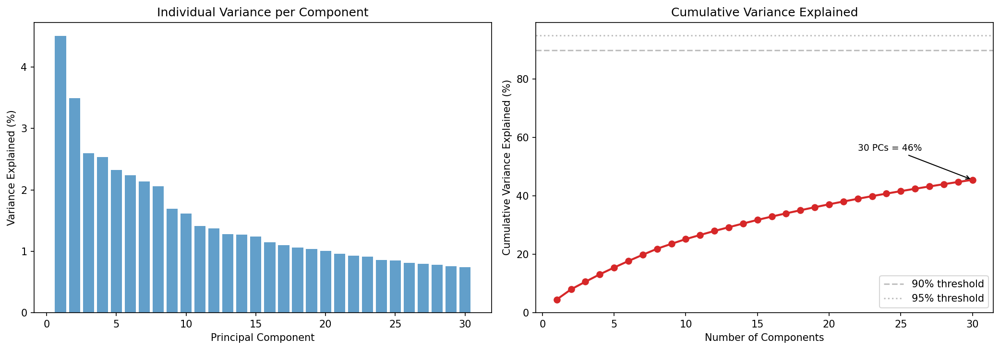
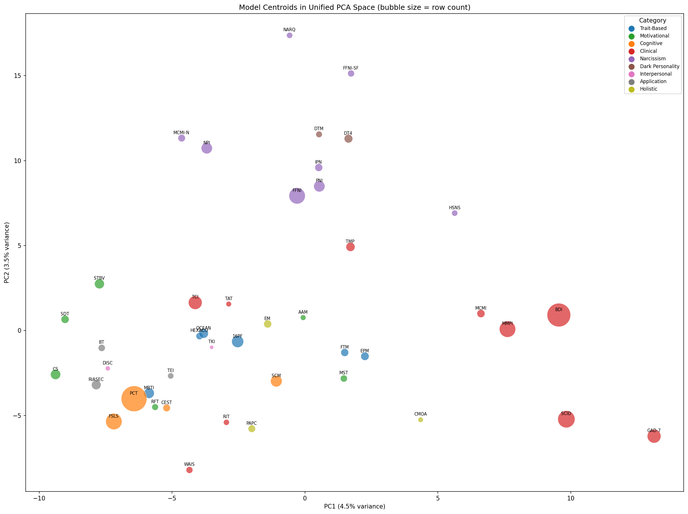
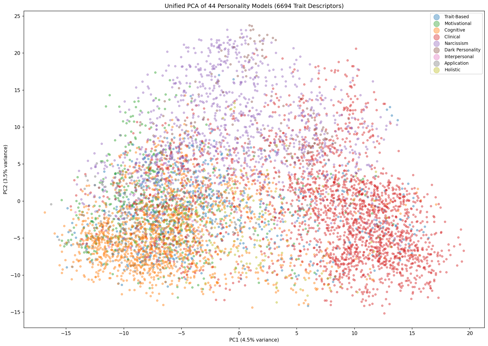
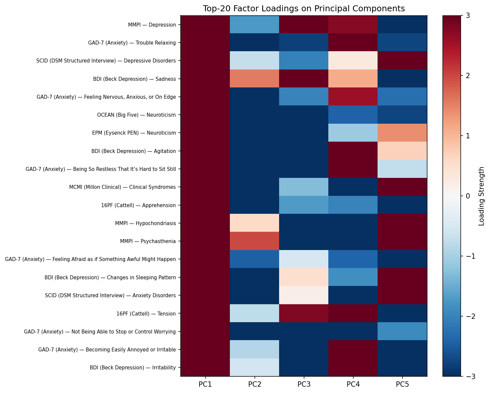

# Cross-Model PCA and Validation Results

Principal Component Analysis and validation experiments across all 44 personality models (6,694 trait rows).

**Reproduce PCA:** `python notebooks/01_cross_model_pca_analysis.py`
**Reproduce all experiments:** Open [`atlas_quick_start.ipynb`](../notebooks/atlas_quick_start.ipynb) in Colab (no API keys needed)

---

## Key Finding

The 44-model atlas is **not redundant**. PCA over the unified 1,536-dimensional embedding space shows that 50 components capture only 56.9% of variance, and no single component exceeds 4.5%. This high intrinsic dimensionality proves that the models encode genuinely distinct psychological constructs — they are not repackagings of the same latent factors. This directly validates the atlas's breadth: practitioners need access to multiple model families (trait-based, clinical, narcissism, motivational, etc.) because no single model captures the full personality space.

---

## Summary

| Metric | Value |
|--------|-------|
| Models analyzed | 44 |
| Categories | 7 |
| Total trait rows | 6,694 |
| Unique factors | 316 |
| Embedding dimensions | 1,536 |
| PCA components computed | 50 |

## Atlas Taxonomy (7 Categories, 44 Models)

| # | Category | Models | Rows | Description |
|---|----------|--------|------|-------------|
| 1 | **Trait-Based** | OCEAN, HEXACO, EPM, 16PF, MBTI, FTM | 692 | General personality structure (Big Five, HEXACO, temperaments) |
| 2 | **Narcissism-Based** | NPI, PNI, FFNI, FFNI-SF, NARQ, HSNS, IPN, MCMI-N, DT3, DT4 | 1,170 | Narcissism subtypes and dark personality traits |
| 3 | **Motivational & Value** | STBV, MST, RFT, SDT, AAM, CS | 508 | Drives, values, regulatory focus, strengths |
| 4 | **Cognitive & Learning** | PCT, SCM, CEST, FSLS | 1,511 | Cognitive styles, learning preferences, personal constructs |
| 5 | **Clinical & Health** | MMPI, TCI, TMP, BDI, GAD-7, SCID, MCMI, RIT, TAT, WAIS | 2,259 | Psychopathology, clinical syndromes, diagnostic instruments, cognitive assessment |
| 6 | **Interpersonal & Conflict** | TKI, DISC | 51 | Conflict resolution styles, workplace interaction patterns |
| 7 | **Application & Holistic** | RIASEC, BT, TEI, EM, PAPC, CMOA | 503 | Vocational interests, emotional intelligence, affect models |

Clinical & Health is the largest category by both model count (10) and row count (2,259), reflecting the granularity of DSM-based instruments (SCID alone has 401 rows across 16 diagnostic categories). Cognitive & Learning ranks second by rows (1,511) despite having only 4 models, driven by PCT's 899-row construct repertoire. Narcissism-Based has 10 instruments, reflecting the field's sustained effort to differentiate grandiose, vulnerable, pathological, and dark personality constructs.

## Computational Profile

All artifacts were generated on a single machine with no GPU required.

| Component | Details |
|-----------|---------|
| **Embedding model** | OpenAI `text-embedding-3-small` (1,536 dimensions) |
| **Embedding cost** | ~$0.27 total for all 6,694 rows (~$0.006/model) |
| **Embedding latency** | ~5-7 minutes for all 44 models (sequential API calls) |
| **PCA runtime** | < 10 seconds (scikit-learn, single CPU core) |
| **RF classifier training** | < 2 seconds per model (100-tree Random Forest) |
| **Total RF models** | 88 files (44 classifiers + 44 label encoders) |
| **RF model sizes** | 20 KB-12 MB per model (median ~130 KB) |
| **Dataset storage** | 520 KB (44 CSV files) |
| **Embedding storage** | 224 MB (44 embedding CSVs, 1,536 floats/row) |
| **RF model storage** | 31 MB (88 pickle files) |
| **Total footprint** | ~256 MB (datasets + embeddings + models) |
| **Dependencies** | pandas, scikit-learn, numpy, matplotlib, openai |
| **Hardware** | Any machine with Python 3.12; no GPU required |

The entire pipeline — from raw CSV datasets to trained classifiers and PCA visualizations — runs end-to-end in under 10 minutes on commodity hardware. The dominant cost is embedding generation via the OpenAI API ($0.27 total), which is a one-time expense. All downstream analysis (PCA, similarity, visualization) is CPU-only and completes in seconds.

## Variance Explained

| Components | Cumulative Variance |
|-----------|-------------------|
| PC1 | 4.5% |
| PC1-5 | 15.5% |
| PC1-10 | 25.2% |
| PC1-20 | 37.1% |
| PC1-50 | 56.9% |

The high dimensionality required to capture variance confirms that personality models occupy meaningfully distinct regions of semantic space — they are not redundant repackagings of the same constructs.

**Figure 1. Scree plot of principal component analysis across 6,694 trait descriptors from 44 personality models.** Left panel: individual variance explained by each of the first 30 principal components. The absence of a pronounced elbow indicates that no small subset of latent dimensions dominates the embedding space. Right panel: cumulative variance explained as a function of the number of retained components. Even at 30 components, only 46% of total variance is captured, and the curve remains well below the conventional 90% and 95% thresholds. This result demonstrates that the 44-model atlas encodes a high-dimensional construct space in which personality models contribute genuinely non-redundant semantic information.

## Model Similarity

### Most Similar Pairs

| Model A | Model B | Category | Cosine Similarity |
|---------|---------|----------|------------------|
| IPN | PNI | Narcissism-Based | 0.959 |
| DT4 | DT3 | Narcissism-Based | 0.955 |
| FFNI | PNI | Narcissism-Based | 0.950 |
| FFNI | NPI | Narcissism-Based | 0.940 |
| FFNI | IPN | Narcissism-Based | 0.918 |

All five most-similar pairs are within the Narcissism-Based category — instruments that share overlapping construct definitions (exploitativeness, entitlement, grandiosity). DT4 and DT3 are near-identical by design (the tetrad extends the triad with sadism). These overlaps serve as a **sanity check**: the embedding space faithfully preserves known theoretical relationships.

### Least Similar Pairs

| Model A | Model B | Categories | Cosine Similarity |
|---------|---------|-----------|------------------|
| PAPC | TKI | App/Holistic vs. Interpersonal | 0.343 |
| FFNI-SF | WAIS | Narcissism vs. Clinical | 0.309 |
| NARQ | WAIS | Narcissism vs. Clinical | 0.301 |
| TAT | WAIS | Clinical vs. Clinical | 0.301 |
| TKI | WAIS | Interpersonal vs. Clinical | 0.268 |

The lowest similarities involve WAIS (cognitive intelligence) paired with personality/narcissism models — confirming that cognitive ability and personality trait constructs occupy fundamentally different semantic regions, consistent with decades of differential psychology research.

**Figure 2. Model centroid positions in the first two principal components of the unified embedding space.** Each bubble represents one of the 44 personality models, positioned at the mean of its constituent trait embeddings; bubble area is proportional to the number of trait rows in that model. Points are colored by atlas category. Several structural patterns are evident. First, Narcissism-Based models (purple) form a tight cluster in the upper portion of the space, consistent with their shared theoretical emphasis on exploitativeness, entitlement, and grandiosity. Second, Clinical & Health models (red) exhibit the widest spatial dispersion of any category, spanning from GAD-7 and BDI at the far right to WAIS at the lower left, reflecting the broad heterogeneity of clinical constructs from affective symptomatology to cognitive assessment. Third, Trait-Based models (blue) occupy a compact central region, with OCEAN and HEXACO nearly overlapping as expected given their shared Big Five structure. Fourth, WAIS occupies an isolated position at the bottom of the space, maximally distant from personality and narcissism instruments, consistent with the established orthogonality of cognitive ability and personality trait constructs in differential psychology.

## Category Variance Contribution

| Category | Models | Total Variance | Variance/Model |
|----------|--------|---------------|----------------|
| **Narcissism-Based** | 10 | 350.2 | 35.0 |
| **Clinical & Health** | 10 | 347.9 | 34.8 |
| **Trait-Based** | 6 | 337.0 | 56.2 |
| **Cognitive & Learning** | 4 | 307.7 | 76.9 |
| **Motivational & Value** | 6 | 277.9 | 46.3 |
| **Application & Holistic** | 6 | 258.8 | 43.1 |
| **Interpersonal & Conflict** | 2 | 183.9 | 92.0 |

**Total variance** ranks Narcissism-Based first (350.2), driven by 10 instruments differentiating grandiose, vulnerable, pathological, and dark personality constructs.

But **variance per model** tells a different story — and is the more actionable metric for practitioners deciding which categories to include:

1. **Interpersonal & Conflict** (92.0/model) — just 2 models (TKI, DISC), each highly distinctive
2. **Cognitive & Learning** (76.9/model) — 4 instruments covering personal constructs, social cognition, learning styles
3. **Trait-Based** (56.2/model) — OCEAN, HEXACO, MBTI, 16PF rank third, not first
4. **Motivational & Value** (46.3/model) — drives, values, and regulatory focus
5. **Application & Holistic** (43.1/model) — vocational interests, emotional intelligence, affect

Despite being the most widely used in NLP applications, Trait-Based models rank only 3rd in per-model discriminative power. Researchers building personality-aware AI systems should look **beyond Big Five** — adding even one Cognitive or Interpersonal model provides more marginal information than adding another trait-based instrument.

## Top Factors by Variance

The five highest-variance factors across all models:

| Model | Category | Factor | Variance | Rows |
|-------|----------|--------|----------|------|
| SCM | Cognitive | Environment | 222.3 | 36 |
| SCM | Cognitive | Interpersonal | 203.7 | 36 |
| SCM | Cognitive | Affective | 199.2 | 36 |
| SCM | Cognitive | Behavior | 195.7 | 36 |
| MCMI | Clinical | Personality Patterns | 187.6 | 45 |

SCM (Social-Cognitive Model) dominates the top-4, suggesting that cognitive-social constructs (how people process their environment, relate to others, regulate affect, and behave) provide the broadest semantic coverage. The 5th slot goes to MCMI's Personality Patterns — clinical psychopathology dimensions that span a wide range of human dysfunction.

## Visualizations

| File | Description |
|------|-------------|
| [`pca_scree_plot.png`](pca_scree_plot.png) | Variance explained by each principal component |
| [`pca_2d_all_models.png`](pca_2d_all_models.png) | 2D PCA projection of all 6,694 trait rows, colored by category |
| [`pca_model_centroids_2d.png`](pca_model_centroids_2d.png) | Model centroid positions in PCA space |
| [`pca_factor_loadings_heatmap.png`](pca_factor_loadings_heatmap.png) | Top-20 factor loadings on PC1-PC5 |

**Figure 3. Two-dimensional PCA projection of all 6,694 trait descriptors from 44 personality models, colored by atlas category.** Each point represents a single trait row (a Factor-Adjective-Synonym-Verb-Noun tuple) embedded in the 1,536-dimensional space and projected onto the first two principal components (PC1: 4.5% variance; PC2: 3.5% variance). Categories exhibit partial spatial segregation: Clinical & Health traits (red) concentrate in the right half of the space, Cognitive & Learning traits (orange) anchor the lower-left quadrant, and Narcissism-Based traits (purple) occupy the upper-center. However, substantial inter-category overlap is present throughout, indicating that personality constructs share significant semantic territory across theoretical traditions. The broad dispersion within each category further demonstrates that individual models contribute diverse, non-overlapping trait descriptors even when they belong to the same conceptual family.

**Figure 4. Factor loading heatmap for the top-20 personality factors on the first five principal components (PC1-PC5).** Rows represent individual factors (labeled as Model-Factor), ranked by absolute loading magnitude on PC1. Color intensity indicates loading strength: red denotes strong positive loadings, blue denotes strong negative loadings, and white indicates near-zero contribution. PC1 is dominated by clinical distress constructs: MMPI Depression, GAD-7 anxiety items, SCID Depressive Disorders, BDI Sadness, and Neuroticism from both OCEAN and EPM all load strongly positive, indicating that the primary axis of variation in the unified personality embedding space corresponds to a general psychopathology or negative affect dimension. PC2 through PC5 exhibit more heterogeneous loading patterns, with contributions from clinical, trait-based, and cognitive factors, suggesting that subsequent components capture progressively more nuanced distinctions between personality traditions rather than a single dominant construct.

## Data Files

| File | Description |
|------|-------------|
| [`pca_variance_explained.csv`](pca_variance_explained.csv) | Variance explained by top-50 components |
| [`pca_top_factors_by_variance.csv`](pca_top_factors_by_variance.csv) | All factors ranked by variance contribution |
| [`pca_model_overlap_matrix.csv`](pca_model_overlap_matrix.csv) | 44x44 cosine similarity matrix between model centroids |
| [`pca_summary_report.json`](pca_summary_report.json) | Machine-readable summary of all metrics |

## Model Row Counts

| Model | Category | Rows | | Model | Category | Rows |
|-------|----------|------|-|-------|----------|------|
| PCT | Cognitive | 899 | | OCEAN | Trait-Based | 120 |
| BDI | Clinical | 756 | | RIASEC | Application | 120 |
| SCID | Clinical | 401 | | TMP | Clinical | 108 |
| FFNI | Narcissism | 360 | | DT4 | Narcissism | 96 |
| MMPI | Clinical | 360 | | EPM | Trait-Based | 90 |
| FSLS | Cognitive | 360 | | MCMI | Clinical | 84 |
| TCI | Clinical | 252 | | SDT | Motivational | 84 |
| GAD-7 | Clinical | 252 | | EM | App/Holistic | 81 |
| 16PF | Trait-Based | 192 | | FTM | Trait-Based | 80 |
| SCM | Cognitive | 180 | | IPN | Narcissism | 80 |
| NPI | Narcissism | 168 | | CEST | Cognitive | 72 |
| PNI | Narcissism | 168 | | MCMI-N | Narcissism | 72 |
| MBTI | Trait-Based | 144 | | PAPC | App/Holistic | 72 |
| CS | Motivational | 136 | | HEXACO | Trait-Based | 66 |
| STBV | Motivational | 128 | | BT | App/Holistic | 64 |
| WAIS | Clinical | 60 | | MST | Motivational | 64 |
| FFNI-SF | Narcissism | 60 | | RFT | Motivational | 56 |
| DT3 | Narcissism | 54 | | NARQ | Narcissism | 48 |
| HSNS | Narcissism | 48 | | TEI | App/Holistic | 48 |
| RIT | Clinical | 45 | | AAM | Motivational | 40 |
| TAT | Clinical | 39 | | CMOA | App/Holistic | 36 |
| DISC | Interpersonal | 31 | | TKI | Interpersonal | 20 |

---

## Implications for AI Personality Modeling

### Why 44 Models?

Current AI systems that model personality almost exclusively use OCEAN (Big Five) — a single model occupying 120 of 6,694 rows (1.8%) and ranked 17th by row count. The PCA results show that OCEAN captures only a narrow slice of the personality space. The atlas provides 43 additional models spanning clinical psychopathology, narcissism subtypes, motivational orientations, cognitive styles, and interpersonal dynamics — all of which encode semantically distinct constructs that OCEAN cannot represent.

### Practical Implications

1. **For LLM personality prompting:** The 316 unique factors provide a structured vocabulary for fine-grained character specification far beyond "high openness, low neuroticism." A game NPC can be specified using Bartle Types (Killer/Explorer/Achiever/Socializer), a clinical simulation agent using MCMI personality patterns, or an adversarial red-team agent using Dark Tetrad traits.

2. **For AI safety and red-teaming:** The 10 narcissism models and 10 clinical models provide the construct granularity needed to stress-test LLM behavior under pathological personality conditions (e.g., distinguishing grandiose vs. vulnerable narcissism responses).

3. **For cross-model transfer:** The 44x44 cosine similarity matrix enables researchers to identify which models provide redundant vs. complementary information for a given task, avoiding unnecessary computational overhead.

4. **For benchmarking:** The trained RF classifiers (one per model) can classify any new text embedding into the appropriate personality factor, enabling automated personality annotation of LLM outputs at scale.

### What the PCA Does Not Show

This analysis operates on the **lexical embedding space** of trait descriptors. It validates that the atlas's 44 models encode diverse constructs, but it does not measure how well LLMs can *use* these constructs to produce behaviorally distinct agents. That empirical question is addressed by the validation experiment below.

---

## Validation Experiment Results

Four-phase empirical validation across all 44 models. Full results are in the `validation/` subdirectory and in each model's `MODEL_CARD.md`.

> From: Raetano, Gregor, & Tamang (2026). "A Survey and Computational Atlas of Personality Models." Under review, ACM TIST.

### Experiment Overview

| Component | Details |
|-----------|---------|
| **Test items** | 5,052 generated (5,038 valid) across 358 factors (316 unique), by GPT-4o |
| **Classifier** | Random Forest trained on atlas embeddings (text-embedding-3-small) |
| **Baselines** | Random-chance and frequency-weighted |
| **Judge panel** | GPT-5.2, Gemini 3 Pro, Claude Opus 4.6 (triple-judge) |
| **Cross-model index** | Unified FAISS index over 6,694 embeddings |
| **Hardware** | M1 MacBook Pro, ~2.5 hours, $7.10 total API cost |

### Aggregate Results

| Metric | Value |
|--------|-------|
| Mean RF accuracy (44 models) | 58.6% |
| Median RF accuracy | 61.1% |
| Models beating random baseline | 44/44 (100%) |
| Models beating frequency baseline | 41/44 (93%) |
| Inter-judge agreement (kappa) | 0.99 |
| Factor-count vs. accuracy correlation | r = -0.67, p < 0.001 |

### Performance by Category

| Category | Models | Mean Acc | Best Model | Best Acc | Worst Model | Worst Acc |
|----------|--------|----------|------------|----------|-------------|-----------|
| Motivational | 6 | 74.5% | AAM | 86.7% | CS | 49.1% |
| Narcissism-Based | 10 | 68.3% | HSNS | 82.8% | IPN | 46.5% |
| Trait-Based | 6 | 64.0% | OCEAN | 76.1% | 16PF | 50.7% |
| Cognitive | 4 | 51.8% | CEST | 72.4% | PCT | 34.7% |
| App/Holistic | 6 | 50.9% | BT | 90.7% | EM | 15.8% |
| Clinical | 10 | 50.6% | GAD-7 | 67.7% | SCID | 31.1% |
| Interpersonal | 2 | 23.7% | TKI | 37.8% | DISC | 9.5% |

Motivational models perform best on average (74.5%), consistent with their low factor counts and clean construct boundaries. Interpersonal models perform worst (23.7%), driven by DISC's 29-factor structure and sparse training data.

### Performance Tiers

**High (>70%):** BT, CMOA, AAM, RFT, FFNI-SF, HSNS, SDT, STBV, OCEAN, CEST, FTM, DT4, NARQ (13 models)

**Moderate (50-70%):** RIASEC, GAD-7, RIT, BDI, EPM, HEXACO, NPI, PNI, DTM, MCMI-N, MBTI, FFNI, MST, TMP, TCI, 16PF, SCM, CS, MMPI (19 models)

**Low (<50%):** WAIS, FSLS, IPN, MCMI, TKI, PCT, PAPC, TAT, SCID, EM, TEI, DISC (12 models)

### Validation Data Files

| File | Description |
|------|-------------|
| [`validation/individual_model_results.csv`](validation/individual_model_results.csv) | Per-model accuracy, F1, precision, recall, judge metrics |
| [`validation/category_results.csv`](validation/category_results.csv) | Category-level aggregates |
| [`validation/baselines.json`](validation/baselines.json) | Random and frequency baselines per model |
| [`validation/factor_complexity.csv`](validation/factor_complexity.csv) | Factor count vs. accuracy data |
| [`validation/atlas_summary.json`](validation/atlas_summary.json) | Aggregate experiment summary |
| [`validation/latency.json`](validation/latency.json) | Computational latency benchmarks |
| [`validation/experiment2_comparison.csv`](validation/experiment2_comparison.csv) | 1536 vs 3072-dim accuracy comparison per model |

Each model's `MODEL_CARD.md` (in `atlas/`) now includes a Validation Results section with per-model performance, baseline comparisons, judge evaluation, and category context.

---

## 3072-Dimensional PCA Results

The same PCA analysis run with OpenAI `text-embedding-3-large` (3,072-dim) embeddings. All 8 output files mirror the 1536-dim structure.

**Reproduce:** `python notebooks/01_cross_model_pca_analysis.py --embedding-dim 3072`

Results are in [`pca_3072/`](pca_3072/).

---

## Experiment 2 — Embedding Upgrade (1536 vs 3072)

Side-by-side comparison of 1536-dim and 3072-dim classifiers on both training data and novel items. The 3072-dim embeddings and retrained classifiers are hosted on [Hugging Face Hub](https://huggingface.co/datasets/Wildertrek/personality-atlas-3072).

**Reproduce:** [`atlas_quick_start.ipynb`](../notebooks/atlas_quick_start.ipynb) §8

---

## Experiment 3 — External Validation (RQ10-12)

Three tests using items the atlas was never trained on:

- **RQ10 (Multi-generator):** 5,369 Opus-generated items vs 5,052 GPT-4o items — tests whether findings depend on a single generator
- **RQ11 (Human items):** 368 items from 21 published instruments (BFI-44, GAD-7, HEXACO-60, etc.) classified through the atlas
- **RQ12 (Convergent validity):** 12,114-vector evaluation bank queried by human items to test cross-instrument retrieval

All pre-computed embeddings are in [`data/`](../data/). No API keys needed.

**Reproduce:** [`atlas_quick_start.ipynb`](../notebooks/atlas_quick_start.ipynb) §9

---

## DSM-5 Clinical Alignment

222 DSM-5-TR disorders embedded and classified through the atlas taxonomy. Tests whether clinical constructs from outside the training data route to the correct category.

**Reproduce:** [`atlas_quick_start.ipynb`](../notebooks/atlas_quick_start.ipynb) §10

---

## Pre-Computed Embeddings

All experiment data ships with the repository in [`data/`](../data/) for API-key-free reproduction:

| File | Size | Used By |
|------|------|---------|
| `data/test_items/test_items.json` | 741 KB | Exp 1 (5,052 GPT-4o items) |
| `data/test_items/test_items_embeddings.npz` | 26 MB | Exp 1 (1536-dim) |
| `data/test_items/test_items_embeddings_3072.npz` | 50 MB | Exp 2 (3072-dim) |
| `data/opus_items.json` | 1.2 MB | Exp 3 RQ10 (5,369 Opus items) |
| `data/opus_items_embeddings.npz` | 28 MB | Exp 3 RQ10 |
| `data/human_items.json` | 82 KB | Exp 3 RQ11-12 (368 items, 21 instruments) |
| `data/human_items_embeddings.npz` | 1.9 MB | Exp 3 RQ11-12 |
| `data/dsm5_disorders.json` | 116 KB | DSM-5 alignment (222 disorders) |
| `data/dsm5_embeddings.csv` | 7.6 MB | DSM-5 alignment |

---

*PCA generated by [`notebooks/01_cross_model_pca_analysis.py`](../notebooks/01_cross_model_pca_analysis.py)*
